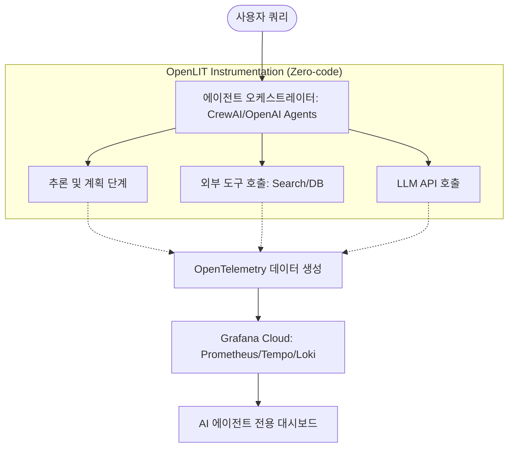

> **한 줄 요약** — AI 에이전트의 비결정적 특성과 복잡한 추론 과정을 OpenLIT와 Grafana Cloud를 활용해 코드 수정 없이 투명하게 시각화하고 비용과 성능을 관리하는 방법

## AI 에이전트 추적에 집중해야 하는 이유
단순히 질문에 답을 하는 대규모 언어 모델(LLM) 단계를 넘어, 스스로 계획을 세우고 도구를 호출하며 실행하는 AI 에이전트(Agent)의 비중이 급격히 늘고 있습니다. 하지만 에이전트는 같은 질문에도 매번 다른 경로로 도구를 선택하거나 추론을 진행하는 비결정적(Non-deterministic) 특성을 가집니다.

이런 특성 때문에 문제가 발생했을 때 단순히 결과값만 보고 원인을 파악하기란 불가능에 가깝습니다. 에이전트가 왜 특정 도구를 선택했는지, 어떤 단계에서 루프에 빠졌는지, 혹은 왜 갑자기 비용이 급증했는지 파악하려면 실행 단계마다 발생하는 데이터를 연결된 흐름으로 볼 수 있는 옵저버빌리티(Observability) 환경이 필수입니다.

실무에서 에이전트를 운영하다 보면 인프라의 상태보다 에이전트의 사고 과정(Reasoning chain)을 복구하는 데 더 많은 시간을 쓰게 됩니다. Grafana Cloud와 OpenLIT의 조합은 이러한 가시성 확보 문제를 코드 수정 최소화라는 실용적인 방식으로 해결해 줍니다.

## AI 에이전트 관측성을 위한 OpenLIT와 Grafana Cloud 활용
AI 에이전트 옵저버빌리티의 핵심은 분산 트레이싱(Distributed Tracing)입니다. 에이전트가 외부 API를 호출하거나 벡터 데이터베이스(Vector Database)에서 정보를 검색하는 모든 과정을 하나의 트레이스로 묶어 관리해야 합니다.

OpenLIT는 오픈텔레메트리(OpenTelemetry) 표준을 따르는 SDK로, AI 프레임워크와 LLM 공급자 사이에서 발생하는 데이터를 자동으로 수집합니다. 이를 Grafana Cloud와 연결하면 수집된 데이터를 바탕으로 토큰 사용량, 응답 지연 시간, 비용 추산치 등을 직관적인 대시보드로 확인할 수 있습니다.



### 단계별 구현 및 통합 방법
에이전트 환경에 옵저버빌리티를 구축하는 과정은 생각보다 단순합니다. OpenLIT가 다양한 프레임워크를 지원하기 때문에 기존 로직을 크게 건드리지 않고도 도입이 가능합니다.

1. **OpenLIT 설치 및 초기화**: 파이썬 환경에서 SDK를 설치하고 코드 상단에서 초기화 함수를 호출합니다.
2. **에이전트 프레임워크 연결**: CrewAI, LangChain, OpenAI Agents 등 사용하는 프레임워크와 도구를 정의합니다.
3. **원격 측정 데이터 전송**: 환경 변수를 통해 Grafana Cloud의 OTLP 엔드포인트와 인증 정보를 설정합니다.
4. **대시보드 시각화**: Grafana Cloud에서 제공하는 사전 정의된 AI 대시보드를 통해 실시간 데이터를 확인합니다.

실제 코드에서는 다음과 같이 단 한 줄의 초기화 코드로 모든 추적을 시작할 수 있습니다.

```python
import openlit
from crewai import Agent, Task, Crew

# 코드 한 줄로 모든 지원 프레임워크의 트레이싱 활성화
openlit.init()

# 에이전트 및 도구 정의 (기존 로직 유지)
research_agent = Agent(
    role="기술 분석가",
    goal="최신 AI 트렌드 요약",
    backstory="당신은 복잡한 기술 문서를 분석하는 전문가입니다.",
    planning=True # 내부 추론 과정 활성화
)

# 태스크 및 크루 실행
# 이 과정에서 발생하는 모든 LLM 호출, 도구 사용, 비용이 자동 기록됨
```

### 수집되는 핵심 데이터 지표
- **LLM 프롬프트 및 완성(Completion)**: 모델에 전달된 입력값과 출력값을 그대로 캡처하여 추론의 정확도를 검증합니다.
- **토큰 사용량 및 비용**: 입력/출력 토큰 수를 기반으로 API 호출 비용을 실시간으로 추산하여 예산 관리를 돕습니다.
- **도구 실행 상세**: 어떤 도구가 어떤 파라미터로 호출되었는지, 실행 시간은 얼마나 걸렸는지 기록합니다.
- **에러 및 예외 상황**: API 타임아웃이나 도구 실행 오류를 트레이스 스팬(Span) 내에서 즉시 확인합니다.

## 실무에서 마주하는 에이전트 모니터링의 한계와 시각
실제로 에이전트를 프로덕션 환경에 배포해 보면 가장 당혹스러운 지점은 비용의 예측 불가능성입니다. 루프에 빠진 에이전트가 수분 만에 수백 달러의 비용을 발생시키는 상황을 방지하려면 단순한 사후 모니터링을 넘어 실시간 경보(Alerting) 체계가 작동해야 합니다.

### 제로 코드 방식의 실용성
OpenLIT와 같은 제로 코드(Zero-code) 방식은 개발자가 비즈니스 로직에만 집중할 수 있게 해준다는 점에서 큰 강점을 가집니다. 현업에서 새로운 기술 스택을 도입할 때 가장 큰 장애물은 기존 코드의 오염인데, SDK 초기화 한 줄로 이를 해결할 수 있다는 것은 도입 장벽을 획기적으로 낮춰줍니다.

하지만 모든 것을 자동에 맡길 때의 트레이드오프도 고민해야 합니다. 에이전트 내부의 아주 미세한 사용자 정의 로직이나 성능 병목을 잡아야 할 때는 자동 생성된 스팬만으로는 부족할 수 있습니다. 이럴 때는 자동 계측을 기본으로 하되, 비즈니스 핵심 구간에만 수동 스팬을 추가하는 하이브리드 접근 방식이 현실적입니다.

### 비용과 성능의 균형 잡기
대시보드에서 특정 에이전트가 유독 많은 토큰을 소비한다는 사실을 발견했다면, 이는 모델의 문제일 수도 있지만 프롬프트 설계나 도구 선택 로직의 문제일 가능성이 큽니다. 

- 성능 최적화: 검색 도구(Search Tool)의 응답이 느려 전체 지연 시간(Latency)이 늘어나는지 확인합니다.
- 모델 교체: 단순 요약 작업에 고비용 모델이 쓰이고 있다면 트레이스 데이터를 근거로 저비용 모델로의 전환을 결정할 수 있습니다.
- 안전성 검증: 할루시네이션(Hallucination)이나 유해 콘텐츠 포함 여부를 트레이스 단계에서 함께 평가하는 워크플로우를 구축할 수 있습니다.

### MCP 서버와의 연동 가시성
최근 주목받는 모델 컨텍스트 프로토콜(Model Context Protocol, MCP) 환경에서도 이러한 옵저버빌리티는 빛을 발합니다. 에이전트가 외부 데이터 소스나 도구 서버와 통신할 때 MCP 레이어에서 발생하는 병목을 추적하지 못하면 에이전트 자체의 성능을 개선하기 어렵습니다. OpenLIT는 MCP 서버 모니터링도 지원하므로 에이전트부터 외부 도구까지 이어지는 엔드 투 엔드 경로를 한눈에 파악할 수 있게 해줍니다.

## 효율적인 에이전트 운영을 위한 제언
AI 에이전트는 더 이상 실험실의 결과물이 아니며 실질적인 비즈니스 가치를 만들어내는 단계에 진입했습니다. 하지만 가시성이 확보되지 않은 에이전트는 운영 단계에서 시한폭탄과 같습니다.

단순히 로그를 남기는 수준을 넘어 표준화된 오픈텔레메트리 기반의 트레이싱을 도입하는 것은 기술적 부채를 예방하는 가장 확실한 방법입니다. Grafana Cloud와 OpenLIT의 조합은 복잡한 인프라 설정 없이도 엔터프라이즈급 옵저버빌리티를 즉시 확보할 수 있게 해줍니다.

지금 당장 운영 중인 에이전트 시스템에 OpenLIT SDK를 붙여보고, 단 하나의 요청이라도 전체 트레이스를 뜯어보는 경험을 해보시기 바랍니다. 에이전트가 생각보다 훨씬 비효율적인 경로로 추론하고 있다는 사실을 발견하는 것만으로도 시스템 개선의 시작점이 될 것입니다.

## 참고 자료
- [원문] Observe your AI agents: End‑to‑end tracing with OpenLIT and Grafana Cloud — Grafana Blog
- [관련] Instrument zero‑code observability for LLMs and agents on Kubernetes — Grafana Blog
- [관련] How to monitor LLMs in production with Grafana Cloud, OpenLIT, and OpenTelemetry — Grafana Blog
- [관련] Monitor Model Context Protocol (MCP) servers with OpenLIT and Grafana Cloud — Grafana Blog