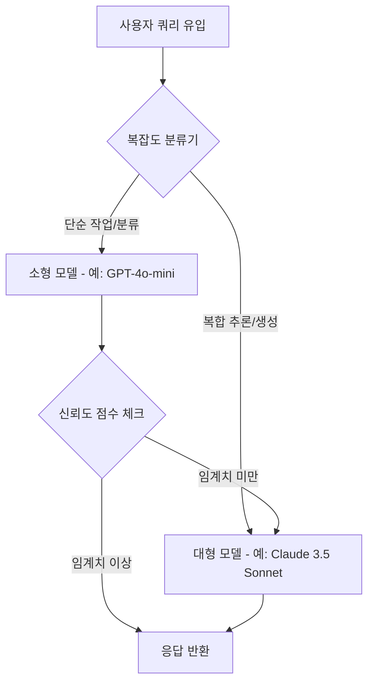

AI 인프라 비용을 LLM API, GPU 연산, 벡터 데이터베이스(Vector DB)라는 세 가지 독립된 계층으로 분리하고 각 계층의 특성에 맞는 최적화 기술을 적용함으로써 전체 지출을 최대 80%까지 절감할 수 있습니다.

## 이 주제를 꺼낸 이유

많은 엔지니어링 팀이 AI 도입 초기 단계에서 예상치를 크게 웃도는 비용 청구서를 받고 당황하곤 합니다. 실제로 AI 인프라 비용 예측에 실패하는 팀이 80%에 달한다는 통계가 있을 정도로 이 영역은 기존 클라우드 비용 관리와는 결이 다릅니다.

단순히 전체 예산을 늘리는 방식으로는 수익성을 맞추기 어렵습니다. 특히 AI 모델의 토큰 단가, GPU 인스턴스의 예약 방식, 벡터 데이터베이스의 인덱싱 구조는 서로 완전히 다른 메커니즘으로 작동합니다. 이를 하나의 덩어리로 보고 관리하면 어디서 비용이 새는지 파악하기 불가능합니다. 각 계층을 쪼개어 분석하고 실무에 즉시 적용 가능한 최적화 레버를 찾아야 합니다.

## 계층 1: LLM API 비용의 효율적 관리

LLM API는 AI 스택에서 변동성이 가장 큰 항목입니다. 모델별로 토큰당 가격 차이가 300배까지 벌어지기 때문에 모든 요청을 최신 고성능 모델로 처리하는 것은 비효율의 극치입니다.

모델 라우팅(Model Routing)과 캐스케이딩(Cascading) 전략이 필요합니다. 쿼리의 복잡도를 사전에 분류하여 단순한 분류나 요약 작업은 소형 모델(Small Model)로 보내고, 복합적인 추론이 필요한 경우에만 대형 모델(Frontier Model)을 호출하는 방식입니다. 구글 리서치의 연구에 따르면 이러한 계스케이딩 방식만으로도 성능 저하 없이 최대 16배의 효율 향상을 얻을 수 있습니다.

프롬프트 캐싱(Prompt Caching)은 RAG(Retrieval-Augmented Generation) 파이프라인에서 필수적입니다. 시스템 프롬프트나 고정된 컨텍스트가 반복될 때 이를 캐싱하면 동일 토큰에 대해 매번 지불하던 비용을 70~80%까지 줄일 수 있습니다. 또한 컨텍스트 윈도우(Context Window)를 관리할 때 과거 대화 내역 전체를 넘기는 대신 요약본을 전달하거나 불필요한 보일러플레이트를 제거하는 것만으로도 토큰 소모를 눈에 띄게 줄일 수 있습니다.

## 계층 2: GPU 컴퓨트 자원 최적화

자체 모델을 서빙하거나 파인튜닝(Fine-tuning)을 진행한다면 GPU 비용이 전체 예산의 가장 큰 비중을 차지하게 됩니다. 여기서 핵심은 모델 양자화(Quantization)와 인스턴스 구매 모델의 전략적 선택입니다.

양자화는 모델의 정밀도를 FP16에서 INT8 또는 INT4로 낮추어 메모리 점유율을 줄이는 기술입니다. 예를 들어 70B 파라미터 모델을 전체 정밀도로 구동하려면 H100 GPU 두 장이 필요할 수 있지만, INT8 양자화를 적용하면 한 장으로도 충분히 서빙이 가능합니다. 이는 곧바로 GPU 대여 비용을 절반으로 낮추는 결과로 이어집니다.

스팟 인스턴스(Spot Instances) 활용도 적극 고려해야 합니다. 실시간 서빙이 아닌 배치 추론(Batch Inference)이나 모델 학습 작업은 언제든 중단되어도 무방하도록 체크포인트를 자주 저장하는 설계를 도입해야 합니다. AWS 스팟 인스턴스를 활용하면 온디맨드(On-Demand) 대비 최대 90% 저렴하게 GPU를 사용할 수 있습니다. 다만 실시간 서비스라면 예약 인스턴스(Reserved Instances)나 세이빙 플랜(Savings Plans)을 통해 30~60%의 확정 할인을 받는 것이 안정적입니다.

## 계층 3: 벡터 데이터베이스의 규모별 전략

벡터 데이터베이스(Vector Database) 비용은 데이터의 양, 쿼리 빈도, 차원(Dimensionality) 수에 따라 결정됩니다. 초기 단계에서 무턱대고 고가의 매니지드 SaaS를 선택하면 데이터가 늘어남에 따라 비용이 기하급수적으로 폭증합니다.

데이터 규모에 따른 의사결정 프레임워크가 필요합니다. 1,000만 개 미만의 벡터를 다루는 초기 단계라면 별도의 인프라를 구축하기보다 기존에 사용 중인 포스트그레스(Postgres)에 pgvector 익스텐션을 사용하는 것이 가장 경제적입니다. 추가적인 관리 비용 없이 기존 DB 자원을 활용할 수 있기 때문입니다.

벡터 수가 5,000만 개를 넘어서는 시점부터는 전용 엔진으로의 전환을 고려해야 합니다. 이때도 매니지드 서비스와 셀프 호스팅(Self-hosted) 사이의 트레이드오프를 따져야 합니다. 운영 인력의 공수를 포함한 총소유비용(TCO)을 계산했을 때 대규모 환경에서는 Qdrant나 Weaviate 같은 오픈소스를 직접 호스팅하는 것이 장기적으로 훨씬 유리할 수 있습니다.

## 내 생각 & 실무 관점

원문에서 강조하는 계층별 접근법은 매우 타당하며 현업에서 마주하는 페인 포인트(Pain Point)를 정확히 짚고 있습니다. 특히 모델 라우팅 부분은 기술적으로 흥미롭지만 실무 도입 시에는 라우터 자체의 지연 시간(Latency)과 오버헤드를 반드시 고려해야 합니다. 라우팅 로직이 너무 복잡해지면 비용은 아낄 수 있어도 사용자 경험이 저하될 위험이 있습니다.

실제로 라우팅 시스템을 설계하다 보면 신뢰도 임계치(Confidence Threshold)를 설정하는 것이 가장 까다롭습니다. 소형 모델이 답변을 잘했는지 판단하기 위해 또 다른 모델을 호출한다면 배보다 배꼽이 더 커지는 상황이 발생합니다. 현업에서는 정교한 AI 기반 라우터보다는 키워드나 입력 길이에 기반한 규칙 기반(Rule-based) 라우팅을 먼저 도입해보고 점진적으로 고도화하는 것을 권장합니다.

또한 GPU 최적화 단계에서 양자화를 적용할 때 벤치마킹 점수만 믿어서는 안 됩니다. 특정 도메인의 전문 용어나 한국어 처리 능력은 양자화 과정에서 예상보다 더 크게 손상될 수 있습니다. 반드시 실제 서비스 쿼리 셋을 활용한 평가(Evaluation) 파이프라인을 구축한 뒤 비용 절감과 품질 사이의 균형점을 찾아야 합니다.

벡터 DB의 경우도 마찬가지입니다. 무조건 최신 기술을 쫓기보다 현재 보유한 데이터의 차원 수와 검색 정확도 요구 수준을 먼저 파악해야 합니다. 단순한 키워드 검색과 시맨틱 검색을 결합한 하이브리드 검색(Hybrid Search)만으로도 충분한 경우가 많으며, 이는 굳이 고차원 벡터를 고집하지 않아도 되어 비용 절감에 큰 도움이 됩니다.

## 정리

AI 비용 최적화는 단순히 싼 모델을 찾는 과정이 아니라 엔지니어링 역량을 투입해 효율적인 아키텍처를 설계하는 과정입니다. LLM API 계층에서는 라우팅과 캐싱을, GPU 계층에서는 양자화와 인스턴스 전략을, 데이터 계층에서는 규모에 맞는 엔진 선택을 실천해야 합니다.

당장 시작해볼 수 있는 작업은 현재 호출 중인 LLM 프롬프트의 길이를 점검하고 중복되는 시스템 프롬프트에 캐싱을 적용하는 것입니다. 이것만으로도 다음 달 청구서의 숫자가 달라지는 것을 확인할 수 있습니다.

## 참고 자료
- [원문] [Cloud Cost Optimization in the Age of AI Workloads: A Practical Guide for Engineering Leads](https://dev.to/mcrolly/cloud-cost-optimization-in-the-age-of-ai-workloads-a-practical-guide-for-engineering-leads-2lh7) — DEV Community
- [관련] What Is An LLM Router? — DEV Community
- [관련] How to monitor LLMs in production with Grafana Cloud, OpenLIT, and OpenTelemetry — Grafana Blog