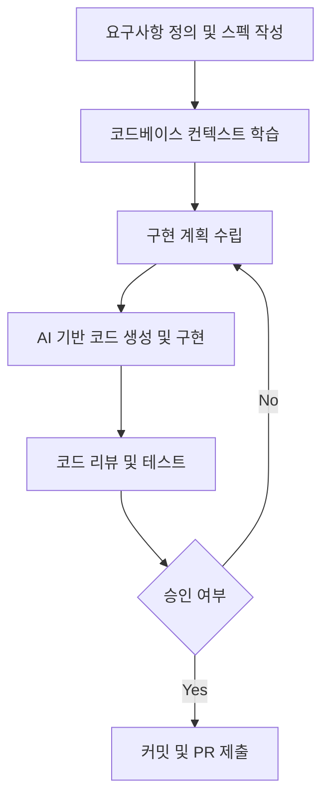

> **한 줄 요약** — AI 시대의 개발은 코드를 직접 작성하는 기술보다 명확한 요구사항 정의와 설계를 통해 시스템을 오케스트레이션하는 능력이 더 중요해지고 있습니다.

## 왜 명확한 스펙 정의가 개발의 본질이 되었을까?

최근 에이전트 방식의 AI 도구들을 사용하면서 가장 크게 느끼는 점은 속도보다 명확성의 중요성입니다. 예전에는 대충 머릿속에 있는 로직을 코드로 옮기면서 디테일을 채워나가는 방식이 가능했지만, AI를 활용할 때는 이 방식이 오히려 독이 되곤 합니다.

모호한 요구사항은 모호한 코드를 만듭니다. 반대로 제약 조건이 명확하고 구조화된 스펙(Spec)을 제공하면 AI는 놀라울 정도로 견고한 결과물을 내놓습니다. 결국 우리가 겪는 개발 지연의 본질은 코딩 속도가 아니라 문제를 얼마나 깊이 이해하고 정의했느냐에 달려 있다는 사실이 AI를 통해 더 극명하게 드러나고 있습니다.

실무에서 복잡한 비즈니스 로직을 구현할 때, 구현 그 자체보다 무엇을 만들 것인지 정의하는 단계에서 병목이 발생하는 경우가 많습니다. 이제 개발자의 역할은 단순히 함수를 작성하는 단계를 넘어, 전체 시스템의 가드레일을 설정하고 결과물을 검토하는 오케스트레이터(Orchestrator)로 변하고 있습니다.

## 스펙 중심 개발(Spec-Driven Development)의 핵심 프로세스

스펙 중심 개발은 단순히 프롬프트를 잘 입력하는 기술이 아닙니다. 이는 의도적이고 계획적인 개발 방법론에 가깝습니다. 단순히 코드를 빠르게 생성하는 프롬프팅과 달리, 스펙 중심 개발은 시스템의 제약 사항과 비즈니스 규칙을 먼저 확립하는 데 집중합니다.

이 과정에서 개발자가 집중해야 할 지점은 다음과 같습니다.

- 비즈니스 규칙의 엄밀한 정의: 예외 상황에서 시스템이 어떻게 반응해야 하는가?
- 제약 조건 설정: 성능, 보안, 메모리 사용량 등 AI가 임의로 판단해서는 안 되는 기준들
- 완료의 정의(Definition of Done): 이 기능이 성공적으로 구현되었다고 판단할 수 있는 구체적인 지표
- 엣지 케이스(Edge Case) 식별: 일반적인 흐름 외에 발생할 수 있는 특수한 상황들에 대한 사전 정의

## 바이브 코딩(Vibe Coding)과 스펙 중심 개발의 차이점

많은 이들이 AI 채팅창에 대략적인 의도를 던지고 코드를 받아보는 방식을 사용합니다. 이를 흔히 기분에 의존해 코딩한다는 의미로 바이브 코딩이라 부르기도 합니다. 이 방식은 프로토타이핑에는 유용할지 모르지만, 실제 운영 환경의 복잡한 시스템을 구축할 때는 매우 위험합니다.

스펙 중심 개발은 이 과정을 훨씬 더 통제된 환경으로 가져옵니다. 명확한 가이드라인이 있는 스펙은 코드 생성뿐만 아니라 테스트 코드 생성, 문서화, 그리고 나중에 합류할 동료를 위한 온보딩 자료로도 재사용될 수 있습니다. 

실제로 실무에서 복잡한 API 구조를 설계할 때, 스펙이 잘 잡혀 있으면 AI는 우리가 놓치기 쉬운 타입 오류나 에지 케이스 처리를 제안해주기도 합니다. 하지만 스펙 자체가 흔들리면 AI는 부족한 정보를 메우기 위해 위험한 가정을 하게 되고, 이는 결국 나중에 수정하기 더 어려운 기술 부채로 돌아옵니다.

## 왜 개발자는 더 뛰어난 설계자가 되어야 할까?

AI가 CRUD(Create, Read, Update, Delete) 패턴이나 반복적인 보일러플레이트 코드를 작성하는 시간을 획기적으로 줄여주면서, 엔지니어의 핵심 역량은 상위 수준으로 이동하고 있습니다. 이제는 어떻게(How) 코드를 짤 것인가보다 무엇을(What) 왜(Why) 만들어야 하는가에 대한 답을 내놓는 능력이 더 중요해졌습니다.

현업에서 비슷한 고민을 하다 보면 결국 좋은 엔지니어링이란 명확한 사고의 산물이라는 점을 깨닫게 됩니다. 도구는 변하지만 문제를 정의하고 구조화하는 본질은 변하지 않습니다. 오히려 AI라는 강력한 도구를 제대로 다루기 위해서는 이전보다 더 엄격한 논리 구조와 설계 능력이 요구됩니다.

이러한 변화가 개발자의 일자리를 뺏는 것이 아니라, 오히려 우리가 더 가치 있는 문제에 집중할 수 있게 해준다고 생각합니다. 지루한 반복 작업에서 벗어나 비즈니스 로직의 핵심을 고민하고, 시스템의 안정성을 높이는 설계에 더 많은 시간을 할애할 수 있기 때문입니다.

## 실무 도입 시 고려해야 할 트레이드오프

스펙 중심 개발이 모든 상황에서 정답은 아닙니다. 스펙을 작성하는 것 자체가 비용이기 때문입니다. 아주 간단한 스크립트나 일회성 도구를 만들 때도 엄격한 스펙을 먼저 작성하는 것은 생산성을 저해할 수 있습니다.

또한 AI가 생성한 코드를 검토하는 능력, 즉 리뷰어(Reviewer)로서의 역량이 뒷받침되지 않으면 스펙이 아무리 좋아도 잘못된 코드가 배포될 위험이 있습니다. 결국 생성된 결과물의 최종 책임은 여전히 사람인 개발자에게 있습니다.

따라서 다음과 같은 기준을 가지고 접근해보는 것이 좋습니다.

- 프로젝트의 복잡도가 높을수록 스펙 작성에 더 많은 시간을 투자할 것
- AI가 작성한 코드에 대해 반드시 단위 테스트(Unit Test)를 병행하여 검증할 것
- 반복적으로 발생하는 패턴은 템플릿화하여 스펙 작성 시간을 단축할 것

## 향후 엔지니어링의 방향성

코딩 기술이 엔지니어를 만드는 것이 아니라, 명확함(Clarity)이 엔지니어를 만듭니다. 우리는 이제 코드 작성자에서 시스템 설계자이자 오케스트레이터로 진화해야 합니다. 

스펙 중심 개발은 단순히 AI를 잘 쓰기 위한 수단이 아니라, 더 나은 소프트웨어를 만들기 위한 본질적인 접근법입니다. 당장 오늘 진행하는 작업부터 작은 메모장에 구현해야 할 기능의 제약 사항과 입력/출력, 그리고 예외 상황을 명확하게 한 페이지로 정리해보는 것부터 시작해보길 권합니다.

그 명확한 문장들이 AI를 만났을 때 얼마나 강력한 실행력으로 변하는지 경험해보면, 다시는 예전의 모호한 개발 방식으로 돌아가지 못할 것입니다.

## 참고 자료
- [원문] [Spec-Driven Development Changes Everything](https://dev.to/christie304/spec-driven-development-changes-everything-3en6) — DEV Community
- [관련] Why RTK Wasn't Enough (And What I Added) — DEV Community