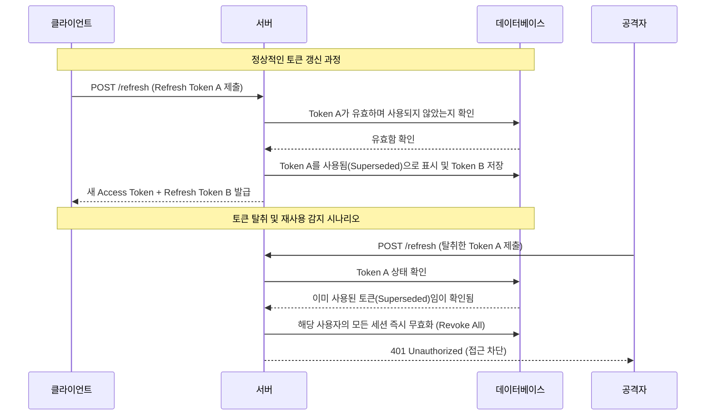

> **한 줄 요약** — 단순한 JWT 인증의 한계를 극복하기 위해 리프레시 토큰 로테이션과 서버 측 세션 트래킹을 결합하여 보안성과 제어력을 동시에 확보하는 방법입니다.

## 왜 단순한 JWT 인증은 실제 서비스에서 위험할까?

대부분의 입문용 튜토리얼은 사용자가 로그인하면 토큰을 발급하고, 이를 클라이언트에 저장한 뒤 매 요청마다 검증하는 수준에서 끝납니다. 하지만 이런 방식의 상태가 없는(Stateless) 인증은 실제 운영 환경에서 예상치 못한 보안 허점을 드러냅니다.

가장 큰 문제는 토큰을 강제로 만료시킬 방법이 없다는 점입니다. 사용자가 로그아웃을 해도 클라이언트에서 토큰을 지울 뿐, 이미 발급된 토큰은 유효 기간이 끝날 때까지 서버에서 유효한 것으로 간주합니다. 만약 리프레시 토큰(Refresh Token)이 탈취된다면 공격자는 유효 기간 내내 사용자의 권한을 마음껏 휘두를 수 있습니다.

현업에서 인증 시스템을 설계하다 보면 단순히 토큰을 주고받는 것을 넘어, 특정 기기를 원격 로그아웃시키거나 수상한 접근을 차단해야 하는 상황을 반드시 마주하게 됩니다. 기본 JWT 방식으로는 이런 요구사항을 충족하기 어렵습니다.

- **세션 제어 불가**: 특정 사용자의 세션을 강제로 종료할 수 없습니다.
- **다중 기기 관리 어려움**: 어떤 기기에서 접속 중인지 파악하기 어렵습니다.
- **탈취 시 무방비**: 리프레시 토큰이 유출되면 만료 전까지는 공격을 막을 방법이 없습니다.

## 리프레시 토큰 로테이션(Refresh Token Rotation)의 작동 방식

리프레시 토큰 로테이션은 클라이언트가 새로운 액세스 토큰(Access Token)을 요청할 때마다 리프레시 토큰도 함께 교체하는 방식입니다. 이를 통해 리프레시 토큰의 수명을 극도로 짧게 유지하고 탈취 위험을 낮춥니다.

이 과정에서 핵심은 서버가 리프레시 토큰의 상태를 추적하는 것입니다. 단순히 토큰을 새로 발급하는 데 그치지 않고, 이전에 사용된 토큰이 다시 제출되는지 감시해야 합니다. 만약 이미 사용된 토큰이 들어온다면 이는 누군가 토큰을 탈취해 재사용하려 한다는 강력한 신호입니다.

다음 다이어그램은 리프레시 토큰이 로테이션되는 정상적인 흐름과 탈취가 감지되는 상황을 보여줍니다.



### 토큰 재사용 감지와 보안 로직

실제 구현 시에는 데이터베이스에 각 세션의 상태를 저장해야 합니다. 단순히 현재 토큰이 무엇인지만 저장하는 것이 아니라, 해당 세션에서 파생된 토큰들의 계보를 관리하는 개념입니다.

```javascript
export async function rotateRefreshToken(refreshToken) {
  // 1. 토큰의 서명 및 유효성 검증
  const decoded = jwt.verify(refreshToken, config.JWT_SECRET);
  const refreshTokenHash = hashValue(refreshToken);

  // 2. DB에서 해당 해시를 가진 세션 탐색
  const session = await sessionModel.findOne({ refreshTokenHash });
  if (!session) {
    throw new AppError(401, "유효하지 않은 토큰입니다.");
  }

  // 3. 이미 교체된(Superseded) 토큰이 들어온 경우 탈취로 간주
  if (session.superseded || session.revoked) {
    // 해당 사용자의 모든 세션을 무효화하여 피해 최소화
    await sessionModel.updateMany(
      { userId: session.userId },
      { revoked: true, revokedAt: new Date() }
    );
    throw new AppError(401, "토큰 재사용이 감지되었습니다. 모든 세션이 만료됩니다.");
  }

  // 4. 새로운 리프레시 토큰 생성 및 기존 토큰 무효화 처리
  const newRefreshToken = signRefreshToken({ id: decoded.id });
  session.superseded = true;
  session.refreshTokenHash = hashValue(newRefreshToken);
  await session.save();

  return {
    accessToken: signAccessToken({ id: decoded.id, sessionId: session._id }),
    refreshToken: newRefreshToken,
  };
}
```

이 로직의 백미는 3번 단계입니다. 공격자가 사용자의 리프레시 토큰을 먼저 훔쳐서 사용했다면, 나중에 정당한 사용자가 토큰 갱신을 시도할 때 이미 사용된 토큰임을 감지하게 됩니다. 이때 시스템은 즉시 해당 유저의 모든 연결을 끊어버림으로써 공격자의 추가 활동을 차단합니다.

## 보안을 극대화하는 해싱과 세션 관리 전략

리프레시 토큰은 그 자체로 매우 강력한 권한을 가집니다. 따라서 데이터베이스에 이를 평문으로 저장하는 것은 매우 위험합니다. DB가 유출되거나 내부 관계자가 데이터를 들여다볼 경우 모든 사용자의 세션을 탈취할 수 있기 때문입니다.

### 왜 SHA-256을 사용해야 할까?

비밀번호를 저장할 때는 브루트 포스(Brute-force) 공격을 막기 위해 Bcrypt나 Argon2처럼 의도적으로 느리게 설계된 해시 함수를 사용합니다. 하지만 리프레시 토큰은 사람이 정하는 것이 아니라 암호학적으로 안전한 난수 생성기(CSPRNG)를 통해 만들어진 고엔트로피 값입니다.

이런 무작위 값은 연산 속도가 빠른 SHA-256으로 해싱하더라도 무차별 대입으로 원본을 찾아내는 것이 사실상 불가능합니다. 따라서 불필요하게 서버 자원을 소모하는 Bcrypt 대신 SHA-256을 사용하는 것이 성능과 보안 사이의 합리적인 선택입니다.

### 세션 트래킹 데이터의 가치

서버에 세션 정보를 기록하면 단순 인증을 넘어 풍부한 관리 기능을 제공할 수 있습니다.

- **IP 주소 및 사용자 에이전트(User Agent)**: 사용자가 어떤 브라우저나 기기에서 접속했는지 기록합니다. 이를 통해 내 계정 활동 페이지에서 수상한 기기를 확인하고 로그아웃시킬 수 있습니다.
- **강제 무효화(Revocation) 플래그**: 관리자 도구에서 특정 사용자의 접근을 즉시 차단해야 할 때 `revoked` 필드 하나로 해결됩니다.
- **최종 활동 시간**: 오랫동안 활동이 없는 세션을 정리하거나 보안 정책에 따라 만료시키는 기준이 됩니다.

## 실무 도입 시 고려해야 할 트레이드오프

이 방식은 완벽해 보이지만 공짜는 아닙니다. 가장 큰 변화는 JWT의 본질적인 장점인 상태가 없음(Stateless)을 일부 포기해야 한다는 점입니다.

실제로 매 요청마다 세션의 유효성을 DB에서 확인한다면, 이는 전통적인 세션 방식과 다를 바가 없게 됩니다. 이로 인해 발생하는 성능 부하를 줄이기 위해 보통 다음과 같은 전략을 사용합니다.

- **하이브리드 검증**: 액세스 토큰은 유효 기간을 아주 짧게(예: 5~15분) 설정하고, 이 기간 동안은 DB 확인 없이 토큰 자체만 검증합니다. 리프레시 토큰을 사용할 때만 DB를 조회하여 상태를 체크합니다.
- **캐시 계층 활용**: Redis 같은 인메모리 DB에 세션 상태를 저장하여 조회 속도를 극대화합니다.

현업에서 비슷한 고민을 하다 보면 보안과 성능 사이에서 타협점을 찾아야 하는 순간이 옵니다. 금융 서비스처럼 보안이 최우선이라면 매 요청마다 세션 상태를 확인해야겠지만, 일반적인 서비스라면 액세스 토큰의 수명을 조절하는 것만으로도 충분한 보안 수준을 확보할 수 있습니다.

## 정리

단순한 JWT 구현은 시작일 뿐입니다. 실제 사용자를 보호하기 위해서는 리프레시 토큰 로테이션과 세션 트래킹이 반드시 뒷받침되어야 합니다.

- 리프레시 토큰은 사용될 때마다 교체하여 수명을 관리해야 합니다.
- 이미 사용된 토큰이 다시 들어오면 즉시 전체 세션을 무효화하는 재사용 감지 로직을 갖춰야 합니다.
- DB에는 토큰의 해시값과 기기 정보를 함께 저장하여 제어력을 확보해야 합니다.
- 보안 강화로 인해 발생하는 성능 저하는 캐싱이나 액세스 토큰 수명 조절로 해결할 수 있습니다.

지금 운영 중인 서비스의 로그아웃 기능이 단순히 클라이언트의 토큰을 삭제하는 방식은 아닌지 점검해 보시기 바랍니다. 서버에서 세션을 완전히 통제할 수 있을 때 비로소 안전한 인증 시스템이라고 할 수 있습니다.

## 참고 자료
- [원문] [🔐 I Finally Understood JWT Auth - After Building Refresh Token Rotation From Scratch](https://dev.to/anishhajare/i-finally-understood-jwt-auth-after-building-refresh-token-rotation-from-scratch-fd4) — DEV Community
- [관련] Self-Refining Agents in Spec-Driven Development — DEV Community