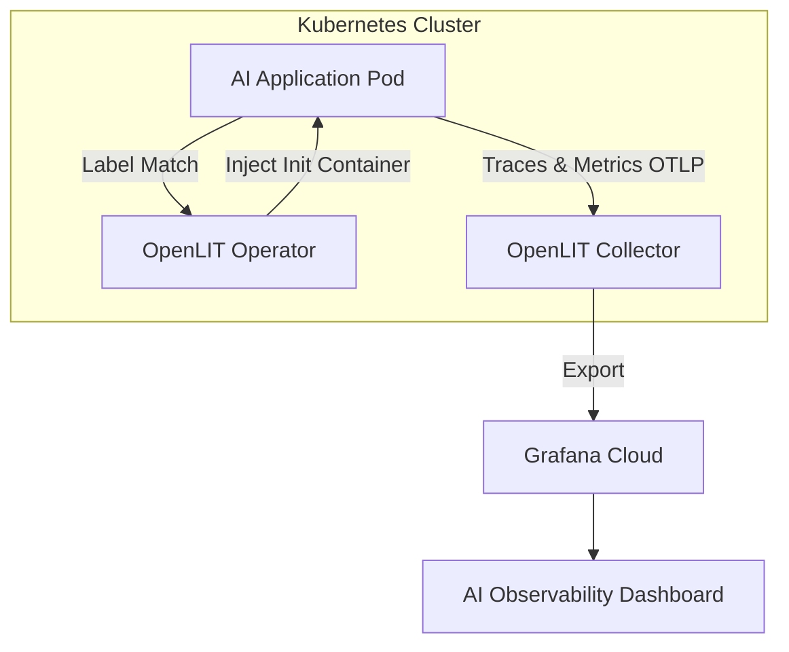

> **한 줄 요약** — 쿠버네티스 환경에서 코드 수정 없이 OpenLIT 오퍼레이터를 활용해 LLM과 AI 에이전트의 비용, 지연 시간, 토큰 사용량을 실시간으로 모니터링하는 자동화 전략을 소개합니다.

## 쿠버네티스 기반 AI 서비스에서 관측성이 왜 해결하기 어려운 과제가 되었을까?

쿠버네티스(Kubernetes) 환경에서 대규모 언어 모델(LLM) 기반 서비스를 운영하다 보면 일반적인 마이크로서비스보다 훨씬 복잡한 문제에 직면합니다. 단순히 서버가 살아있는지 확인하는 수준을 넘어, 특정 에이전트가 왜 반복적인 루프에 빠졌는지, 어떤 사용자가 토큰을 과다하게 소비하여 비용을 발생시키는지 파악해야 하기 때문입니다.

기존의 모니터링 방식대로라면 모든 파이썬(Python) 코드나 프레임워크 호출부에 라이브러리를 직접 삽입해야 합니다. 하지만 랭체인(LangChain), 크루AI(CrewAI) 같은 프레임워크가 빈번하게 업데이트되는 상황에서 소스 코드를 매번 수정하고 이미지를 다시 빌드하는 과정은 운영팀과 개발팀 모두에게 큰 부담이 됩니다.

이러한 문제를 해결하기 위해 코드 수정이 필요 없는 제로 코드(Zero-code) 방식의 관측성(Observability) 확보가 필수적입니다. 인프라 수준에서 계측(Instrumentation)을 자동화하면 개발자는 비즈니스 로직에만 집중하고, 운영자는 클러스터 전체의 AI 워크로드 상태를 즉시 시각화할 수 있습니다.

## OpenLIT 오퍼레이터와 그라파나 클라우드를 활용한 자동 계측 구조

OpenLIT 오퍼레이터는 쿠버네티스 클러스터 내에서 AI 워크로드를 감시하며 오픈텔레메트리(OpenTelemetry) 계측을 자동으로 주입합니다. 이 방식의 핵심은 파드(Pod)가 생성될 때 초기화 컨테이너(Init Container)를 삽입하여 애플리케이션 실행 환경에 필요한 에이전트를 구성하는 것입니다.

이 과정에서 수집된 텔레메트리 데이터는 그라파나 클라우드(Grafana Cloud)의 OTLP 게이트웨이로 전송됩니다. 사용자는 별도의 대시보드를 구성할 필요 없이 사전에 정의된 템플릿을 통해 모델별 지연 시간(Latency), 토큰 소비량, 비용 발생 현황을 한눈에 파악할 수 있습니다.



### 주요 구성 요소와 워크플로우

- **AI 워크로드**: OpenAI, Anthropic 등의 모델을 호출하거나 벡터 데이터베이스(Vector DB)를 사용하는 파이썬 기반 서비스입니다.
- **OpenLIT Operator**: 특정 레이블이 지정된 파드를 감지하고 오픈텔레메트리 설정을 자동으로 주입하는 쿠버네티스 컨트롤러입니다.
- **AutoInstrumentation 리소스**: 어떤 파드를 대상으로 할지, 데이터를 어디로 보낼지 정의하는 커스텀 리소스(CRD)입니다.
- **Grafana Cloud**: 수집된 트레이스(Traces)는 Tempo에, 메트릭(Metrics)은 Prometheus에 저장되어 시각화됩니다.

## 실무에서 마주하는 AI 모니터링의 한계와 극복 방안

현업에서 AI 서비스를 운영하다 보면 특정 요청에서 갑자기 지연 시간이 튀는 현상을 자주 겪습니다. 이때 원인이 모델 제공업체의 API 문제인지, 아니면 에이전트가 도구(Tool)를 호출하는 과정에서 발생한 병목인지 구분하는 것이 매우 어렵습니다.

제로 코드 계측을 도입하면 분산 추적(Distributed Tracing) 기능을 통해 에이전트의 실행 단계를 단계별로 쪼개서 볼 수 있습니다. 예를 들어 에이전트가 검색 증강 생성(RAG)을 위해 벡터 데이터베이스에 쿼리를 날리고 결과를 받아 모델에 전달하기까지의 전 과정을 하나의 트레이스로 연결합니다.

실제로 비슷한 고민을 하다 보면 성능뿐만 아니라 비용 통제가 더 큰 화두가 되곤 합니다. OpenLIT은 토큰 사용량을 실시간으로 달러 단위의 비용으로 환산해 줍니다. 이는 개발 단계에서 예상치 못한 재귀 호출로 인해 비용이 폭증하는 사고를 방지하는 강력한 안전장치가 됩니다.

### 도입 시 고려해야 할 트레이드오프

자동 주입 방식은 편리하지만 모든 상황에서 만능은 아닙니다. 초기화 컨테이너가 삽입되면서 파드의 시작 시간이 미세하게 길어질 수 있으며, 주입된 에이전트 라이브러리와 애플리케이션 내의 특정 패키지 버전이 충돌할 가능성도 염두에 두어야 합니다.

따라서 운영 환경에 바로 적용하기보다는 스테이징 환경에서 충분한 검증을 거쳐야 합니다. 특히 모델 컨텍스트 프로토콜(MCP) 서버를 경유하는 복잡한 호출 구조를 가진 경우, 컨텍스트 전파(Context Propagation)가 끊기지 않고 트레이스 ID가 잘 유지되는지 확인하는 과정이 반드시 필요합니다.

## 쿠버네티스 환경에 OpenLIT 오퍼레이터 배포하기

구현을 위해 먼저 헬름(Helm)을 이용해 오퍼레이터를 설치해야 합니다. 설치 자체는 간단하며 기존 클러스터 운영 방식과 크게 다르지 않습니다.

```bash
# OpenLIT 헬름 저장소 추가 및 업데이트
helm repo add openlit https://openlit.github.io/helm/
helm repo update

# 오퍼레이터 설치
helm install openlit-operator openlit/openlit-operator
```

설치가 완료되면 어떤 파드를 모니터링할지 결정하는 `AutoInstrumentation` 매니페스트를 작성합니다. 아래 예시는 `instrumentation: openlit` 레이블이 붙은 파드에 자동으로 계측을 적용하고 데이터를 그라파나 클라우드로 전송하는 설정입니다.

```yaml
apiVersion: openlit.io/v1alpha1
kind: AutoInstrumentation
metadata:
  name: ai-monitoring-config
  namespace: default
spec:
  selector:
    matchLabels:
      instrumentation: openlit
  python:
    instrumentation:
      enabled: true
      otlp:
        endpoint: "https://otlp-gateway-region.grafana.net/otlp"
        headers:
          Authorization: "Basic <BASE64_AUTH_TOKEN>"
    resource:
      attributes:
        deployment.environment: "production"
        service.name: "chatbot-agent"
```

위 설정을 적용한 후 대상 배포판(Deployment)을 재시작하면, 오퍼레이터가 파드 사양을 수정하여 오픈텔레메트리 에이전트를 포함시킵니다. 이후부터는 코드 한 줄 고치지 않고도 그라파나 대시보드에서 실시간 데이터를 확인할 수 있습니다.

## AI 에이전트 가시성 확보를 위한 실무적 조언

단순히 지표를 수집하는 것보다 중요한 것은 수집된 데이터를 어떻게 활용하느냐입니다. AI 서비스의 특성상 모델의 응답이 정확한지(Hallucination 여부) 판단하는 품질 평가 지표와 성능 지표를 결합해야 진정한 관측성이 완성됩니다.

그라파나 클라우드의 AI 관측성 솔루션은 프롬프트와 응답 내용을 트레이스 정보와 함께 기록할 수 있는 기능을 제공합니다. 이를 통해 특정 오류가 발생했을 때 당시의 입력값과 모델의 출력을 즉시 대조할 수 있습니다. 이는 개인정보 보호 정책에 따라 민감할 수 있으므로, 실무에서는 마스킹(Masking) 처리를 적절히 병행하는 것이 좋습니다.

또한, 에이전트가 외부 도구를 사용하는 MCP(Model Context Protocol) 환경에서는 네트워크 경계를 넘나드는 트레이싱이 필수입니다. 파이썬으로 작성된 클라이언트와 노드제이에스(Node.js)로 작성된 도구 서버 사이의 호출을 하나의 흐름으로 파악해야 장애 복구 시간(MTTR)을 단축할 수 있습니다.

## 요약 및 제언

쿠버네티스 위에서 돌아가는 AI 애플리케이션은 변화의 속도가 매우 빠릅니다. 매번 계측 코드를 수동으로 관리하는 방식은 결국 기술 부채로 돌아오게 됩니다. OpenLIT과 같은 오퍼레이터 기반의 제로 코드 방식을 도입하면 인프라 계층에서 관측성을 표준화할 수 있습니다.

지금 바로 수행해 볼 수 있는 작업은 현재 운영 중인 테스트 클러스터에 OpenLIT 오퍼레이터를 설치하고, 가장 빈번하게 호출되는 LLM 서비스 하나에 레이블을 붙여보는 것입니다. 대시보드에 찍히는 토큰 비용과 지연 시간 데이터를 마주하는 순간, 그동안 보이지 않았던 시스템의 빈틈이 명확히 보이기 시작할 것입니다.

## 참고 자료
- [원문] [Instrument zero‑code observability for LLMs and agents on Kubernetes](https://grafana.com/blog/ai-observability-zero-code/) — Grafana Blog
- [관련] Monitor Model Context Protocol (MCP) servers with OpenLIT and Grafana Cloud — Grafana Blog
- [관련] How to monitor LLMs in production with Grafana Cloud, OpenLIT, and OpenTelemetry — Grafana Blog