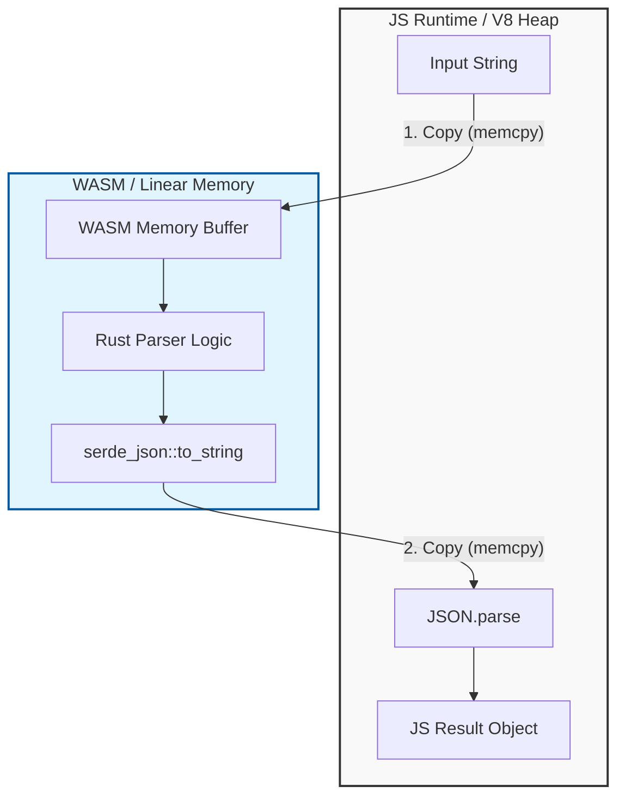

> **한 줄 요약** — Rust와 WebAssembly가 모든 상황에서 JavaScript보다 빠른 것은 아니며, 특히 런타임 간 데이터 교환 비용이 큰 경우에는 오히려 성능이 저하될 수 있습니다.

## 이 주제를 꺼낸 이유
성능 최적화가 필요한 시점에 많은 개발자가 가장 먼저 떠올리는 선택지 중 하나가 Rust와 WebAssembly(WASM) 조합입니다. JavaScript(JS)의 한계를 넘어서는 네이티브에 가까운 속도를 브라우저에서 구현할 수 있다는 기대 때문입니다. 하지만 실제 프로젝트에 이를 적용해 보면 예상치 못한 병목 구간을 마주하게 됩니다.

최근 OpenUI 팀에서 공유한 사례는 이러한 기술적 맹점을 정확히 짚어줍니다. 그들은 LLM이 생성한 DSL(Domain Specific Language)을 파싱하기 위해 Rust 기반의 WASM 파서를 구축했지만, 오히려 이를 순수 TypeScript(TS)로 재작성했을 때 성능이 2배에서 4배까지 향상되는 결과를 얻었습니다. 이는 단순히 언어의 실행 속도보다 시스템 전체의 데이터 흐름과 경계 비용(Boundary Cost)을 이해하는 것이 얼마나 중요한지를 보여줍니다.

브라우저 환경에서 고성능 모듈을 고민하고 있다면, 이 사례는 기술 스택을 결정하기 전 반드시 검토해야 할 중요한 이정표가 될 것입니다.

## 핵심 내용 정리
OpenUI의 파서는 LLM이 스트리밍 방식으로 뱉어내는 텍스트를 실시간으로 React 컴포넌트 트리로 변환하는 역할을 합니다. 이 파이프라인은 오토클로저(Autocloser), 렉서(Lexer), 스플리터(Splitter), 파서(Parser), 리졸버(Resolver), 매퍼(Mapper)의 6단계로 구성됩니다. Rust로 작성된 이 로직 자체는 매우 빠르고 견고했습니다. 문제는 실행 속도가 아니라 데이터가 오가는 통로에 있었습니다.

### WASM 경계 통과 시 발생하는 비용
JS와 WASM은 서로 독립된 메모리 공간을 사용합니다. WASM은 선형 메모리(Linear Memory)라는 플랫한 바이트 배열을 사용하고, JS는 V8 엔진이 관리하는 힙(Heap) 메모리를 사용합니다. 두 영역 사이에서 데이터를 주고받을 때마다 다음과 같은 비용이 발생합니다.

1.  **입력 데이터 복사**: JS 문자열을 WASM의 선형 메모리로 복사하기 위한 할당과 메모리 복사(memcpy)가 일어납니다.
2.  **데이터 처리**: Rust 내부에서 파싱이 수행됩니다. 이 구간은 매우 빠릅니다.
3.  **결과 직렬화**: Rust의 구조체(Struct)를 JS가 이해할 수 있는 형태로 변환해야 합니다. `serde_json` 등을 통해 JSON 문자열로 변환합니다.
4.  **결과 데이터 복사**: 생성된 JSON 문자열을 다시 JS 힙 영역으로 복사합니다.
5.  **역직렬화**: JS 엔진에서 `JSON.parse`를 호출하여 실제 객체로 변환합니다.

결국 Rust 코드가 아무리 빨리 돌아가도, 데이터를 넣고 빼는 과정에서 발생하는 오버헤드가 전체 실행 시간을 지배하게 됩니다.

### 직접 객체 전달의 함정
개발팀은 JSON 직렬화 과정을 생략하기 위해 `serde-wasm-bindgen`을 도입했습니다. 이는 Rust 구조체를 `JsValue`로 직접 변환하여 반환하는 방식입니다. 이론적으로는 더 빨라야 하지만, 벤치마크 결과는 오히려 30% 더 느려졌습니다.

이유는 간단합니다. JS는 WASM 메모리에 있는 Rust 구조체의 바이트 레이아웃을 직접 읽을 수 없습니다. 따라서 `serde-wasm-bindgen`은 내부적으로 수많은 미세한 변환 과정을 거칩니다. 객체의 필드 하나하나를 생성할 때마다 JS와 WASM 사이의 경계를 넘나들게 되는 것입니다. 한 번의 큰 데이터 복사가 수많은 작은 함수 호출과 변환으로 치환되면서 성능이 더욱 악화된 사례입니다.

### 알고리즘의 승리: O(N²)에서 O(N)으로
언어를 TypeScript로 바꾸면서 얻은 가장 큰 이득은 단순한 언어적 특성이 아니었습니다. 스트리밍 데이터 처리 방식을 개선한 알고리즘의 변화가 결정적이었습니다.

기존 방식은 LLM에서 청크(Chunk)가 올 때마다 전체 문자열을 처음부터 다시 파싱하는 구조였습니다. 데이터가 길어질수록 파싱 시간이 기하급수적으로 늘어나는 O(N²) 구조였던 셈입니다. TypeScript로 포팅하면서 이들은 상태 기반의 증분 파서(Incremental Parser)를 도입했습니다.

*   이미 완료된 문장(Statement)은 AST(Abstract Syntax Tree) 형태로 캐싱합니다.
*   새로운 데이터가 들어오면 마지막 미완성 문장만 다시 파싱합니다.
*   캐싱된 AST와 새로 파싱된 결과를 합쳐 최종 결과물을 만듭니다.

이 최적화를 통해 전체 스트리밍 과정에서의 연산량을 O(N)으로 줄였고, 결과적으로 사용자 체감 속도를 비약적으로 높였습니다.

## 내 생각 & 실무 관점
현업에서 성능 이슈를 마주할 때 흔히 저지르는 실수가 "언어만 바꾸면 해결될 것"이라는 믿음입니다. 하지만 이 글에서 보여주듯, 시스템의 성능은 가장 느린 연결 고리(Weakest Link)에 의해 결정됩니다.

### V8 엔진의 성숙도를 간과하지 말 것
실제로 현대의 JavaScript 엔진은 매우 고도화되어 있습니다. 특히 파싱과 같은 텍스트 기반 작업에서 V8의 JIT(Just-In-Time) 컴파일러는 이미 최적화의 끝판왕에 가깝습니다. 단순한 로직이라면 Rust 코드가 네이티브 환경에서 보여주는 압도적인 성능 차이가 브라우저의 WASM 샌드박스 안에서는 희석될 가능성이 큽니다.

실무에서 비슷한 고민을 하다 보면, 복잡한 비즈니스 로직을 WASM으로 옮겼을 때 얻는 이득보다 그 로직을 유지보수하기 위해 들어가는 공수와 디버깅의 어려움이 더 크게 다가올 때가 많습니다. 이번 사례처럼 데이터 구조가 복잡하고 빈번한 입출력이 발생하는 경우라면, JS의 성능을 믿고 알고리즘 개선에 집중하는 것이 훨씬 효율적인 접근입니다.

### FFI 비용은 어디에나 존재한다
이 문제는 비단 WASM과 JS 사이에서만 발생하는 것이 아닙니다. Python에서 C++ 확장 모듈을 호출할 때나, Node.js에서 네이티브 애드온을 쓸 때도 동일한 비용이 발생합니다. 호출 횟수가 잦고 넘겨주는 데이터의 크기가 작을수록 이 비용은 상대적으로 커집니다.

만약 대규모 행렬 연산이나 이미지 필터링처럼, 한 번 데이터를 넘겨준 뒤 WASM 내부에서 수 밀리초(ms) 이상 집중적인 연산을 수행하고 결과값으로 단순한 수치를 돌려받는 구조라면 WASM은 여전히 최상의 선택입니다. 하지만 파서처럼 객체 지향적인 복잡한 결과물을 매 순간 돌려줘야 하는 작업에서는 경계 비용이 성능의 발목을 잡게 됩니다.

### 트레이드오프와 도입 시 주의점
WASM 도입을 고려하고 있다면 다음 사항을 먼저 자문해봐야 합니다.

*   **데이터의 크기와 복잡도**: 주고받는 데이터가 단순한가? 아니면 깊은 계층의 객체 구조인가?
*   **호출 빈도**: 함수를 초당 수천 번 호출하는가? 아니면 무거운 작업을 가끔 수행하는가?
*   **알고리즘 최적화 여부**: 현재 JS 코드에서 알고리즘적으로 개선할 여지는 정말 없는가?

대부분의 경우 언어를 바꾸기 전에 알고리즘을 O(N²)에서 O(N)으로 바꾸는 것이 가장 저렴하고 확실한 해결책이 됩니다.

## 정리
Rust와 WASM은 분명 강력한 도구이지만, 브라우저라는 특수한 환경에서는 데이터 전송 오버헤드라는 보이지 않는 세금이 붙습니다. 이번 사례를 통해 우리는 두 가지 교훈을 얻을 수 있습니다. 첫째, 성능 측정(Profiling) 시 로직 실행 시간뿐만 아니라 데이터 직렬화 및 복사 비용을 반드시 포함해야 한다는 것입니다. 둘째, 언어의 속도보다 알고리즘의 복잡도 개선이 성능에 더 드라마틱한 영향을 미친다는 점입니다.

지금 성능 문제로 WASM 도입을 고민하고 있다면, 먼저 프로파일러를 열고 데이터가 경계를 넘나드는 횟수와 크기를 측정해 보시기 바랍니다.

## 참고 자료
- [원문] [We rewrote our Rust WASM parser in TypeScript and it got faster](https://www.openui.com/blog/rust-wasm-parser) — Hacker News Best
- [관련] Professional video editing, right in the browser with WebGPU and WASM — Tooscut
- [관련] Grafeo – A fast, lean, embeddable graph database built in Rust — Grafeo.dev