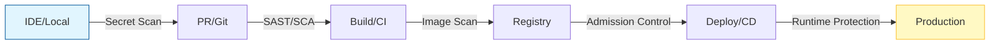

> **한 줄 요약** — 보안을 개발 마지막 단계의 검문소가 아니라 파이프라인 전체에 녹여내는 데브섹옵스(DevSecOps) 실천법을 통해 예기치 못한 침해 사고를 방지해야 합니다.

## 왜 보안을 개발 프로세스 전반으로 옮겨야 할까?

새벽 3시, 슬랙(Slack) 채널에 크리티컬 보안 사고 알림이 뜹니다. 운영 중인 쿠버네티스 클러스터에서 암호화폐 채굴(Cryptomining) 활동이 감지되었다는 메시지입니다. 이런 상황은 단순히 이론적인 가설이 아니라 실제 현업에서 빈번하게 발생하는 일입니다. 데브섹옵스(DevSecOps)는 이러한 공격자가 시스템에 침투하기 전에 미리 방어막을 구축하는 일련의 과정입니다.

전통적인 방식에서는 개발이 모두 끝난 뒤 보안 팀이 코드를 검수합니다. 이 시점에서는 이미 수십 개의 취약점이 발견되고, 개발자는 3주 전에 쓴 코드의 맥락을 기억하지 못해 수정이 늦어집니다. 보안이 병목 현상을 일으키는 주범이 되는 셈입니다. 보안을 왼쪽으로 옮기는 쉬프트 레프트(Shift-Left) 전략이 필요한 이유가 여기에 있습니다.



보안 결함도 일반적인 버그처럼 취급해야 합니다. 심각도에 따라 명확한 해결 기한(SLA)을 설정하는 것이 실무적으로 효과적입니다.

| 심각도(Severity) | 해결 기한(SLA) | 예시 상황 |
| :--- | :--- | :--- |
| Critical | 24시간 이내 | 유출된 운영 환경 시크릿, 실제 악용 중인 CVE |
| High | 7일 이내 | SQL 인젝션 취약점, 인증 로직 누락 |
| Medium | 30일 이내 | HTTPS 리다이렉트 미설정, 과도한 에러 메시지 노출 |
| Low | 90일 이내 | 보안 헤더 누락, 경미한 정보 노출 |

## 공급망 공격(Supply Chain Attack)의 위협과 방어 전략

최근 보안 사고의 특징은 서비스 자체보다 서비스를 만드는 도구나 의존성 라이브러리를 노린다는 점입니다. 솔라윈즈(SolarWinds) 사태처럼 빌드 시스템 자체를 장악하거나, `ua-parser-js` 사례처럼 오픈소스 메인테이너의 계정을 탈취해 악성 코드를 심는 방식입니다. 특히 의존성 혼란(Dependency Confusion)은 기업 내부에서 사용하는 비공개 패키지 이름을 외부 공용 저장소에 높은 버전으로 올리는 단순한 수법임에도 치명적입니다.

실무에서 의존성 혼란을 방지하려면 다음과 같은 설정이 필수입니다.

```bash
# 1. 스코프 패키지 사용 및 레지스트리 매핑 설정
echo "@mycompany:registry=https://mycompany.pkgs.visualstudio.com/_packaging/feed/npm/registry/" > .npmrc

# 2. 락파일 취약점 점검 실행
npx lockfile-lint --path package-lock.json --type npm --allowed-hosts npm mycompany.pkgs.visualstudio.com
```

공급망 보안은 소스 코드, 빌드 프로세스, 의존성이라는 세 가지 축에서 동시에 이루어져야 합니다. 커밋 서명(Signed Commits)과 코드 소유자(CODEOWNERS) 지정으로 코드 변경을 통제하고, 빌드 시에는 휘발성 러너(Ephemeral Runners)를 사용하여 흔적을 남기지 않는 것이 좋습니다.

## 시크릿 관리(Secrets Management)의 3단계 계층 구조

코드에 데이터베이스 비밀번호나 API 키를 직접 입력하는 것은 보안 사고의 지름길입니다. 시크릿 관리는 위험 수준과 관리 편의성에 따라 세 단계로 나눌 수 있습니다.

- **1단계: 시크릿 자체를 없애기 (Managed Identity)**
가장 권장하는 방식입니다. 애저(Azure)의 관리형 ID나 쿠버네티스의 워크로드 ID(Workload Identity)를 사용하면 애플리케이션이 별도의 비밀번호 없이도 클라우드 자원에 인증할 수 있습니다. 짧은 수명의 토큰이 자동으로 발급되므로 유출될 비밀번호 자체가 존재하지 않습니다.

- **2단계: 중앙 집중형 금고 사용 (Centralized Vault)**
서드파티 API 키처럼 어쩔 수 없이 시크릿이 필요한 경우입니다. 애저 키 볼트(Azure Key Vault) 같은 전문 도구를 사용하되, 네트워크 접근을 전용 엔드포인트(Private Endpoint)로 제한하고 모든 접근 로그를 남겨야 합니다.

- **3단계: 쿠버네티스 시크릿 (Kubernetes Secrets)**
보안상 수용 가능한 수준이지만, 반드시 암호화가 동반되어야 합니다. `Secrets Store CSI Driver`를 사용해 외부 금고의 시크릿을 파일 형태로 마운트하는 방식이 실무에서 자주 쓰입니다.

```yaml
# SecretProviderClass 예시
apiVersion: secrets-store.csi.x-k8s.io/v1
kind: SecretProviderClass
metadata:
  name: azure-kv-secrets
spec:
  provider: azure
  parameters:
    keyvaultName: "kv-prod-env"
    objects: |
      array:
        - |
          objectName: db-password
          objectType: secret
```

## 컨테이너 보안(Container Security)과 이미지 최적화

컨테이너 이미지는 단순한 실행 파일이 아니라 하나의 작은 파일 시스템입니다. 베이스 이미지에 포함된 수많은 라이브러리가 취약점의 통로가 될 수 있습니다. 실제로 데비안(Debian) 같은 전체 이미지를 사용하면 수백 개의 보안 취약점(CVE)이 발견되기도 합니다.

이를 해결하기 위해 실무에서는 다음 네 가지 원칙을 지켜야 합니다.

1. **최소형 베이스 이미지 사용**: `node:20-alpine`처럼 꼭 필요한 라이브러리만 포함된 이미지를 선택합니다.
2. **루트 권한 실행 금지**: 컨테이너 내부 사용자를 별도로 생성하여 권한을 최소화합니다.
3. **멀티 스테이지 빌드(Multi-stage builds)**: 빌드 도구는 최종 이미지에 포함하지 않고 실행에 필요한 결과물만 옮깁니다.
4. **태그 고정 및 다이제스트 사용**: `latest` 태그 대신 특정 버전과 해시값(`@sha256:...`)을 명시하여 이미지의 불변성을 보장합니다.

```dockerfile
# 멀티 스테이지 빌드 예시
FROM node:20-alpine AS builder
WORKDIR /app
COPY . .
RUN npm ci && npm run build

FROM node:20-alpine AS runtime
# 빌드 도구 없이 결과물만 복사
COPY --from=builder /app/dist /app/dist
USER 1000
CMD ["node", "/app/dist/index.js"]
```

## 내 생각 & 실무 관점

보안 사고는 기술적 결함보다 관리적 실수에서 시작되는 경우가 많습니다. 실무에서 보안 도구를 도입할 때 가장 큰 장애물은 개발 생산성 저하에 대한 우려입니다. 모든 취약점을 막겠다고 파이프라인 곳곳에 차단기를 설치하면 개발 팀의 반발을 사기 쉽습니다.

현업에서 비슷한 고민을 하다 보면 보안 도구를 처음부터 차단(Block) 모드로 두기보다 감지(Audit) 모드로 시작하는 것이 현실적이라는 점을 깨닫게 됩니다. 우선 어떤 취약점이 있는지 가시성을 확보하고, 개발자들이 스스로 수정할 수 있도록 IDE 플러그인을 제공하는 것이 먼저입니다. 보안은 개발자를 감시하는 도구가 아니라 더 안전한 코드를 짜도록 돕는 도구라는 인식이 심어져야 합니다.

또한 시크릿 유출 사고가 발생했을 때 단순히 비밀번호만 바꾸는 것으로 끝내서는 안 됩니다. 이미 유출된 시크릿이 포함된 깃(Git) 히스토리 전체를 다시 써야 하며, 해당 시크릿을 통해 접근 가능한 다른 자원들의 로그까지 전수 조사해야 합니다. 이는 엄청난 비용이 드는 작업이므로 프리커밋 훅(Pre-commit hooks) 등을 통해 애초에 커밋되지 않도록 막는 것이 비용 대비 효율이 가장 높습니다.

마지막으로 로그4쉘(Log4Shell) 사태 때 느꼈던 점은 소프트웨어 자재 명세서(SBOM)의 중요성입니다. 우리 시스템이 어떤 라이브러리의 몇 버전을 쓰고 있는지 한눈에 파악할 수 없다면, 긴급 상황에서 대응 속도는 늦어질 수밖에 없습니다.

## 정리

데브섹옵스는 한 번의 설정으로 끝나는 것이 아니라 지속적인 프로세스 개선 과정입니다. 보안을 파이프라인의 자연스러운 일부로 통합하고, 자동화된 도구를 활용해 개발자의 부담을 줄여주는 것이 핵심입니다. 지금 바로 자신의 프로젝트에 `gitleaks` 같은 시크릿 스캔 도구를 적용해 보는 것부터 시작해 보길 권합니다.

## 참고 자료
- [원문] [Hackers Tried to Breach My Pipeline at 3 AM — A DevSecOps Survival Guide 🛡️](https://dev.to/sanjaysundarmurthy/hackers-tried-to-breach-my-pipeline-at-3-am-a-devsecops-survival-guide-55im) — DEV Community
- [관련] From Theory to Practice: Week 1 of Hands-On Offensive Security — DEV Community