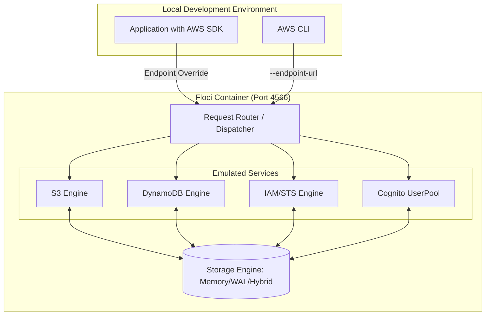

AWS 로컬 에뮬레이터인 LocalStack이 점진적으로 유료 기능을 확대하고 커뮤니티 에디션의 제약을 늘려가는 상황에서, 이를 완전히 대체할 수 있는 가볍고 빠른 오픈소스 대안인 Floci가 등장했습니다.

> **한 줄 요약** — Floci는 LocalStack의 유료화 행보에 대응하여 등장한 MIT 라이선스 기반의 초경량 AWS 로컬 에뮬레이터로, 24ms 수준의 빠른 시작 속도와 낮은 메모리 점유율이 특징입니다.

## 이 주제를 꺼낸 이유

로컬 개발 환경에서 AWS 인프라를 테스트할 때 LocalStack은 사실상 표준처럼 자리 잡았습니다. 하지만 시간이 흐를수록 LocalStack의 도커(Docker) 이미지는 비대해졌고, 실행하는 데만 수십 초가 소요되는 등 개발 피드백 루프를 저해하는 요소가 되었습니다. 특히 2026년 3월부터 LocalStack 커뮤니티 에디션에서 인증 토큰을 요구하고 CI 지원을 중단한다는 소식은 오픈소스 생태계에 큰 충격을 주었습니다.

실무에서 테스트 코드를 작성하다 보면 인프라 초기화 시간이 전체 테스트 시간의 절반 이상을 차지하는 경우를 자주 봅니다. 단순히 S3 버킷 하나 만들고 DynamoDB 테이블 하나 테스트하고 싶은데, 수 기가바이트(GB)에 달하는 이미지를 내려받고 실행을 기다리는 과정은 비효율적입니다. 이런 갈증을 느끼던 차에 네이티브 바이너리 기반으로 극강의 효율성을 보여주는 Floci의 등장은 매우 반가운 소식입니다.

## 핵심 내용 정리

Floci는 구름의 한 형태인 편적운(Floccus)에서 이름을 따왔으며, 팝콘처럼 가볍고 푹신하다는 의미를 담고 있습니다. 이름처럼 성능 지표가 압도적인데, 기존 도구들과 비교했을 때 다음과 같은 차별점을 가집니다.

| 항목 | Floci | LocalStack Community |
| :--- | :--- | :--- |
| 인증 토큰 요구 | 없음 | 필요 (2026년 3월부터) |
| CI/CD 지원 | 무제한 무료 | 유료 플랜 필요 |
| 시작 속도 | 약 24 ms | 약 3.3 s |
| 대기 메모리 사용량 | 약 13 MiB | 약 143 MiB |
| 도커 이미지 크기 | 약 90 MB | 약 1.0 GB |
| 라이선스 | MIT | 제한적 (Restricted) |

가장 인상적인 부분은 API 지원 범위입니다. 일반적으로 무료 에뮬레이터는 S3나 DynamoDB 같은 기본 서비스에 집중하기 마련인데, Floci는 API Gateway v2(HTTP API), Cognito, ElastiCache(Redis), 심지어 IAM 정책과 STS까지 지원합니다. 408개의 AWS SDK 테스트를 통과했다는 점은 단순한 흉내를 넘어 실무 수준의 호환성을 확보했음을 시사합니다.

### 아키텍처 및 요청 흐름

Floci가 어떻게 로컬 환경에서 AWS 요청을 처리하는지 흐름도를 통해 이해할 수 있습니다.



### 빠른 시작 및 설정

도커 컴포즈(Docker Compose)를 사용하면 단 몇 줄로 환경을 구축할 수 있습니다. 별도의 계정 생성이나 토큰 발급 과정이 전혀 필요 없다는 점이 강력한 장점입니다.

```yaml
# docker-compose.yml
services:
  floci:
    image: hectorvent/floci:latest
    ports:
      - "4566:4566"
    volumes:
      - ./data:/app/data
    environment:
      - FLOCI_STORAGE_MODE=hybrid
```

애플리케이션 코드에서는 엔드포인트(Endpoint) 주소만 로컬 주소로 변경하면 즉시 연동됩니다.

```python
import boto3

# Python (boto3) 예시
s3 = boto3.client(
    "s3", 
    endpoint_url="http://localhost:4566",
    aws_access_key_id="test",
    aws_secret_access_key="test",
    region_name="us-east-1"
)

s3.create_bucket(Bucket="my-local-bucket")
```

## 내 생각 & 실무 관점

Floci의 등장은 로컬 개발 도구의 본질이 무엇인지 다시 생각하게 만듭니다. 우리는 그동안 로컬 클라우드 환경이 실제 환경과 100% 동일하기를 기대하며 무거운 도구들을 감내해 왔습니다. 하지만 실제 개발 단계에서 필요한 것은 완벽한 모사가 아니라, 인터페이스 호환성과 빠른 피드백입니다.

### 네이티브 바이너리의 위력

Floci가 24ms라는 경이로운 시작 속도를 낼 수 있는 이유는 자바 가상 머신(JVM) 기반이 아닌 네이티브 이미지(Native Image)를 제공하기 때문입니다. 쿼커스(Quarkus) 프레임워크를 활용해 빌드된 것으로 보이는데, 이는 컨테이너 기반의 마이크로서비스 아키텍처(MSA) 환경에서 큰 이점이 됩니다. 수십 개의 마이크로서비스가 각각 로컬 인프라를 띄워야 하는 상황에서 메모리 점유율이 13MiB에 불과하다는 것은 개발 장비의 부담을 획기적으로 줄여줍니다.

### 스토리지 모드의 유연성

설정 중 `FLOCI_STORAGE_MODE` 옵션이 흥미롭습니다. `memory`, `persistent`, `hybrid`, `wal` 등 다양한 모드를 지원하는데, 이는 실무의 다양한 요구사항을 잘 반영하고 있습니다.
- 단위 테스트(Unit Test) 시에는 `memory` 모드로 극강의 속도를 챙길 수 있습니다.
- 복잡한 시나리오 테스트나 프론트엔드 연동 개발 시에는 `persistent` 모드로 데이터를 유지할 수 있습니다.
- `hybrid` 모드는 성능과 영속성 사이의 적절한 타협점을 제공합니다.

### 도입 시 주의할 점 (Trade-off)

물론 우려되는 지점도 있습니다. LocalStack은 거대 기업의 지원을 받으며 방대한 API 커버리지를 유지하지만, Floci는 이제 막 시작된 오픈소스 프로젝트입니다. AWS가 새로운 API 파라미터를 추가하거나 동작 방식을 변경했을 때 얼마나 빠르게 대응할 수 있을지가 관건입니다.

또한, 복잡한 IAM 정책 검증이나 S3의 세밀한 권한 제어(ACL) 등은 에뮬레이터마다 구현 수준이 다를 수 있습니다. 로컬에서 성공했다고 해서 실제 AWS 환경에서 권한 오류가 발생하지 않으리라는 보장은 없습니다. 따라서 Floci는 로컬 개발과 빠른 테스트 용도로 한정하고, 최종 검증은 실제 스테이징 환경에서 수행하는 전략이 필요합니다.

실제로 현업에서 비슷한 고민을 하다 보면, 결국 도구의 성능보다는 유지보수 지속 가능성에 의문을 갖게 됩니다. 하지만 Floci가 MIT 라이선스를 채택했다는 점은 커뮤니티의 참여를 끌어내기에 충분한 유인책이 될 것입니다. LocalStack의 최근 행보에 피로감을 느낀 많은 개발자가 이미 이 프로젝트에 기여하기 시작했다는 점은 긍정적인 신호입니다.

## 정리

Floci는 무거워진 로컬 클라우드 개발 환경에 던져진 신선한 대안입니다. 단순히 무료라서가 아니라, 가볍고 빠르며 군더더기 없는 기능 구성이 개발자의 생산성을 직접적으로 향상해 줍니다. 

당장 진행 중인 프로젝트의 `docker-compose.yml`에서 LocalStack 이미지를 `hectorvent/floci`로 교체해 보시기 바랍니다. 수십 초씩 걸리던 컨테이너 기동 시간이 눈 깜짝할 새 완료되는 경험만으로도 도입 가치는 충분합니다. 특히 CI 환경에서 테스트 비용과 시간을 줄이고 싶은 팀에게 Floci는 선택이 아닌 필수가 될 가능성이 높습니다.

## 참고 자료
- [원문] [Floci – A free, open-source local AWS emulator](https://github.com/hectorvent/floci) — Hacker News Best
- [관련] LLM in a Flash: Efficient Streaming from SSD — Apple Research
- [관련] Quarkus Native Executables Guide — Quarkus.io