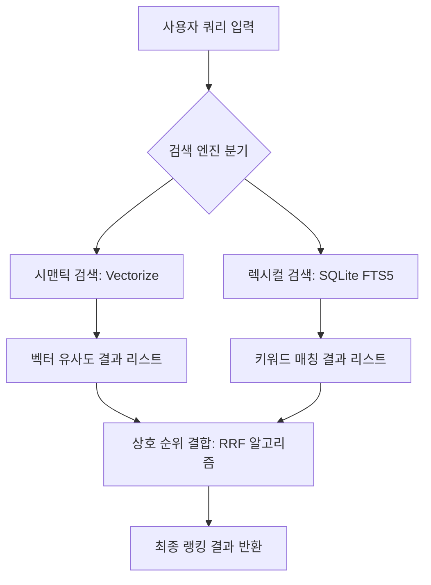

> **한 줄 요약** — 검색 의도를 파악하는 시맨틱 검색과 정확한 키워드를 찾는 렉시컬 검색을 결합하여, 검색 품질과 서버 성능을 동시에 잡는 하이브리드 검색 아키텍처 구현 가이드입니다.

## 이 주제를 꺼낸 이유

최근 많은 서비스가 벡터(Vector) 기반 시맨틱 검색(Semantic Search)을 도입하고 있습니다. 자연어 질문에 대해 찰떡같은 답변을 내놓는 모습은 분명 매력적이지만, 실무에서 이를 운영하다 보면 의외의 복병을 만납니다. 바로 고유 명사나 API 이름처럼 정확한 텍스트 매칭이 필요한 영역에서 시맨틱 검색이 힘을 쓰지 못한다는 점입니다.

단순히 최신 기술을 도입하는 것에 그치지 않고, 실제 사용자가 겪는 검색 품질 저하 문제를 해결하기 위해 렉시컬 검색(Lexical Search)을 어떻게 결합했는지, 그리고 그 과정에서 발생한 아키텍처적 시행착오는 무엇이었는지 공유하고자 합니다. 검색 시스템을 직접 구축하거나 성능 최적화에 고민이 있는 분들에게 실질적인 도움이 될 것입니다.

## 시맨틱 검색의 한계와 하이브리드 모델의 필요성

시맨틱 검색은 텍스트를 고차원 벡터로 변환하여 개념적 유사성을 계산합니다. 덕분에 구현 세부 사항을 테스트하지 않는 방법 같은 추상적인 질문에도 관련성 높은 문서를 찾아줍니다. 하지만 React Testing Library 같은 고유 명사를 검색할 때는 이야기가 달라집니다. 벡터 모델은 이 단어의 개념적 의미를 해석하느라, 정작 해당 라이브러리의 공식 소개 포스트를 검색 결과 상단에서 놓치는 실수를 범하곤 합니다.

이런 갈증을 해결해 주는 것이 전통적인 키워드 기반의 렉시컬 검색입니다. 렉시컬 검색은 BM25 같은 알고리즘을 사용하여 특정 단어가 문서에 얼마나 자주, 그리고 중요한 위치에 등장하는지 계산합니다. 결국 최상의 검색 경험을 위해서는 이 두 가지 방식을 섞은 하이브리드 검색(Hybrid Search)이 필수적입니다.

| 검색 방식 | 강점 | 약점 |
| :--- | :--- | :--- |
| 시맨틱(Semantic) | 자연어 의도 파악, 유의어 처리 | 고유 명사, API 이름, 버전 번호 |
| 렉시컬(Lexical) | 정확한 키워드 매칭, 제목 일치 | 문맥 파악 불가, 오타에 취약 |
| 하이브리드(Hybrid) | 양쪽의 장점을 결합하여 상호 보완 | 아키텍처 복잡도 증가, 결과 병합 로직 필요 |

두 검색 결과를 하나로 합칠 때는 상호 순위 결합(Reciprocal Rank Fusion, RRF) 알고리즘을 주로 사용합니다. 각 검색 방식에서 나온 결과의 순위를 바탕으로 점수를 재계산하여, 양쪽에서 공통적으로 높은 순위를 기록한 문서가 최상단에 오도록 만드는 방식입니다.

## 1차 구현과 예상치 못한 프로덕션 장애

처음에는 아키텍처를 단순하게 가져가기 위해 기존 앱 서버 내부에 렉시컬 검색 기능을 넣었습니다. SQLite의 FTS5(Full-Text Search) 확장 기능을 활용하여 로컬 데이터베이스에 인덱스를 저장하고 검색하는 방식이었습니다. 별도의 인프라 비용 없이 빠르게 기능을 추가할 수 있다는 판단이었습니다.

하지만 프로덕션 배포 직후 심각한 문제가 발생했습니다. 새로운 검색 쿼리가 들어올 때마다 서버가 몇 초간 응답하지 않거나 500 에러를 뱉기 시작했습니다. 더 심각한 것은 검색과 무관한 일반 페이지 요청까지 모두 멈춰버린 것입니다.

원인은 Node.js의 이벤트 루프(Event Loop) 블로킹이었습니다. 검색 인덱스를 동기화하는 과정에서 사용한 SQLite 라이브러리의 DatabaseSync API가 동기식으로 작동하며 CPU를 점유해 버린 것입니다. 싱글 스레드로 동작하는 Node.js 환경에서 200~300ms 동안 DB 쓰기 작업이 발생하자, 그동안 들어온 모든 HTTP 요청이 큐에 쌓이며 서버 전체가 마비되었습니다.

## 아키텍처 개선: 검색 전용 Worker 분리

실패를 거울삼아 검색 로직을 메인 앱 서버에서 완전히 격리하기로 했습니다. Cloudflare Workers와 D1 데이터베이스를 활용하여 독립적인 검색 전용 서비스를 구축했습니다. 메인 앱 서버는 검색이 필요할 때 이 Worker에 HTTP 요청을 보내고 결과만 받아옵니다.

이 구조의 장점은 명확합니다. 검색 서비스에 부하가 걸리거나 장애가 발생해도 메인 웹사이트의 렌더링에는 영향을 주지 않습니다. 또한 렉시컬 검색을 위한 SQLite 인덱스 업데이트 작업이 백그라운드에서 독립적으로 수행되므로, 사용자 응답 속도를 저해할 요소가 사라졌습니다.

구현 과정에서 한 가지 더 신경 쓴 부분은 우아한 성능 저하(Graceful Degradation)입니다. 만약 렉시컬 검색 전용 Worker가 응답하지 않을 경우, 시스템은 자동으로 이를 무시하고 기존의 시맨틱 검색 결과만 반환합니다. 검색 품질은 조금 떨어질지언정 서비스 전체가 불능 상태에 빠지는 것은 막는 설계입니다.

## 실무 관점에서 바라본 하이브리드 검색

실제로 이런 시스템을 고민하다 보면 성능과 품질 사이에서 끊임없이 저울질하게 됩니다. 렉시컬 검색을 위해 별도의 인덱스를 관리하는 것은 결국 데이터 중복과 동기화 비용을 발생시킵니다. 하지만 사용자가 라이브러리 이름을 정확히 입력했는데도 엉뚱한 결과가 나오는 상황을 방치하는 것은 서비스 신뢰도에 치명적입니다.

현업에서 비슷한 고민을 하다 보면 기술적 화려함보다 운영 안정성에 무게를 두게 됩니다. 처음 시도했던 로컬 SQLite 방식은 비용 효율적이었지만, Node.js의 특성을 간과한 위험한 선택이었습니다. 반면 독립된 Worker로 분리한 방식은 관리 포인트가 하나 늘어나는 트레이드오프가 있지만, 장애 전파 범위를 최소화한다는 측면에서 훨씬 견고한 선택지입니다.

또한 상호 순위 결합(RRF)을 적용할 때 가중치 설정도 세심하게 다뤄야 합니다. 특정 도메인에서는 제목 일치(Lexical)가 본문 내용 유사성(Semantic)보다 훨씬 중요할 수 있습니다. 이런 파라미터들은 한 번 설정하고 끝내는 것이 아니라, 실제 검색 로그를 분석하며 지속적으로 튜닝해야 하는 영역입니다.

## 정리

하이브리드 검색은 시맨틱 검색의 지능적인 면모와 렉시컬 검색의 정확함을 결합한 현실적인 해법입니다. 단순히 두 기술을 합치는 것을 넘어, 각 기술이 메인 애플리케이션의 성능에 미치는 영향을 면밀히 검토해야 합니다. 특히 Node.js 기반 환경이라면 무거운 연산이나 동기식 DB 작업이 이벤트 루프를 장악하지 않도록 격리된 아키텍처를 지향하는 것이 바람직합니다.

지금 운영 중인 검색 시스템이 고유 명사나 특정 키워드를 제대로 찾지 못해 사용자 불만이 접수되고 있다면, 렉시컬 검색 엔진을 별도 서비스로 구축하여 결합해 보는 시도를 추천합니다.

## 참고 자료
- [원문] [Implementing Hybrid Semantic + Lexical Search](https://kentcdodds.com/blog/implementing-hybrid-semantic-lexical-search) — Kent C. Dodds Blog
- [관련] I Ran 60 Autoresearch Experiments on a Production Search Algorithm — DEV Community
- [관련] Reciprocal Rank Fusion (RRF) explained — Elasticsearch Guide