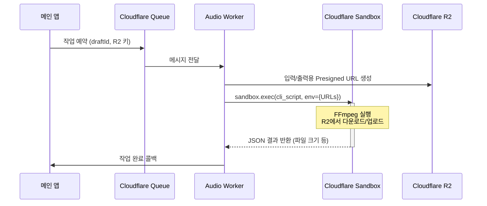

> **한 줄 요약** — 무거운 FFmpeg 작업을 처리하기 위해 도입했던 복잡한 컨테이너 관리 로직을 버리고, 일회성 실행 후 자동 소멸하는 Cloudflare Sandboxes로 아키텍처를 단순화한 여정을 소개합니다.

## 왜 컨테이너 관리가 복잡해질까?

메인 서버에서 FFmpeg 같은 CPU 집약적인 작업을 수행하면 서비스 전체의 응답성이 떨어집니다. 이를 해결하기 위해 작업을 별도의 인프라로 격리하는 것은 올바른 선택이지만, 그 과정에서 예상치 못한 관리 포인트가 생깁니다.

가장 골치 아픈 지점은 컨테이너의 생명주기(Lifecycle) 관리입니다. 작업이 끝났을 때 컨테이너가 스스로를 종료할 수 없다면, 외부에서 상태를 확인하고 꺼주는 별도의 컨트롤 플레인(Control Plane)이 필요합니다.

이를 위해 하트비트(Heartbeat)를 주고받거나 일정 시간 활동이 없으면 종료하는 아이들(Idle) 체크 로직을 구현하게 되는데, 정작 비즈니스 로직보다 이 부수적인 코드가 더 비대해지는 배보다 배꼽이 더 큰 상황이 벌어집니다.

## Cloudflare Sandboxes로 구현하는 일회성 작업

Cloudflare Sandboxes는 기존 컨테이너와 모델이 다릅니다. 컨테이너가 계속 떠 있으면서 요청을 기다리는 서버 형태라면, 샌드박스는 명령어를 실행(exec)하고 결과가 나오면 즉시 사라지는 일회성 작업(One-shot job)에 최적화되어 있습니다.

복잡한 상태 관리가 필요 없어진 새로운 아키텍처의 흐름은 다음과 같습니다.



이 구조에서 핵심은 워커(Worker)가 샌드박스를 라이브러리처럼 호출한다는 점입니다. 별도의 HTTP 엔드포인트를 가진 서비스를 띄우는 것이 아니라, 코드 내부에서 `sandbox.exec()`를 호출하고 `finally` 블록에서 `sandbox.destroy()`를 실행함으로써 자원 정리를 보장합니다.

샌드박스 내부에서 실행될 도커파일(Dockerfile)도 매우 단순해집니다.

```dockerfile
FROM docker.io/cloudflare/sandbox:0.7.16
RUN apt-get update && apt-get install -y --no-install-recommends ffmpeg
WORKDIR /opt/call-kent-audio
COPY assets ./assets
COPY sandbox/call-kent-audio-cli.sh /usr/local/bin/call-kent-audio-cli
RUN chmod +x /usr/local/bin/call-kent-audio-cli
```

## 보안과 효율을 모두 잡는 Presigned URL 활용

실무에서 이런 격리된 환경을 구축할 때 가장 고민되는 부분이 자격 증명(Credentials) 관리입니다. 샌드박스 안에 R2나 S3에 접근할 수 있는 비밀키를 직접 주입하는 것은 보안상 위험할 수 있습니다.

이번 사례에서는 워커가 짧은 유효 기간을 가진 프레시전 URL(Presigned URL)을 생성해 샌드박스에 환경 변수로 넘겨주는 방식을 택했습니다. 샌드박스는 그저 주어진 URL로 파일을 받고 올릴 뿐, 전체 스토리지에 대한 권한은 전혀 알 필요가 없습니다.

이런 방식은 샌드박스 내부 로직을 극도로 단순하게 만듭니다. 복잡한 클라우드 SDK를 설치할 필요 없이 `curl`이나 표준 라이브러리만으로 파일 입출력이 가능해지기 때문입니다.

```typescript
const completed = await runCallKentAudioSandboxJob({
  binding: env.Sandbox,
  sandboxId: createSandboxId(parsed.draftId),
  request: {
    draftId: parsed.draftId,
    callAudioUrl: signedUrls.callAudioUrl, // 입력 URL
    episodeUploadUrl: signedUrls.episodeUploadUrl, // 출력 URL
  },
})
```

## 실무에서 마주친 예외 상황과 해결책

이론적으로는 완벽해 보였지만, 실제 배포 과정에서는 두 가지 흥미로운 제약 사항이 발견되었습니다.

첫째는 식별자(ID) 길이 제한입니다. 처음에는 추적을 용이하게 하려고 UUID를 포함한 긴 문자열을 샌드박스 ID로 사용했습니다. 하지만 Cloudflare Sandbox ID는 63자 제한이 있었고, 이를 초과하자 즉시 오류가 발생했습니다.

현업에서도 로그 추적을 위해 ID에 정보를 욱여넣다가 시스템 제한에 걸리는 경우가 종종 있습니다. 이를 해결하기 위해 대시(-)를 제거하고 문자열을 슬라이싱하여 고유성은 유지하되 길이는 줄이는 타협점을 찾았습니다.

```typescript
function createSandboxId(draftId: string) {
  const compactDraftId = draftId.replaceAll('-', '').slice(0, 12)
  const randomSuffix = crypto.randomUUID().replaceAll('-', '').slice(0, 12)
  return `call-kent-${compactDraftId}-${randomSuffix}`
}
```

둘째는 베이스 이미지의 역할 오해였습니다. 일반적인 컨테이너처럼 동작시키려고 별도의 HTTP 서버를 엔트리포인트(Entrypoint)로 설정했더니, Cloudflare의 샌드박스 런타임과 충돌하며 501 에러가 발생했습니다. 샌드박스는 전용 런타임 위에서 동작하므로, 사용자는 그저 실행할 바이너리만 준비하면 된다는 것을 다시금 확인한 계기였습니다.

## 아키텍처 결정의 비용과 AI 에이전트의 역할

이번 개선 작업에서 놀라운 점은 컨테이너 방식에서 샌드박스 방식으로의 전환이 단 한 시간 만에 이루어졌다는 것입니다. 이는 AI 에이전트(Cursor 등)를 활용해 아키텍처 탐색 비용(Exploration Cost)을 획기적으로 낮췄기에 가능했습니다.

보통은 새로운 기술 스택을 검증하기 위해 직접 공식 문서를 파고 프로토타입을 만드는 데 며칠을 소비합니다. 하지만 에이전트에게 구현 방향을 설명하고 두 가지 다른 접근 방식(서비스 형태 vs 임베디드 형태)의 PR을 빠르게 생성하게 함으로써, 개발자는 코드를 읽고 최선의 구조를 선택하는 데만 집중할 수 있었습니다.

기술적 부채를 해결하는 속도가 빨라지면, 잘못된 선택을 했을 때 되돌리는 비용도 줄어듭니다. 컨테이너 방식이 운영된 지 단 하루 만에 더 나은 대안인 샌드박스로 갈아탈 수 있었던 근거도 여기에 있습니다.

## 정리

기존의 긴 생명주기를 가진 컨테이너 모델은 상태 관리와 자원 해제라는 부수적인 복잡성을 수반합니다. 작업 단위가 명확한 FFmpeg 처리와 같은 경우에는 Cloudflare Sandboxes 같은 일회성 실행 모델이 훨씬 경제적이고 안전합니다.

인프라를 거대한 서비스로 보지 않고, 필요할 때만 호출하고 버리는 함수나 라이브러리처럼 다룰 때 비로소 관리의 굴레에서 벗어날 수 있습니다. 지금 운영 중인 시스템에 작업 완료 후 종료를 위해 고군분투하는 하트비트 로직이 있다면, 이를 일회성 샌드박스로 전환할 수 없는지 검토해 볼 때입니다.

## 참고 자료
- [원문] [Simplifying Containers with Cloudflare Sandboxes](https://kentcdodds.com/blog/simplifying-containers-with-cloudflare-sandboxes) — Kent C. Dodds Blog
- [관련] [From signals to savings: Optimizing cloud costs with Grafana Assistant and MCP servers](https://grafana.com/blog/from-signals-to-savings-optimizing-cloud-costs-with-grafana-assistant-and-mcp-servers/) — Grafana Blog
- [관련] [Stop writing cron jobs: I built a C++ database with native temporal states](https://dev.to/michael30706/stop-writing-cron-jobs-i-built-a-c-database-with-native-temporal-states-5f1a) — DEV Community