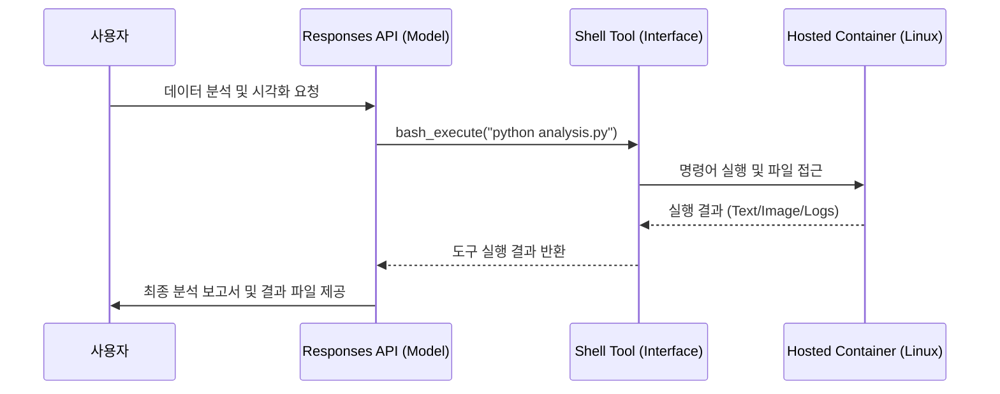

> **한 줄 요약** — 단순한 텍스트 생성을 넘어 호스팅 컨테이너 환경과 셸(Shell) 도구를 결합하여 실질적인 작업을 수행하는 에이전트 환경 구축 전략을 다룹니다.

## LLM이 직접 코드를 실행해야 하는 이유
모델이 질문에 답하는 수준을 넘어 스스로 도구를 사용하고 환경을 조작하는 에이전트(Agent)로 진화하고 있습니다. 기존의 방식은 모델이 생성한 코드를 개발자가 복사해서 실행하거나, 로컬 환경에서 위험을 감수하며 실행 스크립트를 돌리는 형태가 많았습니다.

하지만 실무에서 복잡한 데이터 분석이나 파일 편집 작업을 자동화하려면 모델이 자유롭게 접근할 수 있는 격리된 실행 환경(Sandboxed Environment)이 필수적입니다. OpenAI가 공개한 Responses API와 컴퓨터 환경(Computer Environment) 결합 방식은 이러한 인프라 고민을 덜어주는 흐름을 보여줍니다.

단순히 API 호출로 텍스트만 받는 것이 아니라, 모델이 직접 리눅스 컨테이너 안에서 명령어를 입력하고 그 결과를 다시 추론에 활용하는 구조입니다. 이는 에이전트가 이론적인 답변만 내놓는 것이 아니라 실질적인 결과물을 만들어낼 수 있음을 의미합니다.

## Responses API와 컴퓨터 환경의 결합 구조
이 시스템의 핵심은 모델의 추론 엔진과 호스팅된 컨테이너(Hosted Container)를 실시간으로 연결하는 것입니다. 사용자가 파일을 업로드하면 에이전트는 이를 컨테이너 내부로 가져와 파이썬(Python)이나 셸 스크립트로 처리합니다.

이 과정에서 모델은 도구 호출(Tool Calling) 기능을 통해 셸(Shell) 도구를 활성화합니다. 모델이 명령어를 생성하면 백엔드 인프라가 이를 실행하고 표준 출력(Stdout)과 표준 에러(Stderr)를 다시 모델에게 전달합니다.

전체적인 워크플로우를 다이어그램으로 표현하면 다음과 같습니다.

이 구조에서 중요한 점은 상태(State) 유지입니다. 한 번의 요청으로 끝나는 것이 아니라, 이전 단계에서 생성한 파일이나 설치한 라이브러리가 세션 동안 유지되어야 연속적인 작업이 가능합니다.

## 에이전트 실행 환경의 보안과 격리 전략
에이전트에게 셸 권한을 주는 것은 편리하지만 보안상 매우 위험한 일입니다. 악의적인 프롬프트 주입(Prompt Injection)으로 인해 시스템 설정이 변경되거나 민감한 정보가 유출될 수 있기 때문입니다.

따라서 실무적인 관점에서는 일회성 컨테이너(Ephemeral Container)를 활용하여 각 세션을 완전히 격리해야 합니다. 작업이 끝나면 컨테이너를 파기하여 잔류 데이터가 남지 않도록 관리하는 것이 기본입니다.

또한 보조 레퍼런스에서 언급된 것처럼 환경 변수나 API 키 같은 민감 정보는 모델에게 직접 노출하지 않는 프라이버시 레이어(Privacy Layer)가 필요합니다. 모델은 플레이스홀더(Placeholder) 형태의 가짜 값을 보고 추론하되, 실제 실행 직전에 로컬 환경이나 보안 저장소에서 실제 값으로 치환하는 방식이 권장됩니다.

- 네트워크 접근 제한: 컨테이너 내부에서 외부 인터넷으로의 접근을 화이트리스트 기반으로 통제합니다.
- 리소스 할당 제한: CPU나 메모리 사용량을 제한하여 무한 루프나 자원 고갈 공격을 방지합니다.
- 읽기 전용 파일 시스템: 수정이 필요 없는 시스템 영역은 읽기 전용(Read-only)으로 설정합니다.

## 운영 환경에서의 관측 가능성(Observability) 확보
에이전트가 복잡한 도구를 사용하기 시작하면 단순히 입력과 출력을 로그로 남기는 것만으로는 부족합니다. 모델이 어떤 도구를 왜 호출했는지, 실행 시간이 얼마나 걸렸는지, 그리고 비용은 얼마나 발생하는지 추적해야 합니다.

오픈릿(OpenLIT)이나 오픈텔레메트리(OpenTelemetry) 같은 도구를 활용하면 에이전트의 내부 동작을 시각화할 수 있습니다. 특히 모델 컨텍스트 프로토콜(MCP, Model Context Protocol) 서버를 사용하는 경우, 에이전트와 도구 서버 사이의 지연 시간(Latency)을 모니터링하는 것이 성능 최적화의 핵심입니다.

| 모니터링 지표 | 설명 | 비고 |
| :--- | :--- | :--- |
| 토큰 사용량 | 입력/출력 토큰을 통한 실시간 비용 추적 | 비용 관리 필수 |
| 도구 실행 지연 | 셸 명령어 또는 API 호출이 완료되는 시간 | UX 개선 포인트 |
| 성공률(Success Rate) | 도구 호출이 에러 없이 수행된 비율 | 프롬프트 튜닝 지표 |
| 환각 발생률 | 모델이 존재하지 않는 도구를 호출하려 한 횟수 | 안정성 지표 |

실제로 에이전트를 운영하다 보면 모델이 잘못된 경로를 참조하거나 셸 문법 오류를 내는 경우가 빈번합니다. 이런 실패 로그를 그라파나(Grafana) 같은 대시보드에 통합하여 실시간으로 확인하는 체계가 갖춰져야 프로덕션 환경에서 신뢰를 얻을 수 있습니다.

## 실무에서 마주하는 한계와 고려할 점
직접 에이전트 환경을 구축해 보면 이론과 다른 현실적인 문제에 부딪히게 됩니다. 가장 먼저 체감하는 것은 지연 시간입니다. 모델이 생각을 하고, 도구를 호출하고, 컨테이너가 응답하고, 다시 모델이 결과를 해석하는 과정이 반복되면 사용자 입장에서는 응답이 매우 느리게 느껴질 수 있습니다.

이를 해결하기 위해 스트리밍(Streaming) 방식으로 중간 과정을 보여주거나, 자주 사용하는 라이브러리가 미리 설치된 환경(Pre-baked Image)을 준비하여 부팅 시간을 단축해야 합니다.

또한 모델이 스스로 오류를 수정하는 자기 개선(Self-correction) 루프를 설계하는 것도 중요합니다. 셸 실행 결과에 에러가 포함되어 있다면, 모델이 그 에러 메시지를 보고 코드를 수정해서 다시 실행하도록 프롬프트를 구성해야 합니다. 이는 단순히 한 번의 실행으로 성공하길 바라는 것보다 훨씬 견고한 시스템을 만듭니다.

- 의존성 관리: 특정 파이썬 패키지가 필요한 경우 에이전트가 직접 `pip install`을 수행하게 할 것인지, 미리 제공할 것인지 결정해야 합니다.
- 파일 영속성: 사용자가 세션을 나갔다가 다시 들어왔을 때 작업 중이던 파일을 어떻게 복구할 것인지에 대한 설계가 필요합니다.
- 비용 최적화: 셸 도구를 반복 호출하면 컨텍스트 윈도우(Context Window)가 급격히 늘어나 비용이 기하급수적으로 증가할 수 있습니다.

## 에이전트 시대를 준비하는 개발자의 자세
OpenAI의 이번 접근은 LLM이 단순히 텍스트를 생성하는 브레인(Brain) 역할에서 벗어나, 손과 발이 있는 에이전트로 나아가는 표준 모델을 제시하고 있습니다. 이제 개발자는 모델 자체의 성능만큼이나 모델이 안전하고 효율적으로 활동할 수 있는 운동장(Runtime)을 잘 만드는 데 집중해야 합니다.

가장 먼저 시도해 볼 수 있는 것은 작은 격리 환경을 만들고 모델에게 특정 파일을 분석하게 시키는 것입니다. 이 과정에서 발생하는 로그를 수집하고 보안 취약점을 점검해 보는 경험이 향후 더 복잡한 에이전트 시스템을 설계하는 밑거름이 될 것입니다.

결국 기술의 핵심은 모델이 얼마나 똑똑하냐를 넘어, 그 똑똑함을 현실의 파일과 인프라에 얼마나 안전하게 연결하느냐에 달려 있습니다.

## 참고 자료
- [원문] [From model to agent: Equipping the Responses API with a computer environment](https://openai.com/index/equip-responses-api-computer-environment) — OpenAI Blog
- [관련] How to monitor LLMs in production with Grafana Cloud, OpenLIT, and OpenTelemetry — Grafana Blog
- [관련] Stop Sending Your .env to OpenAI: A Privacy Layer for OpenCode — DEV Community
- [관련] Monitor Model Context Protocol (MCP) servers with OpenLIT and Grafana Cloud — Grafana Blog