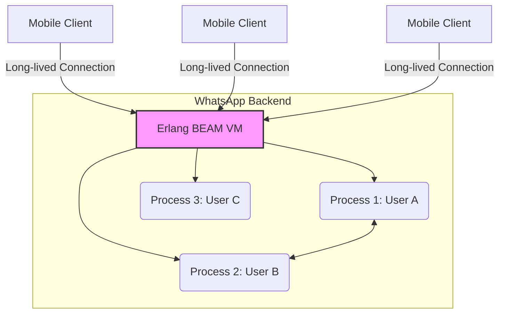

> **한 줄 요약** — 왓츠앱은 화려한 프로세스나 대규모 인원 대신 얼랑(Erlang) 기반의 단순한 아키텍처와 엔지니어 간의 강력한 신뢰를 통해 30명의 엔지니어로 4억 5천만 명의 사용자를 수용했습니다.

## 이 주제를 꺼낸 이유
수많은 기업이 마이크로서비스 아키텍처(MSA)를 도입하고 애자일(Agile) 프로세스를 정교하게 다듬는 데 엄청난 에너지를 쏟습니다. 하지만 정작 서비스의 본질인 속도와 안정성은 뒷전이 되는 경우를 자주 목격합니다. 왓츠앱(WhatsApp)의 초기 멤버인 진 리(Jean Lee)의 인터뷰는 우리가 당연하게 여겼던 코드 리뷰, 스크럼, 테스트 주도 개발(TDD) 같은 절차들이 과연 필수적인 것인지 의문을 던집니다.

기술적 화려함보다 단순함(Simplicity)을 선택해 세상을 바꾼 이들의 방식은 효율성을 고민하는 모든 개발자에게 큰 영감을 줍니다. 특히 인공지능(AI)이 코드를 대신 짜주는 시대에 엔지니어의 진짜 역할이 무엇인지 다시 생각해보게 합니다.

## 30명의 엔지니어가 4억 5천만 명을 감당한 비결
왓츠앱이 페이스북에 인수될 당시 엔지니어는 단 30명이었습니다. 이 적은 인원이 8개 이상의 플랫폼을 지원하며 수억 명의 메시지를 처리할 수 있었던 이유는 기술 선택과 운영 철학의 단순함에 있습니다.

### 얼랑(Erlang)과 가벼운 아키텍처
왓츠앱은 백엔드 언어로 얼랑을 선택했습니다. 얼랑은 수백만 개의 가벼운 프로세스를 동시에 실행할 수 있는 동시성(Concurrency) 모델에 최적화되어 있습니다. 서버 한 대당 수백만 개의 커넥션을 유지해야 하는 메시징 서비스에 이보다 적합한 선택은 없었습니다.

이들은 크로스 플랫폼 추상화 계층을 거의 사용하지 않았습니다. 각 플랫폼의 네이티브 성능을 최대한 끌어내기 위해 안드로이드, iOS 등 각 환경에 맞춘 최적화에 집중했습니다. 도구를 복잡하게 만드는 대신 문제의 핵심인 연결성과 안정성에 모든 자원을 투입한 결과입니다.

### 프로세스를 대체한 신뢰와 책임감
놀랍게도 왓츠앱에는 공식적인 코드 리뷰 절차가 없었습니다. 신규 입사자가 들어오면 공동 창업자인 브라이언 액튼(Brian Acton)이 첫 번째 풀 리퀘스트(PR)를 아주 세밀하게 리뷰합니다. 그 리뷰를 통해 팀이 지향하는 코드 품질의 기준을 완벽히 학습시킨 뒤, 그 다음부터는 엔지니어 각자의 판단에 전적으로 맡겼습니다.

스크럼(Scrum)이나 칸반(Kanban) 같은 정형화된 업무 관리 프레임워크도 없었습니다. 대신 사무실 한복판에 마지막 장애 발생 후 경과된 시간을 표시하는 대시보드를 두었습니다. 장애가 발생하면 카운터는 0으로 초기화됩니다. 복잡한 보고서나 회의 대신, 이 숫자를 높게 유지하려는 엔지니어들의 자발적인 책임감이 팀을 움직이는 동력이었습니다.

## 실무 관점에서 바라본 왓츠앱의 전략
현업에서 다양한 프로젝트를 경험하다 보면 프로세스가 늘어날수록 오히려 실행 속도가 느려지는 역설을 자주 마주합니다. 왓츠앱의 사례는 프로세스가 신뢰의 부족을 메우기 위한 수단으로 전락할 수 있음을 시사합니다.

### 99%의 기능 요청을 거절하는 용기
왓츠앱의 CEO 얀 쿰(Jan Koum)은 팀에서 제안하는 기능 요청의 99%를 거절했습니다. 경쟁사들이 화려한 스티커, 게임, 타임라인 기능을 추가할 때 왓츠앱은 시골에 사는 할머니도 바로 쓸 수 있는 단순함에 집착했습니다. 비디오 호출 기능조차 완벽하게 다듬어질 때까지 수년을 기다린 뒤에야 출시했습니다.

실제로 실무에서는 기획자나 이해관계자의 요구사항을 쳐내는 것이 구현하는 것보다 훨씬 어렵습니다. 하지만 왓츠앱은 무엇을 만들지보다 무엇을 만들지 않을지를 결정하는 것이 비즈니스의 핵심 경쟁력이 될 수 있음을 증명했습니다.

### 경험 많은 시니어 중심의 팀 구성
2014년 당시 왓츠앱 엔지니어 30명 중 30대 미만은 단 4명뿐이었습니다. 대부분 야후(Yahoo) 등에서 대규모 트래픽을 다뤄본 경험이 풍부한 베테랑들이었습니다. 이들은 어떤 기술이 유행인지보다 어떤 기술이 이 문제를 가장 안정적으로 해결할 수 있는지 판단할 줄 알았습니다.

신입 개발자에게 기본기(Fundamentals)를 강조하는 진 리의 조언도 여기서 기인합니다. 도구와 언어는 유행에 따라 변하지만, 컴퓨터 과학의 기초와 문제 해결 능력은 변하지 않습니다. AI가 코드를 생성하는 시대가 되어도 시스템의 전체 구조를 설계하고 병목 지점을 찾아내는 것은 결국 기본기가 탄탄한 엔지니어의 몫입니다.

### 페이스북 인수 후의 문화적 충돌
인터뷰에서 흥미로운 점은 페이스북(현재의 메타) 인수 이후의 변화입니다. 왓츠앱은 극도의 효율성을 추구했지만, 페이스북은 내부 소셜 네트워크에 자신의 성과를 공유하고 알리는 활동이 평가에 큰 영향을 미치는 구조였습니다.

| 구분 | 왓츠앱 (초기) | 페이스북 (메타) |
| :--- | :--- | :--- |
| 의사결정 | 소수 집중, CEO의 강력한 필터링 | 데이터 기반, 상향식 제안 |
| 성과 측정 | 장애 없는 서비스 운영(카운터) | 내부 포스팅 및 성과 홍보(Calibration) |
| 개발 문화 | 신뢰 기반, 코드 리뷰 최소화 | 엄격한 리뷰 및 표준 프로세스 |
| 조직 규모 | 30명 미만의 정예 | 수천 명 단위의 대규모 조직 |

이 차이는 조직의 규모에 따라 필요한 시스템이 다르다는 점을 보여줍니다. 작은 팀에서는 신뢰가 프로세스를 이기지만, 거대 조직에서는 공정성을 위해 어쩔 수 없이 관료주의적 요소가 개입하게 됩니다. 하지만 우리가 경계해야 할 것은 조직이 작은데도 거대 기업의 복잡한 프로세스를 흉내 내는 일입니다.

## 내 생각 & 실무 관점
왓츠앱의 방식이 모든 스타트업에 정답은 아닐 것입니다. 하지만 최근 많은 기술 조직이 본질보다 형식을 중요하게 생각하는 경향이 있다는 점에는 동의합니다. 테스트 커버리지 숫자에 집착하느라 정작 중요한 비즈니스 로직의 결함을 놓치거나, 스크럼 미팅을 하느라 실제 개발 시간을 뺏기는 상황이 비일비재합니다.

실제로 장애 카운터를 사무실에 배치하는 것과 같은 시각적 장치는 백 마디 말보다 강력한 동기부여가 됩니다. 왓츠앱의 사례에서 가장 배울 점은 도구가 아니라 태도입니다. 내가 짠 코드가 서비스 전체에 어떤 영향을 미치는지 온전히 책임지는 문화가 형성되어 있다면, 수많은 승인 절차는 오히려 방해 요소일 뿐입니다.

또한 AI 시대의 엔지니어링에 대한 진 리의 시각도 인상적입니다. 문서화나 성과 지표 수집 같은 부수적인 업무는 AI가 대체하겠지만, 사람과 사람 사이의 문제를 해결하고 팀원의 잠재력을 끌어올리는 매니징 업무는 여전히 인간의 영역으로 남을 것입니다.

## 정리
왓츠앱은 린(Lean)하게 일한다는 것이 단순히 빠르게 만드는 것이 아니라, 불필요한 모든 것을 제거하는 과정임을 보여주었습니다.

- 기술적 화려함보다 문제 해결에 가장 적합한 도구(Erlang)를 선택할 것
- 프로세스로 신뢰를 대체하려 하지 말고, 신뢰할 수 있는 사람들과 일할 것
- 무엇을 만들지보다 무엇을 포기할지 결정하는 데 더 많은 에너지를 쓸 것

지금 운영 중인 서비스에서 당장 없어도 돌아가는 기능이나 프로세스가 무엇인지 고민해보는 것만으로도 왓츠앱의 효율성에 한 걸음 다가갈 수 있습니다.

## 참고 자료
- [원문] [Building WhatsApp with Jean Lee](https://newsletter.pragmaticengineer.com/p/building-whatsapp-with-jean-lee) — The Pragmatic Engineer
- [관련] The Pulse: What will the Staff Engineer role look like in 2027 and beyond? — The Pragmatic Engineer
- [관련] From IDEs to AI Agents with Steve Yegge — The Pragmatic Engineer