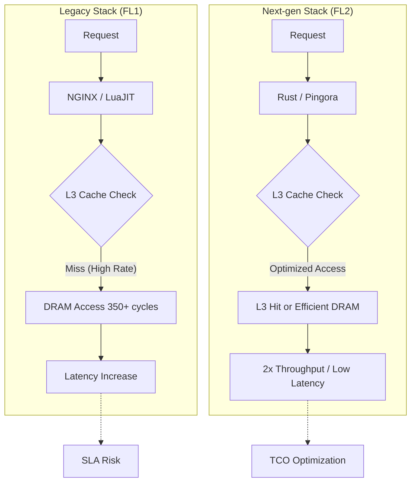

Cloudflare Gen 13 서버는 AMD EPYC Turin 프로세서의 고밀도 코어를 활용하기 위해 Rust 기반의 FL2 스택으로 전환했으며, 이를 통해 캐시 의존성을 극복하고 엣지 컴퓨팅(Edge Compute) 처리량을 2배로 끌어올렸습니다.

## 이 주제를 꺼낸 이유

인프라를 운영하다 보면 하드웨어 세대 교체 시점에 예상치 못한 성능 병목을 마주하곤 합니다. 단순히 최신 CPU를 도입한다고 해서 성능이 선형적으로 증가하지 않기 때문입니다. 특히 수천 개의 엣지 데이터 센터를 운영하는 환경에서는 하드웨어의 아키텍처 변화가 소프트웨어 스택에 미치는 영향이 치명적일 수 있습니다.

Cloudflare가 최근 발표한 Gen 13 서버 도입 과정은 기술 결정권자들이 직면하는 전형적인 트레이드오프(Trade-off)를 보여줍니다. 코어 수를 늘려 처리량(Throughput)을 확보할 것인가, 아니면 대용량 캐시를 유지해 지연 시간(Latency)을 방어할 것인가의 문제입니다. 이 글에서는 Cloudflare가 어떻게 소프트웨어 아키텍처를 재설계하여 하드웨어의 한계를 돌파했는지, 그 실무적인 통찰을 공유하고자 합니다.

## 핵심 내용 정리: 캐시를 줄이고 코어를 선택한 전략

Cloudflare의 Gen 12 서버는 3D V-Cache 기술이 적용된 AMD EPYC Genoa-X를 사용했습니다. 코어당 12MB라는 압도적인 L3 캐시 용량 덕분에 기존의 NGINX 및 LuaJIT 기반 스택(FL1)에서도 낮은 지연 시간을 유지할 수 있었습니다. 하지만 차세대 규격인 Gen 13을 검토하면서 상황이 달라졌습니다.

### AMD EPYC Turin의 변화와 도전 과제

새로 도입된 AMD EPYC 5세대 Turin 프로세서는 코어 밀도를 극단적으로 높였습니다. 9965 모델의 경우 무려 192코어(384스레드)를 제공합니다. 하지만 여기서 중요한 변화가 발생합니다. 전체 L3 캐시 용량은 늘어났을지 몰라도, 코어 수가 워낙 많아지면서 코어당 할당되는 캐시는 2MB로 줄어들었습니다. Gen 12 대비 6분의 1 수준입니다.

이러한 하드웨어의 변화는 기존 소프트웨어 스택인 FL1에서 즉각적인 성능 저하로 나타났습니다.
- 캐시 미스(Cache Miss) 발생 시 DRAM 접근 필요: 약 350 사이클 소요 (L3 캐시 적중 시 약 50 사이클)
- 높은 CPU 사용률에서 지연 시간 급증: 처리량은 62% 늘었지만 지연 시간이 50% 이상 증가하는 결과 초래
- 서비스 수준 협약(SLA) 위반 위험: 고객 경험에 직접적인 타격을 줄 수 있는 수준의 퇴보

### 하드웨어 튜닝의 한계와 PQOS 실험

Cloudflare는 소프트웨어를 수정하기 전 하드웨어 레벨에서 최적화를 시도했습니다. AMD의 플랫폼 서비스 품질(PQOS, Platform Quality of Service) 확장을 사용하여 L3 캐시와 메모리 대역폭을 강제로 할당해 보았습니다.

특정 코어 복합체(CCD, Core Complex Die)를 요청 처리 레이어에 전담 배정하는 방식 등을 테스트했지만, 하드웨어 튜닝만으로는 15% 정도의 추가 이득을 얻는 데 그쳤습니다. 근본적인 해결책은 소프트웨어가 데이터를 처리하는 방식 자체를 바꾸는 것이었습니다.

### FL2: Rust로 재작성한 차세대 스택의 위력

이 시점에 Cloudflare가 내놓은 카드는 Rust 기반의 새로운 요청 처리 레이어인 FL2였습니다. Pingora와 Oxy 프레임워크를 기반으로 구축된 FL2는 기존의 동적 할당이 잦고 메모리 접근 패턴이 복잡했던 LuaJIT 기반 스택과 달랐습니다.

FL2는 메모리 안전성을 확보함과 동시에 데이터 지역성(Data Locality)을 극대화하도록 설계되었습니다. 그 결과 대용량 L3 캐시에 의존하지 않고도 빠른 처리가 가능해졌습니다. Turin 프로세서에서 FL2를 실행했을 때, FL1 대비 지연 시간은 70% 감소했고 전체 처리량은 Gen 12 대비 2배(100% 향상)로 뛰어올랐습니다.

## 내 생각 & 실무 관점

### 하드웨어 최적화는 소프트웨어 아키텍처의 거울

현업에서 성능 최적화 업무를 하다 보면 하드웨어 성능 수치에만 매몰되는 경우가 많습니다. 하지만 Cloudflare의 사례는 하드웨어가 제공하는 성능의 성격이 변할 때 소프트웨어가 어떻게 응답해야 하는지를 명확히 보여줍니다. 

최근 CPU 시장의 흐름은 코어 수를 늘려 병렬 처리 성능을 높이는 방향으로 가고 있습니다. 이는 개별 요청의 처리 속도보다 전체 시스템의 처리량을 중시하는 클라우드 네이티브 환경에 적합한 변화입니다. 하지만 소프트웨어가 여전히 단일 스레드 성능이나 대용량 캐시에 의존하는 구조라면, 비싼 최신 CPU는 오히려 독이 될 수 있습니다.

### Rust 전환이 가져온 성능 이상의 가치

실제로 이런 대규모 전환을 결정할 때 단순히 성능 지표만 보지는 않습니다. Rust로의 전환은 메모리 안전성이라는 보안적 이점과 더불어 하드웨어 자원을 더 세밀하게 제어할 수 있는 통제권을 제공합니다. 

현업에서 비슷한 고민을 하다 보면 NGINX의 복잡한 설정과 Lua의 동적 타이핑이 주는 유연성이 오히려 대규모 트래픽 상황에서는 예측 불가능한 병목을 만드는 것을 자주 목격합니다. Cloudflare가 15년 된 스택을 버리고 Rust로 간 것은 단순히 유행을 따른 것이 아니라, 하드웨어의 물리적 한계를 소프트웨어로 극복하기 위한 필연적인 선택이었다고 봅니다.

### 트레이드오프와 실제 도입 시 주의할 점

Gen 13 서버의 도입 사례에서 눈여겨볼 부분은 성능당 전력 소모(Performance per Watt)입니다. Gen 12 대비 50% 향상된 전력 효율은 데이터 센터 운영 비용(OPEX) 관점에서 엄청난 이득입니다. 

하지만 모든 조직이 Cloudflare처럼 전체 스택을 Rust로 재작성할 수는 없습니다. 실무적으로 이 접근법을 참고할 때 주의할 점은 다음과 같습니다.
- 워크로드의 특성 파악: 본인의 서비스가 CPU 연산 중심인지, I/O 중심인지, 아니면 메모리 대역폭에 민감한지 먼저 프로파일링해야 합니다.
- 단계적 전환의 필요성: Cloudflare도 FL2 프로젝트를 Gen 13 출시와 맞춰 시작한 것이 아니라 이미 진행 중이던 프로젝트를 하드웨어 검증에 활용했습니다.
- 관측 가능성(Observability) 확보: AMD uProf 같은 도구를 사용하여 L3 캐시 미스율과 같은 하드웨어 카운터를 모니터링하는 습관이 필요합니다.

보조 레퍼런스에서 언급된 Grafana Cloud와 OpenLIT를 통한 LLM 모니터링 사례처럼, 인프라의 성능은 결국 서비스의 가용성과 비용으로 직결됩니다. 특히 Custom Regions와 같이 특정 지역에서 데이터를 처리해야 하는 규제 준수 상황에서는 하드웨어 효율성이 곧 사업의 경쟁력이 됩니다.

## 정리

Cloudflare의 Gen 13 서버 런칭은 하드웨어의 발전 방향에 맞춰 소프트웨어가 어떻게 진화해야 하는지를 보여주는 이정표입니다. 캐시 용량을 포기하는 대신 코어 수를 늘린 AMD Turin 프로세서의 잠재력을 Rust 기반의 FL2 스택으로 이끌어낸 과정은 매우 인상적입니다.

결국 기술의 정점에서는 하드웨어와 소프트웨어의 경계가 모호해지며, 두 영역을 깊이 있게 이해하는 조직만이 압도적인 퍼포먼스를 낼 수 있습니다. 지금 운영 중인 서비스의 성능 병목이 혹시 최신 하드웨어의 특성을 반영하지 못한 낡은 소프트웨어 구조 때문은 아닌지 점검해 볼 시점입니다. 당장 전체 코드를 재작성할 수는 없더라도, 주요 경로의 메모리 접근 패턴을 최적화하는 것부터 시작해 보길 권장합니다.

## 참고 자료
- [원문] [Launching Cloudflare’s Gen 13 servers: trading cache for cores for 2x edge compute performance](https://blog.cloudflare.com/gen13-launch/) — Cloudflare Blog
- [관련] Introducing Custom Regions for precision data control — Cloudflare Blog
- [관련] How to monitor LLMs in production with Grafana Cloud, OpenLIT, and OpenTelemetry — Grafana Blog