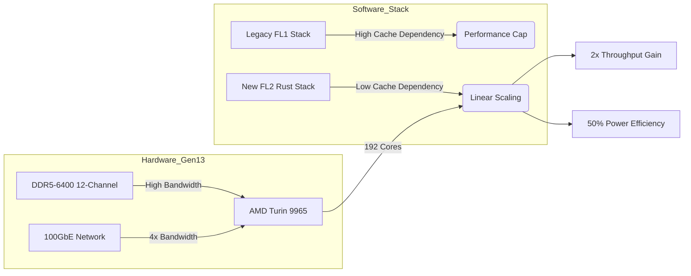

클라우드플레어(Cloudflare)의 13세대 서버 설계는 단순히 더 빠른 부품을 조립하는 단계를 넘어, 소프트웨어 스택의 변화가 하드웨어 결정에 어떤 영향을 미치는지 보여주는 전형적인 사례입니다. 특히 러스트(Rust) 기반의 FL2 스택 전환이 하드웨어의 물리적 한계를 어떻게 극복했는지에 초점을 맞춰 정리했습니다.

> 하드웨어의 캐시 용량을 줄이는 대신 코어 밀도를 극대화하고, 이를 소프트웨어 최적화로 보완하여 서버당 처리량을 2배로 끌어올린 하드웨어-소프트웨어 공동 설계의 결과물입니다.

## 성능 확장을 가로막던 하드웨어 제약과 소프트웨어의 해답

기존 12세대 서버에서 사용하던 AMD Genoa-X 프로세서는 대용량의 L3 캐시(3D V-Cache)를 탑재하여 요청 처리 속도를 높였습니다. 하지만 차세대 하드웨어를 검토하는 과정에서 코어 밀도를 높이면 코어당 할당되는 L3 캐시 용량이 급격히 줄어드는 문제에 직면했습니다. 기존의 FL1 소프트웨어 스택은 캐시 의존도가 높았기 때문에 하드웨어의 코어 수가 늘어나도 성능이 선형적으로 증가하지 않는 병목 현상이 예상되었습니다.

이 문제를 해결한 핵심은 소프트웨어의 완전한 재작성입니다. 클라우드플레어는 핵심 요청 처리 계층을 러스트 언어 기반의 FL2로 전환했습니다. FL2는 메모리 관리와 데이터 처리 구조를 개선하여 대용량 L3 캐시에 대한 의존도를 낮췄습니다. 덕분에 하드웨어 설계팀은 캐시 용량이 적더라도 코어 수가 압도적으로 많은 프로세서를 선택할 수 있는 자유를 얻었습니다.

## 13세대 서버의 주요 하드웨어 구성 요소와 선택 근거

새로운 서버 플랫폼은 성능 밀도와 운영 효율성을 극대화하는 방향으로 설계되었습니다. 핵심 사양은 다음과 같습니다.

- CPU: AMD EPYC Turin 9965 (192코어, 384스레드)
- 메모리: 768GB DDR5-6400 (12채널 구성)
- 네트워크: 100 GbE 듀얼 포트 (NVIDIA Mellanox ConnectX-6 Dx 등)
- 저장장치: 24TB NVMe PCIe 5.0

### 왜 AMD Turin 9965 프로세서인가?

비교 대상이었던 Turin 9755는 코어당 성능이 우수했지만, 9965는 코어 밀도와 전력 효율성 측면에서 압도적이었습니다. 9965는 코어당 L3 캐시가 2MB로 12세대의 12MB에 비해 83%나 줄어들었지만, 코어 수는 96개에서 192개로 두 배 늘어났습니다. FL2 스택에서는 코어 수 증가가 곧바로 전체 처리량(Throughput) 증가로 이어지기 때문에, 캐시를 포기하고 코어를 선택하는 전략이 가능했습니다.

### 메모리 대역폭과 용량의 균형

192개의 코어가 데이터 굶주림 현상을 겪지 않도록 메모리 시스템도 대폭 강화되었습니다. 12개의 메모리 채널을 모두 사용하는 1DPC(One DIMM Per Channel) 구성을 채택하여 초당 614GB의 대역폭을 확보했습니다. 이는 12세대 대비 33% 향상된 수치입니다. 용량 측면에서는 코어당 4GB 비율을 유지하면서 총 768GB를 탑재했는데, 이는 현재 메모리 시장의 가격 곡선에서 가장 경제적인 지점과 운영상의 필요량을 절충한 결과입니다.

## 하드웨어 교체 시 고려해야 할 실무적 관점

현업에서 서버 인프라를 설계하다 보면 최신 사양의 부품을 조합하는 것보다 더 어려운 것이 소프트웨어 특성과의 정합성을 맞추는 일입니다. 이번 13세대 서버 설계 사례에서 주목해야 할 실무 포인트는 다음과 같습니다.

### 캐시 감소가 미치는 영향의 양면성

모든 워크로드가 클라우드플레어의 FL2처럼 캐시 의존도가 낮은 것은 아닙니다. 만약 데이터베이스 서버나 복잡한 연산이 반복되는 레거시 애플리케이션을 운영 중이라면, 단순히 코어 수가 많고 캐시가 적은 Turin 9965로 전환했을 때 오히려 성능이 하락할 위험이 있습니다. 실무에서는 도입 전 반드시 실제 워크로드의 CPU 프로파일링을 통해 L3 캐시 히트율(Hit Rate)과 메모리 대역폭 사용량을 점검해야 합니다.

### 전력 밀도와 랙 단위 설계

13세대 서버는 코어당 전력 효율이 50% 개선되었지만, 서버 한 대당 소비 전력은 오히려 늘어났습니다. 이는 데이터센터의 랙(Rack)당 전력 밀도 설계를 다시 해야 함을 의미합니다. 서버 대수를 줄이면서 전체 처리량을 유지할 수 있다는 점은 운영상 이점이지만, 특정 랙에 전력 부하가 집중되는 핫스팟(Hotspot) 현상에 대비한 쿨링 전략이 필수적입니다.

### 운영 복잡도와 관리 포인트의 감소

동일한 연산 성능을 제공하기 위해 필요한 서버 대수가 절반으로 줄어든다는 것은 관리 효율성 측면에서 엄청난 이득입니다. 패치 적용, 펌웨어 업데이트, 물리적 장애 대응 등 운영팀의 업무 부하가 서버 대수에 비례하기 때문입니다. 고밀도 서버로의 전환은 초기 하드웨어 비용보다 장기적인 운영 비용(OPEX) 절감에 더 큰 목적이 있다고 볼 수 있습니다.

## 인프라 최적화를 위한 다음 단계

클라우드플레어의 사례는 하드웨어 사양에 소프트웨어를 맞추는 것이 아니라, 소프트웨어의 진화 방향에 맞춰 하드웨어의 트레이드오프(Trade-off)를 결정한 좋은 예시입니다. 

실무 환경에서 유사한 고민을 하고 있다면, 단순히 CPU 벤치마크 점수에 의존하기보다 현재 운영 중인 서비스의 병목 지점이 어디인지부터 파악해야 합니다. 메모리 대역폭이 문제인지, 캐시 적중률이 문제인지, 아니면 단순 코어 수가 부족한 것인지에 따라 최적의 하드웨어 선택지는 완전히 달라집니다. 

지금 바로 운영 중인 서버의 CPU 성능 지표를 확인해 보시기 바랍니다. 만약 코어 사용률은 낮은데 대기 시간(Latency)이 길다면 대용량 캐시 모델이 적합할 것이고, 코어 사용률이 전체적으로 높다면 13세대 서버와 같은 고밀도 코어 모델로의 전환을 검토할 시점입니다.

## 참고 자료
- [원문] Inside Gen 13: how we built our most powerful server yet — Cloudflare Blog
- [관련] Launching Cloudflare’s Gen 13 servers: trading cache for cores for 2x edge compute performance — Cloudflare Blog
- [관련] How to monitor LLMs in production with Grafana Cloud, OpenLIT, and OpenTelemetry — Grafana Blog