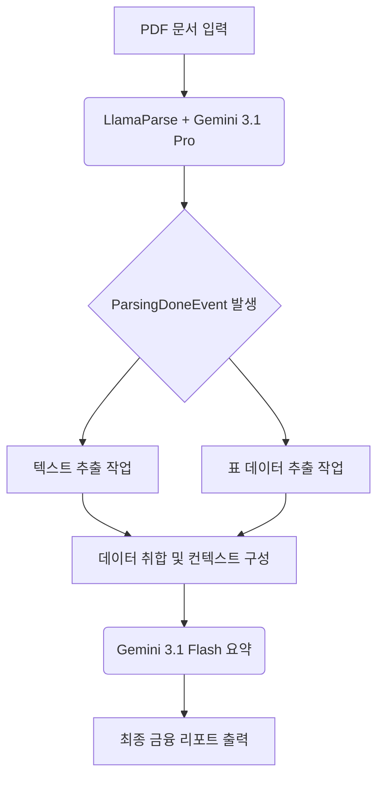

> **한 줄 요약** — LlamaParse의 에이전트 기반 파싱과 Gemini 3.1의 멀티모달 추론을 결합하여 복잡한 금융 PDF 문서에서 정확한 데이터를 추출하고 자동화된 분석 파이프라인을 구축하는 방법입니다.

## 금융 PDF 데이터 추출이 유독 까다로운 이유

비정형 문서에서 텍스트를 뽑아내는 작업은 개발자에게 오래된 숙제와 같습니다. 특히 금융 명세서(Brokerage Statements)는 다단 레이아웃, 복잡하게 중첩된 표, 전문 용어가 뒤섞여 있어 일반적인 OCR(Optical Character Recognition) 엔진으로는 처리가 거의 불가능합니다. 표의 경계선이 명확하지 않거나 페이지를 넘어가는 긴 테이블을 만나면 기존 시스템은 텍스트 순서를 엉망으로 섞어버리기 일쑤입니다.

최근 멀티모달(Multimodal) 능력을 갖춘 대규모 언어 모델(LLM)이 등장하면서 이 문제가 해결될 기미가 보이고 있습니다. 단순히 글자를 읽는 수준을 넘어 문서의 시각적 구조를 이해하고 논리적으로 재구성하는 것이 가능해졌기 때문입니다. 구글의 Gemini 3.1 Pro는 이러한 시각적 레이아웃 이해도가 뛰어나며, 이를 LlamaParse와 결합하면 단순 텍스트 추출을 넘어 데이터 자산으로 변환하는 지능형 파이프라인을 만들 수 있습니다.

실무에서 대량의 문서를 처리하다 보면 정합성 문제에 직면합니다. Gemini 3.1 Pro와 같은 고성능 모델을 파싱 단계에 배치하고, 상대적으로 가벼운 Gemini 3.1 Flash를 요약 및 분석 단계에 배치하는 이중화 전략은 성능과 비용이라는 두 마리 토끼를 잡는 현실적인 대안이 됩니다.

## LlamaParse와 Gemini 3.1을 활용한 지능형 워크플로우

LlamaParse는 단순히 텍스트를 긁어오는 도구가 아닙니다. Gemini 3.1 Pro를 엔진으로 사용하면 에이전트 기반 파싱(Agentic Parsing) 모드를 활성화할 수 있습니다. 이 모드에서 AI는 OCR 결과를 시각적 맥락과 대조하며 스스로 수정하고 마크다운(Markdown) 형식으로 구조화합니다.

전체 워크플로우는 이벤트 기반 아키텍처(Event-driven Architecture)를 따릅니다. 문서를 제출하면 파싱 완료 이벤트가 발생하고, 이에 따라 텍스트 추출과 표 추출이 동시에 병렬로 실행됩니다. 마지막으로 추출된 모든 데이터를 취합하여 최종 요약본을 생성하는 단계로 이어집니다.



### 1단계: 에이전트 기반 파서 설정

먼저 환경을 구성해야 합니다. Python 환경에서 `llama-cloud-services`와 `google-genai` 패키지를 설치한 뒤 API 키를 설정합니다. 파서 설정 시 `parse_page_with_agent` 모드를 선택하는 것이 핵심입니다.

```python
def get_llama_parse() -> LlamaParse:
    return LlamaParse(
        api_key=os.getenv("LLAMA_CLOUD_API_KEY"),
        parse_mode="parse_page_with_agent",
        model="gemini-3.1-pro",
        result_type=ResultType.MD,
    )
```

이 설정은 Gemini 3.1 Pro가 문서의 각 페이지를 시각적으로 분석하게 만듭니다. 표의 행과 열이 복잡하게 얽혀 있어도 모델이 이를 인지하고 정확한 마크다운 테이블 형식으로 변환해 줍니다. 일반 파싱 대비 약 13~15%의 정확도 향상을 기대할 수 있는 지점입니다.

### 2단계: 이벤트 기반 병렬 추출 구현

LlamaIndex 워크플로우를 사용하면 상태 관리와 비동기 처리가 간편해집니다. 파싱이 끝나면 `ParsingDoneEvent`를 던지고, 이를 기다리던 두 개의 단계가 동시에 실행됩니다.

```python
class BrokerageStatementWorkflow(Workflow):
    @step
    async def parse_file(
        self, ev: FileEvent, ctx: Context[WorkflowState], parser: Annotated[LlamaParse, Resource(get_llama_parse)]
    ) -> ParsingDoneEvent | OutputEvent:
        result = cast(ParsingJobResult, (await parser.aparse(file_path=ev.input_file)))
        async with ctx.store.edit_state() as state:
            state.parsing_job_result = result
        return ParsingDoneEvent()

    @step
    async def extract_text(self, ev: ParsingDoneEvent, ctx: Context[WorkflowState]) -> TextExtractionDoneEvent:
        # 텍스트 추출 로직 실행
        return TextExtractionDoneEvent()

    @step
    async def extract_tables(self, ev: ParsingDoneEvent, ctx: Context[WorkflowState]) -> TablesExtractionDoneEvent:
        # 표 데이터 추출 로직 실행
        return TablesExtractionDoneEvent()
```

추출 작업을 병렬로 처리하면 전체 파이프라인의 지연 시간(Latency)을 크게 줄일 수 있습니다. 특히 문서가 수십 페이지에 달할 경우 이러한 비동기 설계는 선택이 아닌 필수입니다.

### 3단계: Gemini 3.1 Flash를 이용한 비용 효율적 요약

모든 추출이 완료되면 데이터를 하나로 모아 사용자에게 친숙한 언어로 설명하는 단계입니다. 여기서는 Gemini 3.1 Flash를 사용합니다. 복잡한 추론은 이미 Pro 모델이 파싱 단계에서 수행했으므로, 텍스트 요약처럼 토큰 소모가 많은 작업은 가성비가 좋은 Flash 모델이 적합합니다.

```python
@step
async def ask_llm(
    self, ev: TablesExtractionDoneEvent | TextExtractionDoneEvent, 
    ctx: Context[WorkflowState], llm: Annotated[GenAIClient, Resource(get_llm)]
) -> OutputEvent:
    # 두 이벤트가 모두 도착할 때까지 대기
    if ctx.collect_events(ev, [TablesExtractionDoneEvent, TextExtractionDoneEvent]) is None:
        return None
    
    # Gemini 3.1 Flash에게 최종 요약 요청
    # 로직 생략
    return OutputEvent(content=summary)
```

## 실무에서 마주하는 한계와 극복 방안

원문에서 제시하는 이 방식은 매우 강력하지만, 실제 현업 시스템에 도입할 때는 몇 가지 트레이드오프(Trade-off)를 고려해야 합니다.

첫째는 속도와 비용의 균형입니다. Gemini 3.1 Pro를 파싱 엔진으로 쓰면 결과물은 훌륭하지만 비용이 발생하고 파싱 시간이 길어질 수 있습니다. 모든 문서에 이 방식을 적용하기보다는 레이아웃이 복잡한 특정 페이지만 선별적으로 에이전트 모드를 적용하는 로직을 추가하는 것이 경제적입니다.

둘째는 환각(Hallucination) 제어입니다. 금융 데이터는 단 하나의 숫자 오차도 치명적입니다. LLM이 표를 마크다운으로 변환하는 과정에서 숫자를 잘못 옮길 가능성이 희박하게나마 존재합니다. 이를 방지하기 위해 추출된 마크다운 표의 합계 수치와 원본 문서의 텍스트 수치를 교차 검증하는 로직을 파이프라인 중간에 삽입하는 습관이 필요합니다.

비슷한 고민을 하던 프로젝트에서 가장 큰 난관은 페이지 중간에 잘린 표였습니다. LlamaParse는 이를 하나의 연속된 표로 합쳐주는 기능을 제공하지만, 완벽하지 않을 때가 있습니다. 이때 Gemini 3.1 Pro의 긴 문맥 창(Context Window)을 활용해 앞뒤 페이지의 맥락을 한꺼번에 밀어 넣으면 끊긴 표를 복구하는 성능이 비약적으로 좋아집니다.

## 데이터 전처리가 AI의 성능을 결정한다

결국 AI 에이전트의 성능은 모델 자체보다 모델에게 입력되는 데이터의 품질에 좌우됩니다. 아무리 똑똑한 Gemini 3.1이라도 엉망으로 섞인 텍스트 뭉치를 주면 제대로 된 분석을 내놓기 어렵습니다. LlamaParse와 같은 도구로 구조화된 데이터를 먼저 확보하는 과정이 선행되어야 하는 이유입니다.

이벤트 중심의 상태 기반 아키텍처를 구축해 두면 나중에 다른 추출 단계(예: 이미지 분석, 서명 확인 등)를 추가하더라도 전체 흐름을 깨지 않고 확장할 수 있습니다. 지금 바로 가지고 있는 복잡한 PDF 명세서 하나를 골라 이 파이프라인에 통과시켜 보시기 바랍니다. 수작업으로 엑셀에 옮기던 고통에서 벗어나는 첫걸음이 될 것입니다.

## 참고 자료
- [원문] [Build a smart financial assistant with LlamaParse and Gemini 3.1](https://developers.googleblog.com/build-a-smart-financial-assistant-with-llamaparse-and-gemini-31/) — Google Developers
- [관련] Jump to play: Building with Gemini & MediaPipe — Google Developers
- [관련] Introducing Wednesday Build Hour — Google Developers