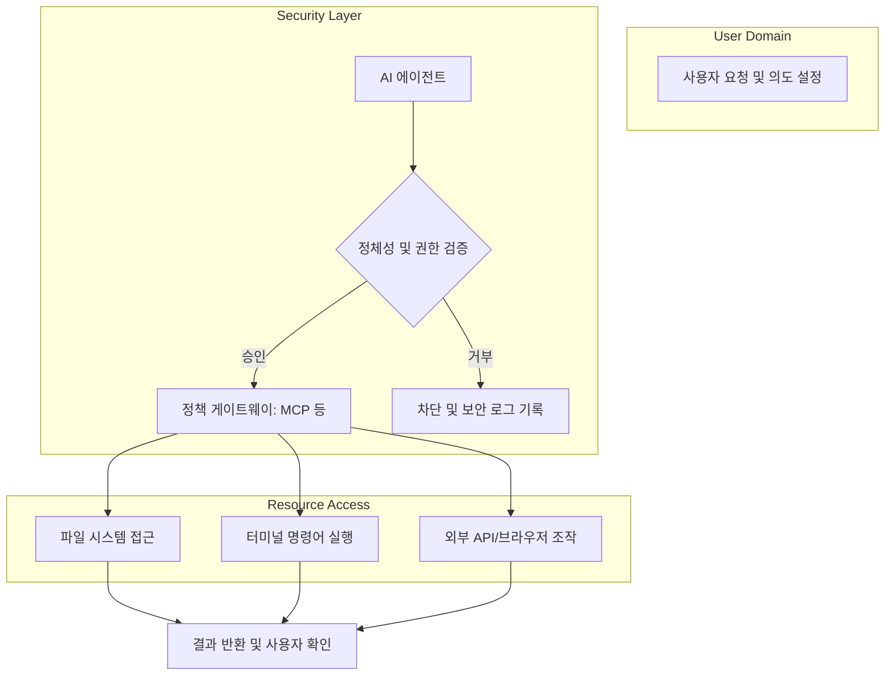

> **한 줄 요약** — 로컬 환경에서 동작하는 AI 에이전트의 권한 남용과 정체성 도용 위험을 방지하기 위해, 실행 시점의 의도 검증과 강력한 정체성 관리 체계 구축이 필수적입니다.

## 로컬 에이전트 보안에 관심을 가져야 하는 이유
최근 클로드 데스크톱(Claude Desktop)이나 오픈 클로(Open Claw) 같은 도구들이 등장하면서 AI 에이전트가 사용자의 로컬 환경에서 직접 실행되는 사례가 급증하고 있습니다. 단순히 채팅창 안에서 답변을 주는 수준을 넘어, 에이전트가 내 컴퓨터의 파일 시스템에 접근하고 터미널에서 명령어를 실행하며 브라우저를 조작해 실제 작업을 수행하는 시대가 된 것입니다.

이러한 변화는 생산성을 비약적으로 높여주지만, 보안 관점에서는 완전히 새로운 위협 모델을 제시합니다. 에이전트가 사용자의 정체성을 빌려(Impersonation) 권한을 행사하기 때문에, 에이전트가 탈취되거나 오작동할 경우 그 피해는 고스란히 사용자의 데이터와 자산으로 이어집니다. 에이전트 정체성 도용(Agentic Identity Theft)이라는 개념이 실무적인 위협으로 다가온 이유입니다.

개발자나 보안 담당자라면 에이전트에게 어디까지 권한을 부여할지, 그리고 에이전트가 수행하는 행위가 정말 사용자의 의도(Intent)와 일치하는지 검증하는 메커니즘을 반드시 고민해야 합니다.

## 에이전트 정체성 관리와 보안 위협의 핵심
로컬 에이전트는 클라우드 기반 서비스보다 안전할 것이라는 막연한 믿음이 있습니다. 데이터가 외부로 나가지 않는다는 점에서는 유리할 수 있지만, 역설적으로 에이전트가 로컬의 실행 컨텍스트(Execution Context)에 직접 접근할 수 있다는 점이 가장 큰 위험 요소가 됩니다.

실제로 보안 연구자들은 클로드 봇(Claude Bot)과 같은 오픈소스 에이전트를 대상으로 위협 분석을 진행하고 있습니다. 에이전트가 민감한 설정 파일(.env), 소스 코드 저장소, 브라우저 쿠키 등에 접근할 수 있게 되면 폭발 반경(Blast Radius)은 걷잡을 수 없이 커집니다.

이를 해결하기 위해 논의되는 핵심 개념들을 정리하면 다음과 같습니다.

- **에이전트 샌드박싱(Agentic Sandboxing)**: 에이전트의 활동 범위를 제한하기 위해 가상 머신(VM)이나 격리된 컨테이너 환경에서 실행하는 방식입니다.
- **의도 검증(Intent Verification)**: 에이전트가 특정 기술(Skill)을 호출하거나 권한을 행사할 때, 그것이 최초에 사용자가 지시한 목적에 부합하는지 실시간으로 판단하는 과정입니다.
- **분산 아이덴티티(DID) 및 검증 가능한 자격 증명(Verifiable Credentials)**: 에이전트가 생성되고 소멸하는 과정에서 그 정체성을 어떻게 증명하고 관리할지에 대한 표준 기술입니다.

에이전트가 리소스에 접근하는 논리적 흐름을 다이어그램으로 표현하면 다음과 같습니다.

## 실무에서 마주할 에이전트 보안의 트레이드오프
현업에서 에이전트 도입을 검토하다 보면 과거 가상화(Virtualization) 기술이 처음 보급되던 시기와 비슷한 고민을 하게 됩니다. 당시에도 컴퓨팅 자원을 분리하고 관리하기 위해 복잡한 권한 제어 모델이 필요했듯이, 지금은 에이전트를 위한 액티브 디렉토리(Active Directory) 같은 체계가 필요한 시점입니다.

실무적인 관점에서 특히 까다로운 부분은 에이전트의 휘발성(Ephemerality)입니다. 에이전트는 특정 작업을 위해 순식간에 생성되었다가 작업이 끝나면 사라집니다. 이때 발급된 아이덴티티가 실행 시점(Time of Execution)에도 유효한지, 그리고 그 짧은 생애 주기 동안 권한 남용이 일어나지 않았는지 추적하는 것은 기존의 워크로드 아이덴티티(Workload Identity) 관리보다 훨씬 난도가 높습니다.

또한 의도(Intent)라는 개념은 매우 주관적입니다. 사용자가 "내 프로젝트를 빌드해줘"라고 명령했을 때, 에이전트가 빌드 과정에서 외부 라이브러리를 업데이트하거나 네트워크 통신을 시도하는 것이 정당한 의도 범위 내에 있는지 판단하는 기준을 세우기가 어렵습니다.

실제로 이런 상황에서는 다음과 같은 실무적 접근이 필요할 수 있습니다.

- **전용 하드웨어 분리**: 개인적인 뱅킹 정보나 민감한 문서가 있는 업무용 노트북에서 로컬 에이전트를 직접 실행하기보다, 별도의 미니 PC(예: Mac Mini)를 구성해 격리된 환경에서 테스트하는 것이 현실적인 대안이 될 수 있습니다.
- **MCP(Model Context Protocol) 게이트웨이 활용**: 에이전트의 모든 외부 호출을 하나의 통로(Choke Point)로 모아 모니터링하고 거버넌스를 적용하는 방식입니다. 이를 통해 에이전트가 어떤 스킬을 언제 사용하는지 가시성을 확보할 수 있습니다.
- **최소 권한 원칙(Principle of Least Privilege) 재정의**: 에이전트에게 파일 시스템 전체 접근 권한을 주기보다, 특정 디렉토리만 마운트(Mount)해주는 방식으로 접근 제어 목록(ACL)을 엄격하게 관리해야 합니다.

## 에이전트 보안을 위해 우리가 준비해야 할 것
과거의 소프트웨어 보안이 코드의 취약점을 찾는 데 집중했다면, 이제는 에이전트라는 행위자의 행동과 권한을 관리하는 방향으로 패러다임이 바뀌고 있습니다. 에이전트가 나를 대신해 일을 처리해주는 편리함은 강력한 신뢰 관계가 전제될 때만 지속 가능합니다.

현업에서 에이전트 도입을 고민하고 있다면 단순히 성능(Performance)이나 지연 시간(Latency)만 볼 것이 아니라, 에이전트의 정체성을 어떻게 정의하고 그들의 행동을 어떻게 관측(Observability)할 것인지에 대한 로드맵을 먼저 세워야 합니다.

지금 당장 해볼 수 있는 것은 사용 중인 로컬 에이전트 도구가 내 파일 시스템의 어느 범위까지 접근 권한을 가지고 있는지 점검해보는 것입니다. 무심코 허용한 전체 디스크 접근 권한이 미래의 보안 사고를 부르는 씨앗이 될 수 있음을 인지해야 합니다.

## 참고 자료
- [원문] [Prevent agentic identity theft](https://stackoverflow.blog/2026/03/27/prevent-agentic-identity-theft/) — Stack Overflow Blog
- [관련] Multi-stage attacks are the Final Fantasy bosses of security — Stack Overflow Blog
- [관련] How to monitor LLMs in production with Grafana Cloud, OpenLIT, and OpenTelemetry — Grafana Blog