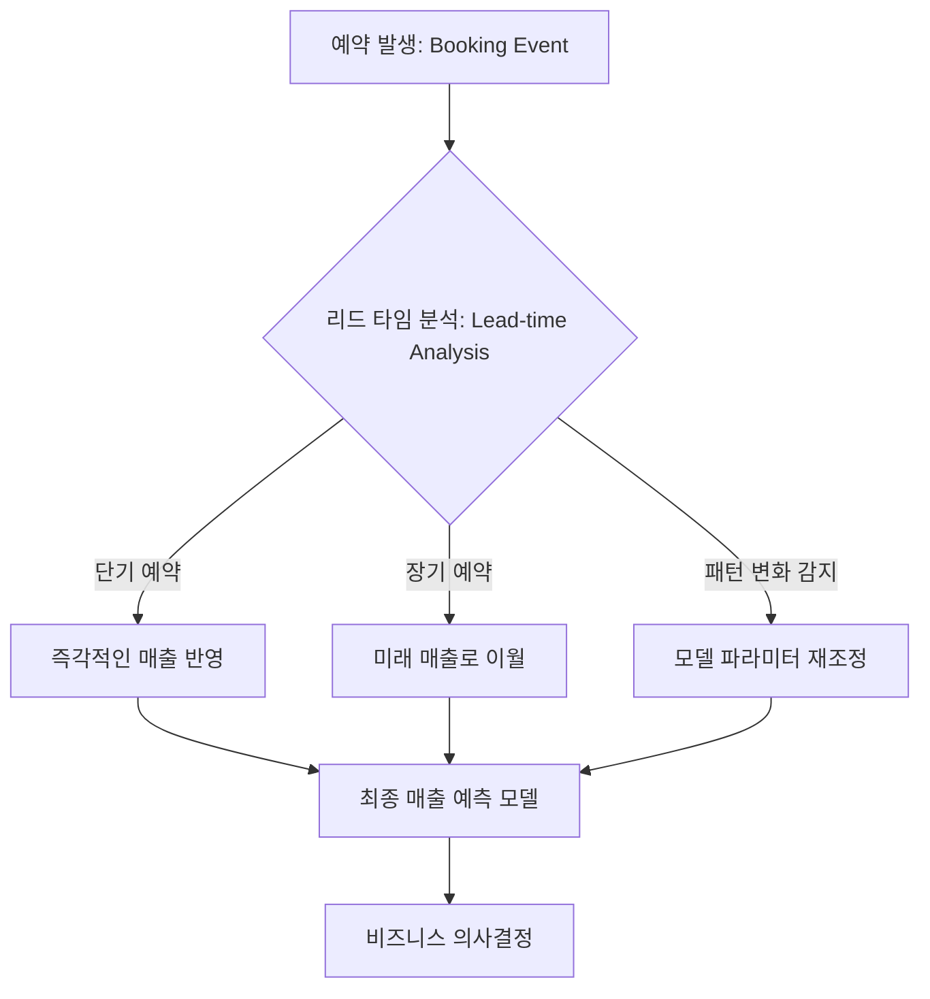

> **한 줄 요약** — 에어비앤비는 예약과 실제 숙박 사이의 리드 타임 분포 변화를 포착하여 팬데믹 같은 거대한 충격에도 견딜 수 있는 회복력 있는 예측 모델을 구축했습니다.

## 이 주제를 꺼낸 이유

예측 모델링(Forecasting Modeling)은 데이터가 과거의 패턴을 반복한다는 가정 아래서만 강력한 힘을 발휘합니다. 하지만 시장의 흐름이 완전히 뒤바뀌는 블랙 스완(Black Swan) 상황이 닥치면, 정교하게 설계된 모델일수록 오히려 더 처참하게 무너지는 광경을 목격하곤 합니다. 에어비앤비가 겪은 2020년의 상황은 단순히 매출이 줄어든 것이 문제가 아니라, 기존의 예측 로직 자체가 작동 불능 상태에 빠졌다는 점에서 데이터 엔지니어와 사이언티스트들에게 시사하는 바가 큽니다.

실무에서 데이터 파이프라인을 관리하다 보면, 모델의 정확도보다 더 중요한 것은 시스템의 회복력(Resilience)이라는 사실을 깨닫게 됩니다. 이번 글에서는 에어비앤비가 전 세계적인 충격 속에서 어떻게 예측 모델을 재설계했는지, 그리고 현대적인 데이터 관측성(Observability) 관점에서 우리가 준비해야 할 것은 무엇인지 깊이 있게 다루어 보려고 합니다.

## 리드 타임 분포가 예측 모델을 무너뜨리는 방식

에어비앤비의 재무 지표 예측에서 가장 핵심적인 변수는 예약(Booking) 시점과 실제 숙박(Stay) 시점 사이의 간격인 리드 타임(Lead-time)입니다. 오늘 예약이 발생했다고 해서 그 수익이 오늘 발생하는 것이 아니기 때문입니다. 평상시라면 이 리드 타임은 일정한 패턴을 유지하지만, 팬데믹은 이 고정 관념을 완전히 깨뜨렸습니다.

사람들은 더 이상 몇 달 뒤의 해외 여행을 예약하지 않게 되었고, 대신 바로 다음 주에 떠나는 근교의 장기 숙박을 예약하기 시작했습니다. 이처럼 리드 타임 구성(Lead-time composition)이 변하면, 기존 모델은 과거 데이터를 기반으로 미래 매출을 과다 혹은 과소 계상하는 오류를 범하게 됩니다. 에어비앤비는 이 문제를 해결하기 위해 예약과 숙박이라는 두 이벤트를 분리하고, 그 사이의 연결 고리를 동적으로 파악하는 구조를 도입했습니다.

현업에서 비슷한 고민을 하다 보면, 단순히 전체 숫자의 합계를 맞추는 것에 매몰되어 그 내부를 구성하는 분포의 변화를 놓치는 경우가 많습니다. 에어비앤비는 전체 예약 건수라는 결과값에 집중하는 대신, 예약이 숙박으로 전환되는 파이프라인 자체를 모델링함으로써 외부 충격에 대응할 수 있는 유연성을 확보했습니다.

## 충격에 강한 예측 모델을 만드는 3단계 전략

에어비앤비가 도입한 방식은 크게 세 가지 단계로 요약할 수 있습니다. 이는 단순히 시계열 데이터를 분석하는 것을 넘어, 비즈니스 도메인의 특수성을 모델 구조에 직접 녹여낸 사례입니다.

### 1. 예약과 숙박 이벤트의 디커플링(Decoupling)
기존 모델이 과거의 예약 흐름을 보고 미래 숙박을 짐작했다면, 새로운 모델은 예약 시점의 데이터와 숙박 시점의 데이터를 독립적인 구성 요소로 취급합니다. 이를 통해 예약 패턴이 급변하더라도 숙박 예측 로직이 즉각적으로 오염되는 것을 방지합니다.

### 2. 리드 타임 구성의 동적 업데이트
리드 타임은 고정된 상수가 아니라 시장 상황에 따라 변하는 변수입니다. 에어비앤비는 최신 예약 데이터를 실시간으로 모니터링하여 리드 타임 분포가 변하는 즉시 이를 모델에 반영하는 메커니즘을 구축했습니다. 예를 들어, 갑작스러운 여행 제한 조치가 해제되어 단기 예약이 폭증하면 모델은 즉시 리드 타임 가중치를 수정합니다.

### 3. 구성 요소별 상향식(Bottom-up) 예측
국가별, 숙박 형태별(장기 vs 단기), 지역별(도시 vs 교외)로 데이터를 세분화하여 각각의 예측치를 합산하는 방식을 사용합니다. 이는 특정 지역이나 카테고리에서 발생하는 충격이 전체 모델을 왜곡하는 현상을 막아줍니다.

| 항목 | 기존 방식 (Pre-shock) | 개선된 방식 (Post-shock) |
| :--- | :--- | :--- |
| 데이터 구조 | 통합 시계열 데이터 활용 | 예약 및 숙박 이벤트 분리 관리 |
| 리드 타임 처리 | 과거 평균값 기반 고정 가중치 | 실시간 분포 변화 감지 및 동적 반영 |
| 예측 단위 | 전체 매출 중심의 하향식 접근 | 속성별 세분화된 상향식 접근 |
| 장애 대응 | 수동 파라미터 조정 필요 | 모델 구조 자체의 적응형 대응 |

## 데이터 관측성과 AI의 역할에 대한 고찰

에어비앤비의 사례는 모델 자체의 성능만큼이나 데이터를 바라보는 시각, 즉 관측성(Observability)이 얼마나 중요한지 보여줍니다. 실제로 최근 Grafana Labs의 설문 조사에 따르면, 많은 전문가가 AI를 활용해 이상 징후를 감지하고 트렌드를 예측하는 데 큰 기대를 걸고 있습니다. 에어비앤비가 수동으로 잡아내야 했던 리드 타임의 미세한 변화를, 이제는 AI 기반의 관측 도구가 자동으로 탐지하고 경고를 보낼 수 있는 환경이 되어가고 있습니다.

실제로 이런 상황에서는 단순히 모델이 틀렸다는 사실을 아는 것보다, 왜 틀렸는지를 파악하는 뿌리 원인 분석(Root Cause Analysis)이 핵심입니다. 에어비앤비가 리드 타임 구성을 파고든 것처럼, 우리도 데이터 파이프라인의 각 단계에서 발생하는 지연 시간(Latency)이나 데이터 드리프트(Data Drift)를 추적해야 합니다.

현업에서 데이터 업무를 수행하다 보면, 모델의 정확도가 떨어질 때 가장 먼저 의심하는 것은 알고리즘의 복잡도입니다. 하지만 에어비앤비의 사례에서 볼 수 있듯, 정답은 알고리즘이 아니라 데이터의 흐름을 규정하는 비즈니스 로직의 재해석에 있는 경우가 많습니다. 오픈텔레메트리(OpenTelemetry)와 같은 오픈 표준을 활용해 시스템 전반의 가시성을 확보하는 것이, 결과적으로 더 나은 예측 모델을 만드는 기반이 됩니다.

## 예측 모델의 한계와 실무적 트레이드오프

모든 충격을 견디는 완벽한 모델을 만드는 데는 비용이 따릅니다. 모델을 세분화하고 동적 업데이트 로직을 추가할수록 시스템의 복잡도는 기하급수적으로 증가합니다. 이는 유지보수의 어려움으로 이어지며, 때로는 모델의 해석 가능성(Explainability)을 떨어뜨리기도 합니다.

에어비앤비가 선택한 방식 역시 관리해야 할 파라미터가 늘어났음을 의미합니다. 하지만 비즈니스의 연속성을 담보해야 하는 재무 예측 분야에서는, 약간의 운영 공수를 더하더라도 정확한 방향성을 제시하는 것이 훨씬 가치 있는 일입니다. 실무자로서 우리는 항상 모델의 복잡성과 회복력 사이에서 균형을 잡아야 합니다.

비슷한 고민을 하는 팀이라면, 당장 모든 모델을 갈아엎기보다는 현재 모델이 의존하고 있는 가장 큰 가정(Assumption)이 무엇인지부터 점검해 보길 권합니다. 에어비앤비에게는 그것이 리드 타임이었고, 다른 서비스에게는 사용자 리텐션이나 특정 API의 응답 속도일 수 있습니다. 이 핵심 가정이 무너졌을 때를 대비한 백업 로직을 설계하는 것만으로도, 다음번 찾아올 충격에서 살아남을 확률은 비약적으로 높아집니다.

## 정리

에어비앤비의 새로운 예측 프레임워크는 단순히 기술적인 업데이트가 아니라, 불확실성을 상수로 받아들이는 데이터 전략의 변화를 상징합니다. 고정된 패턴에 의존하는 대신 데이터의 내부 구성 변화를 실시간으로 추적하고, 이를 모델 구조에 유연하게 녹여내는 설계가 핵심입니다.

지금 운영 중인 모델이 내일 당장 데이터 분포가 180도 변하더라도 유효한 통찰을 줄 수 있는지 자문해 보아야 합니다. 만약 그렇지 않다면, 에어비앤비가 리드 타임을 쪼개어 분석했듯이 우리 시스템의 핵심 동력을 다시 정의하는 작업부터 시작해야 할 것입니다.

## 참고 자료
- [원문] [What COVID did to our forecasting models (and what we built to handle the next shock)](https://medium.com/airbnb-engineering/what-covid-did-to-our-forecasting-models-and-what-we-built-to-handle-the-next-shock-ccbf0e1f7fa9) — Airbnb Tech
- [관련] AI in observability in 2026: Huge potential, lingering concerns — Grafana Blog
- [관련] Open standards in 2026: The backbone of modern observability — Grafana Blog