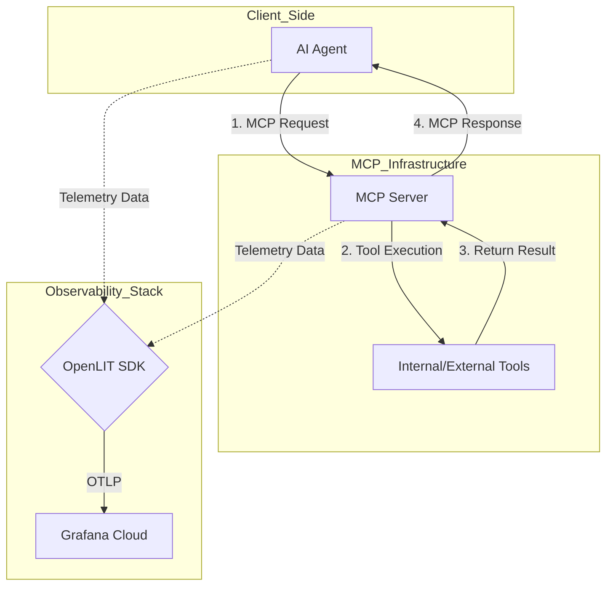

AI 에이전트가 외부 도구와 상호작용할 때 사용하는 모델 컨텍스트 프로토콜(Model Context Protocol, MCP) 서버의 상태를 OpenLIT와 Grafana Cloud로 모니터링하여 시스템의 블랙박스 영역을 제거하는 방법을 공유합니다.

> **한 줄 요약** — OpenLIT SDK를 활용해 MCP 서버의 도구 호출 지연 시간과 리소스 사용량을 추적하고, Grafana Cloud에서 AI 에이전트의 전체 실행 과정을 시각화하여 성능 병목을 해결할 수 있습니다.

## 이 주제를 꺼낸 이유

대규모 언어 모델(Large Language Model, LLM) 기반 서비스가 단순한 채팅을 넘어 에이전트 구조로 진화하면서 외부 도구와의 연결이 핵심이 되었습니다. 이때 MCP는 에이전트와 도구 서버 사이의 표준 통신 규약 역할을 수행하지만, 운영 관점에서는 새로운 복잡성을 야기합니다. 

에이전트가 답변을 내놓지 못할 때, 그것이 모델의 추론 문제인지, MCP 서버의 연결 문제인지, 아니면 연동된 API의 장애인지 파악하기 어렵습니다. 실무에서 이러한 가시성(Visibility) 부재는 장애 복구 시간을 늦추는 결정적인 요인이 됩니다. 따라서 MCP 서버를 단순한 프록시가 아닌, 관측 가능한(Observable) 구성 요소로 관리해야 할 필요성을 느껴 이 기술을 정리하게 되었습니다.

## MCP 서버 관측성 확보를 위한 핵심 개념

MCP 서버는 에이전트의 요청을 받아 실제 도구를 실행하고 결과를 반환하는 중간 계층입니다. 이 과정에서 발생하는 데이터를 수집하기 위해 오픈소스 표준인 오픈텔레메트리(OpenTelemetry) 기반의 OpenLIT를 활용합니다.

### 시스템 구성도 및 워크플로우

에이전트 클라이언트와 MCP 서버 사이의 통신 흐름은 다음과 같은 구조로 시각화할 수 있습니다.



### OpenLIT를 통한 자동 계측

OpenLIT는 코드 몇 줄로 MCP 운영 데이터를 수집하는 자동 계측(Auto-instrumentation) 기능을 제공합니다. 파이썬(Python) 환경에서 MCP 라이브러리와 함께 설치하여 즉시 사용할 수 있습니다.

- **도구 호출 지연 시간**: 각 도구가 실행되는 데 걸리는 시간을 밀리초(ms) 단위로 측정합니다.
- **성공 및 실패율**: 도구 호출 중 발생하는 예외 상황과 에러 코드를 기록합니다.
- **컨텍스트 윈도우 사용량**: 에이전트가 소비하는 토큰 수와 메모리 점유율을 모니터링합니다.

### 계측 코드 구현 예시

서버 측에서는 `openlit.init()` 호출 한 번으로 모든 MCP 도구 호출을 추적할 수 있습니다.

```python
import openlit
from mcp import Server

# OpenTelemetry 트레이싱 및 메트릭 활성화
openlit.init() 

server = Server()

@server.tool("search_documents")
def search_documents(query: str):
    # 실제 데이터베이스 또는 검색 API 호출 로직
    results = document_search(query)
    return results

server.run(host="localhost", port=8080)
```

클라이언트 측에서도 동일하게 OpenLIT를 초기화하면 서버와 클라이언트 사이의 트레이스(Trace)가 연결되어 전체 호출 경로를 한눈에 볼 수 있는 엔드 투 엔드(End-to-End) 가시성이 확보됩니다.

## 내 생각 & 실무 관점

원문에서 강조하는 MCP 모니터링은 단순히 성능 지표를 보는 것을 넘어, AI 시스템의 신뢰성을 담보하는 장치라고 생각합니다. 실무에서 에이전트 시스템을 운영하다 보면 다음과 같은 상황에 직면하게 되는데, 이때 관측성 데이터가 큰 힘을 발휘합니다.

### 소리 없는 실패의 위험성

AI 에이전트의 무서운 점은 시스템 에러가 나지 않았음에도 불구하고 잘못된 도구 데이터를 바탕으로 그럴듯한 거짓말(Hallucination)을 하는 경우입니다. MCP 서버에서 도구 호출 결과를 구조화된 로그로 남기지 않으면, 모델이 왜 그런 답변을 했는지 사후 분석이 불가능합니다. Grafana Cloud의 AI 관측성 대시보드는 도구의 응답 값과 모델의 추론 과정을 연결해 주므로, 결과의 타당성을 검증하는 데 필수적입니다.

### 인프라 비용과 컨텍스트 관리

많은 팀이 모델 API 비용에만 집중하지만, 실제로는 MCP 서버가 도구에서 가져오는 방대한 데이터가 컨텍스트 윈도우(Context Window)를 과도하게 채워 비용을 폭증시키는 경우가 많습니다. OpenLIT가 제공하는 컨텍스트 사용량 지표를 모니터링하면, 불필요하게 많은 데이터를 모델에 전달하고 있지는 않은지 확인하고 데이터 필터링 로직을 개선하는 근거로 삼을 수 있습니다.

### 도입 시 고려해야 할 트레이드오프

모든 도구 호출을 상세히 기록하는 것은 성능 오버헤드를 발생시킬 수 있습니다. 특히 실시간성이 중요한 서비스에서는 트레이스 샘플링(Sampling) 비율을 조정하는 전략이 필요합니다. 

또한, 오픈텔레메트리 표준을 따르는 것은 벤더 종속성(Vendor Lock-in)을 피하는 좋은 선택입니다. 원문에서는 Grafana Cloud를 예로 들었지만, OpenLIT로 수집한 데이터는 OTLP(OpenTelemetry Protocol)를 지원하는 어떤 백엔드로도 보낼 수 있다는 점이 실무적으로 큰 장점입니다.

### 보안 및 데이터 프라이버시

MCP 서버는 종종 내부 데이터베이스나 민감한 API에 접근합니다. 모니터링 과정에서 개인정보나 기밀 데이터가 로그에 포함되어 Grafana Cloud와 같은 외부 플랫폼으로 전송되지 않도록 주의해야 합니다. OpenLIT 설정 시 민감한 필드를 마스킹(Masking)하거나 제외하는 필터링 규칙을 반드시 적용해야 합니다.

## 정리

MCP 서버는 AI 에이전트의 손과 발이 되는 핵심 인프라입니다. 이를 블랙박스로 방치하면 운영 단계에서 발생하는 수많은 변수에 대응할 수 없습니다. OpenLIT와 Grafana Cloud를 조합한 관측성 체계는 시스템의 투명성을 높이고, 장애 대응 시간을 단축하며, 최종적으로는 더 안정적인 AI 사용자 경험을 제공하는 밑거름이 됩니다. 지금 운영 중인 에이전트에 MCP 서버가 있다면, 먼저 한두 개의 핵심 도구에 대해서만이라도 지연 시간 지표를 수집해 보는 것부터 시작해 보길 권장합니다.

## 참고 자료

- [원문] [Monitor Model Context Protocol (MCP) servers with OpenLIT and Grafana Cloud](https://grafana.com/blog/ai-observability-MCP-servers/) — Grafana Blog
- [관련] How to monitor LLMs in production with Grafana Cloud, OpenLIT, and OpenTelemetry — Grafana Blog
- [관련] How OpenRouter and Grafana Cloud bring observability to LLM-powered applications — Grafana Blog
- [관련] Open standards in 2026: The backbone of modern observability — Grafana Blog