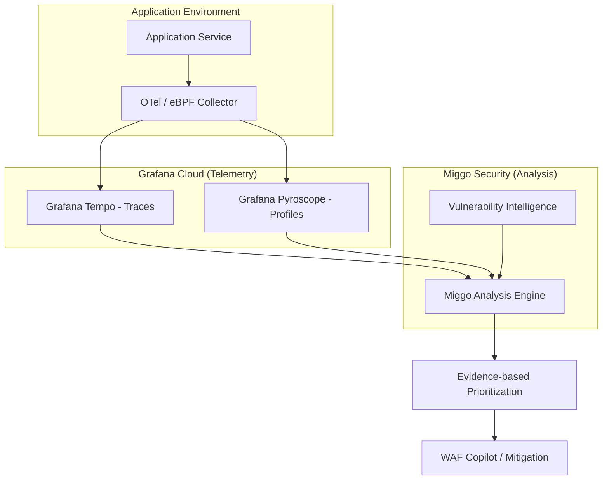

이미 수집하고 있는 옵저버빌리티(Observability) 데이터를 보안 영역으로 확장해, 추가적인 성능 저하 없이 실제 실행 경로에 포함된 핵심 취약점만 식별하고 방어하는 효율적인 보안 운영 방안을 다룹니다.

## 보안과 개발 사이의 간극을 줄여야 하는 이유
보안 팀과 개발 팀 사이에는 늘 보이지 않는 긴장감이 흐릅니다. 보안 팀은 수천 개의 취약점이 발견되었다며 수정을 요구하고, 개발 팀은 그중 상당수가 실제 서비스 운영과는 상관없는 라이브러리 내부의 코드라며 피로감을 호소합니다. 실제로 소프트웨어 구성 분석(SCA)이나 정적 분석(SAST) 도구가 찾아내는 취약점 중 서비스 실행 과정에서 실제로 호출되어 공격에 노출될 수 있는 비중은 2% 내외에 불과하다는 통계도 있습니다. 나머지 98%는 실행되지도 않는 코드 속에 잠들어 있는 노이즈인 셈입니다.

이런 상황에서 무분별한 수정 요청은 개발 우선순위를 뒤흔들고 부서 간 신뢰를 무너뜨립니다. 실무에서 보안 취약점 조치 업무를 수행하다 보면, 단순히 버전 업데이트를 하는 것만으로도 예상치 못한 사이드 이펙트가 발생해 서비스 장애로 이어지는 사례를 자주 접합니다. 따라서 정말로 위험한 2%가 무엇인지 정확히 가려내고, 이를 증거 기반으로 설득할 수 있는 데이터가 절실합니다.

그 대안으로 등장한 런타임 보안(Runtime Security) 기술 역시 도입이 쉽지 않았습니다. 기존의 런타임 애플리케이션 자기 보호(RASP) 방식은 애플리케이션 성능을 떨어뜨리거나 특정 벤더에 종속되는 문제를 일으켰고, 최근 유행하는 eBPF 기반 센서들조차 여러 개가 중첩되면 무시할 수 없는 수준의 컴퓨팅 오버헤드를 발생시킵니다. 인프라 비용에 민감한 조직이라면 보안을 위해 서버 자원의 10% 이상을 할애하는 결정이 결코 쉽지 않을 것입니다.

## 옵저버빌리티 데이터를 보안 자산으로 전환하기
그라파나(Grafana)와 미고(Miggo)의 파트너십이 제시하는 핵심 아이디어는 간단하면서도 강력합니다. 이미 엔지니어들이 장애 대응과 성능 모니터링을 위해 수집하고 있는 트레이스(Traces)와 프로파일(Profiles) 데이터를 보안 분석의 원천 데이터로 재활용하는 것입니다. 새로운 에이전트를 설치할 필요 없이, 기존에 구축된 파이프라인을 그대로 활용해 보안 가시성을 확보하는 방식입니다.

이 프로세스는 크게 네 단계로 진행됩니다.

1. 데이터 수집: 오픈텔레메트리(OpenTelemetry)나 그라파나 알로이(Alloy), 베일라(Beyla) 등을 통해 애플리케이션의 요청 흐름과 코드 실행 경로 데이터를 그라파나 클라우드로 모냅니다.
2. 실행 경로 분석: 미고(Miggo)는 그라파나의 템포(Tempo)와 파이로스코프(Pyroscope)에 저장된 데이터를 분석해, 특정 취약점이 포함된 함수가 실제로 호출되었는지 확인합니다.
3. 우선순위 결정: 외부 노출 여부, 민감 데이터 접근성, 실제 실행 여부를 결합해 당장 조치해야 할 취약점을 선별합니다.
4. 능동적 방어: 분석된 트래픽 패턴을 바탕으로 취약한 지점에 대해서만 정밀하게 작동하는 가상 패치(Virtual Patch)를 생성합니다.

이 구조에서 주목할 부분은 프로파일링 데이터의 활용입니다. 프로파일링은 프로그램이 실행되는 동안 어떤 함수가 CPU를 얼마나 쓰는지, 어떤 경로로 실행되는지 기록합니다. 이를 보안 취약점 데이터베이스(CVE)와 대조하면, 라이브러리 안에 취약점이 존재하더라도 그 함수가 단 한 번도 실행되지 않았다면 우선순위를 낮게 책정할 수 있습니다. 이는 보안 팀이 개발 팀에게 조치를 요구할 때 단순한 목록이 아닌 실행 증거를 제시할 수 있게 해줍니다.

## 실무에서 마주하는 한계와 극복 방안
이론적으로는 완벽해 보이지만, 실제 현업에서 이 모델을 적용할 때는 몇 가지 고려해야 할 지점이 있습니다. 가장 먼저 부딪히는 문제는 CVE 레코드의 불완전성입니다. 취약점 데이터베이스 중 해당 취약점이 정확히 어떤 함수나 메서드(programRoutine)에서 발생하는지 명시한 경우는 10% 미만입니다. 단순히 라이브러리 이름과 버전만으로는 실행 여부를 판단하기 어렵다는 뜻입니다. 미고와 같은 전문 보안 솔루션은 자체 연구팀을 통해 취약한 함수 정보를 직접 매핑함으로써 이 간극을 메웁니다.

또한, 트레이싱 데이터의 샘플링(Sampling) 정책도 변수입니다. 비용 절감을 위해 트레이싱 데이터를 1%만 수집하고 있다면, 공격자가 시도한 특정 경로나 드물게 실행되는 취약한 코드가 분석망을 벗어날 수 있습니다. 실무에서는 보안 분석이 필요한 핵심 서비스나 외부 노출 접점에 대해서는 수집 비율을 높게 유지하는 전략적 샘플링이 필요합니다.

비용 측면에서의 트레이드오프(Trade-off)도 따져봐야 합니다. 보안 센서를 중복으로 설치하는 오버헤드는 줄일 수 있지만, 분석을 위해 그라파나 클라우드로 전송하는 데이터 양이 늘어남에 따라 수집 비용이 증가할 수 있습니다. 하지만 이는 보안과 운영이라는 두 마리 토끼를 잡기 위한 통합 비용으로 이해해야 합니다. 별도의 보안 솔루션을 운영하면서 겪는 관리 포인트 증가와 성능 저하 비용을 고려하면, 통합된 데이터를 활용하는 편이 운영 효율성 면에서 훨씬 유리합니다.

## 실행 가능한 보안 가시성 확보하기
현업에서 보안 사고를 겪다 보면 가장 무서운 것은 어디가 뚫렸는지가 아니라, 우리 시스템이 어떻게 연결되어 있는지 정확히 모른다는 사실입니다. 마이크로서비스 아키텍처(MSA) 환경에서는 서비스 간의 복잡한 호출 관계 때문에 특정 라이브러리의 취약점이 어디까지 영향을 미칠지 파악하는 것만으로도 며칠이 소요되기도 합니다.

그라파나와 미고의 결합은 런타임 애플리케이션 그래프를 자동으로 그려줍니다. 이는 단순한 아키텍처 설계도가 아니라, 실제 트래픽이 흐르고 있는 실시간 지도입니다. 어떤 API가 인터넷에 노출되어 있고, 그 API가 내부의 어떤 데이터베이스에 접근하며, 그 과정에서 어떤 취약한 코드가 실행되는지를 한눈에 보여줍니다.

이런 방식의 접근은 보안을 개발의 방해 요소가 아닌, 시스템의 안정성을 보장하는 옵저버빌리티의 연장선으로 인식하게 만듭니다. 지금 당장 모든 취약점을 패치할 수 없다면, 적어도 우리 서비스에서 실제로 실행되고 있는 코드가 무엇인지 파악하는 것부터 시작해야 합니다. 현재 운영 중인 대시보드에 보안 관점의 실행 경로 데이터를 추가하는 것만으로도 보안 운영의 수준은 비약적으로 상승할 것입니다.

정리하자면, 보안은 더 이상 별도의 에이전트나 격리된 팀의 업무가 되어서는 안 됩니다. 이미 수집하고 있는 성능 데이터를 보안 지표로 전환하고, 이를 통해 확보한 증거 기반의 우선순위 설정은 개발자와 보안 담당자 모두가 납득할 수 있는 가장 합리적인 타협점이 될 것입니다.

## 참고 자료
- [원문] [Bridge the DevSec divide: Using Grafana Cloud and Miggo for runtime protection](https://grafana.com/blog/grafana-cloud-and-miggo-for-runtime-protection/) — Grafana Blog
- [관련] AI in observability in 2026: Huge potential, lingering concerns — Grafana Blog
- [관련] From raw data to flame graphs: A deep dive into how the OpenTelemetry eBPF profiler symbolizes Go — Grafana Blog
- [관련] How to monitor LLMs in production with Grafana Cloud, OpenLIT, and OpenTelemetry — Grafana Blog