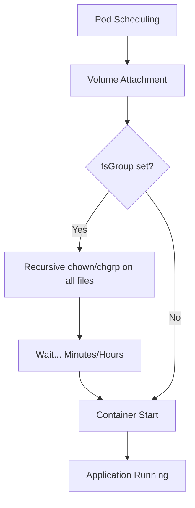

쿠버네티스(Kubernetes) 환경에서 파드(Pod)가 재시작될 때 예상치 못한 지연이 발생하는 경우가 많습니다. 특히 퍼시스트 볼륨(Persistent Volume, PV)의 파일 개수가 수백만 개 단위로 많아지면 단순한 설정 변경이나 이미지 업데이트를 위한 재시작조차 수십 분이 걸리기도 합니다. 클라우드플레어(Cloudflare)는 최근 자사 인프라에서 테라폼(Terraform) 실행 도구인 아틀란티스(Atlantis)의 재시작 시간이 30분에 달하는 문제를 해결하며 연간 600시간의 엔지니어링 리소스를 확보했습니다. 이 글에서는 쿠버네티스의 기본 동작 방식이 대규모 볼륨에서 왜 병목을 일으키는지, 그리고 단 한 줄의 설정으로 이를 어떻게 해결할 수 있는지 정리합니다.

> **한 줄 요약** — 쿠버네티스 볼륨 마운트 시 발생하는 재귀적 권한 변경(chown/chgrp) 프로세스를 `fsGroupChangePolicy` 설정을 통해 최적화하여 파드 기동 시간을 획기적으로 단축할 수 있습니다.

## 30분 동안 멈춰버린 인프라 배포 시스템
아틀란티스는 깃랩(GitLab) 머지 리퀘스트를 통해 인프라 변경 사항을 계획(Plan)하고 적용(Apply)하는 역할을 합니다. 클라우드플레어는 이를 스테이트풀셋(StatefulSet)으로 운영하며, 상태 저장을 위해 쿠버네티스 퍼시스트 볼륨을 사용합니다. 문제는 자격 증명 갱신이나 설정 변경을 위해 아틀란티스를 재시작할 때마다 발생했습니다.

파드를 재시작하면 새로운 파드가 즉시 생성되지만, 실제 컨테이너가 실행되기까지 30분이라는 긴 시간이 소요되었습니다. 이 시간 동안 모든 인프라 변경 작업은 중단되었고, 온콜(On-call) 엔지니어는 매번 허위 알람과 싸워야 했습니다. 처음에는 스토리지 엔진의 성능 문제나 네트워크 지연을 의심했지만, 문제의 원인은 훨씬 더 깊은 곳인 쿠블릿(kubelet)의 기본 동작 방식에 있었습니다.

## 볼륨 마운트의 숨겨진 병목: fsGroup
쿠버네티스에서 파드가 볼륨을 마운트할 때, 컨테이너 내부의 프로세스가 해당 볼륨에 읽기/쓰기 권한을 가질 수 있도록 보장해야 합니다. 이를 위해 `securityContext` 아래에 `fsGroup` 설정을 사용합니다. 쿠버네티스는 이 설정값이 있으면 볼륨 내의 모든 파일과 디렉터리에 대해 재귀적으로 권한 변경을 수행합니다.

볼륨에 저장된 파일이 적을 때는 이 과정이 순식간에 끝나지만, 아틀란티스처럼 수많은 테라폼 상태 파일과 캐시를 저장하여 아이노드(Inode) 사용량이 높은 경우에는 이야기가 달라집니다. 수백만 개의 파일에 대해 일일이 권한을 확인하고 수정하는 작업은 고성능 NVMe 스토리지를 사용하더라도 엄청난 시간이 걸리는 작업입니다.



위 다이어그램처럼 쿠버네티스는 컨테이너를 실행하기 전 전처리 단계에서 볼륨의 모든 파일을 훑습니다. 이 과정이 완료되기 전까지 파드는 `Init:0/1` 또는 `ContainerCreating` 상태에 머물게 되며, 쿠블릿 로그에는 컨텍스트 마감 시간 초과(context deadline exceeded) 오류가 반복적으로 찍히게 됩니다.

## 단 한 줄로 해결하는 fsGroupChangePolicy
이 문제를 해결하기 위해 쿠버네티스 1.20 버전부터(1.23 버전에서 GA) `fsGroupChangePolicy`라는 필드가 도입되었습니다. 이 설정은 볼륨의 권한을 어떤 조건에서 변경할지 결정합니다.

* `Always`: 기본값입니다. 파드가 시작될 때마다 매번 볼륨 내의 모든 파일 권한을 재귀적으로 변경합니다.
* `OnRootMismatch`: 볼륨의 루트 디렉터리 권한이 `fsGroup` 설정과 일치하지 않을 때만 권한 변경을 수행합니다. 즉, 루트 권한이 이미 올바르다면 하위 파일들을 일일이 확인하지 않고 즉시 마운트를 완료합니다.

클라우드플레어는 아틀란티스 파드 스펙에 아래와 같은 한 줄의 설정을 추가했습니다.

```yaml
spec:
  securityContext:
    fsGroup: 1000
    fsGroupChangePolicy: "OnRootMismatch"
```

이 변경 직후 30분이나 걸리던 재시작 시간은 30초로 단축되었습니다. 수백만 개의 파일을 전수 조사하던 비효율적인 프로세스를 제거한 결과입니다.

## 실무 관점에서 바라본 권한 관리의 트레이드오프
현업에서 대규모 데이터를 다루는 스테이트풀(Stateful) 애플리케이션을 운영하다 보면 이와 비슷한 상황을 자주 마주하게 됩니다. 특히 머신러닝 모델 저장소나 대규모 로그 수집 시스템처럼 작은 파일이 무수히 많이 생성되는 환경에서는 `fsGroup` 설정 하나가 시스템 전체의 가용성을 결정짓기도 합니다.

실제로 비슷한 고민을 하다 보면 무조건 `OnRootMismatch`를 쓰는 게 정답처럼 보일 수 있습니다. 하지만 여기에는 주의해야 할 트레이드오프가 존재합니다. 만약 볼륨이 마운트된 상태에서 컨테이너 외부의 프로세스가 특정 하위 디렉터리의 권한을 임의로 변경했다면, 쿠버네티스는 이를 감지하지 못합니다. 루트 디렉터리의 권한만 체크하고 넘어가기 때문입니다.

따라서 다음과 같은 상황에서는 도입을 신중히 검토해야 합니다.
* 볼륨 내의 파일 권한이 실행 중인 애플리케이션 외부 요인에 의해 수시로 변하는 경우
* 보안 요구사항이 엄격하여 매 실행 시마다 모든 파일의 소유권이 완벽하게 일치해야만 하는 경우

하지만 대부분의 일반적인 워크로드에서는 `OnRootMismatch`가 훨씬 합리적인 선택입니다. 특히 클라우드 네이티브 환경에서 파드는 언제든 죽고 다시 살아날 수 있어야 하는데, 재시작에 30분이 걸린다는 것은 사실상 고가용성(High Availability)을 포기하는 것과 다름없기 때문입니다.

## 시스템의 기본 동작에 의문을 던지는 태도
이번 사례에서 가장 인상 깊은 점은 문제 해결의 기술적 난이도보다 문제를 파헤치는 과정입니다. 대부분의 엔지니어는 파드 재시작이 느리면 "원래 볼륨이 크니까 느린가 보다"라고 생각하며 모니터링 경고 시간을 늘리거나 수동으로 대응하곤 합니다. 하지만 "왜 쿠버네티스는 볼륨을 마운트할 때 아무런 로그도 남기지 않고 멈춰 있는가?"라는 의문을 가지고 쿠블릿의 시스템 로그와 소스 코드를 추적했기에 이 한 줄의 해결책을 찾아낼 수 있었습니다.

인프라 엔지니어링에서 당연하게 여겨지는 기본값(Safe Defaults)은 보통 가장 안전한 경로를 선택하지만, 서비스 규모가 커지면 그 안전함이 오히려 독이 되어 돌아옵니다. 현재 운영 중인 서비스에서 유독 재시작이 느린 파드가 있다면 `securityContext` 설정을 다시 한번 살펴보시기 바랍니다.

## 참고 자료
- [원문] [A one-line Kubernetes fix that saved 600 hours a year](https://blog.cloudflare.com/one-line-kubernetes-fix-saved-600-hours-a-year/) — Cloudflare Blog
- [관련] [Configure a Security Context for a Pod or Container](https://kubernetes.io/docs/tasks/configure-pod-container/security-context/) — Kubernetes Documentation