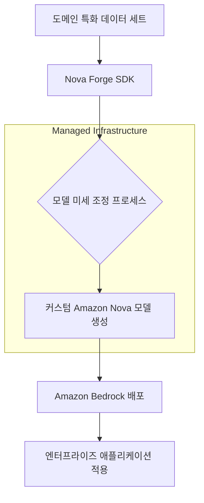

> **한 줄 요약** — AWS가 엔비디아 네모트론 3 슈퍼(NVIDIA Nemotron 3 Super) 모델을 베드록에 추가하고, EKS 가용성을 99.99%로 끌어올리며 생성형 AI와 핵심 인프라의 완성도를 동시에 높이고 있습니다.

## 생성형 AI 모델 다변화와 인프라 신뢰성 사이의 균형
최근 클라우드 기술의 흐름을 보면 생성형 AI(Generative AI) 모델의 가짓수를 늘리는 것만큼이나, 이를 뒷받침하는 인프라의 안정성을 확보하는 것이 중요해지고 있습니다. 이번 AWS 소식은 엔비디아의 고성능 모델 도입과 더불어 람다(Lambda)의 가용 영역(Availability Zone) 메타데이터 지원, EKS의 서비스 수준 합의(SLA) 상향 등 실무적으로 체감되는 업데이트가 많아 눈길을 끕니다. 단순한 기능 추가를 넘어 기업이 AI 모델을 실무 환경에 배포할 때 겪는 운영상의 제약 사항들을 해결하려는 의도가 보입니다.

현업에서 대규모 분산 시스템을 운영하다 보면 모델의 성능 못지않게 중요한 것이 관찰 가능성(Observability)과 안정적인 API 응답 속도입니다. 이번에 발표된 업데이트들은 개발자가 복잡한 인프라 관리 부담을 덜고 비즈니스 로직에 집중할 수 있도록 설계되었습니다. 특히 인프라 계층에서의 세밀한 제어권과 고성능 연산 자원에 대한 접근성이 강화된 점이 인상적입니다.

## 아마존 베드록과 인프라 성능의 비약적 향상
아마존 베드록(Amazon Bedrock)에 엔비디아 네모트론 3 슈퍼(NVIDIA Nemotron 3 Super) 모델이 합류했습니다. 이 모델은 복잡한 추론, 요약, 코드 생성에 최적화된 고성능 언어 모델로, 기존 베드록 사용자들은 별도의 인프라 구축 없이 API 호출만으로 엔비디아의 최신 모델을 활용할 수 있게 되었습니다. 또한 노바 포지 SDK(Nova Forge SDK)가 출시되어 아마존 노바(Amazon Nova) 모델을 기업의 특정 도메인 데이터에 맞춰 미세 조정(Fine-tuning)하는 과정이 훨씬 간소화되었습니다.

데이터 분석 도구인 아마존 레드시프트(Amazon Redshift)는 대시보드 및 ETL 워크로드에서 캐시되지 않은 새로운 쿼리의 실행 속도를 최대 7배까지 높였습니다. 이는 쿼리 가변성이 높은 환경에서 대기 시간을 줄여주는 실질적인 개선입니다. 인프라 측면에서는 아마존 EKS(Amazon EKS)가 프로비저닝된 컨트롤 플레인(Provisioned Control Plane) 클러스터에 대해 99.99%의 SLA를 제공하기 시작했습니다. 기존 99.95%에서 향상된 수치이며, API 서버 처리 용량을 두 배로 늘린 8XL 스케일링 티어도 도입되어 대규모 AI/ML 학습이나 고성능 컴퓨팅(HPC) 워크로드 대응이 수월해졌습니다.

아래 다이어그램은 이번에 발표된 노바 포지 SDK를 활용해 기업용 모델을 커스터마이징하고 배포하는 흐름을 보여줍니다.

서버리스 환경에서의 변화도 주목할 만합니다. AWS 람다는 이제 가용 영역(AZ) 메타데이터를 제공합니다. 이를 통해 함수가 정확히 어느 AZ에서 실행 중인지 식별할 수 있어, 지연 시간에 민감한 멀티 AZ 아키텍처를 설계할 때 디버깅과 최적화가 훨씬 정교해졌습니다.

## 실무에서 마주하는 인프라 가용성과 옵저버빌리티의 가치
EKS의 SLA가 99.99%로 상향된 점은 미션 크리티컬한 서비스를 운영하는 입장에서 상당히 반가운 소식입니다. 클라우드 환경에서 0.04%의 가용성 차이는 장애 발생 시 대응해야 하는 가용 시간 예산(Error Budget)에 큰 영향을 미칩니다. 특히 대규모 트래픽을 처리하는 서비스라면 컨트롤 플레인의 안정성이 전체 시스템의 생사로 직결되는 경우가 많습니다. 8XL 티어의 등장은 대규모 쿠버네티스 클러스터를 운영하며 API 서버 병목 현상을 겪던 엔지니어들에게 실질적인 해결책이 될 것입니다.

람다의 AZ 메타데이터 지원 역시 사소해 보이지만 실무 효율을 높여주는 도구입니다. 가용 영역 간 통신 비용이나 네트워크 지연 문제를 분석할 때, 람다 함수의 실행 위치를 추적하기 위해 별도의 로직을 짤 필요가 없어졌기 때문입니다. 데이터 주권이나 규제 준수를 위해 특정 영역 내에서의 데이터 처리를 보장해야 하는 상황에서도 유용하게 쓰일 수 있습니다.

| 주요 업데이트 항목 | 실무적 이점 | 비고 |
| :--- | :--- | :--- |
| NVIDIA Nemotron 3 Super | 인프라 관리 없이 고성능 AI 추론 가능 | Bedrock API 통합 |
| EKS 99.99% SLA | 대규모 클러스터 운영 안정성 확보 | 8XL 티어 추가 |
| Lambda AZ 메타데이터 | 멀티 AZ 아키텍처 최적화 및 디버깅 용이 | 실행 환경 정보 제공 |
| Redshift 7x 성능 향상 | 초기 쿼리 및 ETL 파이프라인 가속 | 캐시 미적용 쿼리 대상 |
| CloudWatch HTTP 프로토콜 | 에이전트 없이 로그 수집 간소화 | 표준 HTTP 엔드포인트 사용 |

아마존 코레토 26(Amazon Corretto 26)의 정식 출시도 눈여겨봐야 합니다. 자바(Java) 기반 시스템을 운영한다면 최신 언어 기능과 성능 개선 사항이 포함된 LTS(Long-Term Support) 버전을 무료로 사용할 수 있다는 점은 유지보수 비용 측면에서 큰 이점입니다. 특히 보안 패치가 포함된 안정적인 배포판을 AWS 환경에서 직접 관리해준다는 신뢰가 큽니다.

## 변화하는 클라우드 환경에 대응하는 자세
클라우드 서비스의 변화 속도가 빠를수록 도구 자체의 화려함보다는 그 도구가 해결하려는 근본적인 문제에 집중해야 합니다. 엔비디아 네모트론 모델을 사용해 보고 싶다면 베드록의 플레이그라운드에서 직접 테스트해 보며 우리 서비스의 도메인에 맞는지 먼저 검증하는 것이 좋습니다. 또한 EKS를 사용 중이라면 현재 클러스터의 규모와 확장 계획에 맞춰 프로비저닝된 컨트롤 플레인 도입을 고려해 볼 시점입니다.

아마존 클라우드워치 로그(Amazon CloudWatch Logs)가 HTTP 기반 프로토콜을 지원하게 된 점도 놓치지 말아야 합니다. 별도의 에이전트 설치가 어려운 환경이나 소규모 컨테이너 서비스에서 로그를 중앙으로 수집할 때 아키텍처를 매우 단순하게 가져갈 수 있습니다. 인프라를 복잡하게 만드는 요소를 하나씩 걷어내는 것이 결국 운영 비용을 줄이는 핵심입니다.

지금 당장 해볼 수 있는 것은 사용 중인 람다 함수에 AZ 메타데이터를 로그로 남겨보는 일입니다. 이를 통해 실제 서비스 트래픽이 가용 영역별로 어떻게 분산되고 있는지, 특정 영역에서 지연 시간이 발생하는지 시각화하는 작업부터 시작해 보시길 권합니다.

## 참고 자료
- [원문] [AWS Weekly Roundup: NVIDIA Nemotron 3 Super on Amazon Bedrock, Nova Forge SDK, Amazon Corretto 26, and more (March 23, 2026)](https://aws.amazon.com/blogs/aws/aws-weekly-roundup-nvidia-nemotron-3-super-on-amazon-bedrock-nova-forge-sdk-amazon-corretto-26-and-more-march-23-2026/) — AWS Blog
- [관련] AWS Weekly Roundup: Amazon S3 turns 20, Amazon Route 53 Global Resolver general availability, and more (March 16, 2026) — AWS Blog