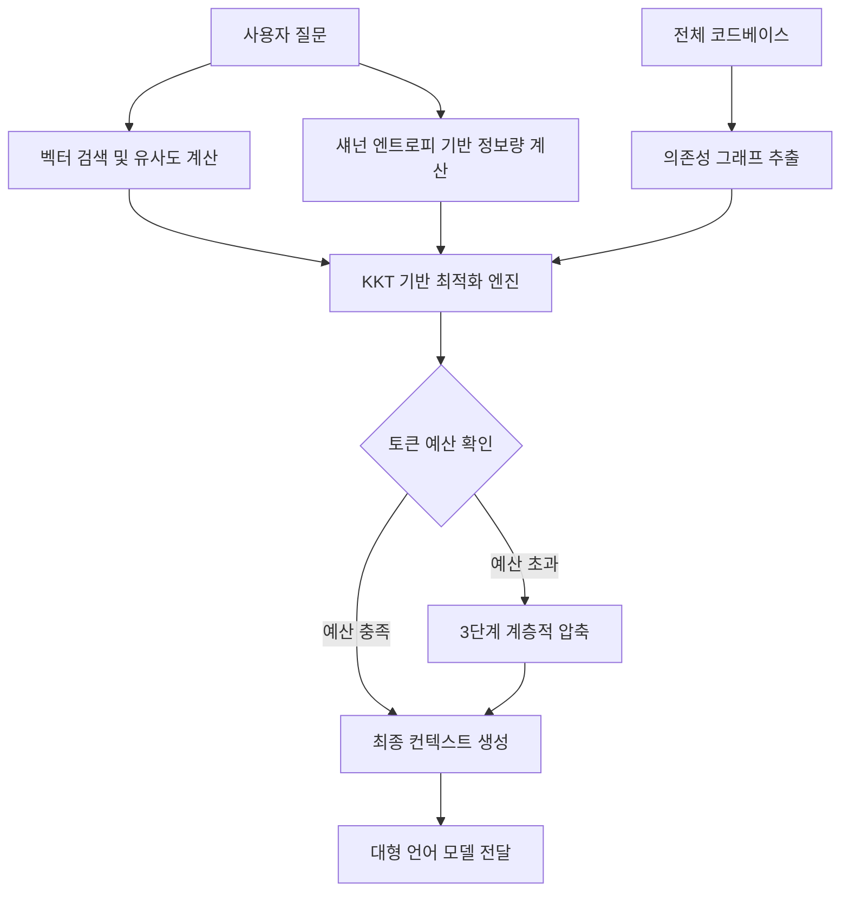

단순한 벡터 검색 기반의 RAG를 넘어 정보 이론과 최적화 알고리즘으로 AI 컨텍스트를 재구성하여, API 비용은 78% 줄이면서도 AI가 전체 코드베이스를 이해하게 만든 기술적 여정을 다룹니다.

## Cursor는 왜 내 코드의 절반도 이해하지 못할까

AI 코드 어시스턴트를 사용하다 보면 분명히 존재하는 함수나 설정 파일인데도 AI가 모른다고 답하거나 엉뚱한 코드를 제안하는 상황을 자주 마주합니다. 이는 현재 대부분의 도구가 사용하는 컨텍스트 주입 방식의 한계 때문입니다. 보통 사용자가 질문을 던지면 질문과 가장 유사한 파일 몇 개를 벡터 검색(Vector Search)으로 찾아내고, 이를 대형 언어 모델(LLM)의 컨텍스트 윈도우(Context Window)에 채워 넣습니다.

이 과정에서 선택받지 못한 95% 이상의 코드는 AI에게 보이지 않는 암흑 영역이 됩니다. 데이터베이스 스키마, 복잡한 미들웨어 로직, 공통 유틸리티 함수 등이 누락되면 AI는 반쪽짜리 정보로 추론을 시작합니다. 결국 개발자는 부족한 맥락을 채워주기 위해 수동으로 파일을 열어 전달하거나, 불필요하게 많은 토큰을 소모하며 비용을 낭비하게 됩니다.

이 문제를 해결하기 위해 등장한 개념이 컨텍스트 엔지니어링 엔진인 Entroly입니다. 검색(Search)의 관점이 아니라 주어진 토큰 예산 안에서 정보량을 극대화하는 최적화(Optimization)의 관점으로 접근한 것이 특징입니다.

## Shannon Entropy를 이용한 정보 밀도 측정

코드베이스의 모든 조각이 동일한 가치를 가지지는 않습니다. 반복되는 임포트(Import) 구문이나 뻔한 보일러플레이트(Boilerplate)는 정보 밀도가 낮습니다. 반면 복잡한 비즈니스 로직이나 고유한 알고리즘이 담긴 구간은 정보 밀도가 높습니다. Entroly는 이를 수학적으로 측정하기 위해 섀넌 엔트로피(Shannon Entropy) 공식을 도입했습니다.

$$H(X) = -\sum p(x_i) \log_2 p(x_i)$$

이 수식을 통해 각 코드 파편의 정보량을 계산합니다. 확률 $p(x_i)$가 높은, 즉 자주 등장하는 패턴은 낮은 엔트로피를 가집니다. 반대로 희귀하고 복잡한 구조는 높은 엔트로피를 가집니다. 여기에 파일의 최신 수정 여부(Recency)와 접근 빈도(Frequency), 그리고 현재 질문과의 의미적 연관성을 결합하여 최종 점수를 산출합니다. 단순히 유사한 코드를 찾는 게 아니라, AI에게 정말로 새로운 정보를 줄 수 있는 코드를 우선순위에 두는 방식입니다.

## 코드 의존성 그래프와 최적화 알고리즘

코드는 서로 독립적이지 않습니다. 특정 API 엔드포인트 로직을 이해하려면 해당 로직이 호출하는 모델 정의와 인증 미들웨어를 반드시 알아야 합니다. Entroly는 코드 간의 수입(Import) 관계, 함수 호출 체인, 타입 참조 등을 분석하여 거대한 의존성 그래프(Dependency Graph)를 생성합니다.

특정 코드 조각이 선택되면 그와 연결된 의존성 노드들의 가중치를 자동으로 높입니다. 이는 알고리즘적으로 그래프 제약 배낭 문제(Graph-constrained Knapsack Problem)에 해당하며, 일반적으로 해결하기 매우 까다로운 NP-hard 문제입니다. Entroly는 이를 해결하기 위해 KKT(Karush-Kuhn-Tucker) 조건을 활용한 이분법(Bisection) 최적화 기법을 사용하여 10ms 이내의 짧은 시간에 최적의 컨텍스트 조합을 찾아냅니다.

## 비용을 극적으로 줄이는 3단계 계층적 압축

모든 파일을 전체 소스 코드로 전달할 필요는 없습니다. Entroly는 토큰 예산 배분에 따라 세 가지 수준으로 정보를 압축합니다.

1. L1 스켈레톤 맵(Skeleton Map): 전체 예산의 5%를 사용하여 프로젝트 전체 구조를 전달합니다. 어떤 파일에 어떤 클래스와 함수가 있는지 이름만 나열합니다.
2. L2 확장 시그니처(Expanded Signatures): 예산의 25%를 할당하여 의존성이 있는 파일의 함수 시그니처와 매개변수 타입을 포함합니다.
3. L3 풀 소스(Full Source): 가장 핵심적인 70%의 예산을 사용하여 질문과 직접 연관된 로직의 전체 코드를 전달합니다.

이 방식을 사용하면 AI는 수백 개의 파일로 구성된 프로젝트 전체의 윤곽을 잡으면서도, 현재 수정해야 할 부분은 세밀하게 들여다볼 수 있습니다. 결과적으로 무조건 전체 파일을 밀어 넣을 때보다 토큰 사용량을 78%나 절감할 수 있었습니다.

## 실제 도입 시 고려해야 할 트레이드오프

실무에서 이런 엔진을 도입할 때 가장 먼저 고민되는 지점은 분석 오버헤드입니다. 코드베이스가 커질수록 의존성 그래프를 그리고 엔트로피를 계산하는 과정 자체가 리소스를 잡아먹을 수 있습니다. Entroly가 Rust로 작성되어 10ms 미만의 성능을 내는 이유도 여기에 있습니다. 파이썬(Python) 같은 인터프리터 언어로 구현했다면 컨텍스트를 구성하는 시간 자체가 길어져 개발 경험을 해쳤을 것입니다.

또한, 수학적으로 최적화된 컨텍스트가 반드시 AI의 정답률을 보장하는지는 별개의 문제입니다. 정보 밀도가 높다고 해서 반드시 문제 해결에 직결되는 정보는 아닐 수 있기 때문입니다. 이를 보완하기 위해 Entroly는 AI의 답변 결과를 바탕으로 각 코드 조각이 정답에 얼마나 기여했는지 Shapley 가치를 계산하여 가중치를 업데이트하는 학습 메커니즘을 포함하고 있습니다. 이는 마치 검색 엔진이 클릭률을 기반으로 랭킹을 조정하는 것과 유사합니다.

현업에서 복잡한 마이크로서비스 아키텍처(MSA)를 다루다 보면 서비스 간 호출 관계를 파악하는 것만으로도 한참이 걸립니다. 이런 도구가 서비스 경계를 넘어 인터페이스 정의서나 설정 파일까지 적절히 요약해서 AI에게 전달해 준다면, 단순한 코드 작성을 넘어 시스템 설계 관점의 조언도 얻을 수 있을 것으로 보입니다.

## 실무적 시각에서 본 컨텍스트의 가치

최근 n8n 같은 도구로 워크플로우를 자동화하는 사례를 보면, 결국 핵심은 데이터를 얼마나 잘 정제해서 다음 단계로 넘기느냐에 있습니다. AI 코드 어시스턴트도 마찬가지입니다. 모델의 성능(Parameter) 경쟁은 이미 임계치에 도달하고 있고, 이제는 모델에게 무엇을 먹일 것인가 하는 데이터 전처리와 컨텍스트 구성의 싸움이 되었습니다.

실제로 비슷한 고민을 하다 보면 무조건 최신 모델, 가장 큰 컨텍스트 윈도우를 가진 모델을 찾는 경향이 있습니다. 하지만 이는 마치 공부할 범위를 정하지 못해 교과서 전체를 통째로 외우려는 전략과 같습니다. Entroly가 보여준 방식처럼 핵심 정보만 골라내고 나머지는 요약본으로 전달하는 전략은 인프라 비용 관리 측면에서 매우 현실적인 대안입니다.

특히 API 호출 비용이 예산의 큰 비중을 차지하는 조직이라면, 무작정 비싼 모델을 쓰기 전에 우리 코드베이스에서 어떤 파일이 정보 가치가 높은지부터 분류해 볼 필요가 있습니다.

## 요약과 제언

기술 블로그나 오픈 소스 프로젝트에서 흔히 볼 수 있는 단순한 튜토리얼 수준을 넘어, 정보 이론이라는 근본적인 원리를 실무적인 비용 절감 문제에 연결한 지점이 인상적입니다. 이 접근법의 핵심은 다음과 같습니다.

- Shannon Entropy를 통한 코드의 정보 밀도 정량화
- 의존성 그래프를 활용한 컨텍스트 간 관계성 확보
- 계층적 압축을 통한 토큰 예산의 효율적 배분
- 결과 피드백을 통한 가중치 자동 튜닝

지금 바로 본인의 프로젝트에 적용해 보고 싶다면, 모든 파일을 AI에게 던지기 전에 `cloc` 같은 도구로 코드 복잡도를 측정해 보거나 의존성 시각화 도구로 전체 구조를 먼저 파악해 보길 권합니다. AI에게 무엇을 보여줄지 결정하는 권한은 여전히 개발자에게 있으며, 그 선택의 질이 결과물의 질을 결정합니다.

## 참고 자료
- [원문] [How We Cut Our AI API Bill by 78% (And Let Cursor See Our Entire Codebase)](https://dev.to/ashu_578bf1ca5f6b3c112df8/how-we-built-a-context-engine-that-makes-ai-code-assistants-see-your-entire-codebase-3076) — DEV Community
- [관련] How I Automated Lead Follow-Up for Local Businesses with n8n + AI — DEV Community
- [관련] I Stopped Running From DSA. Here’s How I’m Hacking My Brain to Learn It in C++ — DEV Community