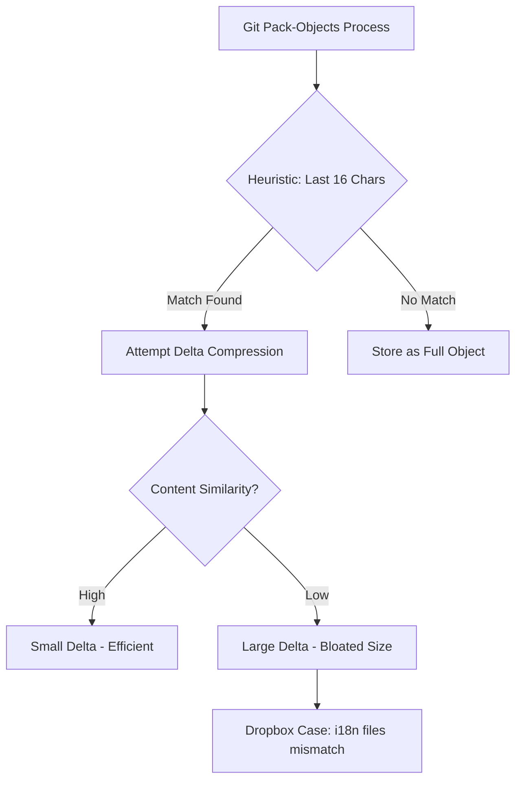

> **한 줄 요약** — Git의 델타 압축 메커니즘과 디렉토리 구조의 상관관계를 파악하여 87GB에 달하던 모노레포 크기를 20GB로 줄이고 개발 생산성을 극대화한 사례입니다.

## 이 주제를 꺼낸 이유

모노레포(Monorepo) 전략을 채택한 팀이라면 누구나 한 번쯤 저장소 크기 문제로 고민하게 됩니다. 코드가 늘어날수록 `git clone` 속도는 느려지고, CI/CD 파이프라인의 전체 실행 시간 중 상당 부분이 소스 코드를 내려받는 데 소비되기 때문입니다.

Dropbox는 거의 모든 서버 코드를 하나의 거대한 모노레포에서 관리합니다. 하지만 이 저장소가 87GB까지 커지면서 신규 입사자가 환경을 구축하는 데만 1시간 넘게 걸리는 상황이 발생했습니다. 심지어 GitHub Enterprise Cloud의 저장소 용량 제한인 100GB에 육박하며 운영상의 위기까지 맞이했습니다.

단순히 오래된 파일을 삭제하는 수준을 넘어, Git이라는 도구가 데이터를 내부적으로 어떻게 압축하고 저장하는지 깊게 파고들어 문제를 해결한 과정이 인상 깊었습니다. 실무에서 대규모 코드베이스를 다루는 엔지니어들에게 이 사례는 도구의 내부 동작 원리를 이해하는 것이 얼마나 중요한지 잘 보여줍니다.

## 왜 모노레포 크기가 폭발적으로 증가했을까?

Dropbox 엔지니어링 팀은 처음에는 대용량 바이너리 파일이나 불필요한 의존성 파일이 범인일 것이라고 예상했습니다. 하지만 조사 결과, 실제 원인은 Git의 델타 압축(Delta Compression) 방식과 Dropbox의 국제화(i18n) 파일 디렉토리 구조 사이의 충돌에 있었습니다.

Git은 모든 파일의 전체 복사본을 저장하지 않습니다. 비슷한 파일들 사이의 차이점인 델타(Delta)만 저장하여 용량을 아낍니다. 이때 Git은 어떤 파일들이 서로 비슷한지 판단하기 위해 특정 휴리스틱(Heuristic)을 사용하는데, 기본적으로 파일 경로의 마지막 16글자를 기준으로 삼습니다.

Dropbox의 번역 파일 구조는 다음과 같았습니다.
- `i18n/metaserver/ko/LC_MESSAGES/messages.po`
- `i18n/metaserver/en/LC_MESSAGES/messages.po`

위 경로에서 마지막 16글자를 추출하면 두 파일 모두 `GES/messages.po`와 같은 식이 됩니다. 국가 코드는 경로 중간에 위치하기 때문에 Git은 서로 다른 언어의 파일을 비슷한 파일로 오인하여 델타를 계산하려 시도했습니다. 결과적으로 압축 효율이 극도로 떨어지며 저장소 크기가 비정상적으로 커진 것입니다.



이 문제를 해결하기 위해 팀은 `--path-walk`라는 실험적인 플래그를 검토했습니다. 이 방식은 경로의 끝부분만 보는 대신 전체 디렉토리 구조를 탐색하며 비슷한 파일을 찾습니다. 로컬 테스트 결과 저장소 크기가 80GB대에서 20GB대로 즉각 줄어드는 효과를 확인했습니다.

하지만 GitHub 서버 환경에서는 이 플래그가 비트맵(Bitmaps)이나 델타 아일랜드(Delta Islands) 같은 기존 최적화 기능과 충돌하는 문제가 있었습니다. 결국 GitHub 지원 팀과 협력하여 서버 측에서 더 공격적인 `repack` 파라미터를 적용하는 방향으로 선회했습니다.

```bash
# 로컬 테스트에서 사용된 공격적인 리팩 설정
# window와 depth 값을 높여 더 깊고 넓게 비슷한 오브젝트를 탐색함
$ git repack -adf --depth=250 --window=250
```

이 설정으로 약 9시간 동안 리팩 작업을 수행한 결과, 운영 중인 모노레포의 크기를 87GB에서 20GB로 77% 감소시켰습니다. 클론 시간 역시 15분 이내로 단축되며 개발자 속도(Developer Velocity)가 비약적으로 향상되었습니다.

## Git의 내부 메커니즘을 알아야 하는 이유

현업에서 대규모 시스템을 운영하다 보면 추상화된 도구 뒤편의 동작 원리가 성능의 병목이 되는 순간을 자주 마주합니다. Git은 우리에게 공기처럼 당연한 도구지만, 그 내부의 `pack-objects`가 어떻게 동작하는지까지 고민하며 개발하는 경우는 드뭅니다.

이번 사례에서 가장 흥미로운 지점은 디렉토리 구조라는 컨벤션이 인프라 비용과 직결될 수 있다는 사실입니다. 단순히 관리하기 편하다는 이유로 정한 폴더 구조가 Git의 압축 알고리즘과 상성이 맞지 않아 수십 기가바이트의 낭비를 초래했습니다. 이는 코드 스타일이나 아키텍처 결정이 시스템 하위 계층에 어떤 영향을 줄지 항상 염두에 두어야 함을 시사합니다.

실제로 이런 상황에서는 단순히 더 좋은 서버를 쓰거나 네트워크 대역폭을 늘리는 방식으로 대응하기 쉽습니다. 하지만 원인을 정확히 파악하지 못하면 밑 빠진 독에 물 붓기가 됩니다. Dropbox 팀이 문제를 해결한 방식처럼, 도구의 한계를 파악하고 서비스 제공자(GitHub)와 긴밀히 협력하여 해결책을 찾아내는 과정이 진정한 시니어 엔지니어링이라고 생각합니다.

또한, 모노레포의 크기 관리는 단순한 저장 공간 절약을 넘어 CI 캐시 전략과도 밀접하게 연결됩니다. 저장소가 무거워질수록 캐시를 업로드하고 다운로드하는 비용이 커지며, 이는 결국 전체 배포 사이클을 늦추는 결과로 이어집니다. 87GB에서 20GB로의 다이어트는 단순히 숫자의 변화가 아니라, 매일 수백 번씩 돌아가는 CI 파이프라인 전체의 효율을 개선한 셈입니다.

다만 이러한 공격적인 리팩 작업에는 트레이드오프(Trade-off)가 따릅니다. `window`와 `depth` 값을 높이면 압축률은 좋아지지만, 리팩 과정에서 CPU와 메모리 소모가 극심해집니다. 또한 너무 깊은 델타 체인은 나중에 특정 오브젝트를 읽어올 때 계산 비용을 높여 오히려 성능을 저하시킬 위험도 있습니다. Dropbox가 프로덕션에 적용하기 전 미러 저장소에서 충분히 검증하고 단계적으로 배포한 이유도 여기에 있습니다.

## 대규모 모노레포 운영을 위한 제언

성장하는 조직에서 모노레포는 피할 수 없는 선택인 경우가 많습니다. 하지만 관리가 동반되지 않는 모노레포는 개발 생산성을 갉아먹는 괴물이 됩니다. 이번 사례를 통해 우리가 실무에 적용해볼 수 있는 관점은 명확합니다.

첫째, Git 저장소의 크기 변화를 지속적으로 모니터링해야 합니다. 특정 시점에 용량이 급증했다면 단순히 코드가 늘어난 것인지, 아니면 압축 효율이 떨어지는 바이너리나 중복 데이터가 유입된 것인지 확인이 필요합니다.

둘째, 디렉토리 구조를 설계할 때 Git의 특성을 고려해야 합니다. 비슷한 내용의 파일들이 서로 다른 경로에 흩어져 있다면 Git은 이를 효과적으로 압축하지 못할 수 있습니다. 특히 자동 생성되는 코드나 번역 파일처럼 양이 많은 데이터일수록 더욱 주의가 필요합니다.

셋째, 플랫폼의 한계를 미리 파악해야 합니다. GitHub나 GitLab 같은 호스팅 서비스가 제공하는 하드 리밋(Hard Limit)을 미리 체크하고, 그 임계치에 도달하기 전에 선제적인 최적화를 진행해야 합니다. 임계치에 도달한 후에는 대응할 수 있는 선택지가 급격히 줄어들기 때문입니다.

결국 기술적 성숙도란 내가 사용하는 도구가 마법처럼 모든 것을 해결해줄 것이라 믿지 않고, 그 도구가 가진 한계와 작동 원리를 명확히 이해하는 데서 시작됩니다. 여러분의 저장소는 지금 건강한 상태인가요? `git count-objects -v` 명령어로 한 번쯤 확인해보는 것을 추천합니다.

## 참고 자료
- [원문] [Reducing our monorepo size to improve developer velocity](https://dropbox.tech/infrastructure/reducing-our-monorepo-size-to-improve-developer-velocity) — Dropbox Tech
- [관련] Self-Hosted File Servers: From FTP to WebDAV to Cloud-Native — DEV Community