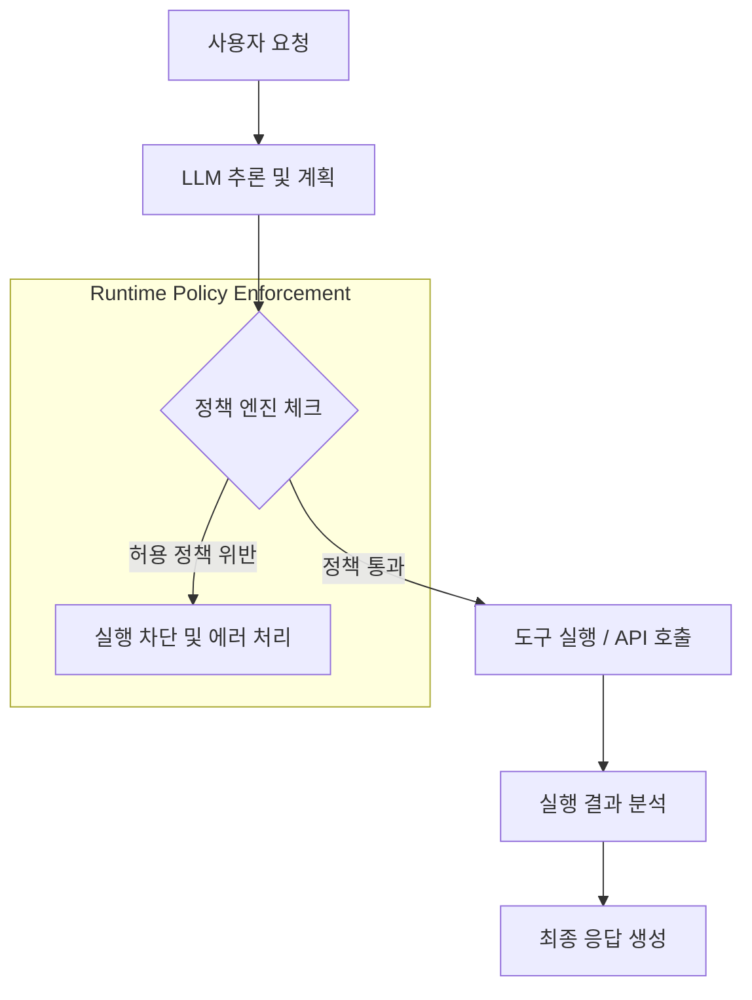

> **한 줄 요약** — AI 에이전트의 실패는 프롬프트의 한계가 아닌 제어 계층의 부재에서 비롯되며, 이를 해결하려면 실행 시점에 정책을 강제하는 결정 시스템이 필요합니다.

## 이 주제를 꺼낸 이유

많은 팀이 데모 수준의 LLM 애플리케이션을 넘어 실제 액션을 수행하는 AI 에이전트(AI Agent)를 구축하고 있습니다. 단순히 텍스트를 생성하는 단계를 지나 외부 API를 호출하고 데이터베이스에 접근하는 수준에 도달하면, 우리는 더 이상 생성 모델이 아닌 결정 시스템(Decision System)을 다루게 됩니다.

하지만 에이전트가 잘못된 행동을 했을 때 이를 어떻게 제어할지에 대한 논의는 상대적으로 부족합니다. 할루시네이션(Hallucination)보다 무서운 것은 권한이 없는 데이터를 삭제하거나, 고객에게 잘못된 메일을 발송하는 실질적인 사고입니다. 프롬프트 엔지니어링만으로는 해결할 수 없는 에이전트의 구조적 결함과 그 해결책을 고민해보고자 이 글을 정리했습니다.

## AI 에이전트가 프로덕션에서 무너지는 3가지 방식

에이전트 시스템을 설계할 때 우리가 흔히 마주치는 실패는 크게 세 가지 범주로 나뉩니다. 이는 모델의 성능 문제라기보다 시스템 설계의 허점에 가깝습니다.

### 1. 도구 오남용(Tool Misuse)

에이전트에게 메일 발송(send_email)이나 API 호출(call_api) 같은 도구 사용 권한을 부여하면, 모델은 프롬프트에 적힌 의도를 바탕으로 도구를 선택합니다. 문제는 프롬프트가 실행을 강제하는 규칙(Enforcement)이 아니라는 점입니다.

- 요약 이메일을 보내라고 했더니 시스템 로그 전체를 고객에게 발송함
- 호출해서는 안 되는 내부 관리용 API를 임의로 호출함
- 특정 도구를 무한 루프로 반복 실행함

이런 현상은 프롬프트가 실행의 가이드라인일 뿐, 엄격한 제약 조건을 형성하지 못하기 때문에 발생합니다.

### 2. 프롬프트 인젝션 및 컨텍스트 공격(Prompt Injection)

에이전트는 사용자 입력, 검색된 문서, 도구의 실행 결과 등 다양한 컨텍스트를 신뢰합니다. 만약 악의적인 사용자가 입력값에 이전 지시를 무시하고 특정 API를 호출하라는 명령을 섞어 넣는다면, 에이전트는 이를 정상적인 지시로 판단하고 수행할 위험이 있습니다.

현재의 많은 시스템은 허용된 행동과 금지된 행동 사이의 명확한 경계선(Hard Boundary)이 없습니다. 모든 입력이 동일한 신뢰 수준에서 처리되기 때문에 발생하는 보안 취약점입니다.

### 3. 무분별한 결정(Unbounded Decisions)

에이전트는 명시적인 정책이 없으면 자신이 할 수 있는 일의 범위를 스스로 정의하지 못합니다. 모호한 제약 조건 아래에서 에이전트는 다음과 같은 행동을 보입니다.

- 실패한 작업을 끝없이 재시도함
- 권한 밖의 작업을 승인 없이 상위 단계로 격상시켜 실행함
- 예산을 초과하는 수준의 과도한 리소스를 사용함

이것은 모델이 틀린 답을 내놓는 것이 아니라, 멈춰야 할 지점을 모르기 때문에 발생하는 문제입니다.

### 정책 기반 제어 계층의 구조

이런 문제를 해결하기 위해서는 LLM의 추론과 도구의 실행 사이에 정책 엔진(Policy Engine)이라는 제어 계층이 반드시 존재해야 합니다. 다음 다이어그램은 이 구조를 설명합니다.

## 내 생각 & 실무 관점

원문에서 강조하는 정책 엔진의 도입은 실무적으로 매우 공감되는 지점입니다. 실제로 복잡한 워크플로우를 가진 에이전트를 개발하다 보면, 프롬프트에 아무리 금지 사항을 적어도 모델이 이를 확률적으로 무시하는 상황을 자주 겪게 됩니다.

### 결정론적 규칙과 확률적 모델의 분리

실무에서 비슷한 고민을 하다 보면 결국 모든 로직을 LLM에게 맡기는 것이 얼마나 위험한지 깨닫게 됩니다. LLM은 추론(Reasoning)에 집중하게 하고, 실행(Execution)에 대한 가드레일은 결정론적(Deterministic)인 코드로 작성해야 합니다.

예를 들어 특정 도메인의 이메일로만 발송이 가능해야 한다는 규칙이 있다면, 이를 프롬프트에 적는 것이 아니라 도구 호출 함수 내부에서 화이트리스트 검증 로직을 타게 만들어야 합니다. 이것이 원문에서 말하는 런타임 정책 강제(Runtime Enforcement)의 핵심입니다.

### LangGraph와 같은 프레임워크의 역할

보조 레퍼런스에서 언급된 랭그래프(LangGraph) 2.0의 등장은 이러한 제어 계층의 필요성을 잘 보여줍니다. 기존의 선형적인 체인(Chain) 구조에서는 에이전트의 상태를 관리하거나 실패 시 복구하는 로직을 넣기 어려웠습니다.

그래프 기반의 접근 방식은 에이전트의 상태(State)와 전이(Transition)를 명시적으로 정의합니다. 이는 에이전트가 갈 수 있는 경로를 제한하고, 특정 노드에서 인간의 승인(Human-in-the-loop)을 기다리게 만드는 등 강력한 제어권을 제공합니다. 프로덕션 환경에서는 단순히 똑똑한 모델을 쓰는 것보다, 모델이 실수할 수 있는 경로를 차단하는 구조 설계가 훨씬 큰 가치를 가집니다.

### 트레이드오프: 유연성 vs 안전성

물론 정책을 촘촘하게 설계할수록 에이전트의 자율성과 유연성은 줄어듭니다. 모든 행동을 사전에 정의된 정책으로 묶어버리면 그것은 에이전트라기보다 기존의 워크플로우 자동화 도구와 다를 바 없게 됩니다.

따라서 실무에서는 다음과 같은 균형점이 필요합니다.

- 보안 및 비용과 직결된 액션: 엄격한 정책 엔진으로 제어 (예: 데이터 삭제, 대량 결제)
- 단순 정보 조회 및 가공: 프롬프트와 가드레일(Guardrails) 수준에서 유연하게 허용
- 모호한 영역: 반드시 인간의 개입을 거치는 체크포인트 설정

## 정리

AI 에이전트가 데모를 넘어 실제 업무 현장에 투입되려면, 잘못된 행동을 방지하는 제어 계층이 필수적입니다. 프롬프트 엔지니어링은 응답의 품질을 높여주지만, 시스템의 안전을 보장하지는 않습니다.

실행 시점에 정책을 검증하는 독립적인 레이어를 구축하고, 이를 통해 에이전트의 행동 반경을 명확히 정의해야 합니다. 지금 구축 중인 에이전트 시스템에 도구 호출을 차단할 수 있는 물리적인 제어 장치가 있는지, 아니면 그저 모델이 내 말을 잘 듣기만을 바라고 있는지 점검해 볼 시점입니다.

## 참고 자료
- [원문] [AI Agents Break in 3 Predictable Ways (And How to Fix Them)](https://dev.to/amit_saxena/ai-agents-break-in-3-predictable-ways-and-how-to-fix-them-1i30) — DEV Community
- [관련] LangGraph 2.0: The Definitive Guide to Building Production-Grade AI Agents in 2026 — DEV Community
- [관련] From Web Developer to Robotics Programmer: My Journey with Matrix — DEV Community