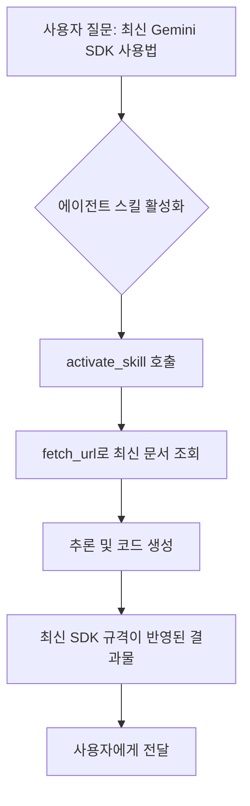

> **한 줄 요약** — LLM의 고정된 학습 데이터와 빠르게 변하는 소프트웨어 생태계 사이의 지식 격차를 해결하기 위해, 최신 문서와 SDK 가이드를 실시간으로 연결하는 에이전트 스킬(Agent Skills)의 효용성을 확인했습니다.

## 이 주제를 꺼낸 이유

대규모 언어 모델(LLM)을 활용해 코드를 작성하다 보면 가장 먼저 마주치는 장벽이 있습니다. 모델이 학습된 시점 이후에 출시된 라이브러리나 업데이트된 API 사양을 제대로 반영하지 못한다는 점입니다. 분명 최신 기술인데 모델은 이미 지원이 중단된 구형 방식을 제안하거나, 존재하지 않는 매개변수를 꾸며내기도 합니다.

이런 지식 격차(Knowledge Gap)는 단순히 모델의 성능 문제를 넘어 개발 생산성을 갉아먹는 요소가 됩니다. 실무에서는 이를 해결하기 위해 검색 엔진을 연동하거나 복잡한 검색 증강 생성(RAG, Retrieval-Augmented Generation) 시스템을 구축하곤 하지만, 구축 비용과 관리 부담이 만만치 않습니다.

구글 딥마인드(Google DeepMind)에서 발표한 에이전트 스킬(Agent Skills) 접근법은 이 지식 격차를 매우 가볍고 효과적으로 메울 수 있는 실무적인 대안을 제시합니다. 특히 모델의 추론 능력을 활용해 최신 소스 오브 트루스(Source of Truth)를 스스로 찾아가게 만드는 방식은 현업 개발자들에게 시사하는 바가 큽니다.

## 핵심 내용 정리

에이전트 스킬은 모델에게 특정 도메인에 대한 최신 정보를 탐색하고 활용하는 법을 가르치는 경량 지침서입니다. 이번에 공개된 Gemini API 개발자 스킬은 모델이 스스로 최신 SDK 사양과 모델 리스트를 파악하도록 돕습니다.

### 에이전트 스킬의 구성 요소

이 스킬은 단순히 정보를 나열하는 것이 아니라, 에이전트가 동작하는 방식을 정의하는 네 가지 핵심 요소를 포함합니다.

- API의 고수준 기능 설명
- 각 언어별 현재 모델 및 SDK 정보
- 각 SDK에 대한 기초 샘플 코드
- 최신 정보를 얻을 수 있는 공식 문서 진입점(Entry Points)

이러한 지침은 모델이 낡은 지식에 의존하는 대신, 필요할 때마다 실시간으로 문서를 가져오도록(Fetch) 유도합니다.

### 성능 향상 수치

구글은 117개의 프롬프트를 활용해 파이썬(Python)과 타입스크립트(TypeScript) 코드 생성 능력을 테스트했습니다. 결과는 놀라웠습니다.

| 모델 버전 | 기본 성공률 (Vanilla) | 스킬 적용 후 성공률 |
| :--- | :--- | :--- |
| gemini-3.1-pro-preview | 28.2% | 96.6% |
| gemini-3.0-pro | 6.8% | 90% 이상 |
| gemini-3.0-flash | 6.8% | 90% 이상 |

가장 최신 모델인 3.1 Pro 버전의 경우, 스킬을 적용하는 것만으로 성공률이 약 3.4배 상승했습니다. 이는 모델 자체의 파라미터를 업데이트하지 않고도 지식의 유효 기간을 실시간으로 갱신할 수 있음을 증명합니다.

### 에이전트 스킬 동작 프로세스

## 내 생각 & 실무 관점

원문에서 강조하는 핵심은 모델의 성능보다 모델의 추론(Reasoning) 능력과 스킬의 결합입니다. 실험 결과를 보면 구형 모델인 2.5 시리즈도 스킬의 도움을 받아 성능이 올랐지만, 최신 3 시리즈만큼의 폭발적인 상승은 보여주지 못했습니다. 이는 아무리 좋은 매뉴얼(스킬)을 줘도 그것을 해석하고 실행할 지능이 뒷받침되어야 한다는 점을 시사합니다.

### 실무에서 겪는 지식 파편화 문제

현업에서 외부 라이브러리를 적극적으로 사용하는 프로젝트를 진행하다 보면, 어제의 베스트 프랙티스(Best Practice)가 오늘의 안티 패턴이 되는 경우가 허다합니다. 특히 클라우드 SDK나 AI 프레임워크처럼 변화가 빠른 분야에서는 더욱 그렇습니다.

실제로 이런 상황에서는 개발자가 일일이 공식 문서를 확인하며 AI가 짠 코드를 수정해야 합니다. 하지만 에이전트 스킬처럼 모델이 스스로 문서를 읽어오게 만드는 도구(Tool)를 내장한다면, 휴먼 에러를 줄이고 검토 시간을 획기적으로 단축할 수 있습니다.

### 트레이드오프: 단순함 vs 최신성

에이전트 스킬의 가장 큰 장점은 단순함입니다. 복잡한 벡터 데이터베이스를 구축할 필요 없이 시스템 프롬프트와 몇 가지 도구 호출(Tool Calling)만으로 구현이 가능합니다. 하지만 원문에서도 지적하듯이 관리의 숙제가 남습니다.

- 스킬 업데이트의 수동성: 현재는 사용자가 스킬을 수동으로 업데이트해야 합니다. 로컬 워크스페이스에 오래된 스킬 정보가 남아있다면 오히려 잘못된 가이드를 제공할 위험이 있습니다.
- 모델 컨텍스트 비용: 스킬 정보와 문서 내용을 컨텍스트에 포함할수록 토큰 사용량이 늘어나고 비용이 증가합니다.

현업에서 도입을 고민한다면 모든 지식을 스킬로 넣기보다는, 모델 컨텍스트 프로토콜(MCP, Model Context Protocol) 서버를 구축해 동적으로 최신 문서를 서빙하는 방식과 병행하는 것이 현실적입니다.

### 생각의 순환(Thought Circulation)과 에이전트의 자율성

원문에서 언급된 생각의 순환(Thought Circulation) 같은 최신 기법이 모델에 내재되어 있을 때 에이전트 스킬은 더 큰 힘을 발휘합니다. 에이전트가 단순히 코드를 생성하는 것을 넘어, 자신이 생성한 코드가 최신 문서의 규격과 맞는지 스스로 검증하는 루프를 돌 수 있기 때문입니다.

실제로 비슷한 고민을 하다 보면 결국 AI에게 얼마나 많은 권한을 줄 것인가로 귀결됩니다. 에이전트 스킬은 AI에게 정보를 찾는 지도와 돋보기를 쥐여주는 것과 같습니다. 지도가 낡았다면 돋보기로 실제 지형(실시간 문서)을 확인하게 만드는 논리 구조가 핵심입니다.

## 정리

LLM의 지식 격차는 모델 학습의 한계로 인해 발생하는 필연적인 현상입니다. 하지만 구글의 사례처럼 에이전트 스킬이라는 가벼운 레이어를 추가함으로써 이를 96% 이상의 정확도로 해결할 수 있다는 점은 매우 고무적입니다.

중요한 것은 모델이 모든 것을 알기를 기대하는 것이 아니라, 모델이 모르는 것을 어디서 찾아야 할지 알려주는 구조를 설계하는 능력입니다. 당장 여러분의 프로젝트에서 자주 사용하는 내부 라이브러리나 복잡한 API 사양을 AGENTS.md 파일이나 별도의 스킬 정의로 만들어 에이전트에게 제공해 보시길 권합니다.

## 참고 자료
- [원문] [Closing the knowledge gap with agent skills](https://developers.googleblog.com/closing-the-knowledge-gap-with-agent-skills/) — Google Developers
- [관련] How to monitor LLMs in production with Grafana Cloud, OpenLIT, and OpenTelemetry — Grafana Blog
- [관련] Introducing Wednesday Build Hour — Google Developers