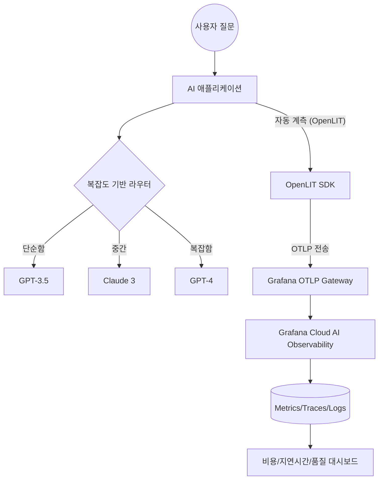

> **한 줄 요약** — 생산 환경의 LLM 애플리케이션에서 발생하는 비용, 지연 시간, 품질 문제를 OpenLIT와 OpenTelemetry를 통해 Grafana Cloud에서 통합 관리하는 방법

## 이 주제를 꺼낸 이유

로컬 환경이나 노트북에서 API 키를 넣어 LLM(Large Language Model) 서비스를 테스트하는 단계와 이를 실제 운영 환경으로 옮기는 단계는 완전히 다른 차원의 문제입니다. 단순히 답변이 잘 나오는지 확인하는 수준을 넘어, 각 모델 호출마다 비용이 얼마나 발생하는지, 응답 지연 시간(Latency)이 서비스 수준 목표(SLO)를 충족하는지, 그리고 생성된 결과물에 할루시네이션(Hallucination)이나 유해한 콘텐츠가 포함되지는 않았는지 실시간으로 추적해야 합니다.

실무에서 LLM 기반 서비스를 구축하다 보면 모델 성능만큼이나 운영 가시성 확보가 어렵다는 사실을 깨닫게 됩니다. 여러 모델 제공자(OpenAI, Anthropic 등)를 섞어서 사용할 경우 데이터 포맷이 제각각이라 지표를 통합하기가 매우 까다롭기 때문입니다. 이러한 파편화된 모니터링 환경을 개선하기 위해 오픈 소스 표준인 오픈텔레메트리(OpenTelemetry)와 이를 활용한 OpenLIT SDK, 그리고 Grafana Cloud의 AI 관측성(AI Observability) 기능을 조합한 해결책이 제시되었습니다.

## 핵심 내용 정리

운영 환경의 LLM 애플리케이션은 모델 호출뿐만 아니라 벡터 데이터베이스(Vector Database), GPU 리소스, 그리고 모델 컨텍스트 프로토콜(MCP) 서버 등 복잡한 스택으로 구성됩니다. Grafana Cloud와 OpenLIT의 통합은 이러한 전체 스택을 하나의 지점에서 모니터링할 수 있게 해줍니다.

OpenLIT는 50개 이상의 GenAI 도구와 프레임워크(LangChain, CrewAI 등)를 지원하는 SDK로, 코드 한 줄로 자동 계측(Auto-instrumentation)을 수행합니다. 생성된 트레이스(Trace)와 메트릭(Metric)은 오픈텔레메트리 프로토콜(OTLP)을 통해 전송되므로 특정 벤더에 종속되지 않는다는 장점이 있습니다.



구현 측면에서 가장 먼저 할 일은 `openlit.init()`을 호출하여 애플리케이션을 초기화하는 것입니다. 이후 OpenAI나 Anthropic 클라이언트를 그대로 사용하더라도 OpenLIT가 중간에서 API 호출을 가로채 토큰 사용량, 응답 시간, 비용 정보를 수집합니다.

```python
import os
import openlit
from openai import OpenAI

# OpenLIT 초기화: 서비스 이름과 환경 설정
openlit.init(service_name="customer-support-bot", environment="production")

openai_client = OpenAI(api_key=os.getenv("OPENAI_API_KEY"))

def get_response(prompt):
    # 일반적인 API 호출과 동일하지만, OpenLIT가 자동으로 지표를 수집함
    response = openai_client.chat.completions.create(
        model="gpt-4-turbo",
        messages=[{"role": "user", "content": prompt}]
    )
    
    # 할루시네이션 평가 및 가드레일 적용 (선택 사항)
    evaluator = openlit.evals.Hallucination(provider="openai", api_key=os.getenv("OPENAI_API_KEY"))
    evaluator.measure(prompt=prompt, text=response.choices[0].message.content)
    
    return response.choices[0].message.content
```

Grafana Cloud는 이렇게 수집된 데이터를 바탕으로 다섯 가지 핵심 영역의 대시보드를 제공합니다.
- GenAI 관측성: 요청 비율, 지연 시간 백분위수, 비용 요약
- GenAI 평가: 할루시네이션 점수, 콘텐츠 품질, 보안 위협
- 벡터 DB 관측성: 쿼리 지연 시간 및 리소스 사용률
- MCP 관측성: 프로토콜 상태 및 서버 성능
- GPU 모니터링: 하드웨어 가동률 및 성능

## 내 생각 & 실무 관점

현업에서 LLM 서비스를 운영할 때 가장 골치 아픈 지점 중 하나는 토큰 비용의 실시간 추적입니다. 월말에 청구서를 보고 나서야 특정 사용자가 과도한 요청을 보냈거나, 루프에 빠진 에이전트가 비용을 낭비했다는 사실을 알게 되는 경우가 흔합니다. OpenLIT처럼 API 호출 시점에 실시간으로 토큰 사용량을 메트릭으로 변환해 Grafana에 쏘아주면, 비용 임계치 기반의 경고(Alerting) 시스템을 구축할 수 있어 매우 실무적입니다.

또한 오픈텔레메트리(OpenTelemetry) 표준을 채택했다는 점에 주목해야 합니다. 2026년 관측성 설문 조사 결과에 따르면, 응답자의 77%가 오픈 소스 및 오픈 표준이 관측성 전략에서 필수적이라고 답했습니다. 특정 클라우드 벤더의 전용 모니터링 도구에 갇히지 않고, 언제든 데이터 백엔드를 교체하거나 확장할 수 있는 유연성을 확보하는 것이 장기적으로 유리합니다.

다만 자동 계측 기능을 사용할 때는 주의할 점이 있습니다. 모든 API 호출을 추적하다 보면 민감한 데이터(사용자 개인정보 등)가 트레이스 로그에 그대로 노출될 위험이 있습니다. 실무에서는 OpenLIT 설정에서 특정 필드를 마스킹하거나, 전송 전 필터링하는 로직을 반드시 검토해야 합니다.

할루시네이션 평가 엔진을 운영 환경에 직접 포함하는 방식에 대해서는 트레이드오프(Trade-off)를 고민해봐야 합니다. 평가를 위해 또 다른 LLM 호출이 발생하므로 추가적인 지연 시간과 비용이 발생하기 때문입니다. 모든 요청을 실시간으로 평가하기보다는, 표본을 추출해 평가하거나 비동기 방식으로 처리하는 구조가 실제 대규모 서비스에는 더 적합할 수 있습니다.

고(Go) 언어로 작성된 애플리케이션의 경우, eBPF 프로파일러를 사용하여 바이너리 수준에서 성능 병목을 찾아내는 방식이 유용합니다. Go는 디버그 심볼이 제거된 상태에서도 함수 이름을 추출할 수 있는 구조를 가지고 있어, LLM 애플리케이션의 백엔드 로직이 복잡해질 때 깊이 있는 성능 최적화를 도와줍니다. 이는 단순한 API 호출 추적을 넘어 시스템 전체의 효율성을 높이는 데 기여합니다.

## 정리

LLM 애플리케이션의 성패는 모델의 지능뿐만 아니라 이를 얼마나 안정적이고 효율적으로 운영하느냐에 달려 있습니다. Grafana Cloud와 OpenLIT의 조합은 복잡한 AI 스택을 가시화하고, 비용과 품질이라는 두 마리 토끼를 잡을 수 있는 강력한 프레임워크를 제공합니다.

지금 바로 수행해볼 수 있는 작업은 현재 사용 중인 LLM 호출 코드 상단에 `openlit.init()`을 추가하고, 로컬 환경에서 OTLP 엔드포인트로 데이터가 정상적으로 나가는지 확인하는 것입니다. 작은 실험에서 시작해 운영 환경의 관측성을 확보해 나가는 과정이 AI 에이전트 시대를 대비하는 핵심적인 준비가 될 것입니다.

## 참고 자료
- [원문] [How to monitor LLMs in production with Grafana Cloud, OpenLIT, and OpenTelemetry](https://grafana.com/blog/ai-observability-llms-in-production/) — Grafana Blog
- [관련] From raw data to flame graphs: A deep dive into how the OpenTelemetry eBPF profiler symbolizes Go — Grafana Blog
- [관련] Is your repo ready for the AI Agents revolution? Checklist — DEV Community
- [관련] Open standards in 2026: The backbone of modern observability — Grafana Blog