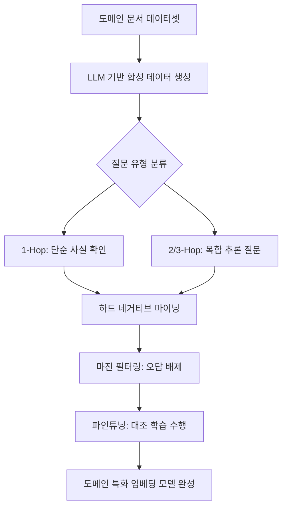

> **한 줄 요약** — 일반적인 임베딩 모델이 해결하지 못하는 도메인 특화 지식을 단 하루 만의 파인튜닝(Fine-tuning)으로 최적화하여 RAG 시스템의 검색 성능을 극대화하는 방법론을 다룹니다.

## 이 주제를 꺼낸 이유

검색 증강 생성(Retrieval-Augmented Generation, RAG) 시스템을 구축하다 보면 반드시 마주치는 벽이 있습니다. 범용 임베딩(Embedding) 모델은 인터넷의 방대한 데이터는 잘 이해하지만, 우리 회사의 내부 계약서, 제조 공정 로그, 독자적인 화학식이나 고유 명사는 제대로 처리하지 못한다는 점입니다.

단순히 상위 모델을 쓴다고 해결될 문제가 아닙니다. 도메인 특화 용어 사이의 미세한 맥락 차이를 구분하지 못하면 검색 단계에서 엉뚱한 문서를 가져오고, 이는 곧 생성된 답변의 품질 저하로 이어집니다.

수작업으로 학습 데이터를 라벨링하는 고통 없이, 단일 GPU와 하루 정도의 시간만으로 도메인 전용 임베딩 모델을 만드는 엔비디아(NVIDIA)의 파이프라인이 공개되어 이를 깊이 있게 살펴보고자 합니다.

## 핵심 내용 정리

엔비디아가 제안하는 방식의 핵심은 합성 데이터 생성(Synthetic Data Generation, SDG)과 하드 네거티브 마이닝(Hard Negative Mining)입니다. 수만 개의 질의-응답 쌍을 사람이 직접 만드는 대신, 거대 언어 모델(LLM)이 문서를 읽고 스스로 문제를 내게 만듭니다.

전체 과정은 크게 네 단계로 나뉩니다. 먼저 도메인 문서에서 텍스트를 추출하고, 이를 바탕으로 LLM이 복잡도가 다른 다양한 질문을 생성합니다. 이후 기존 모델을 이용해 질문과 비슷해 보이지만 오답인 문서를 찾아내는 마이닝 과정을 거칩니다. 마지막으로 이 데이터를 활용해 바이-인코더(Bi-encoder) 모델을 대조 학습(Contrastive Learning)시킵니다.

### 합성 데이터 생성과 멀티홉(Multi-hop) 질문의 중요성

학습 데이터 생성 시 단순히 한 문단에서 질문 하나를 뽑는 것에 그치지 않습니다. 실무에서 사용자는 여러 섹션에 걸쳐 있는 정보를 종합해서 질문하는 경우가 많기 때문입니다.

엔비디아의 파이프라인은 1-Hop부터 3-Hop까지 질문의 난이도를 조절합니다. 3-Hop 질문은 세 개의 서로 다른 문서 조각을 합성해야 답변할 수 있는 수준입니다. 이러한 데이터를 학습한 모델은 복잡한 문맥에서도 관련 있는 여러 문서를 동시에 찾아내는 능력이 비약적으로 상승합니다.

### 하드 네거티브 마이닝: 모델의 변별력 높이기

임베딩 모델 학습에서 가장 중요한 것은 정답과 오답을 명확히 구분하는 힘입니다. 단순히 정답만 알려주는 것이 아니라, 정답과 매우 유사해 보이지만 실제로는 틀린 하드 네거티브(Hard Negatives) 예시를 함께 제공해야 합니다.

예를 들어 당뇨병 치료제 용량에 대한 질문이 있다면, 비슷한 약물의 용량 정보나 같은 약물의 부작용 정보를 오답 후보로 제시합니다. 이때 마진 필터(Margin Filter)를 적용하여 정답과 너무 똑같아서 모델이 혼란을 느낄 수 있는 가짜 오답은 제거하는 정교한 작업이 병행됩니다.

## 내 생각 & 실무 관점

원문에서 강조하는 합성 데이터 기반의 접근법은 실무적으로 매우 합리적입니다. 현업에서 임베딩 파인튜닝을 망설이는 가장 큰 이유는 학습용 골든셋(Golden Set) 구축에 드는 비용과 시간이기 때문입니다.

직접 RAG 파이프라인을 운영해 보면 검색 정확도(Recall) 10% 차이가 사용자 경험에 미치는 영향은 엄청납니다. 아틀라시안(Atlassian)이 지라(JIRA) 데이터셋에 이 방식을 적용해 검색 성능을 26%나 끌어올렸다는 수치는 단순한 벤치마크 이상의 의미를 갖습니다.

### 데이터 품질이 모델 크기를 압도한다

실무에서 흔히 하는 실수가 무조건 파라미터 수가 많은 거대한 임베딩 모델을 고집하는 것입니다. 하지만 도메인 특화 상황에서는 10억 개(1B) 수준의 파라미터를 가진 가벼운 모델이라도 정확하게 튜닝된 데이터로 학습했을 때 훨씬 나은 결과를 보여줍니다.

추론 속도와 비용을 고려해야 하는 운영 환경에서는 무거운 모델을 쓰는 것보다, 도메인 지식이 주입된 가벼운 모델을 사용하는 것이 처리량(Throughput) 관점에서 훨씬 유리합니다.

### 합성 데이터의 환각 문제와 검증 절차

다만 LLM이 생성한 합성 데이터를 100% 신뢰하기는 어렵습니다. 원문에서도 언급하듯 생성된 질의-응답 쌍에 대해 품질 점수(Quality Score)를 매기고 임계치 이하의 데이터는 과감히 버리는 과정이 필수적입니다.

실제로 비슷한 파이프라인을 구축해 보면 LLM이 문서 내용을 왜곡해서 질문을 만드는 경우가 종종 발생합니다. 따라서 초기 단계에서는 도메인 전문가가 생성된 데이터의 일부를 샘플링해서 검수하는 과정이 반드시 동반되어야 모델의 신뢰성을 담보할 수 있습니다.

### 트레이드오프: 하드웨어 장벽과 가치

이 방식의 유일한 걸림돌은 GPU 자원입니다. 80GB 이상의 메모리를 가진 A100이나 H100급 GPU가 필요하다는 점은 소규모 팀에게는 부담일 수 있습니다.

그럼에도 불구하고 전문적인 기술 문서나 법률, 의료 데이터를 다루는 서비스라면 이 정도 투자는 충분한 가치가 있습니다. 범용 모델이 놓치는 미묘한 뉘앙스를 잡아내는 순간, RAG 시스템의 고질적인 문제인 할루시네이션(Hallucination)이 눈에 띄게 줄어들기 때문입니다.

## 정리

도메인 특화 임베딩 모델 구축은 이제 더 이상 수개월이 걸리는 거대 프로젝트가 아닙니다. 잘 설계된 합성 데이터 생성 파이프라인과 하드 네거티브 마이닝 기법을 활용하면 단 하루 만에 성능을 극대화할 수 있습니다.

지금 운영 중인 RAG 시스템이 특정 전문 용어 검색에서 계속 실패하고 있다면, 모델의 크기를 키우기보다 우리 도메인에 맞는 작은 모델을 직접 학습시키는 방향을 진지하게 고민해 봐야 합니다.

당장 시도해 볼 수 있는 것은 보유한 문서 중 가장 검색이 안 되는 카테고리를 골라 100개 정도의 합성 데이터를 생성해 보고, 기존 모델과의 유사도 분포를 비교해 보는 것입니다.

## 참고 자료
- [원문] [Build a Domain-Specific Embedding Model in Under a Day](https://huggingface.co/blog/nvidia/domain-specific-embedding-finetune) — Hugging Face Blog
- [관련] What's New in Mellea 0.4.0 + Granite Libraries Release — Hugging Face Blog
- [관련] Holotron-12B - High Throughput Computer Use Agent — Hugging Face Blog
- [관련] A New Framework for Evaluating Voice Agents (EVA) — Hugging Face Blog