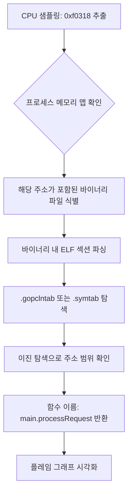

> **한 줄 요약** — eBPF 프로파일러가 Go 바이너리의 메모리 주소를 읽어 사람이 이해할 수 있는 함수 이름으로 변환하는 심볼화(Symbolization)의 내부 동작 원리를 다룹니다.

## 이 주제를 꺼낸 이유

운영 환경에서 갑자기 CPU 사용량이 치솟을 때 가장 먼저 찾는 도구가 프로파일러(Profiler)입니다. 하지만 eBPF 기반 프로파일러를 처음 접하면 당황스러운 순간이 있습니다. 분명 내 코드를 분석했는데 0x00000000000f0318 같은 의미 없는 16진수 주소만 잔뜩 나열되는 경우입니다.

이런 현상을 이해하려면 프로파일러가 어떻게 기계의 언어를 인간의 언어로 번역하는지 알아야 합니다. 특히 Go 언어는 다른 네이티브 언어와 달리 바이너리 안에 독특한 구조를 가지고 있어 프로파일링에 매우 유리합니다. OpenTelemetry eBPF 프로파일러가 Go 바이너리를 해석하는 과정을 따라가며 실무에서 마주치는 성능 분석의 병목을 어떻게 해결할 수 있는지 살펴보겠습니다.

## 핵심 내용 정리

심볼화(Symbolization)는 메모리 주소를 함수 이름과 소스 코드 위치로 매핑하는 과정입니다. eBPF 프로파일러는 커널 공간에서 동작하므로 실행 중인 프로세스의 내부 런타임에 직접 물어볼 수 없습니다. 대신 디스크에 있는 바이너리 파일을 직접 파싱해서 정보를 캐내야 합니다.

### eBPF 프로파일러의 제약 사항

전통적인 프로파일러는 프로세스에 에이전트를 주입하거나 런타임 API를 호출합니다. 하지만 eBPF 프로파일러는 커널에서 샘플링을 수행하기 때문에 다음과 같은 제약과 특징을 가집니다.

- 실행 중인 프로그램의 코드를 수정할 수 없습니다.
- 애플리케이션 내부의 리플렉션(Reflection)이나 런타임 API를 호출할 수 없습니다.
- 커널에서 수집하는 데이터는 오직 현재 실행 중인 명령어 주소(Program Counter)와 스택의 복귀 주소들뿐입니다.

따라서 프로파일러는 수집된 16진수 주소들을 들고 바이너리 파일의 심볼 테이블(Symbol Table)을 뒤져야 합니다.

### Go 언어의 비밀 병기: .gopclntab

일반적으로 C++ 같은 언어는 바이너리 크기를 줄이기 위해 디버그 심볼을 제거(Strip)하면 함수 이름을 찾기 어렵습니다. 하지만 Go는 다릅니다. Go 바이너리에는 .gopclntab이라는 특수한 섹션이 포함되어 있습니다.

이 섹션은 함수 이름, 소스 파일 경로, 라인 번호 정보를 압축해서 담고 있습니다. 중요한 점은 바이너리를 스트립(Strip)해도 이 섹션은 기본적으로 유지된다는 것입니다. 덕분에 운영 환경의 가벼운 바이너리에서도 정확한 스택 트레이스를 얻을 수 있습니다.

### 심볼화 파이프라인 과정

프로파일러가 하나의 메모리 주소를 함수 이름으로 바꾸는 과정은 대략 다음과 같습니다.

바이너리 내부에서 주소를 찾는 과정은 이진 탐색(Binary Search)을 사용합니다. 예를 들어 `main.processRequest`가 0xf0310에서 시작하고 다음 함수가 0xf0370에서 시작한다면, 0xf0318은 그 사이에 있으므로 해당 함수에 속한다고 판단하는 식입니다.

## 내 생각 & 실무 관점

실무에서 성능 최적화를 하다 보면 프로파일러가 뱉어내는 raw 데이터의 신뢰성이 무엇보다 중요합니다. 원문에서 강조하듯 Go가 프로파일링에 유리한 이유는 개발자가 별도의 디버그 패키지를 관리하지 않아도 되기 때문입니다.

### 스트립(Strip)된 바이너리와의 싸움

현업에서는 배포 아티팩트의 크기를 줄이기 위해 `go build -ldflags="-s -w"` 명령어를 자주 사용합니다. 이렇게 하면 ELF 심볼 테이블은 날아가지만, Go 런타임에 필요한 .gopclntab은 남습니다. 

만약 C++나 Rust를 사용 중이라면 상황이 다릅니다. 별도의 디버그 심볼 파일(.debug)을 관리하거나 서버사이드 심볼화 서버를 구축해야 하는 번거로움이 생깁니다. 이런 관점에서 Go의 설계는 관측 가능성(Observability)을 처음부터 염두에 둔 매우 실용적인 선택이라고 느껴집니다.

### 성능 오버헤드에 대한 고민

초당 수십 번의 샘플링을 수백 개의 프로세스에서 수행할 때 심볼화 과정 자체가 CPU를 잡아먹으면 주객전도가 됩니다. 실제로 운영 환경에서 프로파일러를 켤 때 가장 걱정되는 부분이 바로 이 지점입니다.

이를 해결하기 위해 OpenTelemetry 프로파일러는 프레임 캐싱(Frame Caching)을 적극적으로 활용합니다. 한 번 해석한 주소는 다시 계산하지 않도록 메모리에 저장해 두는 것이죠. 실무에서는 이 캐시 효율이 프로파일러의 오버헤드를 결정짓는 핵심 지표가 됩니다.

### 인라이닝(Inlining)의 함정

성능 최적화를 위해 컴파일러가 함수를 인라이닝해버리면 심볼화 결과가 왜곡될 수 있습니다. 소스 코드에는 분명 함수가 있는데 플레임 그래프에는 나타나지 않는 경우입니다. 

원문 예제에서는 `-gcflags="all=-N -l"` 옵션으로 최적화를 끄고 실험했지만, 실제 서비스 코드에서는 인라이닝된 함수 정보를 복구하기 위해 DWARF의 `.debug_inlined` 섹션을 뒤져야 할 수도 있습니다. 하지만 이는 바이너리 크기를 키우는 트레이드오프가 있으므로 적절한 균형점을 찾는 것이 중요합니다.

## 정리

eBPF 프로파일러는 단순한 도구를 넘어 시스템 커널과 바이너리 구조를 잇는 정교한 메커니즘을 가지고 있습니다. Go 언어는 .gopclntab이라는 영리한 설계를 통해 운영 환경에서도 최소한의 비용으로 깊이 있는 통찰을 제공합니다.

내 서비스의 프로파일링 결과가 제대로 나오지 않는다면, 먼저 바이너리의 섹션 정보를 확인해 보세요. `readelf -S` 명령어로 .gopclntab이 살아있는지 확인하는 것만으로도 문제 해결의 실마리를 찾을 수 있습니다.

## 참고 자료
- [원문] [From raw data to flame graphs: A deep dive into how the OpenTelemetry eBPF profiler symbolizes Go](https://grafana.com/blog/deep-dive-into-how-the-opentelemetry-ebpf-profiler-symbolizes-go/) — Grafana Blog
- [관련] Finding performance bottlenecks with Pyroscope and Alloy — Grafana Blog