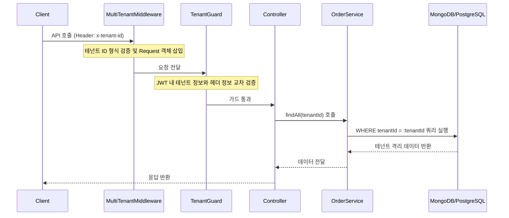

SaaS 서비스를 개발할 때 가장 먼저 맞닥뜨리는 고민 중 하나가 멀티 테넌시(Multi-tenancy) 아키텍처 설계입니다. 하나의 코드베이스로 수많은 고객사(Tenant)를 효율적으로 관리하면서도, 데이터 격리(Data Isolation)와 확장성을 동시에 잡는 일은 결코 쉽지 않습니다. 특히 NestJS와 같은 프레임워크를 사용해 실무 시스템을 구축하다 보면, 설계 문서에 적힌 이상적인 구조가 실제 운영 환경에서 예상치 못한 병목이나 데이터 혼선으로 이어지는 상황을 자주 목격하게 됩니다.

> **한 줄 요약** — 멀티 테넌트 시스템의 핵심은 데이터 격리 수준에 따른 트레이드오프를 이해하고, NestJS의 미들웨어와 가드를 활용해 애플리케이션 전반에 일관된 테넌트 컨텍스트를 주입하는 것입니다.

## 멀티 테넌시 아키텍처는 왜 필요할까?

소프트웨어 서비스(SaaS) 모델의 기본은 하나의 소프트웨어 인스턴스가 여러 고객에게 서비스를 제공하는 것입니다. 테넌트마다 별도의 서버와 데이터베이스를 구축하는 방식은 고객이 10명일 때는 문제가 없지만, 고객이 1,000명으로 늘어나는 순간 운영 비용과 배포 복잡도가 기하급수적으로 증가합니다.

진정한 멀티 테넌시는 하나의 코드베이스와 배포 단위를 유지하면서 논리적으로 고객의 데이터를 분리하는 데 목적이 있습니다. 이를 통해 운영 효율성을 극대화하고, 모든 고객에게 최신 기능을 동시에 제공할 수 있습니다. 하지만 이 과정에서 테넌트 A의 데이터가 테넌트 B의 대시보드에 노출되는 치명적인 사고를 방지하기 위한 견고한 설계가 뒷받침되어야 합니다.

## 데이터 격리를 위한 세 가지 전략

실무에서 테넌트 데이터를 나누는 방식은 크게 세 가지로 요약됩니다. 각 방식은 비용, 보안, 관리 편의성 측면에서 뚜렷한 차이를 보입니다.

- 공유 데이터베이스 및 공유 스키마 (Shared Database, Shared Schema)
  - 모든 테넌트가 동일한 테이블을 사용하며, `tenantId` 컬럼으로 데이터를 구분합니다.
  - 구현이 가장 쉽고 비용이 저렴하지만, 쿼리 작성 시 실수로 `WHERE tenantId = ?` 절을 누락하면 데이터 유출 사고가 발생할 위험이 큽니다.
- 공유 데이터베이스 및 개별 스키마 (Shared Database, Separate Schema)
  - PostgreSQL의 스키마 기능을 활용해 테넌트별로 논리적 공간을 분리합니다.
  - 데이터베이스 엔진 수준에서 격리가 이루어져 보안성이 높지만, 스키마 변경(Migration) 시 모든 테넌트 스키마에 동일한 작업을 반복해야 하는 운영 부담이 있습니다.
- 개별 데이터베이스 (Separate Database)
  - 각 테넌트에게 독립된 데이터베이스 인스턴스를 할당합니다.
  - 보안과 성능 격리가 완벽하지만, 커넥션 풀(Connection Pool) 관리와 백업 프로세스가 복잡해지며 비용이 가장 많이 듭니다.

실제 시스템을 구축할 때는 처음부터 하나를 고집하기보다 테넌트의 규모나 요구사항에 따라 계층화된 접근을 하는 것이 현명합니다. 일반 사용자는 공유 스키마를 사용하고, 보안 요구사항이 엄격한 엔터프라이즈 고객은 독립된 데이터베이스로 마이그레이션하는 유연한 구조가 권장됩니다.

## NestJS에서 테넌트 식별 레이어 구현하기

멀티 테넌트 시스템의 요청 처리 흐름은 테넌트 식별, 컨텍스트 주입, 쿼리 적용의 3단계로 구성됩니다. NestJS에서는 미들웨어(Middleware)를 통해 요청 헤더나 서브도메인에서 테넌트 ID를 추출하는 것이 가장 효율적입니다.

```typescript
// multi-tenant.middleware.ts
@Injectable()
export class MultiTenantMiddleware implements NestMiddleware {
  private readonly TENANT_ID_PATTERN = /^[a-zA-Z0-9_-]{3,64}$/;

  use(req: Request, res: Response, next: NextFunction) {
    const tenantId = req.headers["x-tenant-id"] as string;

    if (!tenantId) {
      throw new BadRequestException("Tenant ID is required");
    }

    if (!this.TENANT_ID_PATTERN.test(tenantId)) {
      throw new BadRequestException("Invalid tenant ID format");
    }

    req["tenantId"] = tenantId;
    next();
  }
}
```

미들웨어에서 정규표현식(Regex)을 통해 테넌트 ID 형식을 검증하는 것은 보안상 매우 중요합니다. 테넌트 ID는 이후 데이터베이스 쿼리나 캐시 키로 직접 사용되기 때문에, SQL 인젝션이나 예기치 못한 캐릭터셋 문제를 원천 차단해야 합니다.

추출된 테넌트 ID는 커스텀 데코레이터(Decorator)를 통해 컨트롤러에서 깔끔하게 사용할 수 있습니다.

```typescript
// tenant.decorator.ts
export const Tenant = createParamDecorator(
  (data: unknown, ctx: ExecutionContext): string => {
    const request = ctx.switchToHttp().getRequest();
    return request["tenantId"];
  }
);
```

이 방식의 장점은 테넌트 식별 로직이 비즈니스 로직과 분리된다는 점입니다. 나중에 테넌트를 서브도메인 기반으로 식별하도록 변경하더라도, 미들웨어 코드만 수정하면 될 뿐 서비스 레이어는 아무런 영향을 받지 않습니다.

### 테넌트 요청 처리 흐름 다이어그램



## 데이터 접근 계층에서의 엄격한 격리

애플리케이션 레벨에서 테넌트 ID를 관리할 때 가장 흔히 저지르는 실수는 클라이언트가 보내는 요청 바디(Request Body)의 테넌트 ID를 그대로 믿는 것입니다. 악의적인 사용자가 본인의 테넌트 ID가 아닌 다른 테넌트의 ID를 바디에 실어 보낼 경우, 시스템은 타인의 데이터를 수정하거나 삭제할 위험이 있습니다.

따라서 테넌트 ID는 반드시 인증된 JWT(JSON Web Token)나 신뢰할 수 있는 미들웨어 컨텍스트에서만 가져와야 합니다. 이를 강제하기 위해 NestJS 가드(Guard)를 활용한 이중 방어 체계를 구축하는 것이 좋습니다.

```typescript
@Injectable()
export class TenantGuard implements CanActivate {
  canActivate(ctx: ExecutionContext): boolean {
    const request = ctx.switchToHttp().getRequest();
    const headerTenantId = request["tenantId"];
    const jwtTenantId = request.user?.tenantId;

    if (jwtTenantId && headerTenantId !== jwtTenantId) {
      throw new ForbiddenException("Tenant mismatch: access denied");
    }
    return true;
  }
}
```

이러한 가드는 개발자가 실수로 특정 API 경로에 테넌트 필터링을 누락하더라도, 권한이 없는 테넌트의 접근을 차단하는 최후의 보루 역할을 합니다.

## 실무에서 마주하는 성능과 운영의 트레이드오프

멀티 테넌트 시스템을 실제 운영하다 보면 이론과 다른 문제들이 튀어나옵니다. 특히 공유 스키마 모델에서 데이터가 늘어날수록 인덱스(Index) 전략이 승패를 가릅니다.

### 복합 인덱스의 중요성
단순히 `tenantId` 컬럼에만 인덱스를 거는 것으로는 부족합니다. 대부분의 쿼리는 특정 테넌트 안에서 생성일순으로 정렬하거나 상태값으로 필터링하기 때문입니다. MongoDB를 예로 들면, 다음과 같은 복합 인덱스(Compound Index)가 필수적입니다.

```javascript
orderSchema.index({ tenantId: 1, createdAt: -1 });
orderSchema.index({ tenantId: 1, status: 1 });
```

실제로 대규모 트래픽이 발생하는 환경에서 이러한 인덱스 최적화만으로도 쿼리 응답 시간을 수백 밀리초에서 수십 밀리초 단위로 단축할 수 있습니다.

### 커넥션 풀 관리의 함정
테넌트별로 독립된 데이터베이스를 사용하는 경우, 테넌트가 늘어날수록 데이터베이스 커넥션 수도 급증합니다. 모든 테넌트의 커넥션을 메모리에 유지하려고 하면 서버 리소스가 금방 고갈됩니다.

이를 해결하기 위해 LRU(Least Recently Used) 캐시 알고리즘을 적용한 커넥션 리졸버(Connection Resolver)를 구현해야 합니다. 일정 시간 동안 활동이 없는 테넌트의 커넥션은 자동으로 닫고, 새로운 요청이 올 때만 동적으로 연결을 생성하는 방식입니다. 이때 연결 생성 시 발생하는 지연 시간(Latency)을 최소화하기 위한 웜업(Warm-up) 전략도 함께 고민해야 합니다.

## 아키텍처 확장을 위한 시각

최근에는 단순한 CRUD를 넘어 멀티 에이전트 AI 시스템(Multi-Agent AI Systems)을 SaaS에 통합하려는 시도가 늘고 있습니다. 테넌트마다 서로 다른 지식 베이스(Knowledge Base)를 가진 AI 에이전트를 배치할 때, 기존의 멀티 테넌트 격리 구조는 더욱 중요해집니다.

에이전트가 도구를 사용하거나 외부 API를 호출할 때, 그 실행 컨텍스트가 해당 테넌트의 경계를 벗어나지 않도록 보장해야 하기 때문입니다. 예를 들어 AI 에이전트가 고객의 데이터를 조회할 때, 앞서 구현한 테넌트 컨텍스트를 에이전트의 권한 범위(Scope)에 주입하는 방식으로 설계를 확장할 수 있습니다.

## 정리

멀티 테넌트 아키텍처는 단순히 데이터를 나누는 기술이 아니라, 서비스의 성장 단계에 맞춰 격리 수준을 조정해 나가는 전략적 선택의 문제입니다. NestJS의 강력한 모듈 시스템과 미들웨어 기능을 활용하면 코드의 복잡도를 낮추면서도 안전한 격리 환경을 구축할 수 있습니다.

지금 운영 중인 시스템이 공유 스키마 방식이라면, 혹시 모든 쿼리에 테넌트 필터링이 강제되고 있는지, 그리고 복합 인덱스가 테넌트 ID를 포함하여 적절히 설정되어 있는지 점검해 보시기 바랍니다. 작은 설계의 차이가 미래의 대규모 마이그레이션 비용을 결정짓습니다.

## 참고 자료
- [원문] [Designing a Scalable Multi-Tenant Architecture with NestJS: Lessons from Building Real-World Systems](https://dev.to/sircatalyst/designing-a-scalable-multi-tenant-architecture-with-nestjs-lessons-from-building-real-world-systems-4j9) — DEV Community
- [관련] How to Build Multi-Agent AI Systems with Node.js (2026 Guide) — DEV Community
- [관련] From raw data to flame graphs: A deep dive into how the OpenTelemetry eBPF profiler symbolizes Go — Grafana Blog