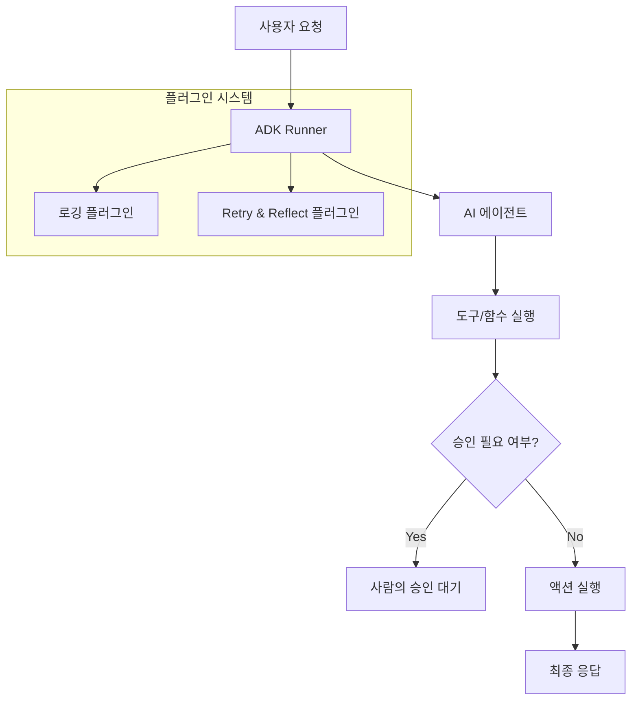

AI 에이전트를 실험적인 스크립트 수준을 넘어 실제 서비스(Production) 환경에 배포하려면 관측 가능성(Observability)과 보안, 그리고 확장성이 반드시 뒷받침되어야 합니다. 최근 발표된 ADK(Agent Development Kit) Go 1.0은 구글이 19년 전 고성능 엔지니어링을 위해 만든 Go 언어의 철학을 이어받아, 복잡한 멀티 에이전트 시스템을 안정적으로 운영할 수 있는 기틀을 마련했습니다.

> **한 줄 요약** — ADK Go 1.0은 OpenTelemetry 통합과 Human-in-the-Loop 설계를 통해 AI 에이전트의 불확실성을 제어하고 프로덕션 환경에 적합한 안정성을 제공합니다.

## 이 주제를 꺼낸 이유

AI 에이전트를 개발하다 보면 가장 먼저 마주치는 벽은 에이전트가 왜 그런 결정을 내렸는지 알기 어렵다는 점입니다. 파이썬(Python) 기반의 프레임워크들은 프로토타이핑에는 유리하지만, 동시성이 중요하거나 대규모 트래픽을 처리해야 하는 백엔드 서비스에서는 성능과 타입 안정성 면에서 아쉬움이 남을 때가 많습니다.

구글이 ADK Go 1.0을 내놓으면서 강조한 지점도 바로 이 부분입니다. 에이전트의 사고 과정을 추적하고, 위험한 동작 전에 사람의 승인을 받으며, 코드를 수정하지 않고도 설정을 바꿀 수 있는 구조는 실무자들에게 매우 현실적인 해결책이 됩니다. 특히 성능과 안정성이 최우선인 금융이나 인프라 제어 분야에서 Go 기반 에이전트의 가치는 더욱 커질 것입니다.

## ADK Go 1.0의 핵심 기능과 아키텍처

ADK Go 1.0의 가장 큰 특징은 에이전트의 비결정성(Non-determinism)을 관리 가능한 영역으로 가져왔다는 점입니다. 단순히 모델에게 질문을 던지는 수준을 넘어, 도구 호출(Tool Call)과 응답 생성의 전 과정을 체계적으로 관리합니다.

### 1. OpenTelemetry를 활용한 블랙박스 해소

에이전트가 실패했을 때 모델의 할루시네이션(Hallucination)인지, API 호출 지연인지, 아니면 도구 자체의 오류인지 파악하는 것은 매우 어렵습니다. ADK Go 1.0은 오픈텔레메트리(OpenTelemetry)를 기본적으로 통합하여 모든 모델 호출과 도구 실행 루프를 추적(Tracing)합니다.

```go
// OTel Initialization in ADK Go
telemetryProviders, err := telemetry.New(ctx, telemetry.WithOtelToCloud(true))
if err != nil {
    log.Fatal(err)
}
defer telemetryProviders.Shutdown(ctx)

// 전역 OTel 프로바이더 설정
telemetryProviders.SetGlobalOtelProviders()

// 텔레메트리 지원을 포함한 러너 초기화
r, _ := runner.New(runner.Config{
    Agent:     myAgent,
    Telemetry: telemetry.NewOTel(tp),
})
```

이 코드를 통해 개발자는 클라우드 트레이스(Cloud Trace) 같은 도구에서 에이전트의 사고 사슬(Chain of Thought)을 시각적으로 확인할 수 있습니다. 실무에서 에이전트가 엉뚱한 도구를 반복 호출하며 루프에 빠지는 상황을 겪어본 분들이라면, 이 트레이싱 기능이 디버깅 시간을 얼마나 단축해줄지 쉽게 짐작하실 겁니다.

### 2. 자가 치유를 돕는 플러그인 시스템

ADK Go 1.0은 핵심 에이전트 로직을 깔끔하게 유지하면서도 로깅, 보안 필터, 자가 수정 기능을 추가할 수 있는 플러그인 시스템을 도입했습니다. 특히 Retry and Reflect 플러그인은 도구 실행 중에 발생한 에러를 모델에게 다시 전달하여, 모델이 스스로 파라미터를 수정하고 재시도하게 만듭니다.



### 3. 안전 장치: Human-in-the-Loop(HITL)

보안은 코드의 견고함만큼이나 통제권이 누구에게 있느냐가 중요합니다. ADK Go 1.0은 금융 거래나 데이터베이스 삭제처럼 민감한 작업을 수행하기 전, 에이전트가 실행을 멈추고 사람의 확인을 기다리는 흐름을 기본적으로 지원합니다.

```go
myTool, _ := functiontool.New(functiontool.Config{
    Name:                "delete_database",
    Description:         "프로덕션 데이터베이스 인스턴스를 삭제합니다.",
    RequireConfirmation: true, // HITL 승인 흐름 활성화
}, deleteDBFunc)
```

이 설정 하나로 에이전트는 단독으로 위험한 행동을 하지 못하게 됩니다. 실제 운영 환경에서 에이전트에게 권한을 부여할 때 가장 주저하게 되는 지점을 기술적으로 잘 풀어낸 사례라고 생각합니다.

### 4. YAML 기반의 에이전트 설정 관리

에이전트의 페르소나나 지침(Instruction)을 수정할 때마다 매번 바이너리를 새로 빌드하는 것은 비효율적입니다. ADK Go 1.0은 YAML 설정을 지원하여 비즈니스 로직과 구성을 분리했습니다.

```yaml
# agent_config.yaml
name: customer_service
description: 항공사 고객 문의 처리 에이전트
instruction: >
  당신은 항공권 예약을 돕는 고객 서비스 에이전트입니다. 
  항상 친절하고 명확하게 답변하세요.
tools:
  - name: "google_search"
  - name: "builtin_code_executor"
sub_agents:
  - "policy_agent"
  - "booking_agent"
```

이 방식을 사용하면 프롬프트 엔지니어나 도메인 전문가가 코드에 직접 손을 대지 않고도 에이전트의 행동 방식을 빠르게 개선할 수 있습니다.

## 내 생각 & 실무 관점

파이썬이 AI 연구의 표준이라면, Go는 AI 서비스의 표준이 될 가능성이 높습니다. 현업에서 에이전트 시스템을 구축하다 보면 결국 마주하게 되는 문제는 모델의 성능보다는 주변 시스템과의 연동, 그리고 예외 처리입니다.

### 언어 선택의 트레이드오프

대부분의 AI 라이브러리가 파이썬 기반이라 Go로 에이전트를 만드는 것에 의구심을 가질 수도 있습니다. 하지만 실제 대규모 트래픽을 처리하는 API 서버 환경에서는 Go의 가벼운 고루틴(Goroutine)과 엄격한 타입 시스템이 주는 이점이 훨씬 큽니다. ADK Go 1.0은 이러한 Go의 강점을 활용하면서도 파이썬이나 자바(Java)로 작성된 다른 에이전트와 통신할 수 있는 A2A(Agent2Agent) 프로토콜을 강화했습니다. 이는 폴리글랏(Polyglot) 마이크로서비스 구조를 가진 팀에게 매우 매력적인 옵션입니다.

### 자가 치유(Self-healing)의 양날의 검

Retry and Reflect 기능은 매우 강력하지만, 주의해서 사용해야 합니다. 모델이 잘못된 방향으로 계속 재시도할 경우 불필요한 토큰 비용이 발생할 수 있습니다. 실무에서는 무한 루프를 방지하기 위해 MaxRetries 값을 보수적으로 설정하고, 특정 횟수 이상 실패 시 반드시 사람에게 알림을 보내는 로직을 플러그인 단계에서 강제하는 것이 안전합니다.

### YAML 관리의 실무적 이점

에이전트의 지침은 서비스 운영 중에 수시로 변합니다. 이를 YAML로 분리하면 CI/CD 파이프라인에서 설정 파일만 교체하여 배포할 수 있습니다. 또한 여러 버전의 YAML 파일을 두고 A/B 테스트를 수행하기에도 매우 용이한 구조입니다. 다만, YAML 파일 내의 프롬프트가 복잡해질 경우 이에 대한 버전 관리와 테스트 자동화 전략을 미리 세워두는 것이 좋습니다.

## 정리

ADK Go 1.0의 등장은 AI 에이전트 개발이 장난감을 만드는 단계에서 견고한 소프트웨어를 만드는 단계로 진입했음을 상징합니다. 특히 OpenTelemetry를 통한 가시성 확보와 Human-in-the-Loop를 통한 안전 제어는 엔지니어가 에이전트를 신뢰하고 프로덕션에 투입할 수 있게 해주는 핵심 요소입니다.

지금 바로 해볼 수 있는 것은 기존에 파이썬으로 작성된 에이전트 로직 중 성능 병목이 있거나 관측이 어려운 부분을 Go로 옮겨보는 시도입니다. 특히 복잡한 도구 호출이 빈번한 에이전트라면 ADK Go의 플러그인 시스템이 주는 깔끔한 구조를 직접 체감해 보시길 권합니다.

## 참고 자료
- [원문] [ADK Go 1.0 Arrives!](https://developers.googleblog.com/adk-go-10-arrives/) — Google Developers
- [관련] Announcing ADK for Java 1.0.0: Building the Future of AI Agents in Java — Google Developers
- [관련] What's new in TensorFlow 2.21 — Google Developers