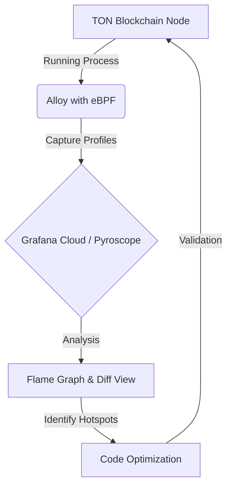

> **한 줄 요약** — 파이로스코프(Pyroscope)와 얼로이(Alloy)를 활용한 컨티뉴어스 프로파일링(Continuous Profiling)은 코드 수정 없이 복잡한 시스템의 성능 병목 지점을 정확히 찾아내는 핵심 도구입니다.

## 이 주제를 꺼낸 이유

성능 최적화(Performance Optimization) 작업은 대개 안개 속을 걷는 것과 비슷합니다. 서비스가 느려졌다는 것은 알지만, 수만 줄의 코드 중 정확히 어디가 범인인지 밝혀내는 데 많은 시간을 허비하곤 합니다. 특히 실시간 처리가 중요한 블록체인이나 고성능 서버 환경에서는 단 1%의 효율 개선이 서비스 전체의 비용과 사용자 경험에 막대한 영향을 미칩니다.

그라파나(Grafana)의 컨티뉴어스 프로파일링 도구인 파이로스코프와 수집기인 얼로이를 활용하면 이런 막막함을 데이터 기반의 확신으로 바꿀 수 있습니다. TON 블록체인 최적화 사례를 통해 최신 프로파일링 기술이 어떻게 실무적인 문제를 해결하고, 실제 코드 수준에서 어떤 변화를 끌어내는지 구체적으로 살펴볼 필요가 있습니다.

## 성능 병목을 찾는 효율적인 방법: Alloy와 eBPF

전통적인 프로파일링은 코드에 직접 측정용 코드를 심거나(Instrumentation), 바이너리를 특수한 모드로 빌드해야 했습니다. 하지만 얼로이의 `pyroscope.ebpf` 컴포넌트를 사용하면 커널 레벨에서 실행 중인 프로세스를 관찰하므로 애플리케이션 코드 수정이 전혀 필요 없습니다.

TON 블록체인 검증 알고리즘 최적화 과정에서도 이 방식이 사용되었습니다. 전체 시스템의 CPU 사용량을 시각화하는 플레임 그래프(Flame Graph)를 통해 어떤 함수가 자원을 독점하는지 즉각적으로 확인했습니다.



위 다이어그램처럼 프로파일링 데이터는 실시간으로 수집되어 분석 장치로 전달됩니다. TON의 사례에서는 `vm::DataCell::create` 함수가 전체 실행 시간의 14%를 차지한다는 사실을 아주 빠르게 찾아냈습니다. 이는 데이터 셀의 역직렬화(Deserialization) 과정이 성능의 핵심 병목임을 의미합니다.

### 간단한 설정으로 시작하는 프로파일링

얼로이를 설정하는 과정은 매우 간단합니다. 아래 설정은 모든 타겟을 프로파일링하여 지정된 엔드포인트로 전송하는 예시입니다.

```hcl
pyroscope.write "staging" {
  endpoint {
    url = "https://pyroscope-endpoint.com"
    basic_auth {
      username = "user_id"
      password = "api_key"
    }
  }
}

pyroscope.ebpf "default" {
  targets_only = false
  forward_to = [pyroscope.write.staging.receiver]
  demangle = "full"
}
```

이 설정을 실행하면 시스템 전체에서 실행되는 C++ 코드를 감시하며, 심볼(Symbol) 정보를 바탕으로 사람이 읽을 수 있는 함수 이름을 플레임 그래프에 표시합니다.

## 실제 최적화가 이루어진 세 가지 포인트

프로파일링으로 병목을 찾았다면 그다음은 해결입니다. TON 최적화 경진대회 참가자들은 파이로스코프 데이터를 바탕으로 크게 세 가지 영역에서 성과를 냈습니다.

### 1. 암호화 라이브러리 교체와 알고리즘 개선

TON은 모든 데이터 셀의 무결성을 확인하기 위해 SHA256 해시를 계산합니다. 이 작업이 CPU를 많이 사용한다는 점을 확인한 참가자들은 기존 오픈SSL(OpenSSL) 구현체를 세레니티OS(SerenityOS)의 크립토 라이브러리로 교체하여 약 2%의 전체 속도 향상을 얻었습니다.

더 극적인 개선은 알고리즘 사용 방식에서 나왔습니다. 해시 계산 시 여러 번 나누어 호출하던 `update` 연산을 하나의 배치(Batch) 호출로 통합했습니다. 이 작은 변화로 `DataCell::create` 함수의 성능이 20% 향상되었고, 전체 검증 속도는 3.5% 빨라졌습니다.

### 2. 자료구조의 적절한 선택

현업에서 흔히 저지르는 실수 중 하나는 데이터의 순서가 중요하지 않음에도 습관적으로 `std::map`을 사용하는 것입니다. TON의 메모이제이션(Memoization) 로직에서도 같은 문제가 발견되었습니다.

- 기존: `std::map<vm::Cell::Hash, CellInfo> seen;` (Red-Black Tree 기반, O(log n))
- 개선: `std::unordered_set<vm::Cell::Hash> seen;` (Hash Table 기반, O(1))

단순히 자료구조를 교체한 것만으로 약 10%의 성능 향상이 있었습니다. 트리 구조를 탐색하는 오버헤드를 제거하고 해시 기반의 상수 시간 조회를 선택한 결과입니다.

### 3. 플랫폼 특화 최적화

Ed25519 서명 검증 로직에서는 이식성을 포기하는 대신 성능을 택했습니다. 범용적인 C++ 코드를 x86_64 아키텍처에 최적화된 수동 어셈블리(Assembly) 코드로 교체하여 1.5%의 추가 이득을 얻었습니다. 이는 하드웨어의 잠재력을 최대한 끌어내야 하는 극한의 최적화 상황에서 유효한 전략입니다.

## 내 생각 & 실무 관점

원문에서 소개된 최적화 사례들은 화려한 기교보다 기본에 충실한 접근이 얼마나 강력한지 보여줍니다. 실무에서도 비슷한 고민을 하다 보면 성능 이슈의 80%는 잘못된 자료구조 선택이나 불필요한 반복 호출에서 발생한다는 점을 체감하게 됩니다.

### 오픈 표준과 관측성

최근 관측성(Observability) 분야의 흐름을 보면 오픈텔레메트리(OpenTelemetry)와 같은 오픈 표준의 중요성이 커지고 있습니다. 특정 벤더에 종속되지 않고 데이터를 자유롭게 이동시킬 수 있는 환경이 갖춰지면서, 프로파일링 데이터도 로그나 메트릭과 결합하여 더 입체적인 분석이 가능해졌습니다.

실제로 이런 상황에서는 단순히 프로필만 보는 것이 아니라, 특정 API 응답 시간이 튀는 시점의 CPU 프로필을 함께 분석하는 트레이스-프로필 결합 분석이 매우 유용합니다.

### AI와 프로파일링의 결합

원문에는 언급되지 않았지만, 최근에는 AI를 활용해 프로파일링 데이터를 해석하려는 시도도 늘고 있습니다. 방대한 플레임 그래프에서 이상 징후를 자동으로 감지하거나, 특정 함수가 왜 느린지 코드 맥락을 짚어주는 기능들입니다. 하지만 AI의 제안을 맹신하기보다는, 파이로스코프가 제공하는 명확한 수치와 디프(Diff) 뷰를 통해 직접 검증하는 과정이 반드시 선행되어야 합니다.

### 도입 시 주의할 점: 트레이드오프

모든 최적화에는 비용이 따릅니다.
- 어셈블리 최적화는 유지보수 난이도를 높입니다.
- 라이브러리 교체는 보안 업데이트 대응을 어렵게 만들 수 있습니다.
- eBPF 프로파일러는 루트 권한이 필요하므로 보안 정책에 따른 검토가 필요합니다.

실무에서는 성능 이득이 이런 비용을 정당화할 수 있을 만큼 충분한지 냉정하게 판단해야 합니다. 1%를 올리기 위해 코드 가독성을 완전히 망가뜨리는 것은 장기적으로 기술 부채가 될 가능성이 큽니다.

## 정리

성능 최적화는 추측이 아닌 데이터로 시작해야 합니다. 파이로스코프와 얼로이를 활용한 컨티뉴어스 프로파일링은 운영 환경의 부하를 최소화하면서도 병목 지점을 시각적으로 명확하게 드러내 줍니다. 

당장 여러분의 서비스에서 가장 CPU를 많이 사용하는 함수 3개가 무엇인지 대답할 수 없다면, 프로파일러를 먼저 설치해 보길 권합니다. 거창한 알고리즘 개선 이전에 자료구조 하나를 바꾸는 것만으로도 놀라운 결과를 얻을 수 있을 것입니다.

## 참고 자료
- [원문] [Finding performance bottlenecks with Pyroscope and Alloy: An example using TON blockchain](https://grafana.com/blog/finding-performance-bottlenecks-with-pyroscope-and-alloy-an-example-using-ton-blockchain/) — Grafana Blog
- [관련] Open standards in 2026: The backbone of modern observability — Grafana Blog
- [관련] AI in observability in 2026: Huge potential, lingering concerns — Grafana Blog