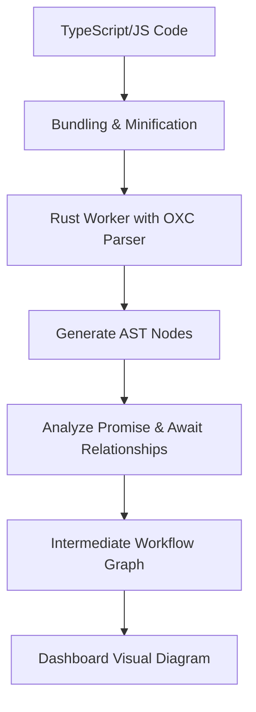

> **한 줄 요약** — Cloudflare는 추상 구문 트리(AST) 분석을 통해 복잡한 TypeScript 코드를 시각적인 워크플로우 다이어그램으로 자동 변환하여 코드의 실행 흐름을 직관적으로 파악하게 돕습니다.

## 왜 코드를 다이어그램으로 그려야 할까?

복잡한 비즈니스 로직을 담은 코드는 시간이 지날수록 읽기 어려워집니다. 특히 여러 단계가 병렬로 실행되거나 조건에 따라 분기되는 워크플로우(Workflow)의 경우, 텍스트로 된 코드만 보고 전체 구조를 파악하기란 쉽지 않습니다. 최근에는 코딩 에이전트가 생성한 코드를 검토해야 하는 상황도 늘어나면서, 내가 작성하지 않은 코드의 실행 흐름을 빠르게 이해해야 할 필요성이 커졌습니다.

대부분의 워크플로우 엔진은 시각화를 위해 JSON이나 YAML 같은 선언적 설정을 사용하거나 드래그 앤 드롭 방식의 빌더를 제공합니다. 하지만 Cloudflare Workflows는 순수하게 코드로 동작합니다. 루프, 조건문, 중첩된 함수 호출이 포함된 동적인 코드를 어떻게 정확한 다이어그램으로 옮길 수 있을까요? 이 글에서는 Cloudflare가 추상 구문 트리(AST, Abstract Syntax Tree)를 활용해 이 문제를 해결한 과정을 살펴봅니다.

## AST를 활용한 코드 분석과 시각화 원리

Cloudflare는 워크플로우가 배포될 때 코드를 정적으로 분석하여 그래프를 생성합니다. 런타임에 다이어그램을 그리는 것이 아니라, 배포 시점에 전체 스크립트를 파악하는 방식입니다. 이 과정에서 핵심적인 역할을 하는 것이 바로 AST입니다.

### 동적 실행 모델의 난제

Cloudflare Workflows는 단계(Step)를 순차적으로만 실행하지 않습니다. `await` 키워드 없이 호출된 단계들은 병렬로 실행되며, 엔진은 이를 동시에 처리합니다. 다이어그램을 정확히 그리려면 어떤 단계가 차단(Blocking)되는지, 어떤 단계가 병렬로 흐르는지 파악해야 합니다.

실제 배포되는 코드는 번들링 과정에서 변수명이 짧게 변하고 구조가 압축되는 경량화(Minification) 과정을 거칩니다. 사람이 읽기 힘든 이 기계적인 코드를 분석하기 위해 Cloudflare는 Rust 기반의 JavaScript 파서인 OXC(JavaScript Oxidation Compiler)를 선택했습니다.

### 데이터 흐름 파악을 위한 단계별 과정

1.  배포된 워크플로우 스크립트를 가져와 OXC 파서로 전달합니다.
2.  JavaScript 코드를 AST 노드 타입으로 변환합니다.
3.  `step.do` 호출과 함수 간의 관계를 추적하여 중간 그래프를 생성합니다.
4.  `Promise`와 `await` 관계를 분석해 병렬 및 직렬 연결을 결정합니다.
5.  최종적으로 대시보드에서 렌더링 가능한 그래프 데이터로 변환합니다.

## 실무에서 마주하는 정적 분석의 한계와 극복

현업에서 정적 분석 도구를 도입할 때 가장 골치 아픈 지점은 유연한 코드 패턴입니다. 개발자는 단계를 함수로 감싸기도 하고, 다른 모듈에서 불러온 함수 안에서 단계를 실행하기도 합니다.

Cloudflare는 이를 해결하기 위해 함수 호출 계층을 추적합니다. 예를 들어 `functionA`가 내부에서 `functionB`를 호출하고, `functionB` 안에서 실제 워크플로우 단계인 `step.do`가 실행된다면, 다이어그램에는 `functionA`와 `functionB`를 모두 포함시켜 전체 맥락을 유지합니다. 반면 워크플로우 단계와 무관한 단순 로그 출력 함수 등은 그래프에서 제외하여 가독성을 높입니다.

### 번들러에 따른 코드 변화 대응

Vite나 Rspack 같은 번들러를 사용하면 결과물인 JavaScript 코드의 형태가 미묘하게 달라집니다. 어떤 번들러는 클래스 구조를 유지하지만, 어떤 번들러는 이를 완전히 다른 형태의 즉시 실행 함수로 바꿀 수도 있습니다. Cloudflare는 Rust로 작성된 워커(Worker)를 WebAssembly(Wasm) 형태로 실행하여, 다양한 형태의 경량화된 코드를 빠르고 정확하게 분석하도록 설계했습니다.

## 나만의 시각: 코드와 시각화의 간극에 대하여

이 기술 블로그를 읽으며 가장 공감했던 부분은 시각화가 단순히 예쁜 그림을 그리는 것이 아니라 진단 도구로 작동해야 한다는 점입니다. 실무에서 복잡한 분산 시스템을 설계하다 보면, 내가 의도한 대로 재시도(Retry) 로직이 걸려 있는지나 병렬 처리가 제대로 이루어지는지 확인하기 위해 수백 줄의 코드를 뒤져야 할 때가 많습니다.

### 코드가 곧 설계도가 되는 세상

과거에는 설계도(다이어그램)를 먼저 그리고 코드를 맞추는 방식이 유행했습니다. 하지만 요구사항이 변하면 설계도는 금세 낡은 유물이 됩니다. Cloudflare의 접근 방식처럼 코드가 유일한 진실의 원천(Source of Truth)이 되고, 여기서 다이어그램을 추출하는 방식이 실무적으로 훨씬 지속 가능합니다.

다만 정적 분석에는 명확한 한계가 있습니다. 실행 시점에 결정되는 동적 경로(Dynamic Path)나 조건부 로직의 모든 경우의 수를 완벽하게 시각화하기는 어렵습니다. Cloudflare도 현재 이 기능을 베타로 운영하며 지속적으로 개선하고 있다고 밝힌 이유일 것입니다.

### 트레이드오프: 분석 비용과 정확도

모든 배포마다 AST를 분석하고 그래프를 생성하는 것은 추가적인 컴퓨팅 자원을 소모합니다. 하지만 배포 시점에 단 한 번 수행함으로써 런타임 성능에는 영향을 주지 않으면서 운영 단계에서의 가시성을 확보했다는 점이 인상적입니다. 특히 Rust와 Wasm을 활용해 분석 속도를 최적화한 대목은 성능과 기능 사이의 균형을 잘 잡은 사례라고 생각합니다.

## 실무 관점에서의 코멘트

실제로 대규모 데이터 파이프라인이나 승인 절차가 복잡한 시스템을 관리하다 보면, 신규 입사자에게 전체 흐름을 설명하는 데만 며칠이 걸리기도 합니다. 이런 자동화된 다이어그램이 있다면 온보딩 비용을 획기적으로 줄일 수 있습니다.

현업에서 비슷한 고민을 하다 보면 결국 문서를 최신 상태로 유지하는 데 실패하곤 합니다. 만약 여러분의 팀에서 워크플로우 엔진을 직접 구축하거나 도입할 계획이 있다면, Cloudflare처럼 코드로부터 메타데이터를 추출해 시각화하는 방향을 진지하게 고려해보길 권합니다.

## 정리하며

Cloudflare의 워크플로우 다이어그램 생성 방식은 정적 분석 기술이 개발자 경험(DX)을 어떻게 개선할 수 있는지 보여주는 좋은 예시입니다. OXC 파서와 Rust 워커를 활용해 경량화된 코드의 장벽을 넘고, 복잡한 비동기 로직을 시각화한 과정은 기술적으로 매우 영리한 선택입니다.

지금 바로 작성 중인 워크플로우 코드가 있다면, 이를 다이어그램으로 옮겼을 때 어떤 모양일지 상상해 보세요. 내가 의도한 병렬 처리가 실제로는 직렬로 동작하고 있지는 않은지, 혹은 불필요하게 복잡한 분기가 섞여 있지는 않은지 확인하는 계기가 될 것입니다.

## 참고 자료

- [원문] [How we use Abstract Syntax Trees (ASTs) to turn Workflows code into visual diagrams](https://blog.cloudflare.com/workflow-diagrams/) — Cloudflare Blog
- [관련] [Introducing Custom Regions for precision data control](https://blog.cloudflare.com/custom-regions/) — Cloudflare Blog
- [관련] [Finding performance bottlenecks with Pyroscope and Alloy](https://grafana.com/blog/finding-performance-bottlenecks-with-pyroscope-and-alloy-an-example-using-ton-blockchain/) — Grafana Blog