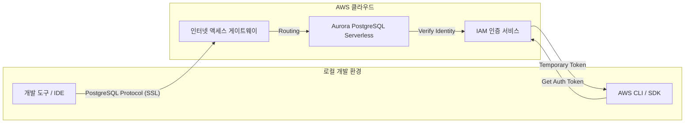

> **한 줄 요약** — 복잡한 VPC 설정 없이 몇 번의 클릭만으로 즉시 사용 가능한 아마존 오로라 포스트그레SQL(Amazon Aurora PostgreSQL) 서버리스 데이터베이스를 생성하고 인터넷을 통해 안전하게 연결할 수 있습니다.

## 이 주제를 꺼낸 이유

클라우드 환경에서 관계형 데이터베이스를 처음 구축할 때 마주하는 가장 큰 장벽은 성능이나 쿼리 작성이 아닙니다. 오히려 가상 프라이빗 클라우드(VPC, Virtual Private Cloud)를 설계하고 서브넷을 나누며 보안 그룹과 라우팅 테이블을 꼬이지 않게 설정하는 초기 인프라 구성 단계입니다. 아이디어를 코드로 옮기기도 전에 네트워크 설정에서 기운을 빼는 경우가 많습니다.

최근 AWS가 발표한 아마존 오로라 포스트그레SQL(Amazon Aurora PostgreSQL) 서버리스의 익스프레스 구성(Express configuration)은 이러한 번거로움을 완전히 걷어냈습니다. 단 몇 초 만에 데이터베이스를 생성하고 로컬 개발 도구에서 즉시 접속할 수 있다는 점은 개발 속도를 비약적으로 높여줍니다. 특히 복잡한 설정보다는 비즈니스 로직에 집중해야 하는 초기 프로젝트나 프로토타이핑 단계에서 이 기능이 주는 이점은 매우 큽니다.

실무에서 새로운 기술을 검증하거나 작은 사이드 프로젝트를 시작할 때 인프라 구성에 들어가는 공수를 줄이는 것은 생산성과 직결됩니다. 이번 업데이트가 단순히 생성 속도가 빨라진 것을 넘어 개발자의 워크플로우를 어떻게 바꾸어 놓을지 살펴보겠습니다.

## 핵심 내용 정리

이번 업데이트의 핵심은 익스프레스 구성(Express configuration)이라는 새로운 배포 방식입니다. 기존에는 데이터베이스를 만들기 위해 네트워크 환경부터 하나하나 지정해야 했지만, 이제는 미리 정의된 최적의 기본값을 사용하여 클릭 두 번으로 데이터베이스 생성을 마칠 수 있습니다.

가장 눈에 띄는 변화는 네트워크 접근 방식입니다. 새로운 익스프레스 구성으로 생성된 오로라 클러스터는 사용자의 VPC 내부에 종속되지 않고 자체적인 인터넷 액세스 게이트웨이(Internet access gateway)를 통해 연결됩니다. 별도의 VPN이나 복잡한 터널링 설정 없이도 외부 개발 도구에서 포스트그레SQL(PostgreSQL) 와이어 프로토콜을 사용해 바로 접속할 수 있습니다.

이 과정에서 보안은 AWS 식별 및 액세스 관리(IAM, Identity and Access Management) 인증을 통해 강화되었습니다. 관리자 계정에 대해 기본적으로 비밀번호 없는 인증 방식인 IAM 인증이 활성화되므로, 유출 위험이 있는 고정 비밀번호 대신 15분간 유효한 임시 토큰을 사용하여 데이터베이스에 접근하게 됩니다.



생성된 데이터베이스는 필요에 따라 설정을 유연하게 변경할 수 있습니다. 서버리스 인스턴스의 용량 범위(ACU, Aurora Capacity Units)를 조정하거나 읽기 전용 복제본(Read Replica)을 추가하여 고가용성을 확보하는 것도 가능합니다. 또한 AWS 프리 티어(Free Tier) 범위에 포함되어 초기 학습이나 테스트 비용 부담을 줄여준다는 점도 긍정적입니다.

실제로 CLI를 통해 익스프레스 구성으로 데이터베이스를 생성하는 명령은 다음과 같이 매우 단순합니다.

`aws rds create-db-cluster --db-cluster-identifier my-express-db --engine aurora-postgresql --with-express-configuration`

이 명령 한 줄이면 클러스터와 인스턴스가 동시에 생성되며, 몇 초 후 사용 가능한 상태로 바뀝니다. 연결 시에는 IAM 토큰을 활용한 파이썬(Python) 코드를 통해 보안 연결을 수립할 수 있습니다.

```python
import psycopg2
import boto3

# IAM 인증 토큰 생성
auth_token = boto3.client('rds', region_name='ap-northeast-2').generate_db_auth_token(
    DBHostname='my-express-db-instance-1.abc.ap-northeast-2.rds.amazonaws.com',
    Port=5432,
    DBUsername='postgres',
    Region='ap-northeast-2'
)

# 데이터베이스 연결
conn = psycopg2.connect(
    host='my-express-db-instance-1.abc.ap-northeast-2.rds.amazonaws.com',
    port=5432,
    database='postgres',
    user='postgres',
    password=auth_token,
    sslmode='require'
)
```

## 내 생각 & 실무 관점

인프라 엔지니어가 없는 팀이나 풀스택 개발자가 혼자 모든 것을 책임져야 하는 환경에서 VPC 설정은 늘 골칫거리입니다. 특히 서브넷 그룹을 만들고 인터넷 게이트웨이를 연결한 뒤 보안 그룹에서 내 IP를 허용하는 일련의 과정은 숙련된 사람에게도 귀찮은 작업입니다. 이번 업데이트는 이러한 인지 부하(Cognitive load)를 획기적으로 줄여준다는 점에서 큰 점수를 주고 싶습니다.

최근 구글 클라우드 넥스트(Google Cloud Next) 같은 컨퍼런스에서도 강조되듯, 이제 개발의 중심은 에이전트 기반 AI(Agentic AI)와 빠른 프로토타이핑으로 이동하고 있습니다. 인프라를 직접 구축하기보다 추상화된 서비스를 활용해 결과물을 빨리 내놓는 것이 중요해진 셈입니다. 오로라의 이번 변화도 Vercel이나 v0 같은 현대적인 개발 플랫폼과의 연동을 염두에 둔 포석으로 보입니다. 자연어로 앱을 만들고 데이터베이스까지 즉시 붙여버리는 워크플로우에 오로라가 자연스럽게 녹아들 수 있게 되었습니다.

다만 실무적인 관점에서 우려되는 부분도 있습니다. 인터넷 액세스 게이트웨이를 통해 공용 네트워크에 데이터베이스가 노출되는 방식은 편리하지만, 보안 정책이 엄격한 기업 환경에서는 도입이 망설여질 수 있습니다. 물론 IAM 인증과 SSL 연결을 강제하지만, 네트워크 레벨에서 접근 자체를 차단하는 기존의 프라이빗 서브넷 방식과는 보안 모델이 다릅니다. 따라서 이 방식은 초기 개발이나 테스트, 혹은 외부 서비스와의 빠른 연동이 필요한 특정 유즈케이스에 한정해서 사용하는 것이 현명해 보입니다.

또한 서버리스 특성상 용량이 0으로 내려갔다가 다시 요청이 올 때 발생하는 콜드 스타트(Cold Start) 지연 시간이 서비스의 성격과 맞는지도 따져봐야 합니다. 하지만 오로라 서버리스 v2는 이 부분을 많이 개선했기에, 일반적인 웹 애플리케이션에서는 큰 문제가 되지 않을 것입니다. 오히려 사용하지 않을 때 비용이 거의 나가지 않는다는 점이 사이드 프로젝트 운영자들에게는 더 큰 매력으로 다가올 것입니다.

비슷한 고민을 하던 과거의 경험을 떠올려 보면, 테스트용 DB를 하나 띄우기 위해 기존 운영망의 VPC 설정을 건드리다가 실수로 라우팅을 꼬이게 했던 아찔한 기억이 있습니다. 익스프레스 구성을 사용하면 운영 환경과 완전히 분리된 독립적인 엔드포인트를 즉시 얻을 수 있으므로, 이런 인적 실수를 방지하는 효과도 기대할 수 있습니다.

## 정리

아마존 오로라 포스트그레SQL의 익스프레스 구성은 개발자가 인프라의 복잡성에 가로막히지 않고 즉시 코드를 작성할 수 있는 환경을 제공합니다. 클릭 몇 번으로 프로덕션급 성능을 가진 데이터베이스를 확보하고, IAM 기반의 안전한 인증으로 로컬에서 바로 접속할 수 있다는 것은 현대적인 개발 흐름에 매우 부합하는 변화입니다.

지금 바로 AWS 콘솔에 접속해서 대시보드의 로켓 아이콘을 클릭해 보세요. 프리 티어를 활용해 비용 부담 없이 새로운 연결 방식을 테스트해 볼 수 있습니다. 특히 Vercel 같은 플랫폼을 사용 중이라면 AI 도구와 연동하여 데이터베이스 스키마 생성부터 애플리케이션 배포까지 얼마나 빨라질 수 있는지 직접 체감해 보시길 권합니다.

## 참고 자료
- [원문] [Announcing Amazon Aurora PostgreSQL serverless database creation in seconds](https://aws.amazon.com/blogs/aws/announcing-amazon-aurora-postgresql-serverless-database-creation-in-seconds/) — AWS Blog
- [관련] Customize your AWS Management Console experience with visual settings — AWS Blog
- [관련] Maintaining Open Source in the AI Era — DEV Community
- [관련] You can't stream the energy: A developer's guide to Google Cloud Next '26 — Google Developers