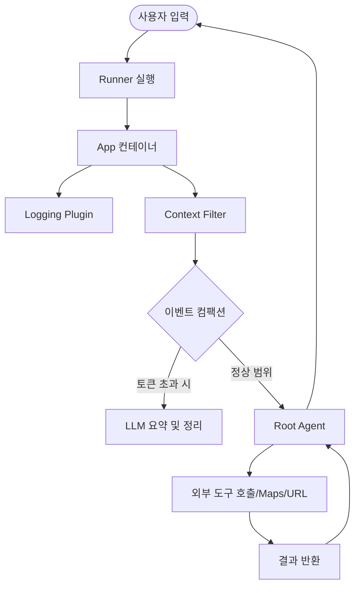

> **한 줄 요약** — 구글이 발표한 ADK for Java 1.0.0은 자바 생태계에서 엔터프라이즈급 AI 에이전트를 구축하기 위한 강력한 도구 모음이며, 특히 컨텍스트 관리와 인간 개입형 워크플로우를 체계화했습니다.

## 이 주제를 꺼낸 이유

AI 에이전트(AI Agent) 개발 시장은 그동안 파이썬(Python) 중심으로 흘러왔습니다. 하지만 실제 기업용 대규모 시스템을 운영하는 환경에서는 자바(Java)의 견고한 인프라와 타입 안정성이 절실할 때가 많습니다. 구글이 에이전트 개발 키트(Agent Development Kit, 이하 ADK)의 자바 버전을 1.0.0 정식 릴리즈로 끌어올린 것은, 이제 자바 개발자들도 실험실 수준을 넘어선 실무용 AI 서비스를 본격적으로 만들 때가 되었음을 의미합니다.

특히 이번 업데이트에는 구글 맵(Google Maps)을 활용한 그라운딩(Grounding)이나 컨텍스트 윈도우(Context Window)를 효율적으로 관리하는 기술이 포함되었습니다. 이는 단순히 모델에 질문을 던지는 수준을 넘어, 실시간 데이터를 조회하고 복잡한 비즈니스 로직을 수행하는 에이전트를 설계하는 데 핵심적인 역할을 합니다.

## 핵심 내용 정리

ADK for Java 1.0.0의 핵심은 에이전트가 외부 세계와 상호작용하는 방식을 표준화하고, 대규모 언어 모델(LLM)의 한계인 컨텍스트 용량 문제를 공학적으로 해결한 데 있습니다.

### 1. 외부 데이터와 연결하는 강력한 도구들

에이전트는 LLM이 가진 지식에만 의존하지 않고 도구(Tool)를 사용해 최신 정보를 가져옵니다. 이번 릴리즈에서는 구글 맵 정보를 직접 활용하는 `GoogleMapsTool`과 특정 URL의 내용을 긁어오는 `UrlContextTool`이 추가되었습니다.

```java
var restaurantGuide = LlmAgent.builder()
    .name("restaurant-guide")
    .description("여행자를 위한 맛집 가이드")
    .instruction("""
        당신은 미식가를 위한 맛집 가이드입니다.
        특정 위치 주변의 식당을 검색할 때는 `google_maps` 도구를 사용하세요.
    """)
    .model("gemini-2.5-flash")
    .tools(new GoogleMapsTool())
    .build();
```

이 코드를 실행하면 에이전트는 사용자가 묻는 위치의 실제 식당 리뷰와 평점을 기반으로 답변합니다. 또한 `UrlContextTool`을 사용하면 별도의 크롤링 파이프라인을 구축하지 않고도 프롬프트에 포함된 웹 페이지 내용을 즉시 분석할 수 있습니다.

### 2. 앱(App)과 플러그인(Plugin) 아키텍처

여러 개의 에이전트가 협업하는 구조에서는 로깅이나 보안 규칙을 개별 에이전트마다 설정하기 번거롭습니다. ADK는 이를 `App`이라는 컨테이너로 묶고, `Plugin`을 통해 전역적으로 제어합니다.

- LoggingPlugin: 모든 에이전트의 실행 과정과 LLM 요청/응답을 구조화된 로그로 남깁니다.
- GlobalInstructionPlugin: 모든 에이전트에게 공통적으로 적용할 페르소나나 안전 규칙을 주입합니다.
- ContextFilterPlugin: 오래된 대화 내역을 걸러내어 컨텍스트 윈도우를 최적화합니다.

### 3. 컨텍스트 엔지니어링과 이벤트 컴팩션(Event Compaction)

대화가 길어지면 토큰 비용이 상승하고 모델의 응답 속도가 느려집니다. ADK는 이벤트 컴팩션(Event Compaction) 기능을 통해 이를 자동 관리합니다. 일정 토큰이 넘어가면 과거 대화를 요약(Summarization)하거나 슬라이딩 윈도우 방식으로 오래된 데이터를 삭제하여 최적의 상태를 유지합니다.



### 4. 인간 개입형(Human-in-the-Loop) 워크플로우

금융 결제나 시스템 설정 변경처럼 위험 요소가 있는 작업은 에이전트가 독단적으로 수행해서는 안 됩니다. `ToolConfirmation` 기능을 사용하면 에이전트가 실행을 잠시 멈추고 사용자의 승인을 기다리는 프로세스를 쉽게 구현할 수 있습니다. 사용자가 승인하면 중단되었던 지점부터 다시 실행이 재개됩니다.

## 내 생각 & 실무 관점

원문에서 소개된 기능 중 실무적으로 가장 와닿는 부분은 이벤트 컴팩션(Event Compaction)입니다. 현업에서 에이전트를 운영하다 보면 처음에는 잘 작동하던 챗봇이 대화가 20회 이상 넘어가면서부터 엉뚱한 소리를 하거나, 비용이 기하급수적으로 늘어나는 상황을 자주 겪습니다.

보통은 개발자가 직접 리스트를 슬라이싱하거나 별도의 요약 로직을 짜야 했는데, 이를 프레임워크 레벨에서 `EventsCompactionConfig` 설정만으로 해결할 수 있게 된 점은 생산성 측면에서 큰 이득입니다. 다만, 요약 과정에서 에이전트가 반드시 기억해야 할 핵심 파라미터가 유실될 위험이 있으므로, 어떤 이벤트를 보존할지에 대한 세밀한 필터링 전략이 병행되어야 합니다.

또한 자바 기반의 에이전트 개발은 엔터프라이즈 환경에서 강력한 장점을 가집니다. 기존에 운영 중인 스프링(Spring) 기반의 마이크로서비스 아키텍처(MSA)에 에이전트를 통합할 때, 파이썬 서비스를 따로 띄워 gRPC나 REST로 통신하는 방식보다 라이브러리 형태로 직접 통합하는 것이 지연 시간(Latency)이나 인프라 관리 면에서 훨씬 유리하기 때문입니다.

구글 맵 툴(GoogleMapsTool)의 도입도 흥미롭습니다. 단순히 지도를 보여주는 것이 아니라, 에이전트가 위치 데이터라는 현실 세계의 좌표를 이해하고 논리적 추론에 활용할 수 있게 된 것입니다. 예를 들어 물류 시스템에서 현재 차량의 위치와 목적지 사이의 맛집이 아니라, 하역장의 혼잡도를 고려한 최적 경로상의 식당을 추천하는 식의 고도화된 비즈니스 시나리오가 가능해집니다.

실제로 이런 시스템을 구축할 때 주의할 점은 트레이드오프(Trade-off)입니다. 모든 기능을 에이전트에게 맡기면 실행 속도가 느려집니다. 따라서 복잡한 계산이나 정형화된 데이터 조회는 기존의 레거시 API로 처리하고, 에이전트는 사용자의 의도를 해석하고 적절한 API를 호출하는 오케스트레이터(Orchestrator) 역할에 집중시키는 설계가 필요합니다.

## 정리

ADK for Java 1.0.0은 자바 개발자가 AI 에이전트를 구축할 때 겪는 고질적인 문제들인 상태 관리, 컨텍스트 최적화, 도구 연동을 깔끔하게 정리해 주는 프레임워크입니다. 특히 `App`과 `Plugin` 구조는 대규모 서비스에서 공통 기능을 일관되게 적용할 수 있는 길을 열어주었습니다.

독자 여러분이 당장 해볼 수 있는 것은, 기존에 파이썬으로 구현했던 간단한 RAG(Retrieval-Augmented Generation) 시스템이나 챗봇을 ADK for Java로 옮겨보는 것입니다. 특히 `UrlContextTool`을 활용해 사내 위키나 기술 문서 URL을 분석하는 에이전트를 만들어보면, 외부 도구 연동이 얼마나 간편해졌는지 체감할 수 있을 것입니다.

## 참고 자료
- [원문] [Announcing ADK for Java 1.0.0: Building the Future of AI Agents in Java](https://developers.googleblog.com/announcing-adk-for-java-100-building-the-future-of-ai-agents-in-java/) — Google Developers
- [관련] Developer’s Guide to Building ADK Agents with Skills — Google Developers
- [관련] Supercharge your AI agents: The New ADK Integrations Ecosystem — Google Developers