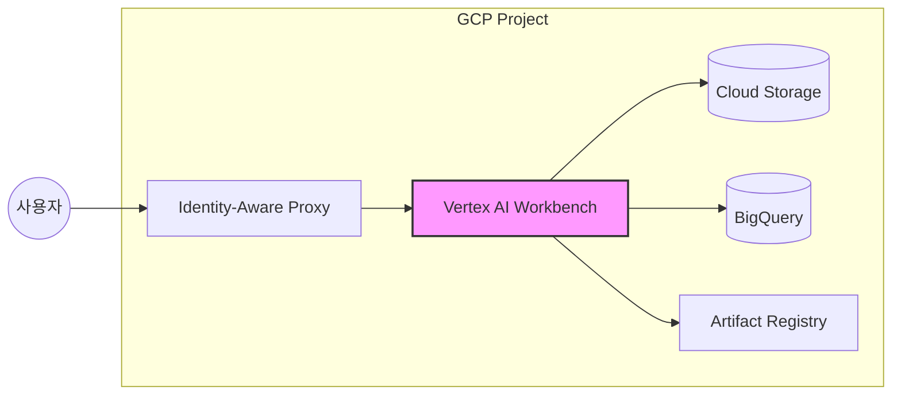

> **한 줄 요약** — 테라폼(Terraform)을 통해 보안과 비용 효율성을 갖춘 구글 클라우드(GCP) Vertex AI Workbench 환경을 코드로 관리하고 팀 표준화된 개발 환경을 구축하는 방법을 다룹니다.

## 이 주제를 꺼낸 이유

머신러닝(ML) 프로젝트를 시작할 때 가장 먼저 마주하는 난관은 개발 환경의 파편화입니다. 로컬 환경에서는 잘 돌아가던 코드가 클라우드로 옮겨가면 라이브러리 버전 충돌이나 권한 문제로 멈춰 서는 일이 빈번합니다. 특히 여러 명의 데이터 사이언티스트가 협업하는 환경에서 각자 콘솔에서 클릭으로 인스턴스를 생성하면 보안 정책이 누락되거나, 불필요하게 켜져 있는 GPU 인스턴스 때문에 비용이 폭증하기도 합니다.

이러한 문제를 해결하기 위해 인프라를 코드로 관리(Infrastructure as Code, IaC)하는 테라폼을 Vertex AI Workbench와 결합하는 방안을 살펴보려 합니다. 일관된 환경을 보장하면서도 보안과 비용이라는 두 마리 토끼를 잡을 수 있는 실무적인 접근법이 필요하기 때문입니다.

## 핵심 내용 정리

Vertex AI Workbench는 구글 클라우드에서 제공하는 JupyterLab 기반의 개발 환경입니다. 단순한 노트북을 넘어 데이터 분석, 모델 학습, 배포까지 이어지는 머신러닝 워크플로우의 중심 역할을 합니다. 이를 테라폼으로 구성할 때 핵심이 되는 구성 요소는 다음과 같습니다.

### Workbench 구성 요소 및 역할

| 구성 요소 | 역할 | 비고 |
| :--- | :--- | :--- |
| Workbench Instance | Compute Engine 기반의 JupyterLab 환경 | 실제 연산이 일어나는 곳 |
| VM Image | 프레임워크가 설치된 사전 빌드 이미지 | TensorFlow, PyTorch 등 포함 |
| Data Disk | 데이터 및 노트북 저장용 영구 디스크 | 인스턴스 삭제 시에도 데이터 유지 |
| Service Account | GCP 리소스 접근 권한 제어 | GCS, BigQuery 접근 권한 부여 |
| Network | VPC 및 서브넷 설정 | 외부 노출 차단 및 내부 통신 보안 |

### 보안과 효율을 위한 네트워크 및 IAM 설정

실무에서 가장 신경 써야 할 부분은 네트워크 격리입니다. 모든 인스턴스에 공인 IP를 할당하는 것은 보안상 위험합니다. `private_ip_google_access = true` 설정을 통해 공인 IP 없이도 구글 API에 접근할 수 있도록 구성해야 합니다.

```hcl
# VPC 및 서브넷 구성 예시
resource "google_compute_subnetwork" "ml_subnet" {
  name                     = "ml-workspace-subnet"
  ip_cidr_range            = "10.0.1.0/24"
  region                   = "us-central1"
  network                  = google_compute_network.ml_vpc.id
  private_ip_google_access = true # 구글 API 내부 접근 허용
}
```

또한 서비스 계정(Service Account)에는 최소 권한 원칙을 적용합니다. 데이터 사이언티스트가 데이터를 읽어야 하는 버킷(GCS)이나 쿼리해야 하는 테이블(BigQuery)에 대해서만 명확히 권한을 부여합니다.

### 인스턴스 자동화와 비용 제어

가장 중요한 리소스인 `google_workbench_instance`를 정의할 때, `idle-timeout-seconds`를 설정하는 것이 비용 관리의 핵심입니다. 사용자가 작업을 멈추고 일정 시간이 지나면 자동으로 인스턴스를 중지시켜 불필요한 GPU 과금을 방지합니다.



## 내 생각 & 실무 관점

원문에서 강조하는 테라폼 기반의 워크벤치 구축은 단순한 자동화 이상의 의미가 있습니다. 실제 현업에서 비슷한 고민을 하다 보면, 인프라의 가시성(Visibility) 확보가 얼마나 중요한지 깨닫게 됩니다.

### 데이터 지속성과 환경 분리의 트레이드오프

실제로 이런 상황에서는 부트 디스크(Boot Disk)와 데이터 디스크(Data Disk)를 엄격히 분리하는 것이 유리합니다. 라이브러리 꼬임 문제로 인스턴스를 새로 만들어야 할 때, 데이터 디스크만 유지한 채 인스턴스를 재생성하면 작업 중이던 노트북과 데이터는 그대로 보존하면서 깨끗한 OS 환경에서 다시 시작할 수 있습니다. 

다만, 커스텀 컨테이너 이미지를 사용할 때는 주의가 필요합니다. 모든 라이브러리를 이미지에 담으려다 보면 이미지 크기가 커져 인스턴스 시작 속도가 느려질 수 있습니다. 핵심 프레임워크는 이미지에 담고, 유동적인 라이브러리는 포스트 스타트업 스크립트(Post-startup script)를 통해 설치하는 방식이 더 유연할 때가 많습니다.

### 비용 최적화의 숨은 복병: GPU 쿼터

많은 분이 테라폼 코드를 완벽히 짰음에도 불구하고 `terraform apply` 과정에서 에러를 마주하곤 합니다. 대부분은 GPU 할당량(Quota) 문제입니다. GCP 프로젝트의 기본 GPU 쿼터는 0인 경우가 많아, 인프라 배포 전 미리 구글 측에 쿼터 증설을 요청해야 합니다. T4나 A100 같은 특정 GPU 모델은 승인까지 며칠이 소요될 수 있으므로 프로젝트 일정에 이를 반드시 반영해야 합니다.

### 협업을 위한 표준 스크립트 활용

팀 내에서 공통으로 사용하는 유틸리티 함수나 인증 방식이 있다면 이를 포스트 스타트업 스크립트에 포함하는 것을 추천합니다. 

```bash
#!/bin/bash
# 공유 라이브러리 설치 및 환경 변수 설정
pip install git+https://github.com/my-org/ml-internal-utils.git
echo "export ML_ENV=production" >> /etc/environment
```

이렇게 하면 새로운 팀원이 합류했을 때 "환경 설정 가이드"를 따라 수동으로 시간을 버리는 일을 막을 수 있습니다. 코드가 곧 문서가 되는 셈입니다.

## 정리

Vertex AI Workbench를 테라폼으로 관리하면 머신러닝 개발 환경을 표준화하고, 보안을 강화하며, 비용을 효율적으로 통제할 수 있습니다. 수동으로 인스턴스를 생성하던 방식에서 벗어나 인프라를 코드로 관리하기 시작하면, 모델 개발 자체에 더 집중할 수 있는 안정적인 기반이 마련됩니다.

지금 바로 사용 중인 GCP 프로젝트에서 자주 사용하는 라이브러리 목록을 정리해 보세요. 그리고 이를 테라폼의 포스트 스타트업 스크립트로 옮겨보는 것부터 시작해 보길 권장합니다. 작은 자동화가 팀 전체의 생산성을 결정짓는 큰 차이를 만듭니다.

## 참고 자료
- [원문] [Vertex AI Workbench with Terraform: Your ML Workspace on GCP 🔬](https://dev.to/suhas_mallesh/vertex-ai-workbench-with-terraform-your-ml-workspace-on-gcp-4gn6) — DEV Community
- [관련] Google Cloud Workbench Instance Terraform Documentation — HashiCorp
- [관련] Best practices for Vertex AI Workbench — Google Cloud Docs