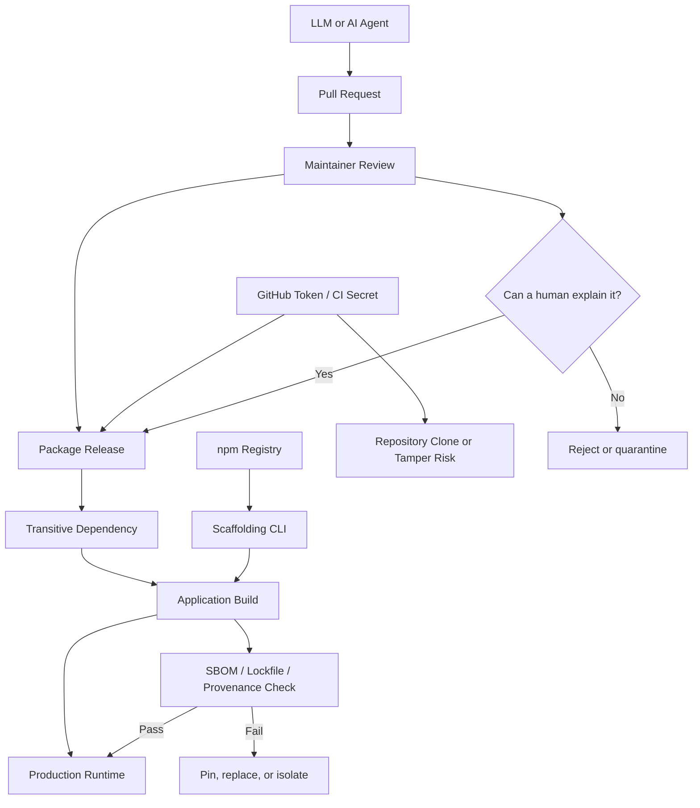

> 한 줄 요약: LLM 생성 코드가 의존성에 섞이는 문제는 취향 논쟁이 아니라 공급망 보안, 리뷰 비용, 유지보수 책임의 문제다. 먼저 볼 것은 출처, 검증 가능성, 장애가 났을 때 고칠 사람이 남아 있는 구조다.

## 왜 지금 이슈인가

LLM이 만든 코드, 오픈소스 공급망 보안, 에이전트가 올리는 PR은 이제 따로 보기 어렵다. 더 까다로운 질문은 “누가 썼나”가 아니라 “왜 이렇게 만들었는지 설명할 사람이 있나”다.

git-annex의 Joey Hess는 LLM 생성 코드가 들어간 의존성을 피하려고 의존성 트리를 계속 점검했다고 썼다. 그 과정에서 큰 변경이 다음 릴리스에서 설명 없이 되돌려진 사례, 2만 6천 줄 규모 코드베이스에 1만 줄 변경과 1,489줄짜리 이상한 커밋 메시지가 붙은 사례, 다른 프로젝트 코드를 복사하라는 프롬프트에 가까운 변경을 봤다고 한다.

이 이야기가 Lobsters, Hacker News 같은 개발자 커뮤니티에서 쉽게 불붙는 이유는 단순하다. 의존성은 내 코드가 아니지만 내 시스템에서 실행된다. 리뷰하지 않은 코드는 보통 내 책임이 아니라고 느끼지만, 장애나 침해가 나면 운영 책임은 결국 서비스 팀으로 돌아온다.

Godot의 생성 코드 기여 금지 논쟁도 같은 맥락에 있다. Godot 쪽은 LLM이 만든 PR, 에이전트가 제출한 PR, 사람 간 커뮤니케이션에 들어간 생성 텍스트까지 제한하겠다는 방향을 밝혔다. 쟁점은 도구 사용 여부보다 리뷰어의 시간을 어디에 써야 하느냐다. 피드백이 사람을 성장시키지 않고 기계 출력 재시도에만 쓰인다면, 리뷰는 멘토링이 아니라 필터링 작업이 된다.

npm 공급망 사고 사례까지 보면 위험의 윤곽이 더 선명해진다. Grafana는 TanStack npm 공급망 랜섬 사고 이후 조사 결과를 공개하면서 고객 프로덕션 시스템 접근은 없었고 Grafana Cloud도 영향받지 않았다고 밝혔다. 다만 GitHub 환경으로 제한된 사고였음에도, 놓친 자격 증명 하나로 전체 저장소 컬렉션이 복제되는 일이 있었다고 적었다.

LLM 코드 논쟁은 품질 취향 문제가 아니다. 자동 생성 코드, 자동화된 PR, 스캐폴딩 CLI, 패키지 설치 스크립트, GitHub 권한, 릴리스 파이프라인이 이어질 때 어디서 신뢰를 끊고 다시 검증할지에 대한 문제다.

## 커뮤니티에서 갈리는 지점

한쪽은 LLM 생성 코드를 개발 도구의 자연스러운 변화로 본다. 반복 작업을 줄이고, 포맷 변경이나 보일러플레이트를 빠르게 처리하고, 익숙하지 않은 언어의 첫 구현을 돕는다는 주장이다. 작은 팀이나 개인 프로젝트에서는 실제로 탐색 속도를 올려주기도 한다.

반대쪽은 비용이 사라진 게 아니라 다른 곳으로 옮겨갔다고 본다. 작성 비용은 낮아졌지만 리뷰, 출처 확인, 라이선스 검토, 회귀 테스트, 유지보수 비용은 남는다. 더 나쁜 경우 작성자는 자신이 제출한 코드를 설명하지 못하고, 리뷰어가 변경 의도와 위험을 거꾸로 추적해야 한다.

Godot 사례에서 커뮤니티가 민감하게 반응한 지점도 여기에 있다. 오픈소스 리뷰는 단순한 게이트가 아니다. 리뷰어가 왜 이 설계가 위험한지 설명하고, 기여자가 그 피드백을 흡수하며 다음 기여자가 되는 구조가 프로젝트를 지탱한다. 에이전트 PR이 늘어나면 이 순환이 끊길 수 있다.

반대로 전면 금지는 현실성이 낮다는 의견도 있다. 생성형 도구 사용 여부를 완벽히 판별하기 어렵고, 사람이 도움을 받아 이해한 뒤 직접 작성한 코드와 에이전트가 만든 코드를 가르는 기준도 애매하다. 그래서 실무에서는 도구 사용 여부보다 증명 가능한 유지보수 능력과 변경 근거를 보는 쪽이 더 잘 작동한다.

코드 리뷰 목적에 대한 논의도 이 흐름과 맞닿아 있다. 리뷰의 핵심 목적을 유지보수하기 어려운 코드를 찾는 데 둔다면, LLM 생성 여부는 위험 신호 중 하나일 뿐이다. 설명 없는 대규모 변경, 불필요한 추상화, 검증되지 않은 의존성, 테스트 없는 자동 수정은 사람이 작성했어도 같은 이유로 위험하다.

create-nest-pro 사례는 다른 각도의 힌트를 준다. npm이 서드파티 패키지의 postinstall 스크립트를 제한하는 이유는 단순한 불편 때문이 아니다. 설치 순간 실행되는 코드가 공급망 공격면이 되기 때문이다. CLI가 최신 패키지 버전을 레지스트리에서 가져오는 설계도 편리하지만, 실행 시점의 레지스트리 상태와 버전 선택 정책에 의존한다.

커뮤니티의 실제 갈등은 도구를 쓰느냐 마느냐가 아니다. 자동화가 만든 산출물을 어떤 신뢰 경계 안에 넣을 것인가, 그 경계를 넘을 때 어떤 증거를 요구할 것인가다.

## 아키텍처 관점에서 볼 점

LLM 생성 코드가 의존성에 들어오는 경로는 생각보다 짧다. 개발자가 직접 붙인 코드만 보면 부족하다. 스캐폴딩 도구, 포맷터 설정 PR, 자동 리팩터링, transitive dependency, CI 봇 권한, 릴리스 토큰이 모두 같은 공급망 안에 있다.

아키텍처 관점에서는 경계를 나눠서 봐야 한다.

첫째는 작성 경계다. 코드가 사람 손에서 왔는지, LLM 초안인지, 에이전트가 제출했는지보다 변경자가 설계 의도와 실패 모드를 설명할 수 있는지가 먼저다. 리뷰어가 질문했을 때 답이 프롬프트 재실행으로만 돌아온다면 그 코드는 운영 가능한 코드가 아니다.

둘째는 배포 경계다. 의존성은 한 번 통과하면 빌드와 런타임으로 들어간다. lockfile, SLSA provenance, SBOM(Software Bill of Materials), 서명된 릴리스, 재현 가능한 빌드가 여기서 의미를 가진다. 모든 팀이 완벽한 공급망 보안 체계를 갖출 수는 없지만, 어떤 패키지가 언제 왜 올라갔는지는 최소한 추적되어야 한다.

셋째는 권한 경계다. Grafana의 사고 공개에서 배울 점은 프로덕션 침해 여부와 별개로 GitHub 환경 자체가 민감한 공격면이라는 점이다. 놓친 자격 증명 하나가 저장소 전체 복제로 이어졌다면, 저장소 접근권은 단순한 개발 편의 권한이 아니라 데이터 유출 권한으로 봐야 한다.

현업에서 비슷한 고민을 하다 보면 리뷰 병목만 눈에 들어오기 쉽다. 하지만 병목을 없애려고 에이전트가 PR을 더 많이 만들게 하면, 검증되지 않은 변경의 총량이 늘어날 수 있다. 문제는 리뷰 속도가 아니라 신뢰할 수 없는 입력의 양일 때가 많다.

LLM 코드 의존성 문제를 줄이는 데 꼭 새 플랫폼이 필요한 것은 아니다. 의존성 업데이트 PR을 분리하고, 자동 생성된 대규모 변경을 한 PR에 섞지 않고, 릴리스 노트 없는 major/minor 업데이트를 보류하고, CI에서 lockfile 차이를 별도 리뷰 대상으로 표시하는 것부터 시작할 수 있다.

## 실무에서 볼 점

도입 전에 먼저 정해야 할 질문은 이렇다.

| 확인 항목 | 봐야 할 이유 | 낮은 비용의 대응 |
|---|---|---|
| AI 생성 코드 허용 범위 | 리뷰 책임과 저작권 리스크가 달라짐 | 기여 가이드에 disclosure 요구 |
| 대규모 자동 변경 기준 | 리뷰어가 의미 단위로 검토하기 어려움 | 포맷 변경과 로직 변경 PR 분리 |
| 의존성 출처 | transitive dependency는 놓치기 쉬움 | lockfile diff와 SBOM 생성 |
| 설치 시 실행 코드 | postinstall류는 공격면이 큼 | 스크립트 실행 제한, 패키지 검토 |
| GitHub/CI 권한 | 저장소 복제와 릴리스 변조 가능 | 최소 권한, 토큰 만료, rotation 점검 |
| 유지보수 가능성 | 장애 시 설명할 사람이 필요 | 리뷰에서 설계 의도와 롤백 경로 확인 |

LLM 보조 개발을 전면 금지할 필요는 없을 수 있다. 하지만 의존성이나 공개 프로젝트 기여에서는 기준이 더 높아야 한다. 사내 실험 브랜치에서 생성형 도구로 초안을 만드는 것과, 수많은 downstream 사용자가 가져가는 패키지에 설명 불가능한 코드를 넣는 것은 위험의 단위가 다르다.

실패하기 쉬운 지점은 도구 사용 여부를 체크박스처럼 다루는 것이다. “이 PR은 AI가 만들었나요”라는 질문만으로는 부족하다. 더 나은 질문은 다음에 가깝다.

- 이 변경은 한 문단으로 의도를 설명할 수 있는가
- 테스트가 변경의 핵심 위험을 잡는가
- 의존성 추가가 기존 표준 라이브러리나 이미 설치된 패키지로 대체 가능한가
- 릴리스 후 문제가 생기면 어느 버전으로 되돌릴 수 있는가
- 라이선스와 출처가 애매한 코드 조각이 들어왔는가
- 리뷰어가 사람이 배운 흔적을 볼 수 있는가

Ponytail식으로 보면 답은 더 단순하다. 새 의존성을 넣지 않아도 되면 넣지 않는다. 기계가 만든 큰 변경보다 사람이 이해한 작은 변경이 낫다. 자동화가 필요하면 먼저 기존 CI, lockfile, 패키지 매니저 정책으로 막을 수 있는지 본다.

대안도 있다. 완전 금지 대신 quarantine branch를 두고 생성형 도구 보조 변경을 별도 검증하는 방식, generated code 디렉터리를 명확히 분리하는 방식, 코드 소유자(CODEOWNERS) 승인을 강화하는 방식, 의존성 업데이트를 Renovate나 Dependabot 같은 도구로 제한하고 사람이 정책을 정하는 방식이다. 다만 이 대안들은 리뷰어 시간이 실제로 확보될 때만 효과가 있다.

하네스와 테스트 자동화도 같은 기준으로 봐야 한다. 에이전트가 테스트를 만든다고 해서 신뢰가 생기지는 않는다. 테스트가 실패할 때 어떤 위험을 막는지, fixture가 현실적인지, snapshot이 의미 없는 대량 출력 비교로 변하지 않았는지는 사람이 판단해야 한다.

에이전트를 개발 워크플로에 넣는다면 운영 조건은 분명해야 한다. 에이전트는 PR을 만들 수 있어도 merge 권한은 제한하고, secret 접근은 막고, 네트워크 접근은 필요한 범위로 줄이고, 생성된 변경은 작은 단위로 나눠야 한다. 자동화의 속도보다 격리와 감사 가능성이 먼저다.

## 정리

LLM 생성 코드 논쟁은 깔끔하게 끝나기 어렵다. 판별은 어렵고, 도구는 더 자연스러워지고, 의존성 트리는 계속 깊어진다. 그래서 실무 판단은 찬반보다 신뢰 경계 설계에 가까워야 한다.

내 코드베이스 안으로 들어오는 모든 코드는 누군가의 책임을 요구한다. 사람이 썼든 LLM이 초안을 냈든, 의존성으로 따라왔든, 설치 스크립트가 실행했든 마찬가지다. 설명할 수 없고, 출처를 추적할 수 없고, 롤백할 수 없는 코드는 편리함보다 먼저 운영 리스크가 된다.

당장 할 일은 하나면 충분하다. 다음 의존성 업데이트 PR에서 lockfile diff를 열고, 새로 들어온 패키지와 설치 스크립트와 릴리스 노트를 같이 보자. 그 작은 습관이 LLM 코드 논쟁을 추상적인 찬반에서 실제 공급망 리스크 관리로 옮긴다.

## 참고 자료

- [선정 글감] No LLM code in dependencies — Lobsters: https://joeyh.name/blog/entry/no_LLM_code_in_dependencies/
- [관련] Godot will no longer accept AI-authored code contributions — PC Gamer / Hacker News: https://www.pcgamer.com/gaming-industry/open-source-game-engine-godot-will-no-longer-accept-ai-authored-code-contributions-we-cant-trust-heavy-users-of-ai-to-understand-their-code-enough-to-fix-it/
- [관련] What I learned building create-nest-pro — DEV Community: https://dev.to/peacemelodi/what-i-learned-building-create-nest-pro-an-open-source-cli-tool-that-scaffolds-a-production-ready-1l8d
- [관련] The primary purpose of code review is to find code that will be hard to maintain — Mathstodon / Hacker News: https://mathstodon.xyz/@mjd/115096720350507897
- [관련] Post-incident review for TanStack npm supply chain ransom incident — Grafana Blog: https://grafana.com/blog/post-incident-review-for-tanstack-npm-supply-chain-ransom-incident/