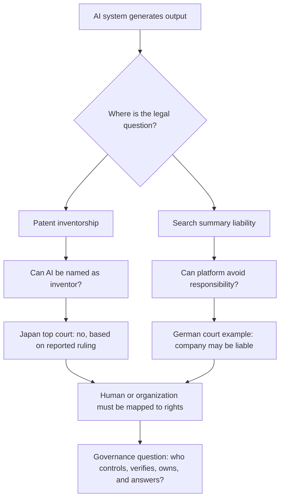

> 한 줄 요약: AI를 발명자로 인정할 수 있느냐는 특허 서류의 이름 칸만의 문제가 아니다. 일본 최고재판소 판단과 독일의 AI 검색 요약 책임 논쟁은 같은 질문으로 이어진다. AI가 한 일을 누가 소유하고, 누가 책임질 것인가.

## 무슨 일이 있었나

2026년 3월 6일, 일본 최고재판소가 특허 출원에서 AI를 발명자로 기재할 수 없다고 판단했다는 보도가 나왔다. 선정 글감은 요미우리신문 영문판 기사이며, Hacker News에서는 370점과 195개 댓글이 붙었다.

확인된 사실은 좁게 봐야 한다.

| 구분 | 내용 |
|---|---|
| 날짜 | 2026년 3월 6일 보도 |
| 당사자 | 일본 최고재판소, 특허 출원에서 AI 발명자 기재를 요구한 쪽 |
| 판단 범위 | AI를 특허 출원의 발명자로 올릴 수 있는지 |
| 확인된 결론 | AI는 발명자로 기재될 수 없다는 취지의 판단 |
| 조심해야 할 해석 | AI가 만든 모든 산출물이 특허 대상이 아니라는 뜻은 아님 |

커뮤니티가 반응한 이유는 이 판단이 개발자와 연구자에게 익숙한 질문을 법정 언어로 다시 꺼냈기 때문이다.

AI가 아이디어를 냈다면 사람은 단순 조작자인가. 사람이 프롬프트와 실험 조건을 설계했다면 그 사람은 발명자인가. 회사가 AI 시스템을 소유했다면 권리도 회사에 귀속되는가.

여기에 Schneier on Security의 AI 책임 논의가 겹친다. 독일 법원이 Google의 AI 검색 요약에 대해, 사용자가 스스로 확인할 수 있다는 방어만으로는 부족하다고 본 사례가 소개됐다. AI 요약이 회사의 사업 활동 표현으로 취급될 수 있다는 논리다.

한쪽에서는 AI를 발명자로 세우지 않는다. 다른 한쪽에서는 AI 출력에 대한 회사 책임을 묻는다. 겉으로는 반대처럼 보이지만, 실제로는 같은 선을 긋고 있다.

AI에게 법적 인격을 주지는 않되, AI를 배치한 사람과 조직의 책임도 흐리지 않겠다는 쪽이다.

## 왜 사람들이 반응했나

개발자 커뮤니티의 반응은 AI에게 권리를 줄 것이냐 말 것이냐로만 갈리지 않는다. 더 예민한 지점은 시스템을 만든 사람, 사용한 사람, 배포한 회사 사이의 책임 분배다.

### AI 발명자 논쟁은 왜 불편한가?

특허 제도는 발명자를 전제로 움직인다. 발명자는 단순 작성자가 아니라 권리 귀속, 보상, 무효 다툼, 회사 내부 발명 규정과 연결된다.

AI가 발명자가 될 수 없다고 하면 많은 사람은 일단 안도한다. 법원이 갑자기 모델을 권리 주체처럼 다루지는 않는다는 뜻이기 때문이다.

하지만 바로 다음 질문이 나온다.

- 프롬프트를 쓴 사람이 발명자인가?
- 실험 데이터를 준비한 사람이 발명자인가?
- 모델을 만든 회사가 권리를 가져야 하나?
- AI 결과를 검증하고 제품화한 팀이 발명자인가?
- 사람이 기여한 부분이 너무 적으면 특허 자체가 흔들리나?

현업에서 비슷한 고민을 해 보면, 진짜 문제는 AI 사용 여부가 아니라 기여 기록이다. 누가 어떤 문제를 정의했고, 어떤 후보를 버렸고, 어떤 실험으로 재현성을 확인했는지가 남아 있지 않으면 나중에 권리 주장도 방어도 어려워진다.

### 플랫폼 책임 논쟁과 닮은 지점

Schneier가 소개한 독일 사례는 AI 검색 요약을 다룬다. Google 쪽 방어 논리에는 사용자가 AI 정보를 맹신하면 안 된다는 취지가 있었다. 법원은 그 논리만으로 면책되기 어렵다고 본 것으로 소개된다.

이 사례가 특허 논쟁과 연결되는 이유는 둘 다 AI 산출물을 중립적인 전달물로만 볼 수 있는지 묻기 때문이다.

전화망처럼 전달만 했다면 책임은 약해진다. 신문처럼 편집하고 배치했다면 책임은 강해진다. AI 검색 요약은 단순히 남의 말을 시간순으로 보여주는 구조가 아니다. 모델이 문장을 만들고, 서비스가 그것을 상단에 배치하며, 사용자는 회사가 제공한 답변처럼 받아들인다.

특허도 비슷하다. AI가 결과를 냈다고 해서 그 결과가 하늘에서 떨어진 것은 아니다. 데이터, 모델, 프롬프트, 평가 기준, 출원 전략이 있다. 법은 결국 이 흐름 안에서 사람과 조직의 위치를 다시 묻는다.

## 내가 보는 핵심

이번 이슈의 핵심은 AI를 사람처럼 볼 것인가가 아니다. AI를 핑계로 책임의 빈칸을 만들 수 있는가다.

AI를 발명자로 인정하지 않는 판단은 보수적으로 보일 수 있다. 하지만 그 보수성이 곧 기술 혐오라는 뜻은 아니다. 특허 제도는 권리와 책임을 함께 다루기 때문에, 이름을 올릴 수 있는 주체는 법적 의무도 감당할 수 있어야 한다.

반대로 플랫폼이 AI 출력에 대해 아무 책임도 없다고 주장하는 것도 점점 설득력을 잃고 있다. 사용자는 모델을 직접 실행한 것이 아니라 서비스의 화면, 순위, 문장, 경고 문구, 추천 흐름을 만난다. 그 전체 경험은 회사가 설계한 제품이다.

개발자가 봐야 할 지점은 꽤 실무적이다.

AI 기능을 붙인 제품에서 출력은 더 이상 로그 한 줄이 아니다. 검색 결과, 요약, 추천, 자동 작성, 코드 생성, 설계 제안은 모두 의사결정의 입력이 된다. 사용자가 그 결과를 믿고 계약을 하거나, 의료 정보를 참고하거나, 보안 설정을 바꾸거나, 특허 출원을 한다면 책임은 제품 경계 밖으로 사라지지 않는다.

아키텍처 관점에서는 다음 네 가지가 갈린다.

| 관점 | 봐야 할 질문 |
|---|---|
| 권한 | AI가 어디까지 자동으로 결정하는가 |
| 검증 | 사람 검토가 형식인지 실질인지 |
| 기록 | 입력, 모델 버전, 근거, 승인자가 남는지 |
| 책임 | 오류가 났을 때 누가 고칠 수 있고 누가 설명할 수 있는지 |

특히 특허, 법무, 보안, 금융처럼 결과의 후폭풍이 큰 영역에서는 AI 사용 여부보다 감사 가능성(Auditability)이 더 현실적인 기준이 된다. 나중에 우리가 "AI가 그렇게 말했다"고 말하는 순간, 상대는 그 AI를 누가 배치했느냐고 되물을 것이다.

### 확인된 사실과 추정을 나누는 습관

이번 보도만으로 말할 수 있는 것과 없는 것을 나눠야 한다.

확인된 쪽은 일본 최고재판소가 AI를 특허 출원의 발명자로 기재할 수 없다는 취지로 판단했다는 점이다. Hacker News에서 댓글이 많이 붙을 만큼 개발자 커뮤니티가 이 문제를 단순 법률 뉴스가 아니라 AI와 권리 문제로 받아들였다는 점도 확인된다.

아직 조심해야 할 쪽도 있다. 이 판단이 일본에서 AI 보조 발명 전체를 어떻게 다룰지, 기업의 내부 발명 보상 규정에 어떤 영향을 줄지, 다른 국가의 특허청과 법원이 같은 선을 택할지는 별개의 문제다.

독일의 AI 검색 요약 책임 사례도 마찬가지다. 그것은 검색 서비스와 AI 요약의 책임 문제이지, 모든 AI 출력에 동일한 책임 법리가 그대로 적용된다는 뜻은 아니다. 다만 한 가지 흐름은 보인다. AI 결과물을 제품 경험의 일부로 볼수록 회사의 설명 책임은 커진다.

## 앞으로 볼 기준

다음에 AI 발명자, AI 저작권, AI 검색 책임 뉴스가 나오면 판결 제목보다 먼저 볼 것이 있다.

### 누가 AI 출력을 제품으로 만들었나?

모델이 문장을 만들었다는 사실만으로 끝나지 않는다. 누가 그 문장을 사용자에게 보여주기로 했는지 봐야 한다. 순위, UI, 경고, 재시도, 출처 표시, 사람 검토 흐름이 모두 책임 구조를 만든다.

### 사람의 기여가 어디에 기록됐나?

특허 맥락에서는 아이디어 생성보다 문제 정의, 실험 설계, 후보 선택, 검증이 더 중요할 수 있다. AI를 썼다면 더더욱 사람이 무엇을 판단했는지 남겨야 한다.

### 면책 문구가 실제 통제를 대체하고 있나?

"AI는 틀릴 수 있다"는 문구만으로 충분하지 않을 수 있다. 사용자가 그 출력을 핵심 판단에 쓰도록 화면을 설계했다면, 경고 문구는 책임을 줄이는 장치일 뿐 책임을 없애는 장치가 아니다.

### 국가별 제도가 어디까지 다르게 움직이나?

일본의 특허 판단, 독일의 AI 검색 요약 책임, 미국의 플랫폼 책임 논쟁은 법적 출발점이 다르다. 글로벌 제품은 가장 느슨한 관할이 아니라 문제가 크게 번질 수 있는 관할을 기준으로 설계해야 한다.

이번 논쟁은 AI에게 이름표를 달아줄지 말지를 묻는 것처럼 보인다. 하지만 실제 질문은 더 날카롭다.

AI가 한 일이라고 말하는 순간에도, 그 AI를 고른 사람, 연결한 시스템, 화면에 올린 회사는 남아 있다. 앞으로의 AI 제품은 성능보다 먼저 이 질문을 견뎌야 한다. 틀렸을 때 누가 설명할 수 있는가.

## 참고 자료

- [선정 글감] [AI can't be listed as inventor on patent applications, Japan's top court rules](https://japannews.yomiuri.co.jp/science-nature/technology/20260306-314930/), The Japan News / Hacker News Best
- [관련] [AI and Liability](https://www.schneier.com/blog/archives/2026/06/ai-and-liability.html), Schneier on Security