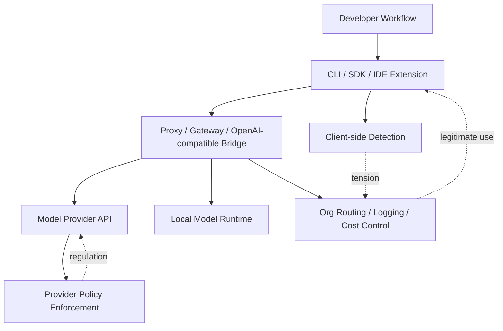

> 한 줄 요약: Claude Code의 `ANTHROPIC_BASE_URL` 감지 논란은 중국 차단만의 문제가 아니다. 로컬 모델, 프록시, MCP, OpenAI 호환 브리지가 섞인 개발 환경에서 클라이언트가 정책 집행을 어디까지 맡아야 하는지 묻는 사건이다.

## 무슨 일이 있었나

Reddit LocalLLaMA에 올라온 글은 Claude Code가 `ANTHROPIC_BASE_URL` 환경 변수를 사용할 때 특정 호스트명을 의심 대상으로 다루는 로직이 있다는 분석에서 출발했다.

글의 설명에 따르면 의심 호스트명 목록은 코드에 평문으로 들어 있지 않았다. Base64로 인코딩한 뒤 XOR 키 `91`로 한 번 더 숨긴 형태였고, 이를 풀면 중국 기업 도메인, 연구소 관련 키워드, Claude API 요청을 우회하거나 중계하는 게이트웨이·리셀러로 보이는 항목들이 나온다고 한다.

확인된 사실과 해석은 나눠 봐야 한다.

- 확인된 사실: 커뮤니티 분석은 `ANTHROPIC_BASE_URL` 설정과 호스트명 감지 로직을 문제 삼았다.
- 확인된 사실: 목록이 평문이 아니라 간단한 난독화 형태로 들어 있었다는 주장이 나왔다.
- 확인된 사실: Anthropic은 2026년 6월 12일 미국 정부의 수출통제 적용 때문에 Claude Fable 5와 Mythos 5 접근을 중단했고, 6월 30일 통제 해제 뒤 7월 1일부터 Fable 5 접근을 복구한다고 공지했다.
- 추정에 가까운 해석: Claude Code의 해당 로직이 특정 국가 사용자 차단만을 목표로 했는지, 리셀러·프록시·우회 API까지 함께 겨냥했는지는 공개된 분석만으로 단정하기 어렵다.
- 남는 질문: 왜 이 목록을 공개 설정이나 문서화된 정책 파일이 아니라 난독화된 코드 형태로 넣었는지는 별도 설명이 필요하다.

불편한 지점은 중국이라는 특정 지역명만이 아니다. 개발자는 `ANTHROPIC_BASE_URL`을 꼭 우회 목적으로만 쓰지 않는다. 로컬 프록시, 사내 게이트웨이, 테스트용 OpenAI 호환 서버, 비용 추적 레이어, 모델 라우터를 붙일 때도 쓴다.

LocalLLaMA의 다른 글들도 같은 흐름을 보여준다. OpenLumara는 KoboldLite, OpenWebUI 같은 UI와 llama.cpp 계열 백엔드 사이에서 OpenAI 호환 브리지처럼 동작한다고 소개됐다. Toolport는 여러 MCP(Model Context Protocol) 서버를 함께 쓰면서 컨텍스트 비용과 보안 위험을 줄이는 도구라고 설명됐다.

즉 지금의 개발 환경에서 base URL 변경, 중간 프록시, 로컬 브리지, MCP 라우터는 예외적인 구성이 아니다. 이미 흔한 작업 방식이 됐다.

## 왜 사람들이 반응했나

첫 번째는 신뢰 문제다.

개발자는 CLI 도구가 어떤 요청을 어디로 보내는지, 어떤 조건에서 차단하거나 경고하는지 알고 싶어 한다. 특히 환경 변수는 자동화 스크립트, CI, 사내 래퍼, 로컬 실험 환경에 자주 들어간다. 그런데 특정 환경 변수를 설정했을 때 숨겨진 목록 기반 로직이 작동한다면, 사용자는 정책 문서가 아니라 실행 결과로 먼저 그 사실을 알게 된다.

두 번째는 권한의 경계다.

서비스 제공자가 수출통제, 제재, 약관 위반, 리셀러 남용을 막아야 하는 상황은 현실에 있다. Anthropic의 Fable 5 사례처럼 정부 지시가 즉시 적용되면 회사는 실시간 국적 확인이 어렵다는 이유로 전체 접근을 멈출 수도 있다. 모델 제공사는 이제 단순 API 판매자에 머물지 않는다. 규제 집행의 일부가 된다.

문제는 그 집행이 서버에서만 일어나지 않을 때다. CLI, SDK, IDE 확장, 로컬 에이전트가 정책 판단을 일부 떠안기 시작하면 개발자 환경 자체가 통제 지점이 된다.

세 번째는 비용과 사용성이다.

로컬 모델 커뮤니티가 OpenAI 호환 엔드포인트를 선호하는 이유는 간단하다. 이미 많은 UI, 에이전트, 라이브러리가 그 형식을 기대한다. OpenLumara 같은 브리지는 기존 UI를 그대로 쓰면서 로컬 모델의 토큰 효율을 높이려는 시도다. Toolport 같은 도구는 MCP 서버를 많이 연결해도 매 턴 컨텍스트를 낭비하지 않으려는 고민에서 나왔다.

이런 흐름에서는 `BASE_URL` 하나가 사용자의 아키텍처 선택권이 된다. 그 값을 바꿨다는 이유만으로 의심 로직이 켜진다면, 커뮤니티는 우회 탐지보다 정상적인 확장성 제한을 먼저 떠올린다.

네 번째는 오해의 여지다.

난독화가 항상 악의의 증거는 아니다. 단순 문자열 매칭 회피, 스크래핑 방지, 우회자에게 목록을 쉽게 노출하지 않기 위한 선택일 수 있다. 하지만 보안 도구와 정책 도구에서 난독화는 설명 비용을 만든다. 공개 문서 없이 코드에서 먼저 발견되면 사용자는 목적보다 은폐 의도를 먼저 의심한다.

## 내가 보는 핵심

이번 논란의 핵심은 중국 차단 여부가 아니라 정책 집행 위치다.

AI 플랫폼은 세 층에서 통제할 수 있다.

서버 쪽 정책 집행은 비교적 이해하기 쉽다. API 키, 계정, 결제 정보, 지역, 사용 패턴, 모델 접근 권한을 제공자가 직접 본다. 문제가 생기면 계정 단위로 설명하고 이의제기할 여지도 있다.

클라이언트 쪽 감지는 다르다. 사용자의 로컬 설정, 프록시 주소, 사내 라우터 이름, 실험용 엔드포인트가 판단 재료가 된다. 이 계층은 개발자의 작업 방식과 너무 가깝다.

현업에서 비슷한 구성을 만들다 보면 base URL은 라우팅 스위치처럼 쓰인다. 운영은 공식 API로 보내고, 테스트는 로컬 모델로 보내고, 일부 작업은 사내 게이트웨이에서 감사 로그를 남긴다. 비용 추적이나 데이터 반출 방지를 위해 일부러 중간 프록시를 두는 경우도 있다.

그래서 플랫폼이 봐야 할 것은 단순히 기본 URL이 바뀌었는지가 아니다. 어떤 데이터가 어디로 나가는지, 사용자가 어떤 모델 권한을 우회하는지, 조직 정책과 충돌하는지, 규제 대상 국가·주체와 연결되는지가 더 직접적인 기준이다.

물론 제공자 입장도 가볍게 볼 수 없다. 고성능 모델은 수출통제, 사이버 안전, 제재, 리셀러 남용과 얽힌다. Anthropic이 Fable 5와 Mythos 5 접근을 일시 중단한 공지는 이 압력을 보여준다. 국적 검증을 실시간으로 안정적으로 할 수 없으면 넓게 막고 나중에 복구하는 선택이 나올 수 있다.

그럴수록 설명 가능성은 제품 품질의 일부가 된다. 차단 기준이 바뀐다면 날짜와 범위가 필요하다. 탐지가 있다면 어떤 종류의 설정이 영향을 받는지 알려야 한다. 사용자가 정상적인 프록시나 로컬 브리지를 쓰는 경우 어떻게 예외 처리할 수 있는지도 보여줘야 한다.

## 앞으로 볼 기준

다음에 비슷한 뉴스가 나오면 네 가지를 먼저 보면 된다.

| 확인할 것 | 질문 |
|---|---|
| 정책 범위 | 국가, 국적, 거주지, 회사, 도메인, 리셀러 중 무엇을 기준으로 삼는가 |
| 집행 위치 | 서버 API에서 막는가, CLI·SDK·IDE에서 먼저 감지하는가 |
| 설명 가능성 | 차단 조건과 예외 절차가 문서에 있는가 |
| 정상 사용 영향 | 로컬 모델, 사내 게이트웨이, MCP, OpenAI 호환 브리지 사용자가 함께 영향을 받는가 |

개발자 입장에서는 `ANTHROPIC_BASE_URL` 같은 설정을 더 이상 편의 옵션으로만 보면 안 된다. 이 값은 데이터 경로, 정책 경계, 감사 범위, 장애 지점을 동시에 바꾼다.

조직에서 AI CLI를 쓴다면 최소한 다음은 확인해야 한다.

- 공식 API와 프록시 API를 구분해 로그를 남기는가
- 로컬 모델 테스트용 엔드포인트가 실수로 운영 토큰을 받지 않는가
- 사내 게이트웨이가 제공자 약관이나 지역 제한을 우회하지 않는가
- CLI 업데이트로 차단·탐지 로직이 바뀌었을 때 빌드가 멈추는가
- 모델 제공자의 수출통제·지역 제한 공지를 릴리스 절차에 반영하는가

커뮤니티가 예민하게 반응한 이유는 단순한 반기업 정서가 아니다. 로컬 모델과 클라우드 모델 사이에 얇은 호환 계층을 쌓아가던 사람들이, 그 계층이 갑자기 정책 감시의 대상이 될 수 있다는 신호를 본 것이다.

모델 제공자는 규제를 피할 수 없다. 개발자도 플랫폼의 법적 책임을 모른 척할 수 없다. 하지만 정책이 로컬 개발 도구 안으로 들어올수록 투명성은 선택 사항이 되기 어렵다.

`BASE_URL` 하나를 바꿨을 뿐인데 누가 허용된 사용자이고 누가 의심 사용자인지 갈린다면, 다음 논쟁은 모델 성능보다 설명 가능한 통제권을 둘러싸고 벌어질 가능성이 크다.

## 참고 자료

- [선정 글감] [Claude Code and China: The mechanism is activated when the user sets the ANTHROPIC_BASE_URL environment variable](https://www.reddit.com/r/LocalLLaMA/comments/1um702y/claude_code_and_china_the_mechanism_is_activated/) — Reddit LocalLLaMA
- [관련] [Redeploying Fable 5](https://www.anthropic.com/news/redeploying-fable-5) — Anthropic News
- [관련] [openlumara, my manually coded super-token-efficient harness, now works across any UI that can connect to an openAI endpoint](https://www.reddit.com/r/LocalLLaMA/comments/1ulol44/openlumara_my_manually_coded_supertokenefficient/) — Reddit LocalLLaMA
- [관련] [Toolport: Use as many MCP servers as you want without the token tax](https://www.reddit.com/r/LocalLLaMA/comments/1um4pig/toolport_use_as_many_mcp_servers_as_you_want/) — Reddit LocalLLaMA