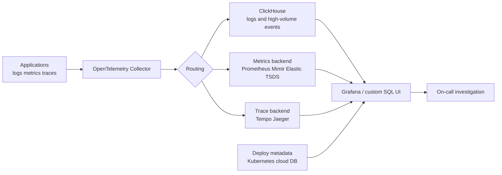

> 한 줄 요약: ClickHouse 기반 관측성이 자주 거론되는 이유는 로그 저장소를 싸게 바꾸자는 이야기가 아니라, 로그·메트릭·트레이스 비용과 장애 조사 방식이 같은 병목에 걸렸다는 신호다.

## 왜 지금 이슈인가

로그(Log)는 팀이 작을 때 가장 직관적인 디버깅 도구다. `tail -f`, `grep`, `jq`로 바로 답을 찾던 경험은 강력하다. 문제는 서비스 수, 팀 수, 데이터 소비자가 늘어나는 순간 그 방식이 거의 그대로 유지되지 않는다는 데 있다.

선정 글감이 건드리는 지점도 여기다. 관측성 플랫폼 논쟁은 Elasticsearch냐 Loki냐 Datadog이냐 ClickHouse냐의 제품 비교처럼 보이지만, 실제로는 로그를 누가 어떤 기대치로 소비하느냐의 문제에 가깝다.

개발자는 임의 검색과 빠른 필터링을 원한다. 고객지원팀은 사용자 단위 조회가 깨지지 않기를 원한다. 데이터팀은 로그 라인 위에 지표성 대시보드를 올린다. 온콜 담당자는 새벽에 새 쿼리 언어를 배우고 싶지 않다.

이 요구들은 서로 충돌한다. 그래서 GitHub, Lobsters, Hacker News 같은 개발자 커뮤니티에서 ClickHouse 관측성 이야기가 반복해서 나오는 배경은 단순한 성능 자랑이 아니다. 기존 관측성 스택이 비용, 스키마, 카디널리티(Cardinality), 조사 흐름을 한 번에 풀지 못한다는 피로감에 가깝다.

Grafana Cloud의 풀스택 관측성 글은 다른 방향에서 같은 문제를 짚는다. 장애 대응에서 어려운 부분은 고치는 일보다 어디서 시작할지 찾는 일이다. 서비스, 파드(Pod), 노드(Node), 네임스페이스(Namespace), 클러스터(Cluster), 데이터베이스, 클라우드 계정이 흩어져 있으면 로그 검색이 빨라도 맥락 전환 비용이 계속 붙는다.

Elastic의 TSDS(Time Series Data Stream) 가격 조정도 같은 흐름 안에 있다. 메트릭 저장을 컬럼형 시계열 엔진 중심으로 다시 설계하고, 서버리스 관측성에서 TSDS 메트릭 수집·보관 비용을 표준 GB 단가의 25%로 낮췄다는 메시지는 분명하다. 관측성 시장의 초점은 더 많은 신호를 모으는 기능 경쟁에서, 더 많이 모아도 버틸 수 있는 저장·질의 구조 경쟁으로 옮겨가고 있다.

## 커뮤니티에서 갈리는 지점

ClickHouse를 관측성 백엔드로 쓰자는 주장은 매력적이다. 로그는 대체로 append-only이고, 시간 순서로 들어오며, 압축이 잘 되고, 조회는 특정 시간 범위와 몇 개 필드에 몰린다. 이 데이터 모양은 컬럼 지향(Column-oriented) 저장소와 잘 맞는다.

예를 들어 로그에 필드가 40개 있어도 실제 쿼리는 `timestamp`, `service`, `status_code` 정도만 읽는 경우가 많다. 행 지향(Row-oriented) 저장소는 한 행 전체를 읽는 비용을 피하기 어렵지만, ClickHouse는 필요한 컬럼만 읽는다. 선정 글감에서 말한 10~14배 압축률, Elasticsearch 대비 2~3배 수준이라는 비교는 이 구조적 차이를 보여주는 사례로 볼 수 있다.

반대편 우려도 가볍지 않다. ClickHouse는 관측성 제품이 아니라 범용 분석 데이터베이스다. 로그 저장소로 쓰려면 스키마 설계, 파티션, `ORDER BY` 키, TTL, 샤딩, 복제, 백필(Backfill), OpenTelemetry Collector 파이프라인까지 직접 판단해야 한다.

커뮤니티에서 갈리는 지점은 그래서 이렇게 정리된다.

| 쟁점 | ClickHouse 쪽 주장 | 우려하는 쪽 주장 |
|---|---|---|
| 로그 비용 | 컬럼 저장과 압축으로 대량 로그에 유리 | 운영자가 데이터베이스 책임까지 떠안음 |
| 쿼리 모델 | SQL이라 익숙하고 강력함 | 관측성 전용 UX와 기본 워크플로는 부족할 수 있음 |
| 확장성 | 1TB/day에서 10TB/day로 갈 때 구조가 크게 바뀌지 않음 | 샤드 키와 머지(Merge) 튜닝을 잘못 잡으면 비용이 뒤늦게 터짐 |
| 메트릭·트레이스 | OTLP 수집과 Grafana 연동으로 구성 가능 | PromQL, 알림, 서비스 맵은 별도 계층이 필요 |
| 조직 적합성 | 플랫폼팀이 통제하면 비용 효율이 큼 | 제품팀이 셀프서비스를 기대하면 마찰이 생김 |

Grafana의 접근은 데이터베이스보다 조사 경험에 초점을 둔다. 지식 그래프(Knowledge Graph)로 서비스와 인프라 엔티티를 연결하고, 애플리케이션 관측성과 Kubernetes 모니터링을 한 화면에서 이어 보게 한다. 이 방향은 ClickHouse가 잘하는 저장·질의 문제와 별개로, 사람이 어디를 봐야 하는지 줄여주는 계층이다.

Stack Overflow Blog의 생산 장애 관련 글도 여기서 이어진다. 코딩 에이전트가 코드 작성 속도를 올리면, 장애 원인은 코드 한 줄보다 시스템 사이 상호작용에서 더 자주 드러난다. 로그 저장소가 빨라도 서비스 간 의존성, 배포 이력, 인프라 상태, 최근 변경을 연결하지 못하면 원인 분석은 다시 사람의 머릿속 그래프에 의존한다.

## 아키텍처 관점에서 볼 점

ClickHouse 관측성 아키텍처를 검토할 때 핵심은 로그 저장소 하나를 바꾸는 일이 아니다. 수집, 정규화, 저장, 조회, 알림, 보존 정책, 접근 제어가 모두 이어져야 한다.

이 구조에서 ClickHouse는 대량 로그와 이벤트성 데이터를 맡기 좋다. 특히 다음 조건에서 힘을 낸다.

- 로그가 append-only이고 업데이트가 거의 없다
- 시간 범위 기반 조회가 대부분이다
- 필드 수는 많지만 쿼리에서 읽는 컬럼은 적다
- JSON 키, 서비스명, 상태 코드처럼 반복 값이 많다
- 장기 보관보다 빠른 집계와 비용 절감이 더 큰 과제다

반대로 모든 관측성 데이터를 ClickHouse 하나로 밀어 넣는 설계는 조심해야 한다. 메트릭은 PromQL 생태계와 알림 규칙이 이미 강하다. 트레이스는 스팬(Span) 관계를 탐색하는 UI와 샘플링 전략이 핵심이다. 로그는 ClickHouse로, 메트릭은 Prometheus 계열이나 TSDS 기반 백엔드로, 트레이스는 Tempo나 Jaeger 계열로 나누는 편이 더 단순할 때가 많다.

실제로 Elastic의 TSDS 개편은 메트릭을 별도 데이터 모양으로 다뤄야 한다는 판단에 가깝다. Grafana의 풀스택 관측성은 저장소보다 엔티티 관계와 탐색 흐름을 강조한다. 둘을 함께 보면 방향이 보인다. 관측성 아키텍처는 단일 만능 저장소보다, 신호별 저장 모델과 공통 탐색 계층을 분리하는 쪽으로 가고 있다.

ClickHouse를 로그 백엔드로 둔다면 최소한 아래 설계는 먼저 정해야 한다.

| 설계 항목 | 확인할 질문 |
|---|---|
| 스키마 | 공통 컬럼과 원본 JSON을 어떻게 나눌 것인가 |
| 정렬 키 | 가장 흔한 필터가 시간, 서비스, 환경, 테넌트 중 무엇인가 |
| 파티션 | 일 단위, 시간 단위, 테넌트 단위 중 삭제와 조회에 맞는 기준은 무엇인가 |
| 보존 정책 | 핫 데이터와 콜드 데이터의 기간을 어떻게 나눌 것인가 |
| 개인정보 | 사용자 식별자, 토큰, 요청 본문을 수집 전에 제거하는가 |
| 장애 격리 | 수집 폭주가 운영 DB, 메시지 큐, API 서버에 역류하지 않는가 |
| 권한 | 고객지원, 개발자, 보안팀의 조회 범위를 어떻게 분리하는가 |

특히 Kubernetes 환경에서는 파드 재시작, 노드 교체, 네임스페이스 분리, 멀티클러스터 운영이 로그 쿼리의 기본 조건이 된다. `pod_name`만 믿고 쿼리하면 배포마다 이름이 바뀌어 조사 흐름이 끊긴다. `service`, `namespace`, `cluster`, `deployment`, `trace_id`, `tenant_id` 같은 안정적인 컬럼을 수집 단계에서 보강해야 한다.

## 실무에서 볼 점

ClickHouse 관측성을 검토할 만한 팀은 대체로 세 가지 압박을 동시에 받는다. 로그 비용이 커지고, 장애 조사 시간이 길어지고, SaaS 관측성 도구의 가격 모델을 예측하기 어렵다.

그렇다고 바로 모든 로그를 ClickHouse로 옮기는 것은 좋지 않다. 먼저 현재 로그 사용 방식을 재야 한다.

- 하루 로그 수집량과 피크 수집량
- 실제 조회되는 로그의 비율
- 대시보드가 의존하는 로그 필드
- 고객지원이나 보안팀이 조회하는 개인정보 범위
- 장애 때 가장 자주 쓰는 필터 조합
- 알림이 로그 기반인지 메트릭 기반인지
- 보관 기간과 삭제 요구사항

현업에서 비슷한 고민을 하다 보면 의외로 비용의 원인이 저장소가 아니라 로그 품질인 경우가 많다. 같은 에러를 초당 수천 번 찍거나, 요청 본문 전체를 남기거나, 디버그 로그가 운영에서 켜진 채 방치된다. 이 상태에서 저장소만 바꾸면 ClickHouse도 결국 비싼 쓰레기통이 된다.

도입 조건은 명확하게 잡는 편이 낫다.

| 상황 | 판단 |
|---|---|
| 1TB/day 미만이고 SaaS 비용이 감당 가능 | 기존 도구 최적화가 먼저 |
| 1~10TB/day이고 로그 쿼리 비용이 병목 | ClickHouse PoC 가치 있음 |
| PromQL 알림과 서비스 맵이 핵심 | 메트릭·트레이스 계층은 유지 |
| 플랫폼팀이 DB 운영 역량을 갖춤 | 자체 운영 가능성 있음 |
| 팀이 SQL과 스키마 설계를 싫어함 | 관리형 관측성 도구가 더 맞음 |
| 개인정보·컴플라이언스 요구가 강함 | 수집 전 마스킹과 삭제 설계가 선행 |

가장 실패하기 쉬운 지점은 셀프서비스 기대치를 낮게 보는 것이다. 플랫폼팀은 SQL이면 충분하다고 생각할 수 있다. 하지만 온콜 담당자는 장애 중에 SQL을 멋지게 쓰고 싶은 것이 아니라, 최근 배포 이후 특정 서비스의 오류율이 왜 튀었는지 빠르게 좁히고 싶다.

그래서 ClickHouse를 쓰더라도 사용자 경험 계층이 필요하다. Grafana 대시보드, 저장된 쿼리, 서비스별 기본 탐색 화면, trace_id 기반 점프, 배포 메타데이터 연결이 없으면 빠른 저장소 위에 느린 운영 경험이 올라간다.

보안 리스크도 처음부터 봐야 한다. 로그는 신뢰 경계 밖의 데이터가 섞이는 통로다. 인증 헤더, 세션 토큰, 이메일, 전화번호, 결제 식별자가 들어오면 압축률과 쿼리 성능보다 삭제와 접근 제어가 먼저 문제가 된다. ClickHouse TTL이 보존 기간 삭제를 처리하더라도, 특정 사용자 데이터 삭제 요청이나 테넌트별 접근 통제는 별도 설계가 필요하다.

에이전트가 코드와 운영 작업에 들어오는 흐름도 관측성 설계를 더 까다롭게 만든다. 에이전트가 생성한 코드가 배포되고, 런북(Runbook)을 실행하고, 알림을 분류한다면 장애 원인은 코드 변경, 설정 변경, 외부 API, 인프라 상태, 에이전트 판단 로그 사이에 걸쳐 나타난다. Stack Overflow Blog가 말한 시스템 간 상호작용의 실패는 이런 환경에서 더 자주 보인다.

이때 필요한 것은 더 많은 로그만이 아니다. 변경 이벤트, 배포 이벤트, 인프라 이벤트, 에이전트 실행 기록을 같은 시간축에서 연결하는 능력이다. ClickHouse는 이 중 고용량 이벤트 저장에 강하지만, 원인 분석 그래프 전체를 자동으로 만들어주지는 않는다.

## 정리

ClickHouse가 관측성 전쟁에서 이긴다는 말은 절반만 맞다. 로그와 이벤트 저장 비용, 대량 집계, 컬럼 기반 압축에서는 강한 답이 될 수 있다. 하지만 장애 대응의 승패는 저장소 하나가 아니라, 신호별 데이터 모델과 사람이 따라갈 수 있는 조사 흐름에서 갈린다.

지금 확인할 것은 단순하다. 최근 장애 하나를 골라서 원인 분석에 실제로 사용한 로그 필드, 메트릭, 트레이스, 배포 이벤트를 적어보면 된다. 그 목록이 세 도구와 열 개 탭에 흩어져 있다면, 다음 관측성 개선의 출발점은 더 비싼 대시보드가 아니라 데이터 흐름과 탐색 경로의 재설계다.

## 참고 자료

- [선정 글감] [Clickhouse is winning the Observability Wars](https://matduggan.com/clickhouse-is-winning-the-observability-wars/) — Lobsters
- [관련] [Full-stack observability in Grafana Cloud: How to investigate issues across services and infrastructure](https://grafana.com/blog/full-stack-observability-in-grafana-cloud-how-to-investigate-issues-across-services-and-infrastructure/) — Grafana Blog
- [관련] [Updated metrics pricing for Elastic Observability: Best-in-class metrics — now cheaper, too!](https://www.elastic.co/blog/metrics-pricing) — Elastic Blog
- [관련] [Code isn’t the only thing causing your production failures](https://stackoverflow.blog/2026/06/25/code-isnt-causing-your-production-failures/) — Stack Overflow Blog