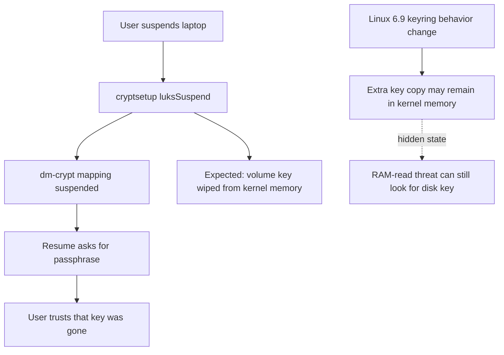

> 한 줄 요약: Linux 6.9 이후 LUKS suspend가 디스크 암호화 키를 메모리에서 지우지 못했다는 보고가 주목받은 이유는 버그 자체보다 보안 UI가 약속한 상태와 커널 내부 상태가 어긋났기 때문이다. Linux 암호화 전체가 무너진 사건은 아니지만, 절전·부팅·키 관리의 경계가 신뢰 문제로 쉽게 번질 수 있음을 보여준다.

## 무슨 일이 있었나: Linux 6.9, LUKS suspend, 메모리 키

2026년 7월 초, Ingo Blechschmidt가 Mathstodon에 Linux 6.9 이후 `cryptsetup luksSuspend` 경로에서 디스크 암호화 키가 메모리에서 제대로 사라지지 않았다는 내용을 올렸다. 이 글은 Hacker News에서 수백 포인트와 190개가 넘는 댓글을 모았다.

핵심은 LUKS 자체가 깨졌다는 이야기가 아니다. LUKS suspend를 이용해 절전 전에 암호화 장치를 중단하고, 재개할 때 사용자가 다시 암호를 입력하게 만드는 구성에서 기대한 보안 속성이 깨졌다는 주장이다.

cryptsetup 문서는 `luksSuspend`가 활성 LUKS 장치를 suspend 상태로 만들고, I/O를 막으며, 커널 메모리의 암호화 키를 지운다고 설명한다. 반대로 `luksResume`은 사용자가 다시 인증한 뒤 키를 되살린다. 사용자가 보기에는 노트북을 깨웠을 때 암호를 다시 묻는 흐름이므로, 키가 이미 메모리에 남아 있다고 생각하기 어렵다.

확인된 사실과 해석은 나눠서 봐야 한다.

- 확인된 사실: cryptsetup 문서상 `luksSuspend`는 커널 메모리에서 암호화 키를 지우는 동작을 약속한다.
- 확인된 사실: Linux `thread-keyring(7)` 문서는 스레드 키링(Thread Keyring)이 해당 스레드 종료 시 파괴된다고 설명한다.
- 확인된 사실: Hacker News 토론에서 작성자는 cryptsetup이 키를 userspace에서 kernelspace로 넘길 때 이 스레드 키링 속성에 의존했고, Linux 6.9 이후 그 전제가 깨졌다고 설명했다.
- 확인된 사실: 일반적인 stock Linux suspend-to-RAM 설정은 애초에 디스크 마스터 키를 메모리에 둔다. 이번 논쟁은 그 기본 동작이 아니라 `luksSuspend`를 활용한 별도 보안 흐름에 관한 것이다.
- 아직 추정인 부분: 어떤 배포판, 어떤 사용자 구성, 어떤 커스텀 스크립트가 실제로 영향을 받았는지는 배포판별 패키지와 initramfs, suspend hook을 확인해야 한다.
- 아직 추정인 부분: 이 문제가 실제 공격에 쓰였다는 공개 근거는 없다.

흐름을 단순화하면 이렇다.

이 다이어그램에서 불편한 지점은 F와 G가 동시에 존재한다는 점이다. 사용자는 다시 암호를 입력하라는 화면을 보고 키가 사라졌다고 믿지만, 내부에는 cryptsetup이 모르는 추가 사본이 남아 있었을 수 있다.

## 왜 사람들이 반응했나: 암호화 키가 남는 순간

반응이 커진 첫 번째 이유는 제목이 건드린 범위 때문이다. “Since Linux 6.9”라는 표현은 커널 전체의 회귀처럼 읽힌다. 댓글에서는 이 문제가 Debian의 optional cryptsetup-suspend 흐름에 가까운지, cryptsetup의 공식 기능 범위에 들어가는지, 다른 배포판에도 넓게 퍼졌는지를 두고 논쟁이 붙었다.

이 논쟁은 말꼬리 잡기가 아니다. 보안 사고에서 범위는 피해 규모와 대응 우선순위를 결정한다. 모든 Linux 노트북의 full disk encryption이 위험하다는 말과, 특정 suspend hook을 쓰는 사용자가 기대한 추가 보호가 깨졌다는 말은 완전히 다르다.

두 번째 이유는 보안 UX의 배신감이다. 절전에서 깨어날 때 암호를 다시 묻는 화면은 강한 신호다. 사람은 그 화면을 보고 디스크 키가 메모리에서 지워졌다고 해석한다. 그런데 실제 내부 상태가 다르면, UI는 보호 장치가 아니라 사용자를 안심시키는 장식이 된다.

세 번째 이유는 공격 모델이 좁지만 선명하기 때문이다. 이 문제는 원격 코드 실행 취약점처럼 누구에게나 즉시 위험한 종류가 아니다. 노트북 탈취, 메모리 읽기, cold boot 계열 공격, 압수된 장비, 재개 과정 조작 같은 물리적·근접 공격 모델이 필요하다.

그렇다고 의미가 작아지는 것도 아니다. full disk encryption은 원래 전원이 꺼진 저장장치가 탈취됐을 때 데이터를 지키기 위한 기술이다. 그런데 suspend 상태는 꺼진 상태와 켜진 상태 사이에 있다. 현업에서 노트북 보안 정책을 만들 때 이 애매한 구간을 대충 넘기면, 문서에는 암호화됨이라고 쓰여 있어도 실제 위험은 남는다.

| 쟁점 | 커뮤니티가 갈린 지점 | 실무에서 확인할 것 |
|---|---|---|
| 영향 범위 | Linux 전체 문제인가, 특정 suspend 구성 문제인가 | 배포판, 커널 버전, cryptsetup hook 사용 여부 |
| 보안 수준 | 기본 suspend보다 여전히 나은가 | 공격자가 RAM을 읽을 수 있는 위협 모델인지 |
| 사용자 신뢰 | 암호 재입력 화면이 충분한 신호인가 | UI와 실제 키 상태를 검증하는 테스트 존재 여부 |
| 대응 방식 | hibernate, poweroff, TPM, PIN 중 무엇이 맞나 | 보안 요구와 사용성 비용의 균형 |

## 내가 보는 핵심: 보안 기능은 경계 계약이다

이 사건은 LUKS만의 문제가 아니다. 보안 기능은 여러 계층이 나눠 가진 약속 위에서 동작한다. cryptsetup은 커널의 keyring 동작을 믿고, 배포판은 cryptsetup의 의미를 믿고, 사용자는 resume 화면을 믿는다.

그중 한 계층의 전제가 바뀌면 위쪽 계층의 UX는 그대로인데 보안 속성만 달라질 수 있다. 사람들이 불편해한 이유도 여기에 있다.

WIRED가 2026년 6월 21일 보도한 Secure Boot 인증서 만료 이슈도 같은 패턴을 보여준다. 2026년 6월 24일부터 Secure Boot 체인의 핵심인 Microsoft 서명 인증서 3개가 만료되기 시작하며, Windows와 Linux 사용자 모두 펌웨어·부트로더·운영체제 업데이트 경로를 신경 써야 한다는 내용이었다.

Secure Boot는 UEFI bootkit처럼 운영체제보다 먼저 실행되는 악성코드를 막기 위한 체인 오브 트러스트(Chain of Trust)다. 그런데 이 체인은 Microsoft, OEM, 배포판, 펌웨어 업데이트, shim, db/dbx 같은 여러 소유권이 얽힌다. 인증서 수명이라는 평범한 운영 문제가 플랫폼 신뢰 문제로 번지는 이유가 여기에 있다.

TPM(Trusted Platform Module)도 마찬가지다. Microsoft 문서는 TPM이 키를 장치 안에 묶고, 특정 플랫폼 측정값에 봉인하며, PIN brute force를 늦추는 anti-hammering 동작을 제공한다고 설명한다. 하지만 TPM이 있다고 해서 모든 디스크 암호화 구성이 자동으로 안전해지는 것은 아니다. TPM-only, TPM+PIN, 복구 키 백업, Secure Boot 상태, 펌웨어 업데이트 정책이 함께 맞아야 한다.

이런 상황에서는 제품명보다 경계면을 봐야 한다. LUKS를 쓰는가보다, suspend 때 키가 어디에 남는가가 더 직접적인 질문이다. Secure Boot를 켰는가보다, 어떤 인증서와 shim을 신뢰하고 언제 갱신되는가가 더 실무적인 질문이다. TPM이 있는가보다, 키가 어떤 조건에서 풀리고 사용자가 어떤 추가 비밀을 제공하는가가 더 현실적인 질문이다.

## 앞으로 볼 기준: LUKS, Secure Boot, TPM을 점검하는 질문들

다음에 비슷한 보안 뉴스를 볼 때는 먼저 문장을 좁혀 읽어야 한다.

- 전체 제품군 문제인가, 특정 설정 문제인가
- 기본값 문제인가, opt-in 기능 문제인가
- 보안 약속이 문서에 있는가, 커뮤니티 관습에 가까운가
- 공격자가 원격에 있는가, 장비를 물리적으로 가진 상태인가
- 사용자가 보는 화면과 실제 내부 상태가 같은가
- 테스트가 UX가 아니라 키 상태 자체를 검증하는가
- 배포판, OEM, 펌웨어, 커널 중 누가 패치를 배포해야 하는가

LUKS suspend 이슈에서 당장 확인할 것은 단순하다. 노트북을 Linux full disk encryption으로 보호한다고 믿고 있고, suspend 후 resume 때 암호를 다시 묻는 구성을 일부러 쓰고 있다면 배포판의 cryptsetup-suspend, initramfs hook, 커널 버전, 관련 패치 상태를 확인해야 한다. 고위험 장비라면 suspend 대신 hibernate 또는 poweroff 정책이 더 알맞을 수 있다.

반대로 일반 사용자가 기본 Linux suspend를 쓰고 있었다면 이 뉴스를 보고 LUKS가 무의미해졌다고 받아들일 필요는 없다. 기본 suspend-to-RAM은 원래 메모리에 민감한 상태를 남긴다. 이 경우 판단 기준은 디스크 암호화가 실패했는가가 아니라, 본인의 위협 모델에서 절전 상태 장비 탈취를 어느 정도까지 막아야 하는가다.

보안 기능은 대개 켜짐과 꺼짐으로 보이지만, 실제로는 상태 전이의 문제다. 부팅할 때, 절전할 때, 재개할 때, 펌웨어가 업데이트될 때, 인증서가 만료될 때 약속이 조금씩 바뀐다. 이번 논쟁은 그 틈을 보여줬다.

사용자가 암호를 다시 입력했는데 키가 이미 남아 있었다면, 문제는 암호화 알고리즘의 강도가 아니다. 시스템이 말한 상태와 실제 상태가 달랐다는 점이다. 앞으로의 보안 점검은 기능 목록보다 그 차이를 찾는 쪽으로 가야 한다.

## 참고 자료

- [선정 글감] [Since Linux 6.9, LUKS suspend stopped wiping disk-encryption keys from memory](https://mathstodon.xyz/@iblech/116769502749142438) — Mathstodon
- [관련] [Hacker News discussion](https://news.ycombinator.com/item?id=48763035) — Hacker News
- [관련] [cryptsetup manual](https://gitlab.com/cryptsetup/cryptsetup/-/raw/main/man/cryptsetup.8.adoc) — cryptsetup project
- [관련] [thread-keyring(7)](https://man7.org/linux/man-pages/man7/thread-keyring.7.html) — Linux man-pages
- [관련] [A Critical Deadline Is Approaching for Windows and Linux Security](https://www.wired.com/story/a-critical-deadline-is-approaching-for-windows-and-linux-security/) — WIRED Security
- [관련] [TPM fundamentals](https://learn.microsoft.com/en-us/windows/security/hardware-security/tpm/tpm-fundamentals) — Microsoft Learn