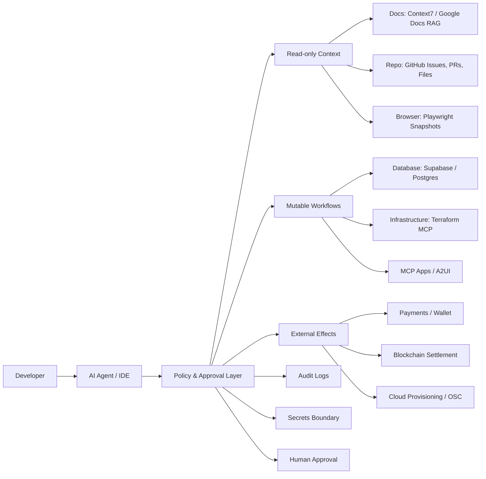

> 한 줄 요약: MCP 서버는 AI 에이전트에 실제 작업 도구를 붙이는 기술이다. 많이 연결할수록 생산성보다 권한 경계가 먼저 커진다. 실무 판단의 핵심은 어떤 도구를 붙일지가 아니라, 어떤 상태를 읽고 어떤 상태를 바꿀 수 있게 할지다.

## 왜 지금 이슈인가

MCP 서버, AI 에이전트, 인프라 자동화가 한 흐름으로 묶이면서 개발자의 질문이 바뀌고 있다. 예전에는 모델이 코드를 얼마나 잘 쓰는지가 관심사였다. 지금은 에이전트가 GitHub, 브라우저, 문서, 데이터베이스, 클라우드, 결제, 블록체인 같은 실제 작업 표면에 접근해도 되는지가 더 큰 문제가 됐다.

선정 글감은 GitHub MCP, Playwright MCP, Context7, Supabase MCP, Pairoa를 AI 빌더가 먼저 설치할 만한 도구로 제안한다. 이 조합은 현실적이다. 저장소 맥락, 브라우저 상태, 최신 문서, 데이터베이스, 외부 기회를 각각 하나의 작업 표면으로 본다.

다만 여기서 곧장 설치 목록으로 넘어가면 핵심을 놓친다. MCP가 중요한 이유는 플러그인 생태계가 커져서가 아니다. AI 에이전트가 읽기 전용 도우미에서 변경 권한을 가진 운영 인터페이스로 이동하고 있기 때문이다.

HashiCorp의 Terraform MCP 서버 글도 같은 지점을 다룬다. LLM은 비결정적 시스템이고, 인프라 환경에서는 보안, 컴플라이언스, 비용, 운영 안정성이 함께 걸린다. 그래서 에이전트가 일반 지식으로 답하게 두기보다 Terraform 워크플로, 모듈, 정책, 워크스페이스처럼 조직이 실제로 쓰는 기준에 붙여야 한다는 주장이다.

Google Pay & Wallet Developer MCP 서버도 비슷하다. 에이전트가 공식 문서를 검색하고, Wallet pass 정의를 검증하고, 통합 상태와 계정 맥락을 확인한다. 여기서 MCP는 단순 생산성 도구보다 최신 API 문서와 실제 계정 상태를 연결하는 검증 레이어에 가깝다.

## 커뮤니티에서 갈리는 지점

개발자 커뮤니티에서 MCP를 두고 갈리는 지점은 대체로 세 가지다.

| 쟁점 | 기대 | 우려 |
|---|---|---|
| 개발 생산성 | 복사, 붙여넣기, 탭 전환, 수동 검증 감소 | 에이전트가 잘못된 맥락으로 더 빠르게 사고를 낼 수 있음 |
| 운영 자동화 | Terraform, 클라우드, DB 작업을 대화형으로 처리 | 권한, 감사 로그, 비용 폭주, 정책 우회 위험 |
| 사용자 경험 | MCP Apps, A2UI로 에이전트 UI 확장 | iframe 격리, 성능, 디자인 일관성, 보안 경계 복잡화 |

찬성 쪽은 MCP를 반복 작업을 줄이는 장치로 본다. GitHub 이슈를 보고 관련 파일을 찾고, Playwright로 실제 화면을 확인하고, Context7로 현재 버전 문서를 가져오고, Supabase에서 스키마를 읽는 일은 이미 개발자가 매일 하던 작업이다. 에이전트가 그 손동작을 대신하면 작업 속도는 올라간다.

반대나 유보 쪽은 MCP가 에이전트의 환각 문제를 없애지는 못한다고 본다. 도구가 붙으면 틀린 답이 줄어드는 영역도 있지만, 잘못된 도구 호출이라는 새 실패 모드가 생긴다. 읽기 전용 문서 검색은 실패해도 비용이 낮다. 운영 DB 쓰기, 클라우드 리소스 생성, 결제 계정 변경은 실패 비용이 다르다.

Google의 A2UI와 MCP Apps 논의는 UI 쪽에서 같은 긴장을 보여준다. MCP Apps는 iframe 안에서 자유로운 웹 UI를 만들 수 있지만, 디자인 충돌, 중복 스크롤, 성능, 보안 캡슐화 부담이 있다. A2UI는 JSON으로 렌더링 의도를 보내고 호스트가 네이티브 컴포넌트로 그리기 때문에 일관성과 보안성이 좋아지지만, 복잡한 클라이언트 로직에는 제약이 있다.

블록체인 사례는 더 예민하다. RFQ부터 환불까지 여섯 개 MCP 도구로 에이전트 간 거래를 진행하는 글은 가격 발견, 봉인 입찰, HTLC(Hash Time Locked Contract), 정산, 환불을 실제 호출 단위로 설명한다. 여기서 MCP는 화면을 여는 도구가 아니라 자산 이동의 전 단계에 서 있다. 자금 이동 전 정보 탐색은 비교적 안전하지만, 잠금과 정산이 들어가는 순간 에이전트 권한 모델은 제품 기능이 아니라 보안 설계가 된다.

## 아키텍처 관점에서 볼 점

MCP 서버를 아키텍처에 넣을 때는 서버 목록보다 권한면을 먼저 그려야 한다. 같은 MCP라도 GitHub 이슈 읽기, PR 생성, 프로덕션 DB 수정, Terraform apply, 결제 계정 조회는 전혀 다른 리스크를 가진다.

이 그림에서 MCP 서버는 에이전트 옆에 납작하게 붙은 플러그인이 아니다. 정책 레이어(Policy & Approval Layer) 뒤에 있어야 한다. 에이전트가 무엇을 요청했는지, 어떤 도구가 호출됐는지, 어떤 입력으로 어떤 변경이 발생했는지 남겨야 한다.

읽기 전용 맥락은 비교적 먼저 도입해볼 만하다. Context7 같은 문서 검색, GitHub의 이슈와 PR 조회, Playwright의 페이지 스냅샷은 에이전트가 더 정확하게 판단하도록 돕는다. 이 단계의 목표는 모델의 추측을 줄이는 것이다.

쓰기 가능한 워크플로부터는 기준이 달라진다. Supabase MCP로 스키마를 읽는 것과 데이터를 변경하는 것은 다르다. Terraform MCP로 모듈과 정책을 참고하는 것과 리소스를 생성하는 것도 다르다. Open Source Cloud처럼 대화로 PostgreSQL과 S3 호환 오브젝트 스토어를 프로비저닝하는 흐름은 편하지만, 누가 비용과 운영 책임을 갖는지 따로 봐야 한다.

외부 효과가 있는 영역은 승인 단계를 기본값으로 둬야 한다. 메시지 발송, 결제, 자산 이동, 프로덕션 배포, 계정 설정 변경은 에이전트가 제안하고 사람이 확정하는 구조가 낫다. 완전 자동화를 막자는 뜻이 아니다. 자동화할 영역과 승인할 영역을 같은 레벨로 다루지 말자는 뜻이다.

### MCP 서버를 몇 개 설치해야 할까?

선정 글감의 다섯 계층은 좋은 출발점이다.

- 저장소: GitHub MCP
- 브라우저: Playwright MCP
- 문서: Context7
- 데이터: Supabase MCP
- 외부 기회: Pairoa

다만 설치 순서는 유행보다 병목을 기준으로 잡아야 한다. 팀이 자주 실패하는 지점이 오래된 SDK 문서라면 Context7이 먼저다. UI 회귀를 놓친다면 Playwright MCP가 먼저다. 이슈와 코드 맥락을 매번 사람이 모아야 한다면 GitHub MCP가 먼저다.

인프라 자동화는 더 늦게 넣어도 된다. Terraform MCP나 OSC처럼 프로비저닝까지 연결되는 서버는 효과가 크지만, 정책과 감사, 비용 한도, 롤백 경로가 없으면 작은 편의가 큰 운영 부담으로 바뀐다.

## 실무에서 볼 점

MCP 도입 전에는 서버 이름보다 다음 질문에 답하는 편이 빠르다.

| 확인 질문 | 이유 |
|---|---|
| 이 서버는 읽기만 하는가, 쓰기도 하는가? | 권한 설계의 출발점 |
| 프로덕션 데이터나 고객 정보에 닿는가? | 개인정보, 보안, 감사 로그 필요 |
| 실패 시 되돌릴 수 있는가? | 배포, 결제, DB 변경, 인프라 생성의 차이 |
| 에이전트 호출 기록이 남는가? | 사고 분석과 책임 경계 |
| 사람이 승인해야 하는 호출은 무엇인가? | 자동화와 통제의 균형 |
| 공식 서버인가, 커뮤니티 서버인가? | 유지보수, 보안 업데이트, 신뢰 수준 |

실제로 비슷한 자동화 흐름을 다루다 보면 가장 먼저 무너지는 곳은 모델 성능이 아니다. 권한 범위가 모호한 곳이다. 처음에는 편해서 넓은 토큰을 넣고 시작하지만, 곧 개발, 스테이징, 프로덕션 경계가 흐려진다. 그 상태에서 에이전트가 좋은 의도로 잘못된 환경을 건드리면 복구 비용은 사람이 낸다.

Supabase MCP 같은 데이터베이스 연결은 처음부터 읽기 전용으로 시작하는 편이 낫다. 스키마 확인, 쿼리 분석, 디버깅용 조회만으로도 얻는 효용이 크다. 쓰기 권한은 마이그레이션 검토, 테스트 데이터 생성, 제한된 스테이징 환경처럼 범위를 좁혀 붙이면 된다.

Playwright MCP는 위험 대비 효용이 좋다. 에이전트가 코드를 읽고 추측하는 대신 실제 브라우저 상태를 본다. 회원가입, 결제 전 단계, 관리자 화면, 문서 페이지 같은 흐름에서 화면 기반 검증은 테스트 자동화와도 이어진다. 다만 로그인 세션과 쿠키를 어떻게 다룰지는 미리 정해야 한다.

Terraform MCP는 플랫폼 팀의 운영 기준과 같이 봐야 한다. 좋은 사용법은 에이전트가 조직의 모듈, 정책, 워크스페이스를 참조해 변경안을 제안하는 것이다. 위험한 사용법은 에이전트가 대화 중 바로 리소스를 만들고, 비용과 소유자 태그와 네트워크 정책을 나중에 정하는 것이다.

MCP Apps와 A2UI는 제품 경험을 만들 때 별도 판단이 필요하다. iframe 기반 앱은 빠르게 풍부한 UI를 붙일 수 있지만, 보안 격리와 성능이 숙제다. 선언형 UI는 호스트 앱의 디자인 시스템과 보안 모델을 지킬 수 있지만, 복잡한 상태ful 상호작용에는 답답할 수 있다. 사내 도구라면 iframe이 충분할 수 있고, 고객-facing 제품이라면 선언형 렌더링과 제한된 확장 포인트가 더 나을 수 있다.

블록체인이나 결제 MCP는 마지막에 붙이는 편이 맞다. RFQ, 견적 비교, 정산 전 검토처럼 정보 단계는 에이전트가 잘할 수 있다. 자금 잠금, 서명, 환불, 계정 변경은 승인과 한도, 시뮬레이션, 감사 로그가 먼저다.

## 정리

MCP의 실무 가치는 에이전트에게 도구를 많이 주는 데 있지 않다. 추측으로 답하던 모델을 실제 저장소, 브라우저, 문서, 데이터, 인프라 상태에 붙이는 데 있다.

그러나 실제 상태에 붙는다고 해서 안전해지는 것은 아니다. GitHub 이슈 읽기와 Terraform apply, 문서 검색과 결제 계정 변경, 브라우저 확인과 블록체인 정산은 같은 MCP 호출처럼 보여도 운영 리스크가 다르다.

당장 할 일은 단순하다. 지금 쓰는 AI 개발 환경에서 MCP 서버 목록을 만들고, 각 서버를 읽기 전용, 제한적 쓰기, 외부 효과 세 단계로 나눠보면 된다. 그 표를 만들 수 없다면 아직 설치가 아니라 경계 정의가 먼저다.

## 참고 자료

- [선정 글감] [5 MCP Servers I Would Install First as an AI Builder](https://dev.to/usepairoa/5-mcp-servers-i-would-install-first-as-an-ai-builder-nb) - DEV Community
- [관련] [Terraform MCP server: Four real-world AI infrastructure patterns](https://www.hashicorp.com/blog/terraform-mcp-server-four-real-world-ai-infrastructure-patterns) - HashiCorp Blog
- [관련] [A2UI + MCP Apps: Combining the best of declarative and custom agentic UIs](https://developers.googleblog.com/a2ui-and-mcp-apps/) - Google Developers
- [관련] [Supercharge your integration workflow with the Google Pay & Wallet Developer MCP server](https://developers.googleblog.com/supercharge-your-integration-workflow-with-the-google-pay-wallet-developer-mcp-server/) - Google Developers
- [관련] [The MCP server that provisions a full backend your AI agent can deploy, and you can walk away](https://dev.to/oscdev/the-mcp-server-that-provisions-a-full-backend-your-ai-agent-can-deploy-and-you-can-walk-away-1pba) - DEV Community
- [관련] [Six MCP tools, one trade: walking an AI agent from RFQ to refund](https://dev.to/barissozen/six-mcp-tools-one-trade-walking-an-ai-agent-from-rfq-to-refund-595m) - DEV Community