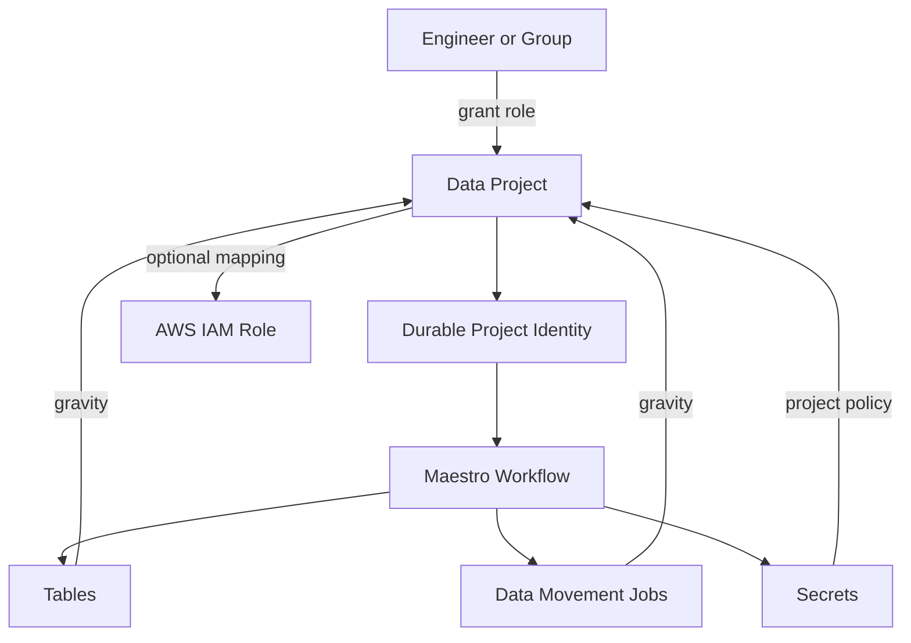

> 한 줄 요약: Netflix는 데이터 자산을 테이블 하나하나가 아니라 Project라는 오래가는 단위로 묶었다. 권한, 실행 아이덴티티, 산출물 소유권을 같은 경계 안에 넣어서 데이터 플랫폼 운영 비용을 줄인 사례다.

## 주제를 꺼낸 이유

데이터 플랫폼은 처음에는 단순해 보인다. 테이블을 만들고, 파이프라인을 돌리고, 필요한 사람에게 권한을 준다. 문제는 규모가 커진 뒤다. 테이블이 수백만 개가 되고, 워크플로가 팀마다 흩어지고, 만든 사람이 팀을 옮기거나 회사를 떠나면 작은 ACL 변경도 운영 이슈가 된다.

Netflix의 Data Projects 글은 이 지점을 꽤 현실적으로 다룬다. "데이터 자산을 잘 관리하자"는 선언이 아니라, 사람이 들고 있던 권한과 워크로드 실행 주체를 어떻게 더 오래가는 단위로 옮겼는지를 설명한다.

## Project가 해결하려는 문제

Netflix가 말하는 Project는 폴더나 태그에 가깝지 않다. 데이터 자산, 권한, 실행 아이덴티티를 함께 묶는 운영 단위다. 특히 중요한 점은 실행 주체다. 사람이 만든 토큰이나 개인 계정으로 워크로드가 계속 돌면, 그 사람이 팀을 옮기거나 계정이 닫힐 때 파이프라인도 같이 흔들린다.

정리하면 문제는 세 가지다.

- 테이블과 워크플로가 많아질수록 소유권 추적 비용이 커진다.
- 개인 계정 중심 권한은 조직 변경에 약하다.
- 새로 생긴 데이터 산출물을 나중에 찾아 소유권을 붙이는 작업이 반복된다.

Project는 이 셋을 같은 모델 안에서 다룬다.

| 구성 | 역할 |
| --- | --- |
| Project | 테이블, 워크플로, 데이터 이동 작업을 묶는 논리 단위 |
| Project identity | 사람 대신 워크로드가 사용하는 지속 가능한 실행 주체 |
| Grant | 개인이나 그룹에게 Project 단위로 부여하는 권한 |
| Gravity | identity로 만들어진 산출물을 같은 Project에 자동으로 묶는 규칙 |

여기서 마음에 드는 부분은 "사후 정리"를 줄인다는 점이다. 워크로드가 테이블을 만들면 그 테이블은 자연스럽게 해당 Project의 관리 범위로 들어간다. 나중에 대시보드에서 주인을 찾아 붙이는 일이 아니라, 생성 경로에서 소유권이 정해진다.

구조는 단순히 권한 UI를 예쁘게 만든 것이 아니다. 사람에게 붙어 있던 실행 권한을 Project로 옮기고, 산출물을 생성 경로에서 바로 분류한다. 그래서 데이터 자산 관리는 사후 정리 작업이 아니라 실행 모델의 일부가 된다.

## 관련 글들이 보여주는 같은 방향

이번 글은 Netflix의 다른 글들과 같이 읽을 때 더 선명하다.

Data Canary 글은 카탈로그 메타데이터 검증을 다룬다. 코드가 정상이어도 데이터가 깨지면 사용자 경험은 망가진다. Projects가 소유권과 권한의 경계를 다룬다면, Canary는 그 경계 안에서 흘러가는 데이터의 품질을 확인하는 장치에 가깝다.

Cassandra Data Movement 글은 플랫폼 재사용의 예다. 데이터 이동 작업을 매번 각 팀이 따로 구현하면 운영 방식이 금방 갈라진다. 공통 플랫폼으로 올리면 장애 대응, 권한, 관측 지점을 한곳에서 다룰 수 있다. Projects도 같은 철학이다. 데이터 자산을 각 팀의 임시 관습에 맡기지 않고, 플랫폼의 관리 평면으로 끌어올린다.

Real-Time Service Map 글은 서비스 의존성 지도 이야기다. 장애가 났을 때 어떤 서비스가 어디에 기대고 있는지 알아야 한다. 데이터 플랫폼도 마찬가지다. 어떤 Project가 어떤 테이블과 워크플로를 소유하고, 어떤 아이덴티티로 실행되는지 알아야 운영 판단이 가능하다.

Kueue 글은 배치 컴퓨트 운영을 단순화한 사례다. 배치 작업이 많아지면 큐, 우선순위, 리소스 할당을 사람이 계속 맞출 수 없다. 결국 정책과 제어를 플랫폼으로 올려야 한다. Projects가 데이터 자산의 권한과 소유권을 올린 것과 결이 같다.

## 내 실무 관점

이 설계에서 가장 현실적인 부분은 "마이그레이션이 어렵다"는 사실을 숨기지 않는 점이다. 이미 돌아가는 데이터 파이프라인을 갑자기 새 모델로 옮길 수는 없다. 개인 계정으로 실행되는 워크로드, 오래된 ACL, 소유자가 흐릿한 테이블이 반드시 남아 있다.

그래서 이런 시스템은 처음부터 완벽한 카탈로그를 만들려고 하면 실패하기 쉽다. 작은 경계부터 잡는 편이 낫다.

1. 장애가 나면 바로 문제가 되는 핵심 데이터 파이프라인을 고른다.
2. 개인 계정으로 실행되는 워크로드를 찾는다.
3. 실행 주체를 팀이나 도메인 단위 아이덴티티로 옮긴다.
4. 새로 생성되는 테이블과 파일에 소유 단위를 자동 태깅한다.
5. 중요한 데이터에는 Canary에 가까운 검증 게이트를 붙인다.

Netflix만큼의 규모가 아니어도 패턴은 유효하다. 데이터 자산이 많아질수록 권한 문제는 보안팀만의 일이 아니라 배포 안정성 문제가 된다. 누가 만들었는지보다, 어떤 운영 단위가 책임지는지가 더 중요해진다.

## 정리

Netflix Projects의 핵심은 데이터 자산을 더 잘 분류하는 데만 있지 않다. 사람에게 붙어 있던 권한과 개별 자산 중심 ACL을 Project라는 더 오래가는 단위로 옮기는 데 있다.

Canary는 데이터 품질을, Cassandra Data Movement는 데이터 이동 플랫폼을, Service Map은 의존성 관측을, Kueue는 배치 실행 제어를 다룬다. 주제는 다르지만 방향은 같다. 사람이 반복해서 맞추던 운영 판단을 플랫폼의 관리 평면으로 옮기는 것이다.

당장 해볼 일은 단순하다. 핵심 데이터 파이프라인 하나를 골라서 "누가 무엇을 만들고, 누가 소유하며, 깨졌을 때 누가 영향을 받는가"를 그려보면 된다. 그 그림이 흐릿하면 이미 Project 같은 관리 단위가 필요한 상태일 가능성이 높다.

## 참고 자료

- [대표 원문] [Data Projects: Managing Data Assets at Netflix Scale](https://netflixtechblog.com/data-projects-managing-data-assets-at-netflix-scale-7ca25888591e?source=rss----2615bd06b42e---4) - Netflix Tech Blog
- [관련] [The Data Canary: How Netflix Validates Catalog Metadata](https://netflixtechblog.com/the-data-canary-how-netflix-validates-catalog-metadata-8ca937cf63ce?source=rss----2615bd06b42e---4) - Netflix Tech Blog
- [관련] [The Evolution of Cassandra Data Movement at Netflix](https://netflixtechblog.com/the-evolution-of-cassandra-data-movement-at-netflix-58c95ba71400?source=rss----2615bd06b42e---4) - Netflix Tech Blog
- [관련] [Real-Time Service Map: From Data to Visualization](https://netflixtechblog.com/real-time-service-map-from-data-to-visualization-5c951dc7657a?source=rss----2615bd06b42e---4) - Netflix Tech Blog
- [관련] [Kueue: A Kubernetes-Native Job Queueing System](https://kubernetes.io/blog/2025/05/19/kueue-intro/) - Kubernetes Blog
