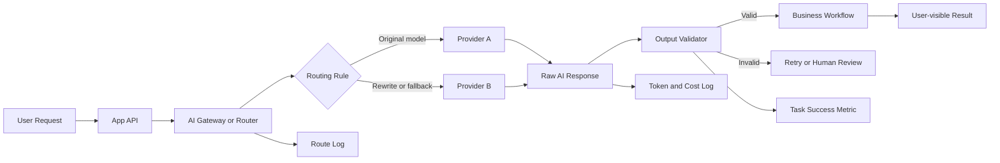

> 한 줄 요약: AI API 운영에서 HTTP 200은 성공 신호로 부족하다. 모델 라우팅, 재시도, 비용, 지연, 출력 검증, 권한 범위를 함께 봐야 정상 응답처럼 보이는 장애를 잡을 수 있다.

## 왜 지금 이슈인가

AI API를 붙인 서비스에서 가장 위험한 순간은 에러가 터질 때만은 아니다. 더 까다로운 상황은 HTTP 200이 돌아왔지만 실제 업무는 실패한 경우다.

응답은 왔다. JSON도 파싱된다. 대시보드에는 성공 요청으로 찍힌다. 그런데 사용자가 받은 답변이 비어 있거나, 다음 워크플로가 요구하는 필드가 빠져 있거나, 의도한 모델이 아니라 fallback 모델이 처리했거나, 내부 재시도 때문에 비용이 예상보다 커져 있을 수 있다.

개발자 커뮤니티에서 AI Gateway, 모델 라우팅, 에이전트 관측성, AI 평가(Evaluation) 이야기가 함께 나오는 이유도 여기에 있다. 기존 API 운영에서는 상태 코드, 지연 시간, 에러율만으로도 꽤 많은 문제를 설명할 수 있었다. AI API에서는 성공의 정의가 애플리케이션의 의미까지 내려온다.

선정 글감이 던지는 질문은 단순하다.

> 요청이 성공했다는 말은 무엇을 뜻하는가?

프로덕션 AI 시스템에서는 최소한 다음을 구분해야 한다.

- 네트워크 요청이 성공했는가
- 의도한 모델이 실행됐는가
- fallback이나 retry가 있었는가
- 토큰과 비용 한도를 지켰는가
- 출력이 다음 단계에서 실제로 쓸 수 있는가
- 지연 시간이 제품의 허용 범위 안에 있었는가
- 로그만 보고 이 요청을 설명할 수 있는가

이 중 하나라도 빠지면 HTTP 200은 운영 지표가 아니라 착시가 된다.

## 커뮤니티에서 갈리는 지점

### AI Gateway를 어디까지 믿어야 할까?

Vercel AI Gateway의 routing rules는 이 논쟁을 잘 보여준다. gateway 레벨에서 특정 모델 요청을 다른 모델로 rewrite하거나, 승인하지 않은 모델을 deny할 수 있다. 모델 장애나 retire 상황에서 애플리케이션 코드를 다시 배포하지 않고 라우팅을 바꿀 수 있다는 점은 운영자에게 매력적이다.

하지만 이 기능은 새로운 실패 모드도 만든다.

애플리케이션은 `anthropic/claude-opus-4.8`을 요청했다고 믿지만, gateway 규칙은 실제 처리를 `anthropic/claude-haiku-4.5`로 바꿀 수 있다. 이 자체가 나쁜 설계는 아니다. 문제는 이 사실이 제품 로그, 비용 분석, 품질 평가에 남지 않을 때 생긴다.

| 관점 | 장점 | 위험 |
|---|---|---|
| Gateway rewrite | 장애 대응과 모델 이전이 빠르다 | 모델 변경이 애플리케이션 코드 밖에서 일어난다 |
| Gateway deny | 승인되지 않은 모델 사용을 막는다 | 팀별 예외 정책이 복잡해진다 |
| Provider fallback | 가용성이 좋아진다 | 품질, 비용, 지연의 원인을 추적하기 어려워진다 |
| 앱 내부 라우팅 | 비즈니스 맥락을 반영하기 쉽다 | 배포 없이 바꾸기 어렵고 중복 구현이 늘어난다 |

현업에서 비슷한 고민을 하다 보면 gateway는 네트워크 프록시보다 정책 실행 지점(Policy Enforcement Point)에 가까워진다. 그래서 단순히 어느 업체의 gateway가 편한지가 아니라, 라우팅 결정을 감사할 수 있는지가 더 중요한 판단 기준이 된다.

### Human-in-the-loop는 안전장치인가, 승인 피로인가?

Anthropic의 Claude containment 글은 다른 종류의 위험을 보여준다. 에이전트가 내부 시스템에 접근할수록 생산성은 올라가지만, 실패했을 때의 피해 반경도 커진다. Anthropic은 사람 승인 방식이 이론적으로는 안전해 보이지만 실제로는 취약하다고 설명한다. 텔레메트리에서 사용자가 권한 요청의 약 93%를 승인했다는 대목은 특히 불편하다.

이 수치는 사람 승인이 무의미하다는 뜻이 아니다. 다만 권한 프롬프트를 많이 보여주는 방식만으로는 통제가 되지 않는다는 뜻이다. 승인 버튼은 보안 경계가 아니라 인터페이스에 가깝다.

AI API에서도 같은 문제가 반복된다. 모델 호출 전에 사용자가 확인을 눌렀다고 해서 그 요청이 성공적이거나 안전한 것은 아니다. 어떤 모델로 갔는지, 어떤 도구를 호출했는지, 어느 데이터에 접근했는지, 실패했을 때 어디까지 되돌릴 수 있는지가 따로 설계돼 있어야 한다.

### 평가 지표는 정확도 하나로 끝나지 않는다

Stack Overflow의 AI apps 관련 논의는 좋은 AI 애플리케이션을 평가할 때 정량 지표와 정성 신호를 함께 봐야 한다는 쪽에 가깝다. 여기에 production failure 논의를 겹쳐 보면 더 선명해진다. 장애는 코드 한 줄보다 시스템 간 상호작용에서 발생하는 경우가 많다.

AI API에서는 그 상호작용이 더 많다.

- 사용자 입력
- 프롬프트 템플릿
- 컨텍스트 검색(RAG)
- 모델 라우터
- provider API
- 재시도 정책
- 출력 검증기
- 후속 워크플로
- 비용 한도
- 감사 로그

어느 한 곳만 정상이어도 전체 업무는 실패할 수 있고, 어느 한 곳만 실패해도 HTTP 200은 여전히 돌아올 수 있다.

## 아키텍처 관점에서 볼 점

### HTTP 200 이후에 성공 판정을 한 번 더 해야 한다

AI API를 제품 기능으로 쓰는 순간, 성공 판정은 transport layer가 아니라 application layer에서 끝나야 한다. 요청 성공과 작업 성공을 분리해 저장해야 한다.

이 구조에서 봐야 할 로그는 단순한 access log가 아니다. 최소한 다음 필드가 있어야 한다.

| 필드 | 이유 |
|---|---|
| requested_model | 애플리케이션이 의도한 모델을 확인 |
| served_model | 실제 처리한 모델을 확인 |
| route_reason | rewrite, fallback, deny, retry 원인 추적 |
| attempt_count | 숨은 재시도와 비용 증가 확인 |
| input_tokens / output_tokens | 가격표가 아니라 실제 비용 기반 분석 |
| charged_amount | 팀, 기능, 고객별 비용 귀속 |
| latency_ms | 제품 허용 시간 초과 여부 확인 |
| output_valid | JSON, 필드, 길이, 금칙 응답 검증 |
| workflow_result | 다음 단계까지 통과했는지 확인 |
| trace_id | 장애 조사와 재현을 위한 연결 키 |

선정 글감의 표현을 빌리면 cheapest model이 아니라 cheapest successful route를 봐야 한다. 가장 싼 모델이 아니라, 의도한 일을 성공시키는 가장 싼 경로다.

### Retry는 신뢰성을 높이지만 비용을 숨긴다

AI API에서 retry는 양날이다. provider의 일시 장애, rate limit, timeout을 흡수해 사용자 경험을 지킬 수 있다. 동시에 한 번의 사용자 요청이 여러 번의 유료 호출로 바뀐다.

특히 에이전트 워크플로에서는 비용이 더 쉽게 흐려진다. 한 번의 사용자 요청이 계획 수립, 검색, 코드 생성, 검증, 수정 호출로 이어진다. 여기에 각 단계 retry가 붙으면 화면에는 성공 한 번, 청구서에는 여러 번의 호출이 남는다.

운영 지표를 이렇게 나눠야 한다.

- request success rate: HTTP 기준 성공률
- task success rate: 업무 기준 성공률
- first-attempt success rate: 첫 호출 성공률
- retry-amplified cost: 재시도로 증가한 비용
- fallback success rate: fallback 이후 성공률
- validation failure rate: 응답은 왔지만 쓸 수 없는 비율

이 지표를 나누지 않으면 장애 대응 회의에서 서로 다른 이야기를 하게 된다. 플랫폼 팀은 성공률이 높다고 말하고, 제품 팀은 품질이 떨어졌다고 말하고, 재무 쪽에서는 비용이 튀었다고 말한다. 셋 다 맞는 말일 수 있다.

### 모델 라우팅은 성능 최적화가 아니라 변경 관리다

Fugu Ultra 같은 모델은 단일 모델이 아니라 여러 공개 frontier model을 조합해 문제에 따라 1~3개 agent로 작업을 나누고 결과를 합치는 방식으로 설명된다. 이런 흐름은 앞으로 더 흔해질 가능성이 크다. 사용자는 하나의 model id를 호출하지만 내부에서는 여러 모델과 단계가 움직인다.

그러면 model id만 저장하는 로그는 부족하다. 라우팅이 단일 호출인지, 다중 에이전트 조합인지, provider 내부에서 어떤 품질 차이를 만들 수 있는지까지는 최소한 운영 가정에 들어가야 한다.

물론 모든 내부 동작을 provider가 공개할 수는 없다. 그래서 애플리케이션이 통제할 수 있는 경계를 분명히 해야 한다.

- 어떤 모델군을 허용할 것인가
- 어떤 요청은 fallback을 금지할 것인가
- 어떤 기능은 저비용 모델로 degrade해도 되는가
- 어떤 기능은 latency보다 정확성이 우선인가
- 어떤 응답은 사람 검토 전까지 외부로 내보내지 않을 것인가

모델 라우팅은 단순한 비용 최적화 스위치가 아니다. 기능별 위험 등급을 반영하는 변경 관리 레이어다.

## 실무에서 볼 점

### 도입 전에 정해야 할 성공 조건

AI API를 붙이기 전에 먼저 정해야 할 것은 프롬프트가 아니라 성공 조건이다. 좋은 답변이라는 말은 너무 넓다. 시스템은 더 좁은 조건을 필요로 한다.

예를 들어 고객 문의 자동 분류라면 성공 조건은 이렇게 쪼갤 수 있다.

- 반드시 JSON으로 응답해야 한다
- `category`, `confidence`, `reason` 필드가 있어야 한다
- `category`는 사전 정의된 값 중 하나여야 한다
- `confidence`가 낮으면 자동 처리하지 않는다
- 응답 시간이 2초를 넘으면 fallback UX로 보낸다
- 특정 개인정보가 출력되면 실패로 처리한다
- fallback 모델이 처리한 결과는 별도 표본 검수 대상으로 보낸다

이런 조건이 없으면 모델 교체나 gateway rewrite가 발생했을 때 품질 변화를 판단할 수 없다. 응답이 자연스러워졌는지보다, 제품이 약속한 작업을 통과했는지가 먼저다.

### 보안 리스크는 모델보다 권한 경계에서 커진다

AI 에이전트가 도구를 호출하는 구조에서는 모델 품질보다 권한 설계가 더 현실적인 위험이 된다. Anthropic이 말한 blast radius 문제도 여기와 맞닿아 있다. 모델이 실수할 확률이 낮아져도, 한 번의 실수가 접근 가능한 시스템 전체에 영향을 준다면 위험은 줄지 않는다.

실무에서는 다음 경계를 따로 둬야 한다.

| 경계 | 확인 질문 |
|---|---|
| 데이터 접근 | 이 요청이 어떤 고객 데이터에 접근할 수 있는가 |
| 도구 실행 | 읽기, 쓰기, 삭제, 배포 권한이 분리돼 있는가 |
| 네트워크 | 외부 URL 호출과 내부 시스템 접근이 구분되는가 |
| 비용 | 루프나 retry가 예산을 초과할 때 멈추는가 |
| 출력 | 민감 정보, 허위 확정 표현, 잘못된 액션을 막는가 |
| 감사 | 누가, 어떤 키로, 어떤 모델과 도구를 썼는가 |

여기서 핵심은 더 똑똑한 모델을 기다리는 것이 아니다. 모델이 더 유능해질수록 더 많은 권한을 요구하고, 그만큼 피해 반경을 제한하는 설계가 필요해진다.

### 실패하기 쉬운 지점

첫 번째는 fallback을 품질 저하가 아니라 가용성 향상으로만 보는 것이다. fallback은 장애 대응 수단이지만, 결과 품질과 비용 프로파일을 바꾼다. 사용자에게 보이는 기능에서는 fallback 여부를 feature flag나 metric 차원에서 분리해야 한다.

두 번째는 로그를 나중에 붙이려는 것이다. AI 기능은 출시 후에야 이상 패턴이 드러나는 경우가 많다. 그런데 요청 당시의 prompt hash, model route, token, validation result가 없으면 재현이 어렵다. 장애가 난 뒤 로그를 추가해도 이미 지나간 요청은 돌아오지 않는다.

세 번째는 evaluation을 별도 연구 과제로 미루는 것이다. 거창한 벤치마크가 아니어도 된다. 최소한 대표 입력 50개, 실패하면 안 되는 입력 20개, 악의적이거나 모호한 입력 20개 정도는 배포 파이프라인에 넣을 수 있다. 모델 변경, 라우팅 규칙 변경, 프롬프트 변경 때 이 묶음을 다시 돌려야 한다.

네 번째는 비용 한도를 월말 청구서로만 보는 것이다. 토큰 예산은 런타임 제어 대상이어야 한다. 요청당 최대 출력 길이, agent loop 최대 횟수, retry 상한, 사용자별 또는 프로젝트별 budget을 두지 않으면 작은 버그가 곧 비용 사고가 된다.

### AI API 운영 체크리스트

- HTTP status와 task status를 분리해 저장한다
- requested model과 served model을 모두 남긴다
- fallback, rewrite, retry를 trace에 기록한다
- 출력 검증기를 애플리케이션 안에 둔다
- 기능별 latency budget을 정한다
- 모델 변경 전후 evaluation set을 돌린다
- agent 권한은 읽기와 쓰기를 분리한다
- 비용 상한은 월 단위가 아니라 요청과 워크플로 단위로 둔다
- 사람이 승인하는 액션도 별도 감사 로그에 남긴다
- gateway 규칙 변경을 코드 변경처럼 리뷰한다

이 정도가 갖춰지면 AI API는 실험용 호출에서 운영 가능한 의존성으로 넘어갈 수 있다. 반대로 이 중 대부분이 없다면 아직 모델 문제가 아니라 플랫폼 문제가 남아 있는 상태다.

## 정리

HTTP 200은 AI API 운영에서 출발점일 뿐이다. 실제 성공은 의도한 모델이, 허용된 비용과 지연 안에서, 검증 가능한 출력을 만들고, 다음 워크플로까지 통과했을 때 말할 수 있다.

AI Gateway, fallback, 다중 에이전트 모델, autonomous SRE 같은 흐름은 모두 같은 문제를 건드린다. AI 시스템의 위험은 모델 호출 한 줄이 아니라 라우팅, 권한, 비용, 로그, 평가가 얽히는 지점에서 커진다.

당장 확인할 것은 하나다. 지금 운영 중인 AI 기능의 로그만 보고 특정 응답이 왜, 어떤 모델로, 몇 번의 시도 끝에, 얼마의 비용으로, 어떤 검증을 통과해 사용자에게 나갔는지 설명할 수 있는가. 설명할 수 없다면 성공률 그래프가 아무리 좋아도 아직 성공을 측정하고 있지 않은 것이다.

## 참고 자료

- [선정 글감] [HTTP 200 Is Not Enough: Define a Successful AI API Request](https://dev.to/edward_li_71f26791eac62b8/http-200-is-not-enough-define-a-successful-ai-api-request-452g) — DEV Community
- [관련] [Routing rules now available on AI Gateway](https://vercel.com/changelog/ai-gateway-routing-rules) — Vercel Blog
- [관련] [How we contain Claude across products](https://www.anthropic.com/engineering/how-we-contain-claude) — Anthropic Engineering
- [관련] [Code isn’t the only thing causing your production failures](https://stackoverflow.blog/2026/06/25/code-isnt-causing-your-production-failures/) — Stack Overflow Blog
- [관련] [The good, the bad, and the AI apps](https://stackoverflow.blog/2026/07/03/the-good-the-bad-and-the-ai-apps/) — Stack Overflow Blog
- [관련] [Sakana Fugu Ultra now available on AI Gateway](https://vercel.com/changelog/sakana-fugu-ultra-now-available-on-ai-gateway) — Vercel Blog