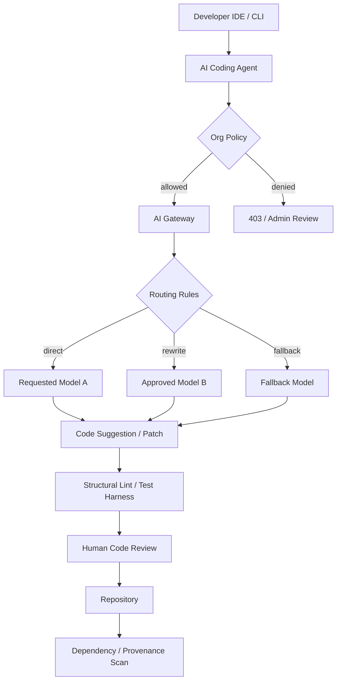

> 한 줄 요약: AI 코딩 에이전트와 GitHub Copilot 모델 선택지는 생산성만으로 설명하기 어렵다. 보안, 비용, 코드 리뷰, 의존성 관리가 함께 걸린 운영 아키텍처 문제다. 모델을 더 많이 열수록 애플리케이션 코드보다 게이트웨이, 정책, 하네스, 리뷰 기준이 먼저 준비돼 있어야 한다.

## 왜 지금 이슈인가

AI 코딩 에이전트는 이제 IDE 안의 자동완성 기능에 머물지 않는다. GitHub Copilot에 Kimi K2.7 Code 같은 오픈 웨이트(open-weight) 모델이 들어오고, Copilot CLI, 클라우드 에이전트, JetBrains, Xcode, GitHub Mobile 같은 표면까지 넓어지면 질문은 꽤 단순해진다.

팀이 어떤 모델을 써도 되는가.

GitHub는 Kimi K2.7 Code를 Copilot 모델 피커에서 선택할 수 있는 첫 오픈 웨이트 모델로 소개했다. Copilot Business와 Enterprise에서는 기본값이 꺼져 있고, 관리자가 정책을 켜야 조직 구성원이 사용할 수 있다. 이 설정은 많은 것을 말한다.

모델 선택은 개발자 개인 취향으로 끝나지 않는다. 보안, 컴플라이언스, 데이터 거버넌스, 비용, 품질 기준을 조직 단위로 다루겠다는 의미에 가깝다.

동시에 Reuters가 전한 Alibaba의 Claude Code 사용 금지 보도처럼, 일부 조직은 AI 코딩 도구를 백도어 위험으로 본다. 반대로 Vercel AI Gateway의 라우팅 규칙은 모델 장애, 은퇴, 비용 문제를 애플리케이션 코드 변경 없이 게이트웨이 정책으로 흡수하려 한다.

한쪽에서는 모델 선택지를 늘리고, 다른 한쪽에서는 접근을 더 강하게 막는다. 이 간극 때문에 개발자 커뮤니티에서 논쟁이 붙고 있다.

## 커뮤니티에서 갈리는 지점

AI 코딩 도구 논쟁은 보통 생산성 대 보안으로 포장된다. 실무에서는 훨씬 더 지저분하다.

첫 번째 갈림길은 모델 선택권이다.

| 관점 | 기대 | 우려 |
|---|---|---|
| 여러 모델 허용 | 작업별 비용과 성능 최적화 | 검증되지 않은 모델 사용 확산 |
| 중앙 정책 관리 | 조직 단위 통제 가능 | 개발자 경험 저하 |
| 오픈 웨이트 모델 도입 | 가격 선택권, 공급자 다양화 | 데이터 처리, 라이선스, 책임 경계 불명확 |
| 게이트웨이 라우팅 | 장애와 모델 은퇴 대응 쉬움 | 실제 동작 모델을 개발자가 착각할 수 있음 |

GitHub의 Kimi K2.7 Code 도입은 선택권을 넓힌 사례다. 다만 기업 플랜에서 기본 비활성화한 점은, 오픈 웨이트라는 말이 곧 안전하다는 뜻은 아니라는 점도 보여준다. 배포 위치가 Azure이고 과금이 사용량 기반이라는 정보도 운영팀에는 모델 품질만큼 현실적인 변수다.

두 번째 갈림길은 생성 코드의 책임이다.

Mark Dominus가 쓴 코드 리뷰 관점은 이 논쟁과 잘 맞물린다. 코드 리뷰의 1차 목적을 버그 찾기가 아니라 유지보수하기 어려운 코드를 찾는 일로 보면, AI 생성 코드는 더 까다로운 리뷰 대상이 된다. 컴파일되고 테스트가 통과해도, 사람이 앞으로 고칠 수 있는 형태인지는 따로 봐야 한다.

세 번째 갈림길은 의존성이다.

Joey Hess의 No LLM code in dependencies 글은 더 극단적인 지점을 건드린다. git-annex가 LLM 생성 코드가 포함된 의존성을 피하기 위해 의존성 트리 전체를 다시 점검했다는 내용이다. 여기서 핵심은 LLM 코드가 무조건 나쁘다는 선언이 아니다. 의존성으로 들어온 코드는 우리 코드보다 검증하기 어렵고, 한 번 들어오면 계속 따라다닌다는 점이다.

AI 에이전트가 만든 코드는 PR 하나로 끝나지 않는다. 패키지, 플러그인, 템플릿, 예제 코드, 자동 수정 커밋을 통해 공급망(supply chain)에 들어온다. 이때 조직은 모델 사용 허용 여부보다 먼저, 생성 코드가 어디까지 전파되는지 추적할 방법을 갖춰야 한다.

## 아키텍처 관점에서 볼 점

AI 코딩 에이전트를 팀에 붙이는 구조는 대략 세 계층으로 나눠 볼 수 있다.

애플리케이션에서 직접 모델 API를 부르면 시작은 빠르다. 대신 운영 통제 지점이 코드 안에 흩어진다. AI 게이트웨이(AI Gateway)를 두면 모델 라우팅, 차단, 비용 제어, 감사 로그를 한곳에서 다룰 수 있다.

Vercel AI Gateway의 라우팅 규칙은 이 구조에서 Gateway와 Route에 해당한다. 특정 모델 요청을 다른 모델로 rewrite하거나, 승인하지 않은 모델을 deny로 막는다. 모델이 중단되거나 은퇴했을 때 애플리케이션을 다시 배포하지 않고 정책만 바꾸는 방식이다.

이 장점은 분명하다. 모델 공급자는 계속 바뀐다. 가격도 바뀐다. 특정 모델 장애도 생긴다. 매번 코드 수정과 배포를 거치면 AI 기능은 운영팀 입장에서 다루기 까다로운 외부 의존성이 된다.

다만 라우팅이 너무 투명하면 다른 문제가 생긴다. 개발자가 Claude 계열 모델을 호출한다고 생각했는데 실제로는 더 저렴한 모델로 rewrite된다면, 품질 차이와 실패 양상이 달라질 수 있다. 코드 생성에서는 이 차이가 테스트 누락, 타입 추론 오류, 보안 경계 오해로 나타날 수 있다.

그래서 게이트웨이 뒤에는 하네스(harness)와 구조 검사가 붙어야 한다.

Vercel의 konsistent는 TypeScript 코드베이스에서 파일 구조, export, 타입 구현 같은 구조적 규칙을 검사하는 CLI로 소개됐다. ESLint와 TypeScript가 잘 보지 못하는 패턴, 예를 들어 특정 폴더에는 특정 파일이 있어야 한다거나 특정 export가 존재해야 한다는 규칙을 잡는다.

이런 도구는 AI 에이전트를 쓸수록 더 중요해진다. 에이전트는 로컬 컨벤션을 문서로 읽고도 자주 놓친다. 반면 구조 규칙은 결정적(deterministic)으로 실패를 낸다. 코드 리뷰어가 매번 같은 지적을 반복하기 전에 하네스가 먼저 막아준다.

운영 관점에서는 네 가지 로그가 필요하다.

| 로그 | 봐야 할 이유 |
|---|---|
| 모델 요청 로그 | 어떤 팀이 어떤 모델을 어떤 표면에서 썼는지 확인 |
| 라우팅 결정 로그 | 요청 모델과 실제 응답 모델 차이 추적 |
| 생성 코드 출처 | PR, 커밋, 의존성에 AI 생성 흔적 연결 |
| 리뷰와 테스트 결과 | 모델별 실패 패턴과 회귀율 비교 |

이 로그가 없으면 모델 정책은 감에 의존한다. 어떤 모델이 싸다, 빠르다, 코딩을 잘한다는 말만 남고 실제 코드베이스에서 어떤 문제를 만들었는지 추적하지 못한다.

## 실무에서 볼 점

도입 전에 먼저 정해야 할 것은 어떤 모델이 좋은가가 아니다. 어떤 실패를 감당할 수 있는가다.

내부 도구, 테스트 코드, 문서 생성처럼 영향 범위가 좁은 작업과 결제, 인증, 권한, 데이터 삭제 로직은 같은 정책으로 묶으면 안 된다. AI 코딩 에이전트 정책은 모델 단위가 아니라 작업 위험도 단위로 나누는 편이 낫다.

예를 들어 다음처럼 시작할 수 있다.

| 작업 유형 | 허용 방식 | 추가 조건 |
|---|---|---|
| 문서, 주석, 예제 | 넓게 허용 | 출처 링크와 리뷰만 요구 |
| 테스트 생성 | 허용 | 실패 케이스 검토, 커버리지 확인 |
| 내부 도구 코드 | 제한적 허용 | 하네스와 CI 필수 |
| 인증, 결제, 권한 | 기본 차단 | 보안 리뷰 후 예외 |
| 외부 의존성 추가 | 강한 제한 | 라이선스, 생성 코드 여부, 유지보수 상태 확인 |

Copilot Business나 Enterprise에서 새 모델이 기본 비활성화되는 구조는 이 접근과 맞다. 관리자가 한 번 켜면 끝나는 스위치로 보면 부족하다. 모델별로 허용 작업, 저장소 범위, 데이터 반출 정책, 비용 한도를 같이 묶어야 한다.

현업에서 비슷한 고민을 하다 보면 가장 자주 실패하는 지점은 리뷰 병목이다. AI가 코드를 더 많이 만들면 리뷰해야 할 코드도 늘어난다. 리뷰어가 보는 기준이 그대로라면 생산성은 앞단에서만 올라가고, 뒤에서는 피로와 누락이 쌓인다.

이때 코드 리뷰 기준도 바뀌어야 한다.

버그를 직접 찾는 리뷰만으로는 부족하다. 유지보수하기 어려운 코드, 프로젝트 구조를 깨는 코드, 테스트하기 어려운 코드, 의존성을 불필요하게 늘리는 코드를 먼저 걸러야 한다. 이 기준은 Mark Dominus의 코드 리뷰 관점과도 연결된다.

AI 코딩 도구를 도입할 때 바로 써먹을 수 있는 체크리스트는 이렇다.

- 모델 사용 정책이 개인 설정이 아니라 조직 정책으로 관리되는가
- 요청 모델과 실제 응답 모델이 로그로 남는가
- 승인되지 않은 모델을 차단할 수 있는가
- 모델 장애나 은퇴 때 코드 배포 없이 우회할 수 있는가
- AI가 만든 PR에 구조 규칙, 타입 검사, 테스트 하네스가 자동 적용되는가
- 생성 코드가 외부 의존성으로 들어오는 경로를 점검하는가
- 리뷰어가 AI 생성 여부보다 유지보수 가능성을 기준으로 판단하는가
- 보안 민감 영역에는 별도 예외 절차가 있는가

트레이드오프도 있다.

게이트웨이를 두면 중앙 통제는 좋아지지만, 개발자는 모델 차이를 직접 실험하기 어려워진다. 구조 린터를 강하게 걸면 에이전트의 엉뚱한 변경은 줄지만, 새 패턴을 도입할 때 설정 비용이 생긴다. 오픈 웨이트 모델을 허용하면 선택지는 늘지만, 조직의 검증 책임도 늘어난다.

모든 팀이 처음부터 복잡한 AI 플랫폼을 만들 필요는 없다. 작은 팀이라면 IDE 모델 선택을 제한하고, 민감 저장소에서는 AI 사용을 금지하며, PR 템플릿에 AI 사용 여부와 검증 내용을 적게 하는 것만으로도 시작할 수 있다. 규모가 커지면 그때 게이트웨이, 라우팅, 감사 로그, 하네스를 붙이면 된다.

## 정리

AI 코딩 에이전트의 질문은 이제 이 모델이 코드를 잘 짜는가에서 멈추지 않는다. 누가 어떤 모델을 쓰고, 어떤 데이터가 들어가며, 생성된 코드가 어떤 리뷰와 테스트를 거쳐 저장소와 의존성으로 들어오는지가 더 중요해졌다.

GitHub Copilot의 오픈 웨이트 모델 선택지, Alibaba의 Claude Code 금지 보도, Vercel의 AI Gateway 라우팅과 konsistent, LLM 코드 의존성을 피하려는 커뮤니티 논쟁은 서로 다른 사건처럼 보인다. 하지만 모두 개발팀이 같은 문제를 마주하고 있음을 보여준다.

AI 코딩은 도구 도입에서 끝나지 않는다. 개발 플랫폼을 어떻게 설계할지의 문제다.

당장 확인할 것은 하나다. 지금 팀의 저장소에서 AI가 만든 코드가 들어올 때, 모델 사용 기록과 검증 결과와 리뷰 판단이 한 PR 안에서 추적되는지 보라. 그게 안 되면 모델을 더 여는 일보다 추적 가능한 경계를 먼저 세워야 한다.

## 참고 자료

- [선정 글감] [Kimi K2.7 Code is generally available in GitHub Copilot](https://github.blog/changelog/2026-07-01-kimi-k2-7-is-now-available-in-github-copilot/), GitHub Blog
- [관련] [Alibaba to ban Claude Code in workplace over alleged backdoor risks, source says](https://www.reuters.com/world/china/alibaba-ban-claude-code-workplace-over-alleged-backdoor-risks-source-says-2026-07-03/), Reuters
- [관련] [The primary purpose of code review is to find code that will be hard to maintain](https://mathstodon.xyz/@mjd/115096720350507897), Mathstodon
- [관련] [No LLM code in dependencies](https://joeyh.name/blog/entry/no_LLM_code_in_dependencies/), Joey Hess
- [관련] [Routing rules now available on AI Gateway](https://vercel.com/changelog/ai-gateway-routing-rules), Vercel
- [관련] [Enforce consistent code for agents and humans with konsistent](https://vercel.com/changelog/enforce-consistent-code-for-agents-and-humans-with-konsistent), Vercel