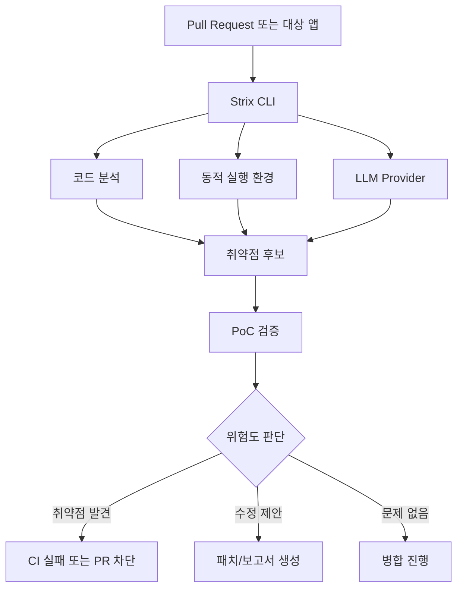

> 한 줄 요약: AI 펜테스팅 도구 Strix가 GitHub Trending 1위에 올랐다. 보안 자동화가 이겼다는 이야기라기보다, 취약점 탐색과 익스플로잇 검증을 CI 안으로 넣으려는 시도가 눈에 띄게 커졌다는 쪽에 가깝다. 봐야 할 지점은 기대보다 권한, 범위, 책임이다.

## 무슨 일이 있었나

GitHub Trending에서 `usestrix/strix`가 1위에 올랐다. 제공된 데이터 기준으로 별은 34,538개, 하루 증가분은 2,804개다. 저장소 설명은 “Open-source AI penetration testing tool to find and fix your app’s vulnerabilities”다.

Strix가 내세우는 범위는 단순 정적 분석이 아니다. README 기준으로 Strix는 자율 AI 펜테스팅 에이전트가 실제 해커처럼 코드를 동적으로 실행하고, 취약점을 찾고, 실제 개념증명(PoC)으로 검증한다고 설명한다.

확인된 기능 범위는 꽤 넓다.

- 로컬 코드베이스, GitHub 저장소, 웹 애플리케이션 대상 스캔
- 정적 분석(SAST)과 동적 분석(DAST)
- XSS, CSRF, SSRF, RCE, IDOR, 인증 우회, 비즈니스 로직 결함 등 점검
- GitHub Actions 기반 PR 스캔
- 취약점 발견 시 비정상 종료 코드로 CI 차단
- 자동 수정 PR, 보고서 생성, 플랫폼형 서비스 제공
- OpenAI, Anthropic, Google 등 여러 LLM API 키 사용

예시 사용법도 꽤 직접적이다.

```bash
strix --target ./app-directory
strix --target https://github.com/org/repo
strix --target https://your-app.com
strix -n --target ./ --scan-mode quick --scope-mode diff
```

여기까지는 저장소에서 확인할 수 있는 설명이다. 다만 실제 탐지 정확도, 오탐률, 놓치는 취약점 유형, 자동 수정의 안전성, 대규모 조직에서의 권한 격리 방식은 README만으로 판단하기 어렵다. GitHub Trending 숫자는 관심을 보여주지만, 운영 품질을 증명하지는 않는다.

## 왜 사람들이 반응했나

Strix 같은 AI 펜테스팅 도구가 반응을 얻는 이유는 단순히 AI가 붙었기 때문이 아니다. 개발자와 보안팀이 이미 피로를 느끼는 지점을 건드린다.

기존 보안 도구의 오탐 피로가 크다. 정적 분석기는 빠르지만 컨텍스트를 잘못 읽으면 쓸 수 없는 경고를 많이 낸다. 동적 분석은 더 현실적이지만 환경 구성과 인증 흐름 세팅이 번거롭다. Strix는 “실제 PoC로 검증한다”는 문장으로 이 불만을 겨냥한다.

펜테스트 병목도 있다. 수동 펜테스트는 비용과 시간이 든다. 릴리스는 매일 나가는데 외부 점검은 분기나 반기 단위로 돌아가는 경우가 많다. 그래서 “PR마다 자동으로 취약점을 찾아 차단한다”는 제안은 매력적으로 보인다.

동시에 불편한 지점도 분명하다. 이 도구는 코드를 읽고, 앱을 실행하고, HTTP 요청을 조작하고, 브라우저를 자동화하고, 셸 실행까지 한다고 설명한다. 보안 도구라서 허용해야 하는 권한이 공격 도구의 권한과 닮아 있다.

커뮤니티가 이런 저장소에 빠르게 반응하는 배경에는 기대와 불신이 같이 있다.

| 반응 지점 | 기대 | 불편함 |
|---|---|---|
| PoC 검증 | 오탐을 줄일 수 있음 | 실제 공격 행위와 경계가 흐려짐 |
| CI 통합 | 취약 코드 병합 차단 | 빌드 권한과 시크릿 노출 위험 |
| 자동 수정 | 보안 패치 속도 증가 | 맥락 없는 수정으로 회귀 가능 |
| 멀티 에이전트 | 탐색 범위 확대 | 비용, 재현성, 감사 가능성 악화 |
| LLM API 사용 | 모델 성능 활용 | 코드와 취약 정보가 외부로 나갈 수 있음 |

논쟁의 핵심은 AI가 보안을 잘할 수 있느냐에만 있지 않다. 더 실무적인 질문은 “취약점을 찾기 위해 어디까지 권한을 줘도 되는가”다.

## 내가 보는 핵심

Strix의 인기는 AI 보안 자동화가 개발 워크플로 안으로 들어오는 방향을 보여준다. 다만 이 움직임을 무조건 반길 일로만 보면 위험하다. 보안 도구가 강해질수록 그 도구 자체도 새로운 공격면이 된다.

Strix가 제안하는 모델은 수동 점검을 보조하는 수준을 넘어선다. README에는 reconnaissance, exploitation, validation, post-exploitation 같은 공격 단계가 언급된다. 보안팀 입장에서는 실전성 있는 검증이지만, 운영팀 입장에서는 통제해야 할 자동 행위다.

현업에서 비슷한 도구를 검토할 때 가장 먼저 부딪히는 문제는 정확도보다 범위다. 테스트 대상이 내부 개발 서버인지, 운영 도메인인지, 외부 협력사 API인지에 따라 법적·운영적 의미가 달라진다. “내가 소유하거나 허가받은 앱만 테스트하라”는 경고 문구가 README에 들어간 이유도 여기에 있다.

구조로 보면 대략 이렇게 된다.



이 다이어그램에서 봐야 할 곳은 Strix CLI 하나가 아니다. LLM Provider, 동적 실행 환경, CI 권한, 저장되는 결과물까지 모두 보안 경계 안으로 들어온다.

예를 들어 GitHub Actions에서 실행한다면 다음 질문이 바로 따라온다.

- 액션이 접근할 수 있는 저장소 시크릿은 무엇인가
- 스캔 대상이 PR 변경분인지 전체 코드인지
- 외부 기여자의 PR에서도 실행되는지
- LLM API로 어떤 코드 조각과 로그가 전달되는지
- PoC 검증 과정에서 실제 외부 시스템을 호출하는지
- 결과 보고서에 토큰, 개인정보, 내부 URL이 남는지
- 자동 수정 PR이 보안 리뷰 없이 병합될 수 있는지

AI 펜테스팅 도구를 SAST 대체재처럼 생각하면 판단이 흐려진다. Strix가 주장하는 가치는 소형 레드팀 자동화에 더 가깝다. 그렇다면 도입 기준도 달라져야 한다. 린터처럼 켜는 도구가 아니라, 권한을 가진 테스트 행위자로 다뤄야 한다.

## 왜 Strix GitHub Trending이 보안팀만의 뉴스가 아닌가

이 이슈는 보안팀 전용 뉴스로 보기 어렵다. CI에서 차단이 걸리고, 자동 수정 PR이 올라오고, 개발자가 재현 절차를 따라야 한다면 곧바로 개발 생산성 문제가 된다.

개발자 입장에서는 좋은 취약점 리포트와 나쁜 취약점 리포트의 차이가 크다. 좋은 리포트는 재현 가능하고, 영향 범위가 분명하며, 수정 방향이 코드 맥락에 맞다. 나쁜 리포트는 경고만 많고, 재현은 안 되며, 릴리스 흐름을 막는다.

Strix는 “working proof-of-concept exploit and reproduction steps”를 내세운다. 이 약속이 지켜지면 보안 리뷰에서 오가는 대화의 질이 올라갈 수 있다. 반대로 PoC가 불안정하거나 테스트 환경에 지나치게 의존하면, AI가 만든 공격 로그를 사람이 다시 디버깅해야 한다.

자동 수정도 마찬가지다. 취약점을 없애는 패치가 항상 제품 요구사항을 만족하지는 않는다. 인증 우회 의심 지점을 막는 과정에서 정상 사용자 플로우를 깨뜨릴 수 있다. 레이트 리밋을 추가하다가 내부 배치 작업을 실패시킬 수도 있다. 보안 패치는 코드만 바꾸는 일이 아니라 동작 계약을 바꾸는 일이다.

그래서 이 도구를 두고 나오는 반응은 자연스럽다. 사람들은 더 빠른 보안 점검을 원하지만, 통제되지 않는 자동 공격과 자동 패치는 원하지 않는다. 그 경계가 아직 익숙하지 않다.

## 앞으로 볼 기준

다음에 AI 펜테스팅 도구가 또 화제가 되면 별 수나 데모 영상보다 먼저 볼 기준이 있다.

첫째, 실행 범위가 명시되는가. 로컬 코드만 보는지, 컨테이너 안에서 앱을 띄우는지, 실제 네트워크로 공격 요청을 보내는지 구분해야 한다. 운영 도메인 대상 테스트를 지원한다면 속도 제한, 허가 범위, 금지 엔드포인트 설정이 필요하다.

둘째, 데이터 경로가 설명되는가. LLM API를 쓴다면 코드, 로그, 요청·응답, 취약점 보고서가 어디로 전달되는지 확인해야 한다. BYOK, 로컬 모델, VPC/self-hosted 같은 선택지가 있어도 기본값이 무엇인지가 더 중요하다.

셋째, 재현성과 감사 로그가 있는가. AI 에이전트가 어떤 판단으로 어떤 페이로드를 보냈는지 남아야 한다. 보안 도구가 발견한 취약점은 나중에 감사, 사고 조사, 규제 대응 문서가 될 수 있다.

넷째, CI 실패 정책이 세밀한가. 모든 finding에서 빌드를 깨는 방식은 오래 버티기 어렵다. 위험도, 신뢰도, 변경 범위, 예외 승인 흐름을 나눠야 개발팀과 보안팀이 같은 시스템 안에서 움직일 수 있다.

다섯째, 자동 수정은 병합이 아니라 제안으로 남는가. AI가 만든 패치는 테스트와 리뷰를 거쳐야 한다. 특히 인증, 권한, 결제, 개인정보 흐름을 건드리는 수정은 보안 관점과 제품 관점을 함께 봐야 한다.

Strix가 GitHub Trending에서 크게 반응을 얻은 건 자동 보안 점검에 대한 수요가 크다는 뜻이다. 다만 실제로 오래 쓰일 도구는 가장 공격적인 AI 해커를 흉내 내는 쪽이 아니라, 공격 능력을 격리하고 설명하고 멈출 수 있게 만든 쪽에 가까울 것이다.

질문은 “AI가 취약점을 찾을 수 있나”에서 “AI에게 어떤 권한을 주고, 어떤 증거를 남기며, 어디서 멈추게 할 것인가”로 옮겨가고 있다.

## 참고 자료

- [선정 글감] [#1 usestrix/strix](https://github.com/usestrix/strix) — GitHub Trending