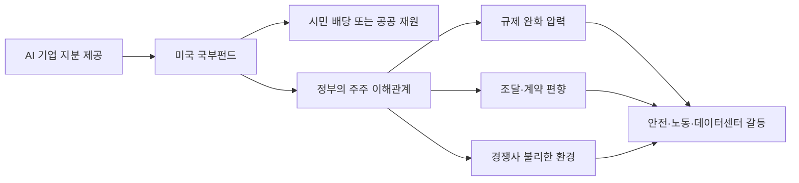

OpenAI 지분 5%를 미국 국부펀드에 넘기자는 제안은 기부보다 승인 구조에 가깝다. AI 회사가 규제 대상이면서 정부의 투자 자산이 되는 순간, 안전 심사와 산업정책, 선거용 배당의 경계가 한 줄로 붙는다.

이 논쟁은 OpenAI의 선의에서 나온 이야기가 아니다. 미국 정부가 AI 붐의 수익을 국민에게 나눠야 한다는 주장, AI 기업이 정치적 반발을 낮추고 싶어 하는 계산, 개발자 커뮤니티가 느끼는 플랫폼 권력 불신이 같은 테이블에 올라온 사건이다.

## OpenAI 5% 지분 제안은 배당보다 관계 설정의 문제다

2026년 7월 2일 TechCrunch는 Financial Times 보도를 인용해 Sam Altman이 OpenAI 지분 5%를 미국 국부펀드에 제공하는 방안을 제안했다고 전했다. FT는 이 사안을 아는 두 명을 근거로 들었다. TechCrunch 보도에 따르면 다른 AI 기업도 비슷한 지분을 기부하는 구조가 함께 논의됐다.

확인된 범위는 여기까지다. 아직 법안이 통과된 것도 아니고, OpenAI가 공식 조건표를 낸 것도 아니다. 보도 기준으로 논의는 예비 단계이며, 정식 조치에는 의회 승인이 필요할 가능성이 크다.

숫자는 이미 정치적이다. 5%는 경영권을 바로 넘기는 수치가 아니다. 하지만 정부가 주주가 되기에는 충분하다. 정부는 감시자에서 이해관계자로 바뀐다. 기업은 피감독자에서 공공 수익의 공급자로 바뀐다.

TechCrunch가 전한 FT의 맥락도 직접적이다. 이 지분 제공은 행정부와 좋은 관계를 확보하고 정치적 역풍을 줄이기 위한 목적과 연결돼 있다. 이 문장이 이 이슈의 중심이다. 공익 배당이라는 말보다 먼저 봐야 할 것은 누가 누구에게 무엇을 사는가다.

| 구분 | 확인된 사실 | 아직 해석에 가까운 지점 |
| --- | --- | --- |
| 시점 | 2026년 7월 2일 보도 | 실제 제안 시점과 협상 문안 |
| 당사자 | OpenAI, 미국 행정부, 의회 가능성 | Google, Anthropic, Meta 등 다른 AI 기업 참여 여부 |
| 범위 | OpenAI 5% 지분 제공 제안 | 국부펀드의 의결권, 매각 제한, 배당 방식 |
| 정책 연결 | OpenAI의 공공 부 펀드 구상, Sanders의 50% 주식세 법안 | 자발적 기부인지 사실상 규제 비용인지 |

이 사건은 돈을 나누자는 논쟁이면서 허가를 받는 방식에 관한 논쟁이다.

## AI 국부펀드가 불편한 이유는 국민 배당이 아니라 의결권이다

공공 부 펀드 자체가 틀린 아이디어는 아니다. AI가 노동소득보다 자본소득을 더 키운다면, 시민이 자본 수익의 일부를 갖는 방식은 재분배 논의에서 설득력이 있다. The Atlantic은 이 흐름을 보편기본자본(Universal Basic Capital)이라는 이름으로 설명하며, 미국 상위 10%가 주식의 약 90%를 보유하고 하위 절반은 1% 미만을 보유한다는 분포를 짚었다.

문제는 펀드가 무엇을 갖느냐다. 배당권만 갖는 비의결권 지분과 회사 의사결정에 영향을 주는 의결권 지분은 완전히 다르다. 전자는 AI 성장의 수익을 나누는 장치다. 후자는 AI 모델 배포, 군사 계약, 데이터센터 입지, 안전 정책에 정부가 주주로 들어오는 장치다.

Bernie Sanders가 2026년 6월 제안한 American AI Sovereign Wealth Fund Act는 더 강한 버전이다. TechCrunch 보도에 따르면 이 법안은 체계적으로 중요한 AI 기업에 일회성 50% 주식세를 부과해 공공 펀드에 넣는 구상이다. 적용 범위도 모델 회사에만 닫히지 않는다. 데이터센터, 인프라, 로보틱스까지 포함될 수 있다. AI가 사업 일부인 Google이나 SpaceX 같은 회사는 비AI 부문을 분리할 여지를 둔 것으로 설명됐다.

OpenAI의 5% 제안은 Sanders식 50%보다 온건해 보인다. 그래서 더 까다롭다. 극단적 법안은 반대하기 쉽다. 낮은 지분과 좋은 명분을 붙인 자발적 제안은 규제 포획(regulatory capture)의 형태를 더 흐릿하게 만든다.

Vox가 지적한 쟁점도 이 지점이다. 좁은 범위의 정부-기업 파트너십은 AI 불평등을 줄이기보다 특정 기업을 정치적으로 보호하는 구조가 될 수 있다. 정부가 OpenAI의 주주가 되면 OpenAI의 수익성은 정부의 수익성이 된다. 강한 안전 규제, 반독점 제재, 데이터센터 제한은 공공 배당을 줄이는 정책으로 보일 수 있다.

감시자가 수익을 나눠 갖기 시작하면 감시는 느려진다.

## 커뮤니티 반응이 갈린 지점은 공유냐 약탈이냐가 아니다

개발자와 AI 관찰자들이 이 이슈에 반응한 이유는 단순히 정부가 기업 지분을 가져간다는 표현 때문만은 아니다. AI Explained의 같은 주간 영상은 Fable 5와 GPT 5.6 Sol 비교, 모델 안전성, 중국 모델 흐름과 함께 5% 지분 이슈를 별도 챕터로 다뤘다. 모델 성능 경쟁과 정책 권력이 한 뉴스 주기에 묶였다는 뜻이다.

기대하는 쪽의 논리는 선명하다. AI 모델은 공공 연구, 인터넷 텍스트, 이용자 데이터, 전력망, 반도체 공급망, 대학 연구자 생태계 위에서 만들어졌다. 일부 기업만 수익을 가져가면 사회적 반발은 커진다. 시민이 지분 수익을 받는 구조는 AI로 인한 부의 집중을 완화할 수 있다.

불편해하는 쪽의 논리도 분명하다. 정부가 지분을 갖는 순간 시민은 간접 주주가 되지만 실제 의사결정은 시민이 하지 않는다. 펀드를 운용하는 관료, 행정부, 위원회가 한다. 시민에게 돌아오는 배당은 작을 수 있고, 기업과 정부의 협상력은 커질 수 있다.

그래서 이 논쟁은 공유냐 약탈이냐로 나누면 틀린다. 더 정확한 질문은 이것이다. 공공이 AI 수익을 나눠 갖기 위해 정부가 특정 AI 기업의 성공에 베팅해도 되는가?

나는 이 질문에 조심스러운 반대 쪽에 선다. AI 수익 공유는 필요하다. 하지만 특정 모델 기업의 지분을 정부가 받는 방식은 감시 기능을 훼손한다. OpenAI처럼 소비자 제품, API 플랫폼, 엔터프라이즈 계약, 모델 안전 논쟁이 한 몸에 묶인 회사에서는 더 그렇다.

공공 배당은 넓고 둔한 구조가 낫다. 특정 기업과 행정부의 밀실 협상보다 법으로 정한 비의결권 지분, 넓게 분산된 포트폴리오, 독립 운용 규칙, 이해상충 공개가 먼저다. 그런 장치 없이 5%라는 숫자만 낮춘 제안은 온건한 개혁이 아니라 낮은 문턱의 결합이다.

## 실무자는 API보다 소유 구조 변화를 먼저 봐야 한다

이 이슈는 정책 뉴스로 끝나지 않는다. OpenAI, Anthropic, Google, xAI 같은 모델 공급자를 쓰는 팀에는 운영 리스크다. 모델 품질과 가격만 비교하는 벤더 평가표로는 부족하다. 공급자의 정치적 이해관계가 제품 로드맵과 API 안정성에 영향을 줄 수 있기 때문이다.

먼저 조달 리스크를 봐야 한다. 정부가 특정 AI 기업의 지분을 갖거나 국부펀드가 주요 주주가 되면 공공 계약과 민간 가격 정책이 분리되지 않을 수 있다. 한쪽에서는 보조와 계약이 붙고, 다른 쪽에서는 경쟁사가 불리해질 수 있다. 이때 API 가격 인하는 시장 효율이 아니라 정책 보조의 결과일 수 있다.

데이터 리스크도 분리해서 봐야 한다. 정부가 주주가 된다고 해서 곧바로 고객 데이터 접근권이 생기는 것은 아니다. 이 둘을 섞어 공포를 키우면 논점이 흐려진다. 다만 정부 조달, 보안 인증, 모델 감사, 수사기관 요청, 수출통제 같은 경로가 지분 이해관계와 결합하면 압력은 달라진다. 계약서에는 데이터 사용, 로그 보관, 정부 요청 통지, 모델 학습 제외, 리전 제한 조항이 더 구체적으로 들어가야 한다.

아키텍처에서는 탈출 경로가 핵심이다. 단일 모델 API에 프롬프트, 평가셋, 툴 호출 스키마, 로그 파이프라인을 모두 맞춰두면 정책 리스크가 곧 전환 비용이 된다. 최소한 다음 항목은 별도 문서로 관리해야 한다.

- 모델 공급자별 기능 의존성: 함수 호출, 긴 컨텍스트, 파일 처리, 멀티모달 입력
- 전환 가능한 대체 모델: 성능이 아니라 허용 가능한 실패율 기준
- 데이터 경계: 어떤 요청이 외부 모델로 나가고 어떤 요청은 내부 추론으로 닫히는지
- 계약 경계: SLA, 가격 변경 통지, 모델 폐기 통지, 정부 요청 통지
- 평가 경계: 정책 변화 이후에도 동일하게 돌릴 수 있는 회귀 테스트 세트

이 목록은 과한 거버넌스가 아니다. AI 플랫폼이 정치적 인프라가 될 때 필요한 최소 장부다. 클라우드 리전, 결제망, 앱스토어 정책을 보듯이 모델 공급자의 소유 구조도 봐야 한다.

## 5%라는 낮은 숫자가 오히려 판단을 어렵게 만든다

OpenAI의 5% 제안은 Sanders의 50% 법안처럼 노골적이지 않다. 그래서 업계가 더 쉽게 받아들일 수 있다. 시민 배당이라는 언어도 거부하기 어렵다. AI가 만든 부가 소수 주주에게만 쌓이는 구조는 이미 신뢰를 잃고 있다.

하지만 낮은 숫자가 안전을 보장하지 않는다. 지분율보다 더 중요한 것은 권리의 종류와 협상의 방식이다. 비의결권인지, 의결권인지. 법률에 근거한 펀드인지, 행정부와 기업 사이의 자발적 거래인지. 모든 기업에 같은 규칙이 적용되는지, 먼저 손을 내민 기업이 더 좋은 대우를 받는지.

도입부의 질문으로 돌아가면 답은 분명하다. AI 수익을 사회가 나눠 갖는 장치는 필요하다. 그러나 그 장치가 정부와 특정 AI 기업을 한 배에 태우는 방식이면, 시민은 배당을 받는 대신 감시자를 잃는다.

OpenAI 5% 지분 논쟁의 본질은 공공의 몫을 인정할 것인가가 아니다. 공공의 이름으로 누가 권한을 갖게 되는가다. 그 질문에 답하지 않은 국부펀드는 개혁이 아니라 새로운 플랫폼 의존성이다.

## 참고 자료

- [선정 글감] [OpenAI proposed donating 5% of its equity to a US sovereign wealth fund](https://techcrunch.com/2026/07/02/openai-proposed-donating-5-of-its-equity-to-a-us-sovereign-wealth-fund/) - TechCrunch
- [관련] [Why Everyone Is Suddenly Talking About Universal Basic Capital](https://www.theatlantic.com/economy/2026/07/universal-basic-capital-ai/687759/) - The Atlantic
- [관련] [Trump floats government ownership of OpenAI and Anthropic](https://www.vox.com/politics/491608/trump-openai-sam-altman-wealth-fund) - Vox
- [관련] [Fable 5 vs GPT 5.6 Sol: The Early Results](https://www.youtube.com/watch?v=y24lF1q4SFY) - YouTube AI Explained