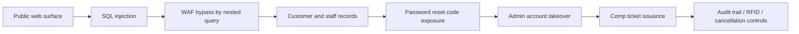

Claude가 Front Gate Tickets의 SQL injection 우회에 쓰였다는 사실보다 더 큰 문제는 중앙화된 티켓 발권 권한이다. 2026년 4월 보안 연구자 Ian Carroll은 모델의 도움을 받아 음악 페스티벌 티켓 플랫폼의 내부 API와 관리자 권한에 접근할 수 있는 경로를 찾았다. 이 사건은 도구 악용 논쟁이기도 하지만, 더 직접적으로는 권한 설계와 운영 검증이 실패한 사례다.

공격자가 초능력을 얻은 게 아니다.

이미 약한 시스템에 더 빠른 조수가 붙었다.

## Claude가 찾은 것은 취약점 하나가 아니라 권한의 지름길이었다

확인된 사실부터 보자. WIRED 보도에 따르면 Carroll은 2026년 4월 Front Gate Tickets 웹 도메인을 살펴보다 SQL injection으로 보이는 취약점을 발견했다. Front Gate Tickets는 Live Nation Entertainment 계열사이며, Lollapalooza, Bonnaroo, South by Southwest, Austin City Limits 같은 대형 미국 음악 페스티벌의 티켓팅을 처리하는 플랫폼으로 설명됐다.

처음에는 웹 애플리케이션 방화벽(Web Application Firewall)이 공격을 막는 것처럼 보였다. Carroll은 Claude Opus 4.7에 우회 방법을 요청했고, Claude는 중첩 SQL 쿼리(nested SQL query)를 이용한 우회 코드를 만들어냈다. Carroll은 그 코드를 읽고 나서야 우회 방식을 이해했다고 말했다.

다음 단계가 더 위험했다. 취약점은 고객 정보 표본이 담긴 데이터베이스 접근으로 이어졌고, Carroll은 직원 데이터도 볼 수 있었다고 주장했다. 그는 관리자 계정의 비밀번호 재설정 코드를 백엔드에서 찾아 계정을 장악했고, Bonnaroo의 고가 티켓을 complimentary ticket 형태로 장바구니에 담을 수 있었다. 실제 발권 완료는 하지 않았다고 밝혔다.

Front Gate 측 설명도 함께 봐야 한다. 회사는 문제가 24시간 안에 해결됐고, 악용 증거, 티켓 영향, 고객 정보 침해 증거는 없다고 밝혔다. 접근 대상은 소비자 로그인 포털이 아니라 행사장 입장 스캐너가 쓰는 내부 API였다고 설명했다. 직원 계정 변경은 알림을 발생시키고, 부정 발권은 감사 추적(audit trail)에 남으며, 사용 전에 식별하고 취소할 수 있었다고도 말했다. 이후에는 많은 고가 VIP 티켓이 RFID 손목밴드를 요구하기 때문에 온라인 시스템만으로 발급될 수 없다는 설명도 추가했다.

여기까지가 확인된 범위다.

추정은 따로 둬야 한다. Carroll은 Claude가 거의 끝까지 스스로 exploit을 찾을 수 있었을 가능성이 높다고 봤다. 이 말은 연구자의 평가이지, 공개 검증된 자동 해킹 능력 측정 결과는 아니다. Front Gate도 과거 악용이 없었다고 입증한 것이 아니라, 증거가 없다고 말한 것이다. 보안 사고에서 이 차이는 작지 않다.

## 개발자들이 불편해한 지점은 AI보다 낡은 인증 구조다

이 사건은 AI가 해커를 만들었다는 단순한 이야기로 소비되기 쉽다. 하지만 실무자가 봐야 할 지점은 Claude의 존재보다 권한 흐름이다.

Carroll의 설명이 맞다면, 한 취약점은 데이터 조회로 끝나지 않았다. 데이터 조회는 직원 계정 탈취로 이어졌고, 계정 탈취는 관리자 권한으로 이어졌고, 관리자 권한은 고가 티켓 발권 권한으로 이어졌다. 방어선이 여러 겹처럼 보였지만 실제로는 같은 백엔드 안에서 줄줄이 연결돼 있었다.

이 흐름에서 마지막 방어선은 감사 로그, 티켓 취소, RFID 확인이다. 모두 사후 통제에 가깝다. 사후 통제가 불필요하다는 뜻은 아니다. 대형 이벤트 운영에서는 현장 확인과 취소 체계가 필요하다. 다만 사후 통제가 있다는 이유로 관리자 계정 탈취의 심각성이 줄어들지는 않는다.

커뮤니티가 이런 사건에 예민하게 반응하는 이유는 명확하다. 티켓은 돈이고, 신원이며, 현장 접근권이다. VIP와 백스테이지 권한이 붙는 순간 단순한 온라인 쿠폰이 아니라 물리 공간의 출입 권한이 된다. 중앙 플랫폼이 여러 행사의 발권을 맡으면 편의는 커지지만, 한 번의 관리자 권한 탈취가 건드리는 면적도 커진다.

AI 논쟁도 이 지점에서 갈린다. 한쪽은 Claude 같은 도구가 승인된 연구자의 취약점 발견을 빠르게 만들었다고 본다. Anthropic은 Cyber Verification Program을 통해 방어자가 이런 연구를 수행할 수 있게 한다고 설명했고, 승인 대상이 아니었다면 해당 사용이 감지되고 차단됐을 것이라고 밝혔다. 반대로 같은 능력이 충분히 통제되지 않으면 공격자의 반복 비용을 낮춘다는 우려도 있다.

두 입장은 같은 현실의 다른 면을 본다. AI는 취약점의 존재를 만들지 않는다. 취약점을 찾고 조합하는 시간을 줄인다.

그 차이가 운영팀에는 치명적이다.

## Dialog와 여권 유출이 보여준 같은 패턴: 공격보다 노출이 먼저였다

Front Gate 사건을 하나의 회사 사고로만 보면 논점이 좁아진다. 같은 주간 보안 이슈들에서도 반복되는 구조가 보인다. 고난도 침입보다 공개 노출, 잘못된 권한, 과도한 데이터 보관이 먼저 나온다.

WIRED의 Dialog 보도는 이 점을 잘 보여준다. Peter Thiel이 공동 창립한 비공개 이벤트 그룹 Dialog는 구성원 개인정보가 범죄자 해킹으로 침해됐다고 통지했다. 하지만 WIRED 분석은 앱 랜딩 페이지에 접근한 사람이 파일을 읽을 수 있었던 웹사이트 설정 오류(misconfiguration)에 가깝다고 봤다. 보도에 따르면 노출된 자료에는 과거 참가자 113명의 이름이 포함됐고, 현직 NATO 지휘관, 미국 상원의원 2명, 미국 재무장관도 명단에 있었다.

핵심은 고급 조직도 평범한 설정 오류로 무너질 수 있다는 점이다. 침입이라는 단어는 공격자를 앞세우지만, 설정 오류라는 단어는 운영 책임을 앞세운다. 사용자는 둘의 차이를 알아야 한다. 규제기관과 고객도 둘을 다르게 본다.

Schneier on Security가 다룬 여권 데이터 유출도 같은 원칙을 더 노골적으로 드러낸다. 거의 백만 건의 여권 데이터가 온라인에 유출됐고, Schneier는 고가치 신분증명인 여권이 대마 판매점 신원 확인 같은 상대적으로 낮은 가치의 인증 시스템에 쓰인 뒤, 그 낮은 가치 시스템이 뚫리면서 고가치 자격증명이 위험해졌다고 지적했다.

이것은 데이터 최소화의 실패다. 시스템이 여권 이미지를 가져야 했는지, 가져야 했다면 얼마나 오래 보관해야 했는지, 저장소가 인증과 암호화 없이 열릴 수 있었는지부터 따져야 한다. 티켓 플랫폼도 같은 질문을 피할 수 없다. 고객 이름, 이메일, 주소, 직원 계정, 비밀번호 재설정 코드, 발권 권한이 한 취약점의 이동 경로 안에 놓였는지가 핵심이다.

World Cup 사기 보도는 사용자 측 위험을 더한다. 2026 FIFA World Cup은 미국, 캐나다, 멕시코 16개 도시에서 104경기를 치르는 대형 이벤트이고, FIFA는 경기장 관람객이 600만 명을 넘을 것으로 추산했다. 판매 초기 15일 안에 1억 5천만 건 이상의 티켓 요청이 몰렸다는 숫자도 제시됐다. 2026년 1월부터 5월까지 FIFA 관련 도메인은 1만 3천 개 이상 등록됐고, 5월 초 기준 약 41개 중 1개가 의심 또는 악성으로 식별됐다고 TrendAI 관계자가 설명했다.

공식 발권 시스템이 흔들리면 사기 생태계는 더 쉽게 자란다. 사용자는 진짜 티켓과 가짜 티켓을 구분해야 하고, 플랫폼은 내부 권한과 외부 사칭을 동시에 막아야 한다. AI가 피싱 사이트, 가짜 영상, 설득력 있는 이메일을 만드는 비용까지 낮추면, 발권 플랫폼의 신뢰는 백엔드 보안만의 문제가 아니게 된다.

## AI 보안 도구를 쓰려면 먼저 권한 지도를 그려야 한다

OpenAI의 Daybreak 발표는 반대편 가능성을 보여준다. OpenAI는 Codex Security, GPT-5.5-Cyber, Daybreak Cyber Partner Program, Patch the Planet 같은 도구와 프로그램을 통해 취약점 발견에서 패치 자동화까지 속도를 높이겠다고 밝혔다. GPT-5.5-Cyber는 CyberGym에서 85.6% 성능을 기록했다고 공개됐고, Patch the Planet에는 cURL, Go, Python, Sigstore, pyca/cryptography 같은 오픈소스 프로젝트가 초기 참여자로 언급됐다.

이 방향은 현실적이다. AI를 막는다고 취약점이 사라지지 않는다. 방어자는 공격자보다 더 많은 코드, 더 많은 설정, 더 많은 계정을 봐야 한다. AI 없이 수동 점검만 고집하는 팀은 속도에서 밀린다.

다만 AI 보안 도구 도입의 첫 작업은 모델 고르기가 아니다. 권한 지도 작성이다. 다음 질문에 답하지 못하면 Claude든 Codex Security든 큰 차이를 만들기 어렵다.

- SQL injection 하나가 어떤 데이터베이스와 테이블까지 닿는가
- 직원 정보와 고객 정보가 같은 조회 경로에서 보이는가
- 비밀번호 재설정 코드가 애플리케이션 백엔드에 평문 또는 재사용 가능한 형태로 남는가
- 관리자 계정에 다중 인증(Multi-Factor Authentication)이 강제되는가
- complimentary ticket 발권, 환불, 권한 상승 같은 고위험 동작에 별도 승인과 속도 제한이 있는가
- 감사 로그가 탐지와 차단으로 연결되는가, 사고 뒤 설명용 기록에 머무는가
- 현장 RFID, QR 코드, 입장 스캐너 같은 물리 검증 장치가 온라인 발권 권한과 어떻게 분리돼 있는가

Front Gate 측은 접근을 감지했고, 감사 추적과 티켓 취소가 가능했으며, RFID 손목밴드가 일부 고가 티켓의 방어선이라고 설명했다. 그 설명은 운영 통제의 존재를 보여준다. 실무 기준에서는 그보다 앞단의 질문이 남는다. 왜 내부 API가 이런 방식으로 우회됐는가. 왜 관리자 재설정 코드가 계정 장악에 쓰일 수 있었는가. 왜 관리자 권한에 MFA가 결정적인 차단선으로 등장하지 않았는가.

방어 설계는 단일 취약점을 막는 일이 아니다. 취약점 하나가 다음 권한으로 번지지 못하게 끊는 일이다.

## 티켓 플랫폼의 신뢰는 매진보다 먼저 검증돼야 한다

이 사건의 출발점은 무료 VIP 티켓을 마음대로 만들 수 있었다는 자극적인 장면이다. 그러나 결론은 더 건조하다. 대형 이벤트 플랫폼은 결제 시스템이기 전에 권한 시스템이고, 권한 시스템이기 전에 신뢰 시스템이다.

공연 팬은 티켓이 진짜인지 믿어야 한다. 주최사는 발권 수량과 출입 권한이 통제된다고 믿어야 한다. 플랫폼은 내부 직원 계정 하나가 전체 축제 목록의 약한 고리가 되지 않는다고 증명해야 한다. 이 신뢰는 브랜드, 규모, 전문적인 웹사이트 디자인으로 생기지 않는다. 데이터 흐름, 권한 분리, 인증 강제, 감사 로그의 실시간 대응으로 생긴다.

AI가 바꾼 것은 공격의 본질이 아니라 검증의 시간표다. 예전에는 발견되지 않았을 취약점이 더 빨리 발견된다. 예전에는 일부 연구자만 조합하던 우회 기법이 더 넓은 집단의 손에 들어간다. 그래서 운영팀의 기준도 바뀐다. 정기 점검으로 충분하다는 말은 약하다. 고위험 권한 경로는 계속 테스트돼야 한다.

Front Gate 사건은 AI 해킹 공포담으로 끝나면 안 된다. 더 정확한 교훈은 이것이다. 중앙화된 플랫폼이 많은 돈과 많은 사람의 이동을 다룰수록, 관리자 권한은 제품 기능이 아니라 사고 반경이다. 그 반경을 줄이지 않은 채 AI만 탓하면 다음 사고에서도 같은 문장을 반복하게 된다.

## 참고 자료

- [선정 글감] [Claude Helped a Hacker Find a Way to Issue Tickets to Almost Every US Music Festival](https://www.wired.com/story/claude-helped-a-hacker-find-a-way-to-issue-tickets-to-almost-every-us-music-festival/) - WIRED Security
- [관련] [Dialog Claims It Was Hacked. A Misconfigured Website Left Its Members Exposed](https://www.wired.com/story/dialog-hack-website-misconfiguration/) - WIRED Security
- [관련] [World Cup Scams Are Getting Harder to Spot](https://www.wired.com/story/world-cup-scams-are-getting-harder-to-spot/) - WIRED Security
- [관련] [One Million Passports Leaked Online](https://www.schneier.com/blog/archives/2026/06/one-million-passports-leaked-online.html) - Schneier on Security
- [관련] [Daybreak: Tools for securing every organization in the world](https://openai.com/index/daybreak-securing-the-world) - OpenAI Blog