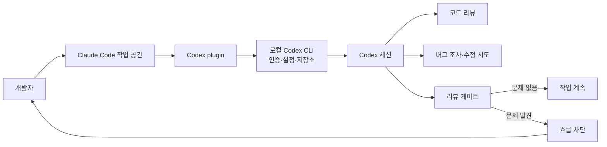

> 한 줄 요약: Claude Code 안에서 Codex를 부르는 플러그인은 편의 기능에 그치지 않는다. AI 코딩 도구 경쟁은 모델 성능만 보던 단계에서 벗어나, 작업 흐름의 권한과 리뷰 책임, 플랫폼 신뢰를 함께 따지는 쪽으로 옮겨가고 있다.

## 무슨 일이 있었나

2026년 7월 초 GitHub Trending에 `openai/codex-plugin-cc`가 올라왔다. 저장소 설명을 보면, 이 플러그인은 Claude Code 사용자가 기존 작업 흐름 안에서 Codex를 호출해 코드 리뷰를 받거나 작업을 맡길 수 있게 한다.

확인된 기능은 꽤 구체적이다.

- `/codex:review`: 현재 변경사항이나 특정 base 브랜치 기준 코드 리뷰
- `/codex:adversarial-review`: 구현 방향, 설계 선택, 숨은 가정, 장애 가능성을 공격적으로 점검하는 리뷰
- `/codex:rescue`: 버그 조사, 실패한 테스트 수정, 이전 Codex 작업 이어받기
- `/codex:transfer`: Claude Code 세션을 Codex의 지속 세션으로 넘기기
- `/codex:status`, `/codex:result`, `/codex:cancel`: 백그라운드 작업 상태 확인과 결과 조회, 취소
- `/codex:setup --enable-review-gate`: Claude 응답 뒤 Codex 리뷰를 붙이고, 문제가 있으면 흐름을 막는 게이트

요구 조건도 분명하다. Node.js 18.18 이상이 필요하고, 사용자는 ChatGPT 구독 또는 OpenAI API 키로 Codex 사용 권한을 갖고 있어야 한다. 플러그인은 별도 런타임을 두지 않는다. 로컬에 설치된 Codex CLI와 Codex app server, 로컬 인증 상태, 같은 저장소 체크아웃을 그대로 쓴다.

추정과 해석은 나눠 봐야 한다. 이 저장소가 GitHub Trending에서 2만 개가 넘는 별과 하루 수백 개의 별을 받았다는 사실은 관심이 컸다는 신호다. 다만 그것만으로 실제 프로덕션 도입률이나 기업 표준화 방향을 말할 수는 없다. 사람들이 반응한 지점은 스타 수보다 OpenAI의 Codex가 Anthropic의 Claude Code 안으로 들어가는 모양새에 있다.

같이 읽을 만한 자료들도 이 긴장을 더 선명하게 만든다. WIRED는 Cursor가 SpaceX에 인수된 뒤에도 OpenAI, Anthropic 같은 외부 모델을 계속 제공할 수 있을지 물었다. The Pragmatic Engineer는 OpenAI, Anthropic, Cursor 방문기에서 클라우드에서 돌아가는 에이전트와 코딩 하네스(Coding Harness)의 확산을 짚었다. OpenAI의 Codex long-running work 글은 단발 프롬프트보다 지속 작업, 컨텍스트 보존, 검증 가능한 단계 분해를 강조한다.

서로 다른 글처럼 보이지만 질문은 비슷하다. 앞으로 개발자는 어떤 모델을 쓰느냐 못지않게, 어떤 작업 공간이 모델과 에이전트를 들여보내는 문이 되는지를 따지게 된다.

## 왜 사람들이 반응했나

첫 반응은 의외성이다. Claude Code는 Anthropic 생태계의 대표적인 개발자 도구로 받아들여진다. 그런데 그 안에서 OpenAI Codex를 플러그인으로 호출한다. 경쟁사 도구와 모델이 한 작업 화면 안에서 섞이는 장면은 낯설다. 개발자 입장에서는 꽤 현실적인 요구이기도 하다.

현업에서는 도구 하나만 쓰는 경우가 오히려 드물다. 어떤 모델은 리팩터링 설명이 좋고, 어떤 모델은 테스트 실패 원인을 빨리 좁히며, 어떤 모델은 리뷰에서 더 까다롭다. 사용자는 브랜드 충성도보다 작업별 성공률, 지연 시간, 비용, 컨텍스트 손실 여부를 본다.

그래서 이 플러그인은 모델 경쟁의 승패 선언이라기보다, 실제 개발 워크플로가 이미 멀티 모델(Multi-model) 상태에 가깝다는 고백처럼 보인다.

반응이 갈리는 지점은 크게 네 가지다.

| 쟁점 | 기대 | 불편한 지점 |
| --- | --- | --- |
| 생산성 | Claude Code에서 나가지 않고 Codex 리뷰와 작업 위임 가능 | 한 도구 안에 두 에이전트가 들어오며 책임 경계가 흐려짐 |
| 신뢰 | 서로 다른 모델로 교차 검토 가능 | 리뷰 게이트가 자동 루프와 사용량 소모를 만들 수 있음 |
| 플랫폼 | 사용자가 기존 워크플로를 유지한 채 선택권 확보 | 결국 작업 공간을 장악한 쪽이 기본값을 정할 수 있음 |
| 보안/운영 | 로컬 Codex 설정과 인증을 그대로 재사용 | 저장소, 세션, 인증, 로그 흐름을 다시 점검해야 함 |

특히 `/codex:adversarial-review`가 눈에 띈다. 일반 리뷰가 버그와 누락을 찾는다면, 이 명령은 설계 방향 자체를 의심한다. 캐싱과 재시도 설계가 맞는지, 인증과 데이터 손실 위험은 없는지, 롤백과 레이스 컨디션을 제대로 봤는지 묻는다.

이 기능이 반응을 얻는 이유는 개발자가 이미 느끼는 불안을 건드리기 때문이다. AI가 코드를 더 빨리 만들수록 잘못된 방향으로 빨리 가는 비용도 커진다. 그래서 또 다른 AI에게 반대편 심사위원 역할을 맡기는 구도가 생긴다.

물론 낙관적으로만 볼 일은 아니다. AI가 만든 변경을 AI가 리뷰한다고 해서 책임이 사라지지는 않는다. 리뷰 게이트가 문제를 잡아낼 수는 있지만, 어떤 기준으로 막았는지, 사람이 어떻게 해제할지, 반복 루프가 비용을 얼마나 쓰는지까지 운영 규칙이 있어야 한다.

OpenAI 저장소 설명에도 review gate는 장기 루프를 만들고 사용량 제한을 빠르게 소모할 수 있다고 경고한다. 짧은 문장이지만 중요한 대목이다. 에이전트 자동화의 위험은 모델이 틀리는 데서만 오지 않는다. 맞을 때까지 계속 시도하는 구조가 예산, 시간, CI, 로컬 환경을 잠식할 수도 있다.

WIRED가 Cursor 사례에서 던진 질문도 여기와 맞닿아 있다. Cursor가 여러 외부 모델을 제공하는 열린 플랫폼으로 남을 수 있는지가 쟁점이라면, Claude Code 안의 Codex 플러그인은 반대 방향의 사례다. 하나의 도구 안에서 경쟁 모델과 에이전트를 부를 수 있게 되면 사용자는 편해진다. 대신 플랫폼 제공자와 모델 제공자 사이의 이해관계는 더 복잡해진다.

Cursor 같은 AI 코딩 도구는 특정 모델 하나의 성능만으로 설명하기 어렵다. 편집기 통합, 컨텍스트 관리, 파일 접근 권한, 리뷰 UX, 실행 환경, 가격 정책이 함께 묶인다. 모델을 바꿔 끼울 수 있어 보여도 실제 잠금 효과는 작업 이력, 세션, 자동화 규칙, 팀의 습관에서 생긴다.

The Pragmatic Engineer의 관찰처럼 클라우드 에이전트와 코딩 하네스가 확산된다면 이 문제는 더 커진다. 에이전트가 백그라운드에서 오래 실행되고, 여러 작업을 나눠 맡고, 사람은 중간중간 검토자로 들어간다. 이때 중요한 인프라는 모델 API만이 아니다. 작업을 보관하고, 재개하고, 취소하고, 감사할 수 있는 실행 제어면(Control Plane)이 필요해진다.

## 내가 보는 핵심

이번 이슈를 OpenAI가 Claude Code에 들어온 사건으로만 보면 반쪽만 본다. 더 중요한 질문은 따로 있다.

AI 코딩 도구의 경쟁력은 이제 답변 품질뿐 아니라, 에이전트 사이의 권한과 책임을 어떻게 배치하느냐에 달려 있다.

아래처럼 보면 구조가 보인다.

겉으로는 Claude Code에서 `/codex:review`를 치는 간단한 흐름이다. 실제로는 작업 공간, 플러그인, 로컬 CLI, 인증 상태, 저장소 접근, 백그라운드 작업, 결과 저장소가 줄줄이 연결된다.

여기서 봐야 할 지점은 몇 가지다.

교차 검토는 좋은 기본값이 될 수 있지만 만능은 아니다. 서로 다른 모델을 붙이면 같은 오류를 반복할 가능성은 줄어들 수 있다. 설계 판단, 권한 체크, 롤백 전략처럼 정답이 코드 한 줄에 있지 않은 영역에서는 adversarial review가 특히 도움이 된다.

하지만 두 모델이 같은 잘못된 전제에서 출발하면 그럴듯한 합의가 만들어질 수 있다. 테스트가 부족한 상태에서 한 에이전트가 구현하고 다른 에이전트가 문맥만 보고 승인하면, 코드 품질의 착시가 생긴다. AI 리뷰는 사람이 볼 시간을 없애는 장치가 아니다. 사람이 더 좋은 질문을 던질 위치를 만들어주는 장치에 가깝다.

장기 실행 에이전트는 제품 기능이면서 동시에 운영 대상이다. OpenAI의 Codex long-running work 글이 말하는 지속 작업, 컨텍스트 유지, 검증 가능한 단계는 매력적이다. 단발 프롬프트보다 실제 업무에 더 가깝기 때문이다.

문제는 장기 실행이 되는 순간 작업이 상태를 갖는다는 점이다. 누가 시작했는지, 어떤 권한으로 실행됐는지, 어떤 파일을 읽고 썼는지, 어디까지 성공했는지, 취소 후 남은 변경은 무엇인지가 남는다. `/codex:status`, `/codex:result`, `/codex:cancel`, `codex resume` 같은 명령이 중요한 이유가 여기에 있다. 이 명령들은 편의 기능이라기보다 에이전트 운영에 필요한 최소 계기판이다.

열린 플랫폼처럼 보이는 구조에도 잠금 효과는 남는다. WIRED의 Cursor 기사에서 핵심은 특정 인수 건 하나가 아니라, AI 코딩 도구가 외부 모델을 계속 품을 수 있느냐는 질문이다. `codex-plugin-cc`는 반대로 Claude Code라는 작업 공간이 Codex를 품는 장면이다.

둘 다 사용자의 선택권을 넓히는 것처럼 보인다. 하지만 선택권이 유지되려면 설정, 세션, 비용, 결과물, 감사 로그가 이동 가능해야 한다. 모델만 갈아 끼울 수 있고 작업 이력과 팀 규칙은 특정 도구에 묶인다면, 사용자는 여전히 플랫폼에 갇힌다.

그래서 나는 이 플러그인을 AI 도구 전쟁의 승리 신호로 보지 않는다. 오히려 아직 승패가 정해지지 않았다는 신호에 가깝다. 사용자가 원하는 것은 단일 왕좌가 아니라, 작업마다 더 나은 에이전트를 부르고 필요하면 중단하고 결과를 검증할 수 있는 조합 가능성이다.

다만 도구가 섞일수록 책임도 섞인다.

- Claude Code의 응답이 막혔을 때 원인은 Claude인가, Codex review gate인가
- Codex가 백그라운드에서 만든 판단은 어디에 기록되는가
- 사용량 제한과 비용은 어느 계정에 귀속되는가
- 팀 저장소에서 어떤 파일까지 읽을 수 있는가
- 리뷰가 실패했을 때 사람은 어떤 기준으로 override 하는가
- 세션 transfer 후 원래 맥락과 변환된 맥락 사이에 누락은 없는가

이 질문에 답하지 않은 상태에서 플러그인을 팀 표준으로 밀어 넣으면, 생산성 향상보다 디버깅 부담이 먼저 온다.

## 앞으로 볼 기준

다음에 비슷한 AI 코딩 도구 통합 뉴스를 볼 때는 모델 이름보다 아래 기준을 먼저 보는 편이 낫다.

실행 경계가 명확한가. 플러그인이 별도 런타임을 쓰는지, 로컬 CLI를 재사용하는지, 클라우드 에이전트로 넘기는지에 따라 보안 검토가 달라진다. 이번 플러그인은 로컬 Codex CLI와 인증 상태를 사용한다고 설명한다. 설정 재사용 측면에서는 편하지만, 팀 환경에서는 로컬 인증과 프로젝트 신뢰 설정을 같이 봐야 한다는 뜻이다.

읽기 전용과 쓰기 작업이 분리돼 있는가. `/codex:review`와 `/codex:adversarial-review`는 읽기 전용이라고 명시돼 있다. 반면 `/codex:rescue`는 버그 조사나 수정 시도를 위임하는 흐름이다. 조직에서 먼저 열어도 되는 것은 대개 읽기 전용 리뷰다. 수정 권한이 들어가는 순간 브랜치 전략, 테스트 실행, 승인 절차가 필요해진다.

백그라운드 작업의 취소와 재개가 가능한가. AI 에이전트가 오래 도는 구조에서는 취소도 기능의 일부다. `/codex:cancel`과 `/codex:status`가 있는지는 사소해 보이지만, 운영에서는 큰 차이를 만든다. 멈출 수 없는 자동화는 생산성 도구가 아니라 장애 원인이 된다.

비용과 사용량 제한을 사용자가 예측할 수 있는가. review gate처럼 자동으로 다시 묻고 다시 검토하는 구조는 편리하지만, 사용량을 빠르게 소모할 수 있다. 개인 실험에서는 감수할 수 있어도 팀 단위에서는 예산 알림, 실행 제한, 로그 확인이 필요하다.

플랫폼 독립성이 말로만 끝나지 않는지도 확인해야 한다. Cursor가 외부 모델을 계속 제공할 수 있을지, Claude Code 안에서 Codex를 부르는 흐름이 얼마나 오래 안정적으로 유지될지, 이런 질문은 모두 같은 뿌리를 가진다. 모델 선택권이 진짜라면 사용자는 세션, 설정, 결과물, 비용 데이터를 이해하고 옮길 수 있어야 한다.

이 이슈의 긴장은 여기서 정리된다. 개발자는 더 강한 모델 하나를 기다리는 대신, 여러 에이전트를 같은 작업 흐름 안에서 다루는 법을 익히고 있다. 그 변화는 편리하지만 권한과 책임의 설계를 요구한다.

`openai/codex-plugin-cc`가 보여준 장면은 경쟁사의 울타리를 넘은 깔끔한 통합만은 아니다. 앞으로 AI 코딩 환경에서 기본 질문이 바뀐다는 신호다. 어떤 모델이 더 똑똑한가보다, 어떤 도구가 작업을 맡기고 멈추고 검증하고 되돌리는 과정을 투명하게 다루는가. 그 기준을 놓치면 가장 편한 플러그인이 가장 설명하기 어려운 운영 경로가 될 수 있다.

## 참고 자료

- [선정 글감] [openai/codex-plugin-cc (GitHub)](https://github.com/openai/codex-plugin-cc)
- [관련] Can Cursor Remain a Platform for OpenAI and Anthropic’s Models Inside SpaceX? (WIRED AI)
- [관련] Impressions from visiting OpenAI, Anthropic, & Cursor (The Pragmatic Engineer)
- [관련] Codex-maxxing for long-running work (OpenAI Blog)