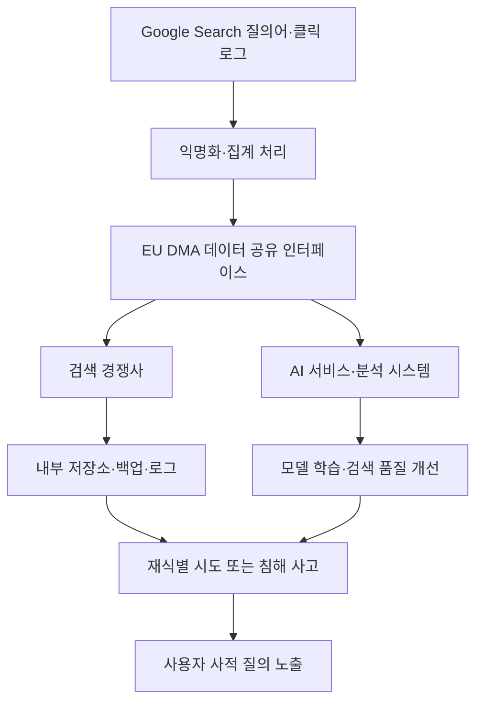

Google 검색 데이터 공유와 EU DMA 논쟁은 경쟁 정책처럼 보이지만, 실제 충돌 지점은 개인정보 익명화다. 유럽이 검색 시장을 열기 위해 Google이 가진 질의어와 클릭 데이터를 경쟁사에 넘기라고 요구하면, 사용자는 더 다양한 검색 서비스를 선택할 수 있다. 문제는 누군가가 입력한 가장 사적인 질문까지 작은 사업자의 저장소로 복제될 수 있다는 점이다.

이 문제는 Google 편을 들 것인지, EU 편을 들 것인지로 정리되지 않는다.

데이터를 열라는 명령이 데이터 통제를 잃는 명령으로 바뀌는 순간, 경쟁 촉진은 보안 설계 문제가 된다.

## EU DMA가 요구하는 검색 데이터 공유는 어디까지인가

확인된 사실부터 나눠보자. 유럽연합의 디지털시장법(Digital Markets Act, DMA)은 2022년 말 채택됐고, 시장 지배력이 큰 플랫폼을 게이트키퍼로 지정해 경쟁사 접근을 넓히는 규칙이다. Alphabet, Amazon, Apple, Booking, ByteDance, Meta, Microsoft가 여기에 포함된다.

WIRED 보도에 따르면 유럽위원회는 2026년 7월 27일을 앞두고 Google Search와 Android 상호운용성 관련 최종 결정을 준비하고 있다. Google Search 쪽 제안은 검색 경쟁사에 Google이 수집하는 수준과 동등한 검색 데이터를 제공하라는 방향이다. 범위에는 사용자가 Google Search에 입력한 질의어, 일부 메타데이터, 클릭 데이터, 검색 결과 순위 정보가 들어간다.

EU 쪽 설계는 익명화, 계약, 재식별 금지, 보안 저장, 독립 감사로 위험을 낮추겠다는 구조다. Google은 이 익명화가 충분하지 않다고 주장한다. Google 보안·프라이버시 임원들은 검색 질의가 재식별될 수 있고, 데이터가 외부 기업으로 넘어간 뒤에는 Google이 더 이상 실행 가능한 보안 통제를 할 수 없다고 말한다.

여기까지가 정책 범위와 공개된 입장이다. Google이 내부적으로 재식별 가능성을 입증했다는 구체 실험 결과는 공개되지 않았다. Reuters 보도를 인용한 WIRED 기사에는 Google 보안 레드팀이 2시간 이내에 검색 사용자를 재식별할 수 있었다는 주장이 나오지만, 테스트 세부사항은 공개되지 않았다.

추정은 따로 봐야 한다. 작은 유럽 스타트업이 모두 해킹당한다는 단정은 Google의 위협 모델이자 이해관계가 걸린 주장이다. 계약과 감사만으로 충분하다는 말도 아직 검증된 운영 결과가 아니다. 법적 문장보다 먼저 필요한 것은 실제 데이터와 운영 환경을 놓고 하는 기술 검증이다.

## 사람들이 불편해한 지점은 독점이 아니라 복제다

검색 데이터는 평범한 로그가 아니다. 사람은 검색창에 병명, 이혼, 채무, 비자, 정치 성향, 직장 문제, 범죄 피해, 성적 취향을 입력한다. 계정 이름이 빠져도 질의어의 조합과 시간, 위치성 메타데이터, 클릭 패턴은 개인을 다시 좁힐 수 있다.

업계 반응은 이 지점에서 갈렸다. Google은 경쟁 당국이 검색 시장을 열려다가 개인정보 위험을 키운다고 말한다. Brave는 현재 제안이 익명 데이터를 만들지 못하며 심각한 프라이버시 위험을 만든다고 봤다. 독립 보안 전문가 Lukasz Olejnik도 이 규모와 맥락에서 정화 조치가 충분하지 않다고 지적했다.

DuckDuckGo는 다르게 판단했다. 법적 기준은 재식별 위험을 완전히 없애는 것이 아니라 무시할 수 있는 수준으로 줄이는 것이며, Google이 제기한 우려는 기존 프레임워크 안에서 다룰 수 있다고 봤다. Knight-Georgetown Institute의 Alissa Cooper는 검색 데이터가 경쟁을 풀 수 있는 고유한 자산이라고 말하면서, 독립 전문가가 실제 데이터에 접근해 공유 설계의 속성을 검증해야 한다고 제안했다.

논쟁이 뜨거운 이유는 분명하다. Google은 데이터를 독점해서 강해졌고, 경쟁사는 그 데이터 없이는 검색 품질을 따라가기 어렵다. 그러나 그 데이터를 나누는 순간 사용자의 사적 행동은 여러 저장소, 여러 접근 권한, 여러 감사 체계로 흩어진다.

Google은 독점으로 신뢰를 샀고, 경쟁사는 접근권으로 신뢰를 시험받는다.

## 익명화보다 약한 고리는 보관하는 조직이다

보조 사례를 붙이면 쟁점이 선명해진다. WIRED가 보도한 Dialog 사건에서 초대 기반 행사 그룹 Dialog는 회원 개인정보가 범죄 해커에게 침해됐다고 알렸다. 하지만 WIRED 분석은 별도 침입 없이 앱 랜딩 페이지를 통해 파일을 읽을 수 있는 공개 설정 오류, 즉 미스컨피그레이션(Misconfiguration)을 가리켰다. 노출된 명단에는 과거 참가자 113명과 별도 여름 리트리트 등록자 정보가 포함됐고, 그 안에는 고위 인사도 있었다.

Schneier on Security가 다룬 여권 유출 사례도 같은 원리를 보여준다. 대마초 판매점 신원 확인이라는 낮은 가치의 부가 인증 시스템이 여권이라는 높은 가치의 신분증 이미지를 모았고, 거의 100만 건 규모의 여권 데이터베이스가 온라인에 노출됐다. 핵심은 해커의 능력이 아니다. 고위험 데이터를 낮은 보안 성숙도의 시스템에 맡기는 순간, 위험의 기준은 가장 약한 보관자가 정한다.

검색 데이터 공유도 같은 구조다. EU 제안이 검색 데이터 수신 기업에 감사와 계약을 요구하더라도, 실제 운영에서는 키 관리, 접근 제어, 로그 모니터링, 직원 권한, 백업 보관, 분석용 복제본, 외주 처리, 사고 대응까지 모두 맞물린다. 원본 데이터가 하나의 대형 플랫폼 안에 있을 때와 여러 경쟁사, 연구기관, 협력사 환경에 복제될 때의 공격면은 다르다.

아키텍처로 보면 문제는 이렇게 변한다.

이 그림에서 가장 위험한 지점은 C 하나가 아니다. B의 익명화가 약해도 위험하고, F의 저장소가 느슨해도 위험하다. G에서 다른 데이터와 결합하는 순간도 문제다. 계약은 금지 행위를 적을 수 있지만, 결합 가능성을 물리적으로 제거하지는 못한다.

## Android 상호운용성 논쟁도 권한 경계의 문제다

같은 WIRED 보도는 Android 제안도 함께 다룬다. EU는 다른 AI 서비스와 에이전트가 휴대폰·태블릿에서 웨이크 워드(Wake Word)를 쓰고, 설치된 앱과 데이터에 더 깊게 상호작용할 가능성을 열어두고 있다. Google Android 보안팀은 마이크, 카메라, 화면 정보 권한이 넓어지면 모바일 보안 모범 관행이 약해지고 사기 위험이 커질 수 있다고 주장한다. Apple도 운영체제 접근에 관한 일부 Google 입장을 이례적으로 지지했다.

여기서도 중심은 경쟁보다 권한 경계다. AI 에이전트가 앱 사이를 넘나들고 화면 내용을 읽고 사용자를 대신해 동작하려면, 기존 모바일 OS가 쌓아온 샌드박스(Sandbox), 권한 프롬프트, 백그라운드 제한, 접근성 권한 통제가 바뀐다. 편의성은 올라가지만 피싱, 원격 사기, 권한 오용의 경로도 짧아진다.

Schneier가 소개한 Flock 카메라 사례와 AI 영상 감시 논쟁도 같은 흐름에 있다. Flock은 번호판이 없어도 차량의 스티커, 랙, 임시 태그 같은 특징을 묶어 Vehicle Fingerprint로 검색할 수 있다고 설명했다. AI 영상 감시는 고정된 검색 조건 몇 개가 아니라 자연어로 행동을 찾는 방향으로 움직인다.

검색 질의, 차량 특징, 영상 속 행동은 서로 다른 데이터처럼 보인다. 플랫폼 관점에서는 같은 문제다. 식별자는 사라져도 패턴은 남는다. 패턴이 충분히 많으면 식별자는 다시 만들어진다.

## 실무자는 어떤 조건에서 데이터 공유를 받아들여야 하나

이 논쟁에서 실무적 기준은 Google의 주장이나 EU의 경쟁 명분 중 하나를 자동으로 고르는 일이 아니다. 데이터 공유가 필요하다면 먼저 공유 가능한 데이터의 형태를 줄여야 한다. 원시 질의어와 클릭 로그를 그대로 넘기는 설계는 마지막 선택이어야 한다.

검토 조건은 구체적이어야 한다.

- 원시 질의어 대신 집계 지표, 차등 프라이버시(Differential Privacy), k-익명성(k-Anonymity), 지연 공개를 조합할 수 있는가
- 수신 기업이 데이터를 다운로드하지 않고 통제된 분석 환경에서만 질의할 수 있는가
- 재식별 테스트를 Google, 경쟁사, 규제기관이 아닌 독립 전문가가 반복 검증할 수 있는가
- 수신 기업의 저장 기간, 백업, 로그, 접근 권한, 외주 처리, 사고 통지 기준이 정책 문서가 아니라 감사 가능한 시스템으로 구현되는가
- Android 권한 확장은 기능 단위 허용, 사용자 가시성, 철회 가능성, 악성 행위 탐지까지 포함하는가

이 조건을 충족하지 못하면 경쟁 정책은 사용자를 실험대에 올린다. 모든 위험을 이유로 데이터를 닫아두면 기존 독점은 더 단단해진다. 판단의 중심은 공유 여부가 아니라 공유 방식이어야 한다.

검색 시장을 열기 위해 사람들의 검색어를 나누는 일은 조건부로만 가능하다. 원본 데이터를 복제하는 방식이면 안 된다. 독립 검증 없이 익명화라는 이름표만 붙이는 방식도 안 된다. 규제기관이 요구해야 할 것은 Google의 데이터 그 자체가 아니라, 경쟁사가 품질을 개선할 수 있으면서 사용자 재식별과 대량 유출을 구조적으로 막는 접근 방식이다.

검색창은 공공 인프라처럼 쓰이지만, 그 안의 문장은 개인의 것이다. 경쟁을 만들려면 그 사실이 먼저 설계에 반영돼야 한다.

## 참고 자료

- [선정 글감] [Top Google Security Staff Warn Search Data Could Be Hacked if EU Rules Change](https://www.wired.com/story/top-google-security-staff-warn-search-data-could-be-hacked-thanks-to-eu-plans/) — WIRED Security
- [관련] [Dialog Claims It Was Hacked. A Misconfigured Website Left Its Members Exposed](https://www.wired.com/story/dialog-hack-website-misconfiguration/) — WIRED Security
- [관련] [One Million Passports Leaked Online](https://www.schneier.com/blog/archives/2026/06/one-million-passports-leaked-online.html) — Schneier on Security
- [관련] [Flock Cameras Can Surveil Cars Without License Plates](https://www.schneier.com/blog/archives/2026/07/flock-cameras-can-surveil-cars-without-license-plates.html) — Schneier on Security
- [관련] [The Realities of AI Video Surveillance](https://www.schneier.com/blog/archives/2026/06/the-realities-of-ai-video-surveillance.html) — Schneier on Security