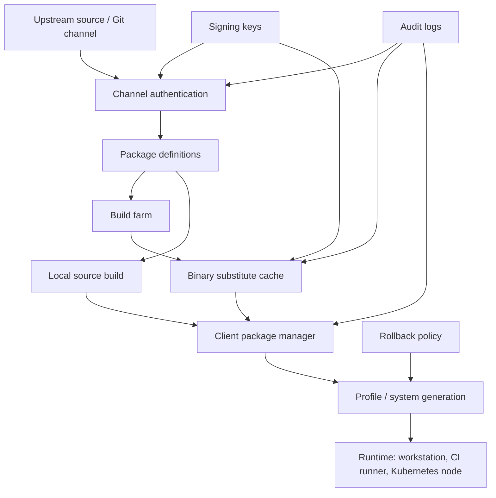

> 한 줄 요약: Guix `substitute`와 `guix pull` 취약점은 재현 가능한 빌드만으로는 소프트웨어 공급망 보안을 설명하기 어렵다는 사례다. 패키지 매니저의 신뢰 경계는 빌드 결과물뿐 아니라 업데이트 경로, 캐시, 키, 롤백 정책까지 포함한다.

## 왜 지금 이슈인가

개발자 커뮤니티에서 Guix 취약점이 이야기되는 이유는 Guix 자체의 점유율 때문만은 아니다. Guix는 재현 가능한 빌드(Reproducible Build), 함수형 패키지 관리, 롤백 가능한 프로필을 핵심 기능으로 삼아 온 도구다.

그런 도구에서도 `guix substitute`와 `guix pull` 같은 업데이트 경로가 문제가 될 수 있다는 점은 생각할 거리를 남긴다.

패키지를 직접 빌드하지 않고 바이너리 대체물(Substitute)을 받는 순간, 사용자는 빌드 시스템과 캐시 서버를 신뢰하게 된다. `guix pull`로 채널(Channel)을 갱신하는 순간에는 앞으로 실행할 패키지 정의와 빌드 코드의 출처를 신뢰하게 된다.

Kubernetes 노드 이미지, CI 러너, 개발자 워크스테이션, 내부 빌드 팜도 비슷한 구조를 가진다. 패키지 이름은 달라도 흐름은 크게 다르지 않다.

- 무엇을 받을지 결정하는 메타데이터
- 누가 만들었는지 증명하는 서명
- 어디서 받았는지 남는 로그
- 문제가 생겼을 때 되돌릴 수 있는 상태

이 중 하나라도 흐려지면 재현 가능성은 방어선이라기보다 사고 이후 분석을 돕는 도구에 가까워진다.

## 커뮤니티에서 갈리는 지점

### 왜 바이너리 캐시를 써야 할까?

Guix나 Nix 계열을 쓰는 큰 이유 중 하나는 같은 입력에서 같은 결과를 얻을 수 있다는 기대다. 하지만 모든 사용자가 매번 소스부터 빌드하면 시간, 전력, 네트워크, 저장소 비용이 커진다.

그래서 `guix substitute` 같은 바이너리 캐시를 쓴다. 이미 빌드된 산출물을 받아 설치하면 빠르고, 대규모 환경에서는 이 차이가 운영비로 바로 이어진다.

문제는 캐시가 단순한 성능 최적화를 넘어 배포 경로가 되는 순간이다. 캐시 서버가 잘못된 산출물을 내주거나, 메타데이터 검증이 우회되거나, 신뢰 키 관리가 느슨하면 사용자는 잘못된 산출물을 빠르게 받게 된다.

커뮤니티에서 의견이 갈리는 지점은 여기다.

| 관점 | 장점 | 리스크 |
| --- | --- | --- |
| 전부 소스 빌드 | 신뢰 경로가 짧다 | 빌드 비용과 시간이 크다 |
| 공식 바이너리 캐시 사용 | 빠르고 운영이 쉽다 | 캐시와 서명 체인을 신뢰해야 한다 |
| 내부 캐시 미러 운영 | 정책 통제가 가능하다 | 키, 동기화, 감사 로그를 직접 책임진다 |
| 중요한 패키지만 재빌드 | 비용과 보안의 절충 | 기준을 잘못 잡으면 빈틈이 남는다 |

현업에서는 보통 하나의 방식만 고르지 않는다. 개발 환경은 캐시를 적극적으로 쓰고, 프로덕션 베이스 이미지나 보안 민감 패키지는 재빌드하거나 별도 검증을 거치는 식으로 경계를 나눈다.

### `guix pull` vs 고정 버전: 자동 업데이트는 어디까지 허용할까?

`guix pull`은 Guix 자체와 패키지 정의를 갱신하는 경로다. 일반 패키지 설치보다 더 민감하다. 이 경로가 바뀌면 이후 어떤 패키지를 어떤 방식으로 빌드할지도 바뀐다.

자동 업데이트를 두고 의견이 갈리는 이유도 같다.

한쪽은 보안 패치를 놓치지 않으려면 최신 채널을 따라가야 한다고 본다. 다른 쪽은 채널 리비전, 커밋, 서명자, 빌드 결과를 고정하지 않은 업데이트를 운영 환경에 넣기 어렵다고 본다.

둘 다 일리가 있다. 다만 프로덕션에서는 최신이라는 표현보다 재현 가능한 승인 상태가 더 다루기 쉽다.

업데이트가 필요하면 다음 질문부터 확인해야 한다.

- 어떤 채널 리비전으로 이동하는가?
- 해당 리비전은 어떤 키와 절차로 인증되는가?
- 빌드 산출물은 어디서 왔는가?
- 같은 입력으로 다시 빌드했을 때 같은 결과가 나오는가?
- 실패 시 어느 세대(Generation)로 되돌릴 것인가?

이 질문에 답하지 못하면 자동 업데이트는 편의 기능이 아니라 변경 관리의 우회로가 된다.

## 아키텍처 관점에서 볼 점

패키지 매니저 보안을 다운로드 보안으로만 보면 부족하다. 실제 아키텍처는 채널, 메타데이터, 빌드 팜, 캐시, 클라이언트, 런타임까지 이어진다.

여기서 신뢰 경계는 세 군데로 나뉜다.

첫째, 채널 인증이다. Git 저장소에서 받은 패키지 정의가 진짜인지, 기대한 계보에 있는지 확인해야 한다. Guix가 채널 인증과 커밋 기반 신뢰 모델을 다루는 이유도 이 지점에 있다.

둘째, 바이너리 캐시 인증이다. 캐시에서 내려받은 산출물이 기대한 해시와 서명을 만족해야 한다. 서명 키가 많아질수록 편의성은 올라가지만, 키 탈취나 폐기 실패의 영향 범위도 넓어진다.

셋째, 런타임 반영이다. 패키지 매니저가 올바른 산출물을 받았더라도 실제 서비스가 언제 그 세대로 전환되는지, 롤백은 가능한지, 어떤 워크로드에 먼저 적용되는지는 따로 관리해야 한다.

Kubernetes에서는 이 구조가 더 복잡해진다. 노드 이미지에 포함된 패키지, 컨테이너 베이스 이미지, init container가 내려받는 도구, CI에서 만든 바이너리가 서로 다른 공급망을 가진다. 한쪽만 SLSA(Supply-chain Levels for Software Artifacts)나 Sigstore로 감싸도 전체 경로가 안전해지지는 않는다.

패키지 매니저의 재현 가능성은 이 다이어그램에서 C와 D 사이를 강하게 만든다. 하지만 이번 Guix 이슈가 건드리는 부분은 B, E, F에 가깝다. 무엇을 빌드했는지보다 무엇을 믿고 받아왔는지에 가까운 문제다.

## 실무에서 볼 점

### 도입 전에 무엇을 확인해야 할까?

Guix, Nix, Bazel 원격 캐시, 내부 아티팩트 저장소, 컨테이너 레지스트리는 비슷한 체크리스트를 가져야 한다.

| 확인 항목 | 질문 | 빠지면 생기는 일 |
| --- | --- | --- |
| 채널 고정 | 운영 환경이 정확한 커밋을 가리키는가? | 재현 불가능한 업데이트 |
| 서명 키 관리 | 키 추가, 폐기, 회전 절차가 있는가? | 탈취된 키의 장기 사용 |
| 캐시 정책 | 어떤 캐시를 신뢰하고 어떤 패키지를 재빌드하는가? | 성능 편의가 보안 정책을 덮음 |
| 감사 로그 | 어떤 메타데이터와 산출물을 받았는지 남는가? | 사고 후 영향 범위 파악 실패 |
| 롤백 | 이전 세대로 돌아가는 절차가 검증됐는가? | 패치 실패 시 장시간 장애 |
| 네트워크 격리 | 빌드와 배포 경로가 분리되는가? | CI 침해가 런타임으로 전파 |

이런 상황에서는 모든 패키지를 소스 빌드하겠다고 선언하는 것보다, 어떤 경로를 신뢰할지 문서화하는 쪽이 현실적이다.

예를 들어 개발자 노트북은 공식 캐시를 허용하되, 프로덕션 이미지 빌드는 내부 미러만 사용하게 할 수 있다. 보안 민감도가 높은 암호화 라이브러리, 런타임, 컴파일러는 별도 재빌드 대상으로 두고, 결과 해시와 provenance를 저장한다.

### TUF, Sigstore, SLSA와의 차이점은?

TUF(The Update Framework)는 업데이트 메타데이터와 키 역할 분리를 다룬다. 루트, 타임스탬프, 스냅샷, 타깃 역할을 분리해 키 하나가 모든 것을 망가뜨리지 않게 만든다.

Sigstore는 서명과 투명성 로그(Transparency Log)를 중심에 둔다. 누가 어떤 아티팩트에 서명했는지 공개 로그에 남기는 방식이다.

SLSA는 빌드 출처와 빌드 단계의 성숙도를 표현하는 프레임워크에 가깝다. 빌드가 어디서, 어떤 입력으로, 어떤 절차를 통해 만들어졌는지 증명하려고 한다.

Guix의 강점은 패키지 정의와 빌드 재현성에 있다. 하지만 운영 조직 입장에서는 Guix만 볼 수 없다. 내부 레지스트리, CI, 배포 승인, 런타임 관측성까지 하나의 업데이트 시스템으로 봐야 한다.

### 실패하기 쉬운 지점

가장 흔한 실패는 신뢰 키를 설정 파일 한 줄처럼 다루는 것이다. 키는 설정값이 아니라 운영 자산이다. 누가 추가했는지, 왜 추가했는지, 언제 폐기할지 기록해야 한다.

두 번째는 캐시 적중률만 보는 것이다. 캐시가 빠를수록 좋다는 지표는 보안 경계를 흐릴 수 있다. 캐시별 응답 수, 서명 검증 실패, 예상하지 않은 원격 캐시 사용, 채널 리비전 변경은 관측 대상이 되어야 한다.

세 번째는 롤백을 쉽게 보는 것이다. Guix나 Nix 계열은 세대 기반 롤백이 강점이지만, 애플리케이션 데이터베이스 마이그레이션, 커널 업데이트, 클러스터 노드 교체가 섞이면 단순히 이전 프로필로 돌아가는 것만으로 복구되지 않는다.

## 정리

Guix의 `substitute`와 `guix pull` 이슈는 특정 패키지 매니저만의 이야기가 아니다. 재현 가능한 빌드와 서명된 아티팩트를 쓰더라도 업데이트 경로 전체를 설계하지 않으면 공급망 보안은 중간에서 끊긴다.

도구를 바꾸기 전에 먼저 확인할 것은 하나다.

운영 환경의 각 서버와 CI 러너가 지금 어떤 채널 리비전, 어떤 캐시, 어떤 서명 키를 신뢰하는지 한 장의 표로 만들 수 있는가. 그 표를 만들 수 없다면 아직 패키지 매니저를 운영하고 있는 것이 아니라, 패키지 매니저가 알아서 해주길 기대하는 상태에 가깝다.

## 참고 자료

- [선정 글감] [‘guix substitute‘ and ‘guix pull‘ vulnerabilities](https://guix.gnu.org/en/blog/2026/guix-substitute-pull-vulnerabilities/) — Lobsters
- [관련] [Building a Secure Software Supply Chain with GNU Guix](https://arxiv.org/abs/2206.14606) — arXiv
- [관련] [The Update Framework](https://theupdateframework.io/) — TUF
- [관련] [SLSA v1.0 Specification](https://slsa.dev/spec/v1.0/) — OpenSSF
- [관련] [Sigstore: How it works](https://www.sigstore.dev/how-it-works) — Sigstore